# Ardah (العرضة النجدية) reference keyframes

Reference for redrawing the Hikaya Ardah animation. Made 2026-10-04 from three
YouTube videos (`sources.txt`). Twelve keyframes, each a different pose or
moment, picked from 3,967 frames extracted at 1 per second.

**How to read the descriptions.** They cover only what is visible in the frame.
Where something can't be read (hand, blade direction, feet), the entry says so
instead of filling it in. When a dancer's own left and right can't be told
reliably, hands are given by side of the frame ("frame-left hand"). No distances
were measured, so spacing is relative ("shoulder to shoulder", "an arm's length
apart").

## Where everything is

| What | Where |
|---|---|
| Keyframes (12 JPG, 1280 px wide) | `keyframes/` next to this file |
| Source URLs and titles | `sources.txt` |
| Contact sheets: every 2 s, timestamp on each tile | Drive `C:\ai\projects\arabic-app\reference\ardah\contact_ardahN.jpg` |
| 30 s clips with audio, for timing the drums | Drive, same folder, `clip_ardahN.mp4` |
| Full videos and all 1 fps frames | Machine A only: `C:\media\ardah\` (`frames\ardahN\ardahN_tSSSSs.jpg`, SSSS = second) |
| This note and the keyframes in git | `arabic-buddy` repo, `docs/reference/ardah/` (contact sheets, clips and videos are not in git) |

## Clips

| Clip | Source span | What's in it |
|---|---|---|
| `clip_ardah1.mp4` | ardah1, 5:20–5:50 | Drummers in a line stepping and raising drums, then sword rows. No narration subtitles appear on screen in this span. I haven't listened to it |
| `clip_ardah2.mp4` | ardah2, 10:32–11:02 | One continuous wide shot of the arena floor: drummers moving down the middle between rows |
| `clip_ardah3.mp4` | ardah3, 7:20–7:50 | 0:01–0:11 is a close row with swords raised, **swaying**: the blades tilt one way, then the other. Then a wide shot, a drummer, and swords close up |

Audio levels in all three are normal (checked by measurement, not by listening).

**Sway:** no single frame can show it. It's clearest in ardah3 at 441–451 s:
the 1 fps frames are on machine A, and the motion is at the start of `clip_ardah3`.

---

## 1. Formation from above, indoor courtyard

`ardah1_t0112s.jpg` · ardah1 (UNESCO) at 1:52

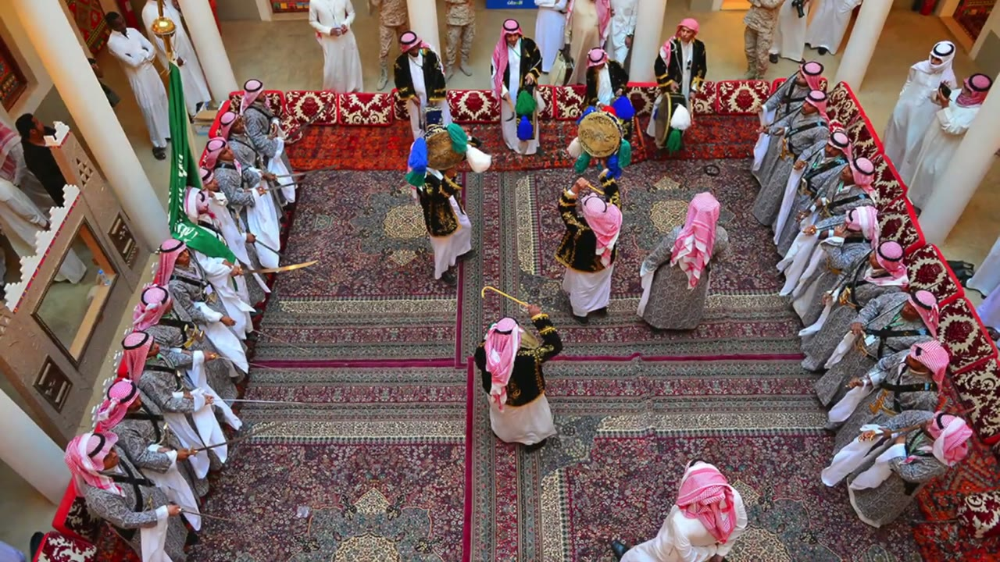

- Camera directly overhead, looking down at a rectangular carpet in a courtyard edged with red floor cushions.
- Two rows of dancers stand along the two long sides of the carpet, facing each other across it. 9 men visible in the left row, about 9 in the right. Within a row they stand shoulder to shoulder, close enough for their coats to overlap.
- The gap between the rows is the full width of the carpet, several times wider than a row is deep.
- Dancers: long grey patterned coats over white thobes, pink-and-white checked shemagh with a black agal, black straps across the chest.
- Left row: each man holds a sword at waist height, blade pointing straight out across the carpet toward the other row, roughly level. The blades are parallel. Right row: swords also at waist height; blade direction isn't clear at this size.
- A green flag is held upright at the far (top) end of the left row.
- In the open centre:
  - At the far end, three drummers in black jackets with gold embroidery; two hold frame drums with blue, green and white tassels above head height.
  - One man in a grey coat stands alone mid-carpet, facing the right row.
  - One man in a black embroidered jacket stands in the centre holding a gold hooked cane.
  - One man in white with a pink shemagh stands at the near (bottom) end.
- Spectators stand behind the cushions.

## 2. Formation, wide, indoor arena

`ardah2_t2260s.jpg` · ardah2 (Janadriyah 32) at 37:40

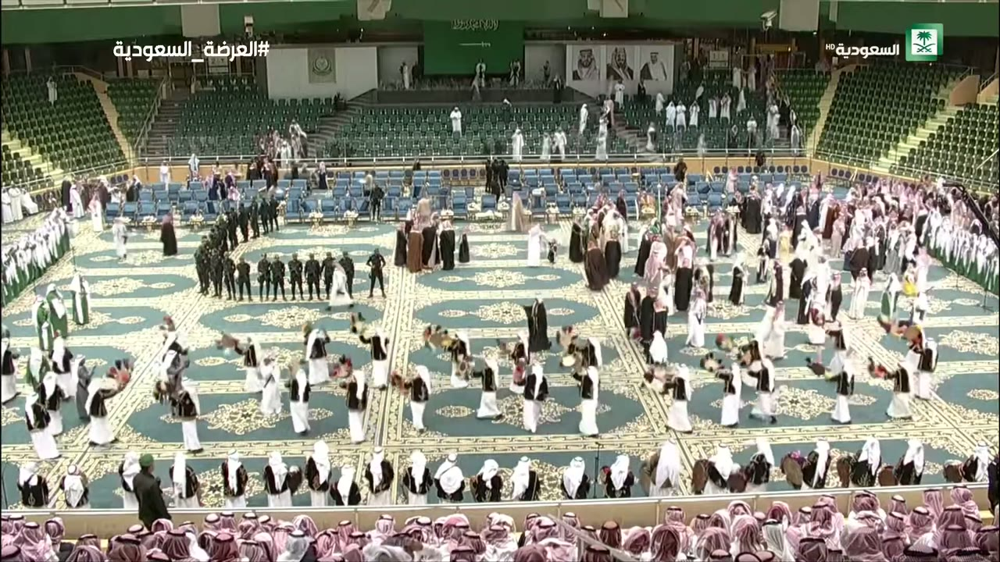

- High wide shot from the stands over a teal-and-gold carpeted arena floor.
- A row of dancers runs along the near edge of the floor (bottom of frame), about 20 men visible, standing close together and facing into the floor. Several at the frame-right end hold drums.
- A second row, men in green robes, runs along the frame-left edge and recedes away from the camera.
- In the middle of the floor are about 16 drummers in black vests over white thobes, in two loose lines across the width. They're spaced well apart (gaps wider than a body), each holding a tasselled drum at chest height or above.
- Behind the drummers, centre-right, is a cluster of men in dark cloaks and white. At frame-left is a line of uniformed men in black.
- At the far end are empty blue seats and the stands.

## 3. Drummers moving down the centre

`ardah2_t0636s.jpg` · ardah2 at 10:36

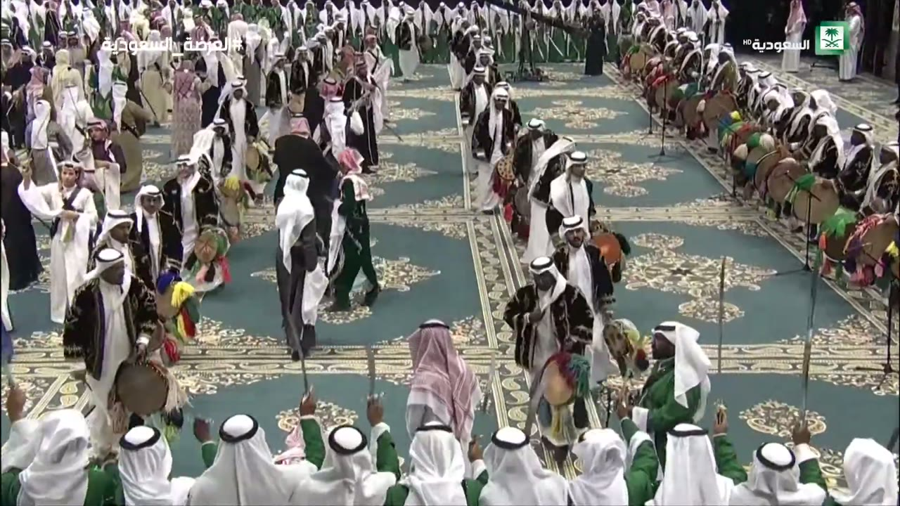

- Low camera behind a row of dancers (bottom of frame, seen from behind: white shemagh with black agal, green or white robes) who hold swords upright, blades pointing up.
- Down a lane of carpet in the middle, drummers walk toward the camera in pairs. They wear black coats with gold embroidery and dark, fur-like trim over white thobes, with white shemagh and black agal. They carry tasselled frame drums at chest-to-waist height. Strides are visible: one leg forward.
- At frame-right, a long line of standing drummers holds large round drums upright, facing the lane. Tassels are red, green, yellow and pink, with microphones on stands in front of them.
- At frame-left and in the background, more dancers in white and green stand in rows.

## 4. Row and drummer arc, outdoors from above

`ardah1_t0160s.jpg` · ardah1 at 2:40

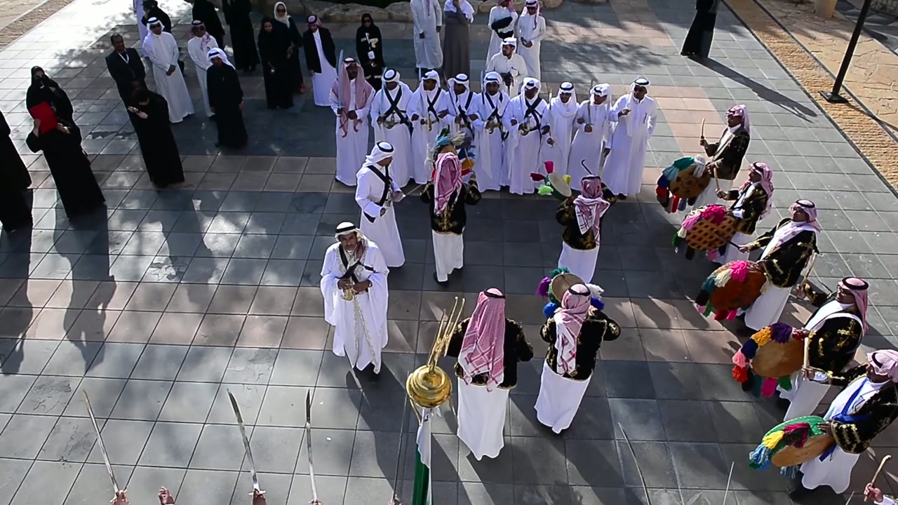

- Aerial view of a paved square in daylight, with long shadows.
- At the top is one row of about 9 dancers: white thobes, white shemagh with black agal, black straps crossed on the chest. They stand shoulder to shoulder, facing down-frame.
- Two men in white stand in front of the row, apart from it; the frame-left one holds a sword.
- At frame-right, an arc of about 6 drummers in black embroidered jackets and red-and-white shemagh holds large drums with coloured tassels at waist level. The top one holds a stick raised.
- In the centre, four men in black jackets with pink shemagh, two holding frame drums, have their backs partly to the camera.
- At the bottom are a flagpole with a gold ball finial and the tips of several swords held upright from below the frame.
- At frame-left, spectators: women in black abayas, men in white.

## 5. Row at rest, swords up, a man facing the row

`ardah1_t0256s.jpg` · ardah1 at 4:16

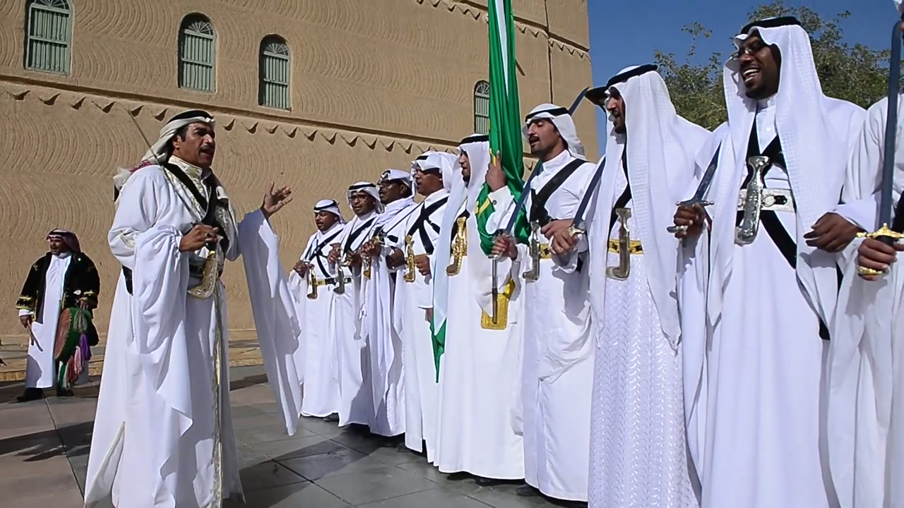

- Outdoors, in front of a mud-brick building. A row of about 9 men stands shoulder to shoulder, receding to frame-right.
- The costume is clear here:
  - white thobe
  - white shemagh with black agal
  - two black straps crossing the chest
  - gold-and-black belt
  - a curved dagger with a gold or silver hilt worn at the centre front of the belt, hilt up
- Swords: the men nearest the camera, who face it, hold the sword in the right hand at chest-to-belly height. The blade points up, between vertical and about 30° off vertical, close to the shoulder. The other hand is at chest height, open or near the hilt.
- A green flag is held upright in the middle of the row.
- At frame-left, one man stands in front of the row facing it, mouth open, his frame-right hand raised open at shoulder height. He wears the same costume, with a dagger.
- In the background at frame-left, a drummer in a black jacket holds a tasselled drum.

## 6. Row at rest, swords diagonal, indoor arena

`ardah2_t1392s.jpg` · ardah2 at 23:12

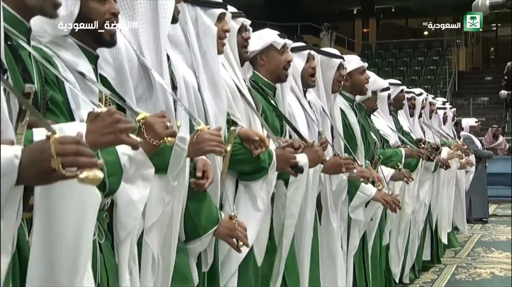

- Camera at chest height near one end of a long, straight row that recedes to frame-right. About 20 men are visible.
- Shoulder to shoulder, arms touching. Green robes, long white hanging sleeves, white shemagh with black agal, black chest straps.
- Each man grips his sword hilt at chest height, and the blade rises diagonally upward in front of the body toward frame-left, the way the men face. Hilts are gold, and several sword hands wear gold chains. The other hand sits just below or beside the sword hand, at waist-to-chest height.
- Faces turned frame-left, several mouths open (singing).
- Feet are not visible.

## 7. Swords held forward at waist height

`ardah1_t0372s.jpg` · ardah1 at 6:12

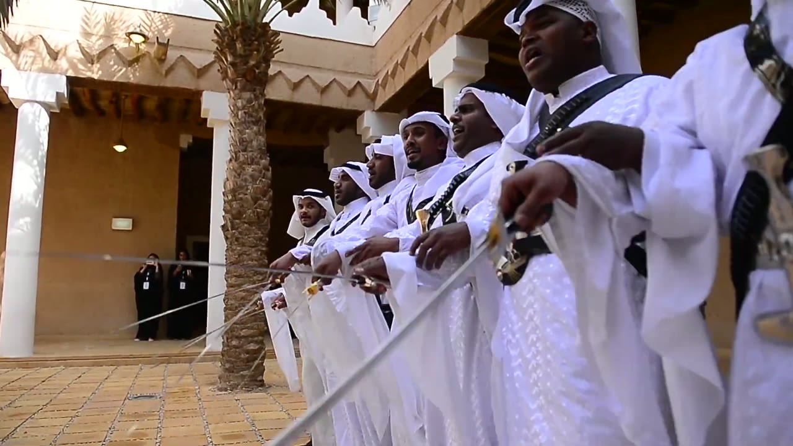

- Low camera at one end of a row, in a colonnaded courtyard with a palm tree.
- About 7 men shoulder to shoulder: white thobes, white shemagh with black agal, black chest straps, gold-hilted curved daggers.
- Each holds his sword at waist height with the arm extended forward. The blade points out to frame-left and slightly down, close to horizontal, and the blades are parallel to each other. Which of each man's hands holds it can't be read reliably from this angle.
- Mouths open (singing).

## 8. Swords raised overhead

`ardah2_t2224s.jpg` · ardah2 at 37:04

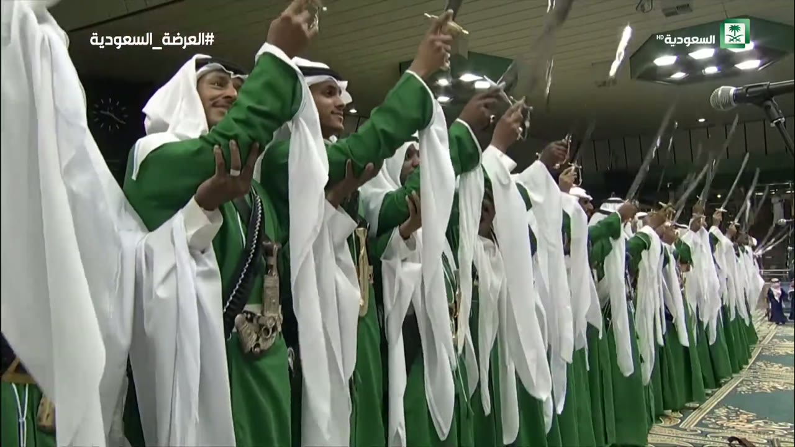

- Low camera at the near end of a row that recedes to frame-right. About 20 men are visible.
- Green robes with long white hanging sleeves, white shemagh with black agal, black cartridge straps, a silver dagger at the waist.
- The sword arm is raised straight up above the head, the hand gripping the hilt, the blade pointing up and tilted back. Every blade in the row is raised at a similar angle.
- The other hand is held open at chest-to-chin height in front of the body, palm up or forward, fingers spread. This is clearest on the two nearest men.
- Faces turned up and to frame-right; the nearest men are smiling.
- Feet are not visible.

## 9. Frame drum raised overhead

`ardah1_t0168s.jpg` · ardah1 at 2:48

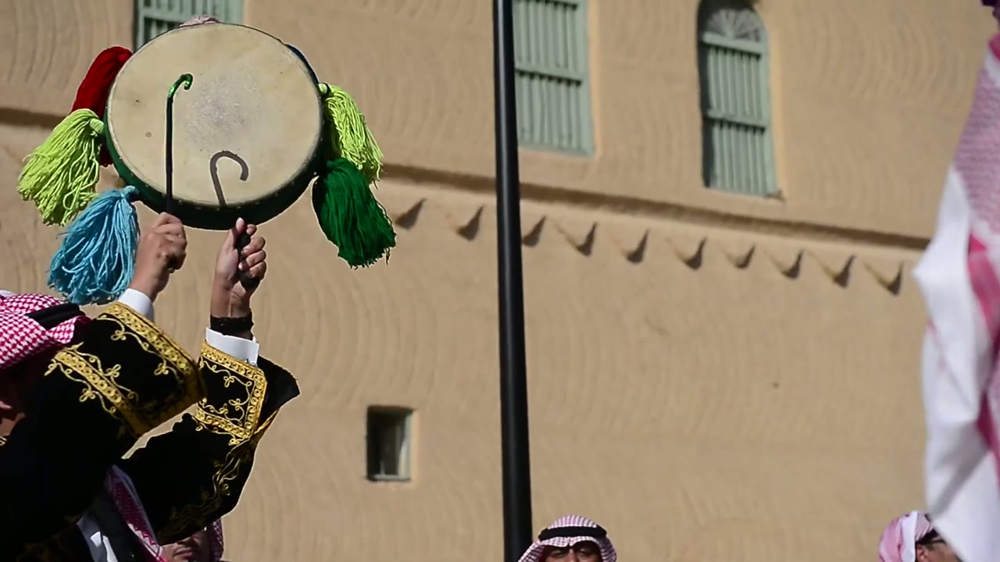

- Close-up against a mud-brick wall. A drummer, partly visible at bottom-left (black jacket with gold embroidery, white cuffs, red-and-white shemagh), holds a round frame drum above his head with both arms raised.
- The drum has pale skin and a dark green rim. Tassels hang from the rim: red, light green, light blue and dark green.
- The frame-left hand holds a thin stick with a hooked, cane-shaped green top. The hook is against the drum face, and its shadow falls on the skin. The frame-right hand is under the lower rim, supporting the drum.

## 10. Large drums, close

`ardah2_t1400s.jpg` · ardah2 at 23:20

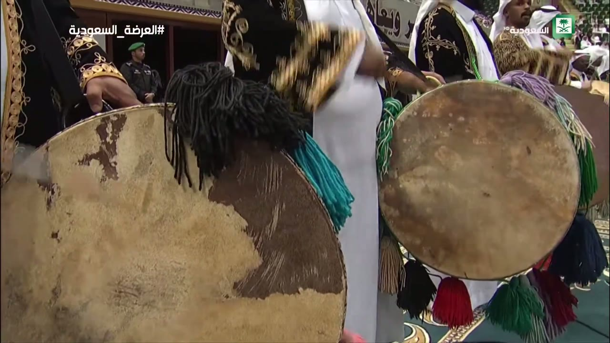

- Close-up of two drums at waist height.
- Frame-left: a large drum, held upright facing the camera, fills the left half of the frame. Its skin is worn and patchy, with a bunch of black tassels and a teal tassel on the upper rim. The drummer's black-and-gold embroidered sleeve and hand are on the rim at top-left.
- Frame-right: a smaller drum, held upright by a drummer in a white thobe. Long tassels hang from its rim in green, red, black, dark blue and grey-purple.
- Behind: drummers in black jackets with gold embroidery.

## 11. Drummers' line and costume

`ardah1_t0324s.jpg` · ardah1 at 5:24

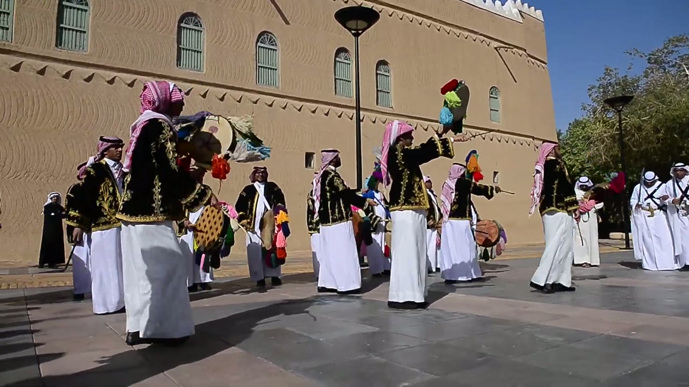

- Outdoors in front of a mud-brick building, low camera.
- About 10 drummers in a loose line across the square, an arm's length or more apart. Unlike the sword rows, they are not shoulder to shoulder.
- Costume:
  - black jackets reaching about mid-thigh, with heavy gold embroidery on the chest, sleeves and hem, over long white thobes
  - red-and-white checked shemagh, worn loose or draped; no agal is visible on several of them
- Drums: some drummers hold frame drums up at head height with a stick in the other hand. Others hold larger tasselled drums at waist level.
- Several are mid-step, one foot ahead of the other, in black shoes.
- At frame-right, dancers in white with crossed chest straps stand apart from the drummers.

## 12. Chest straps, belt and dagger, close

`ardah1_t0400s.jpg` · ardah1 at 6:40

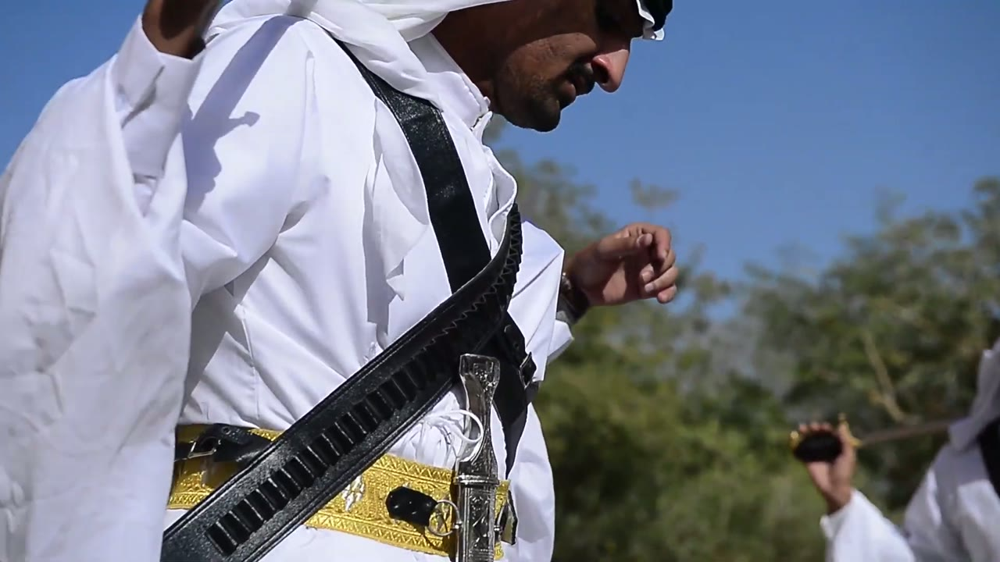

- Low-angle close-up of one dancer.
- A black leather strap with a row of cartridge loops runs diagonally from the shoulder down across the chest to the opposite hip. A second, plainer black strap crosses it.
- At the waist is a wide gold-embroidered belt. A curved dagger in a silver sheath, with rings on it, hangs at the centre front of the belt, hilt up.
- White thobe and white shemagh. His arm is raised, hand at chest height with the fingers bent.
- In the background at frame-right, another dancer's hand holds a sword hilt.

---

## Not covered by these frames

- **Feet in the sword rows.** No keyframe shows them clearly: the thobes reach the ankles and most row shots are cropped at the waist. Steps are visible only for the drummers (3, 11).
- **The poet** chanting into a microphone appears in ardah2 (5:12, 20:36) but isn't a keyframe.
- **Night footage.** ardah3 is mostly dark and crowded. Only its clip is used, for the sway.
