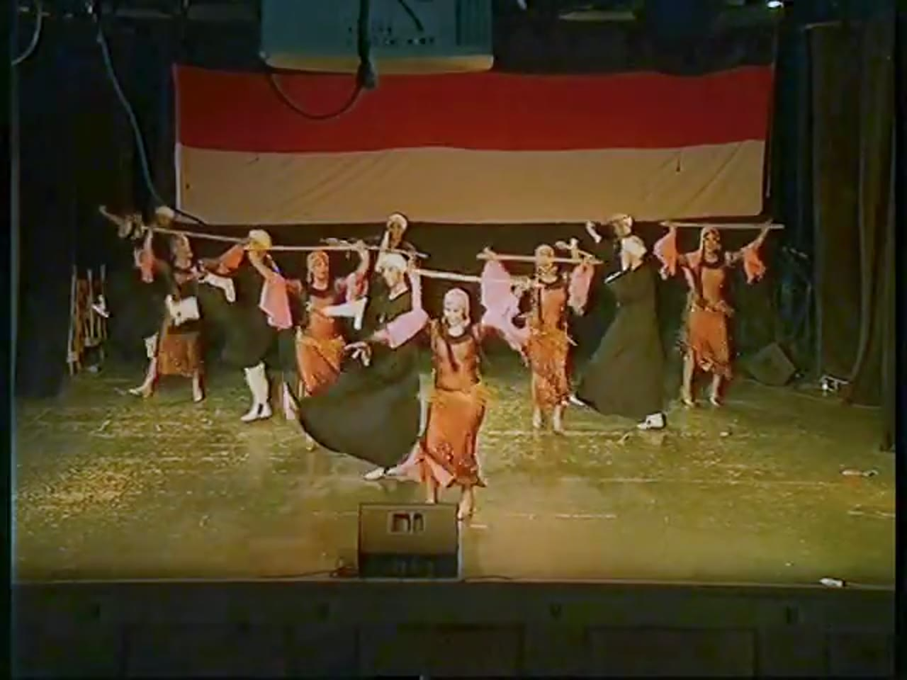
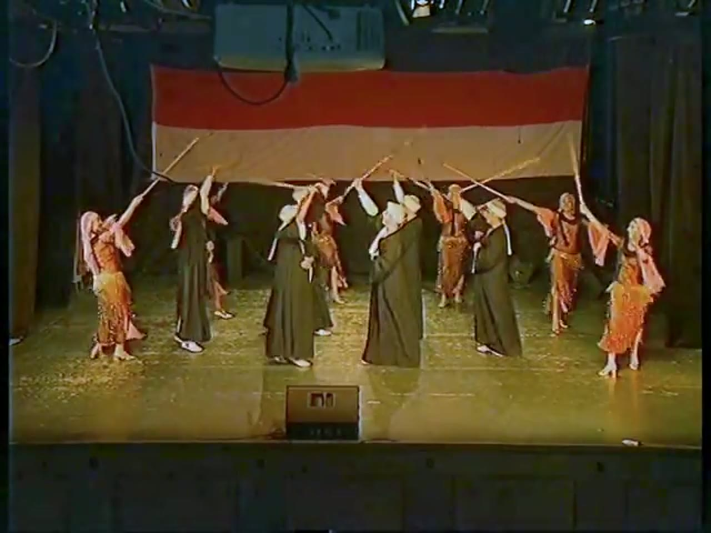
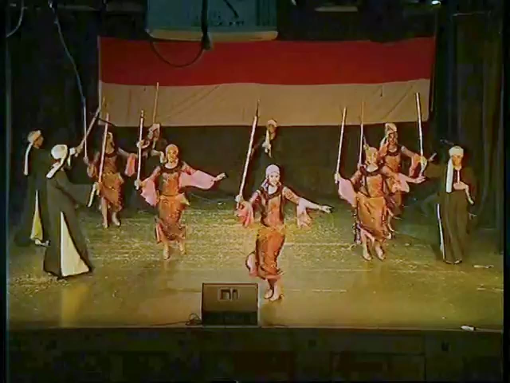
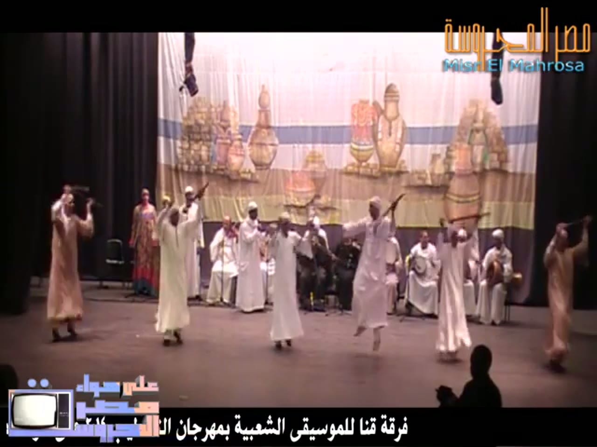
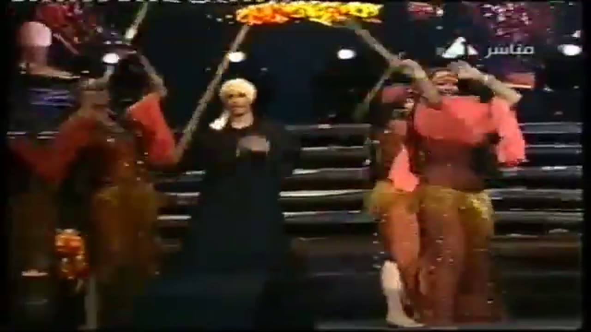
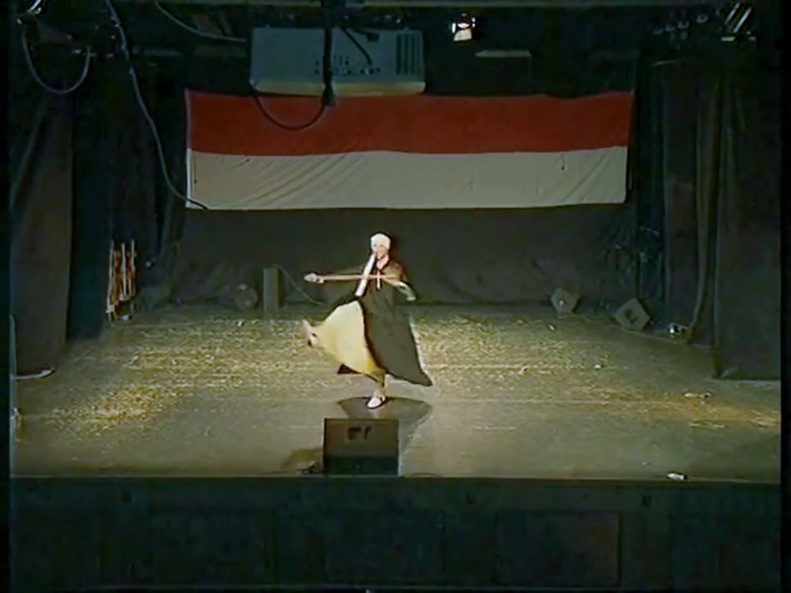
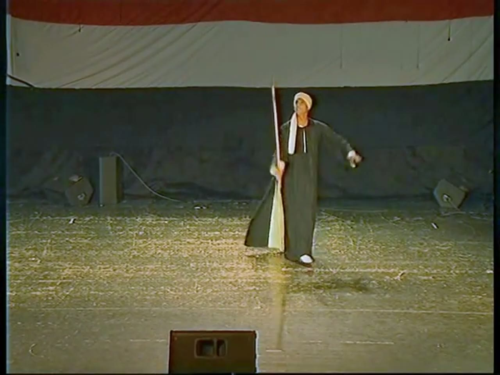
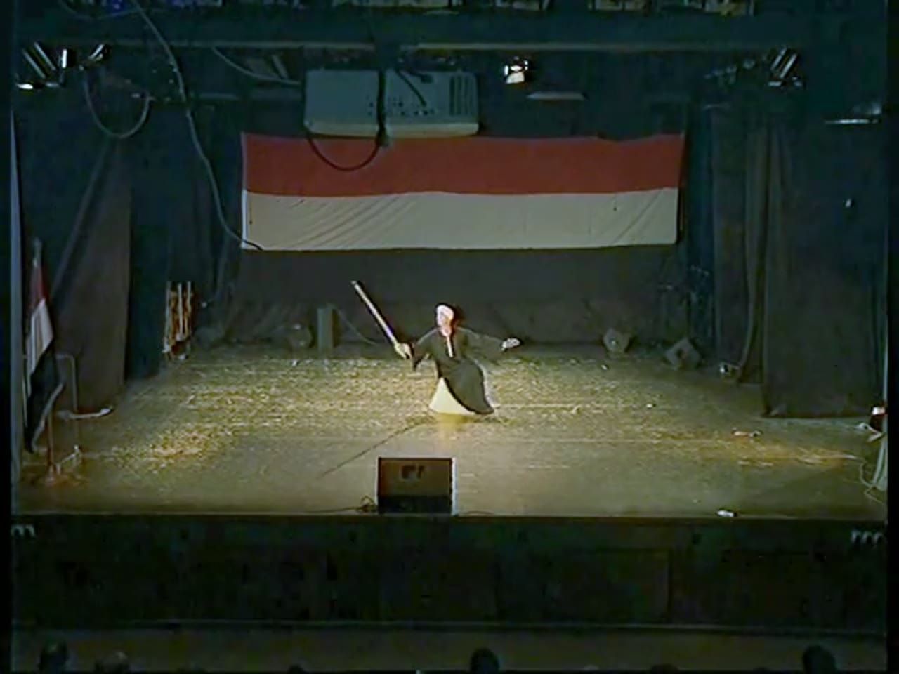
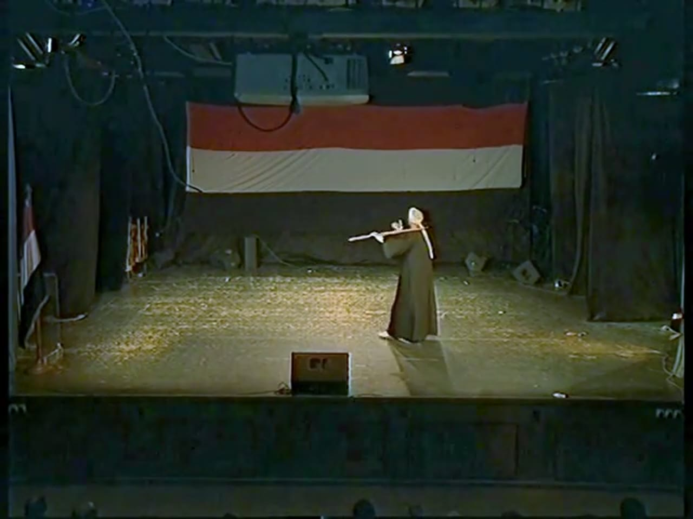
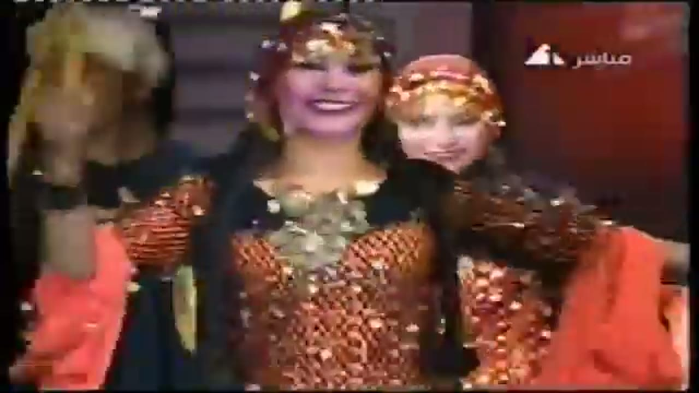

# Raqs al-assaya (رقص العصاية) reference keyframes

Reference for redrawing the Hikaya Saidi cane dance (Upper Egypt) animation. Made 2026-10-04 from three
YouTube videos (`sources.txt`). Ten keyframes, each a different pose or moment, picked from 1,547 frames
extracted at 1 per second (384 + 510 + 653). It also carries timing measurements (see `## Timing`).

All three videos are low resolution (360p to 480p) and none is verified as an official channel, so
everything below is soft. Two are stage performances by a troupe (`assaya3` shot by one fixed camera, `assaya1` a
live-TV mix with many close-ups); the third (`assaya6`) is a men's troupe on a TV programme (logo and address
`misrelmahrosa.gov.eg` on screen) with the band in view.

**How to read the descriptions.** They cover only what is visible in the frame. Where something can't be read (a
hand, a foot, the end of a cane), the entry says so instead of filling it in. When a performer's own left and right
can't be told reliably, hands are given by side of the frame ("frame-left hand"). Distances are relative
("a head above", "about as long as") unless a method is named. Numbers in `## Timing` give the video and the
timestamps they were measured at. Women's footage is described by costume, formation and movement only.

**What the footage shows, in short.**

- **The cane** is a long, thin, straight wooden stick, pale to brown. It is held in one hand or two. Moves seen: carried across the
  shoulders behind the neck; held horizontally across the chest in both hands while the dancer turns on one foot; held out
  diagonally or horizontally in one hand; **twirled** round one hand near the head (about 2.6 turns a second, counter-clockwise on screen);
  **tossed** and caught (about 0.2 s in the air); stood **upright over the hand** for 0.3 to 0.8 s; raised overhead by a whole group so the
  tips cross. All the twirls, tosses and upright holds measured here are by one man (a solo in `assaya3`).
- **Men and women** both carry canes in the groups (carried on the shoulders, held upright, raised in an arch). In the parts I reviewed, the women
  carry, raise and hold canes; I did not see a woman twirl, toss or balance one. Men's costume: long dark (or cream/white) galabeya, white turban or cap.
  Women's costume: fitted rust-orange sequined dress or top, bell-shaped pink or coral sleeves, headscarf (coin-trimmed in `assaya1`).
- **Steps:** turns on one foot with the other leg kicked back; high leg raises while turning (`assaya3` 1:06.5-1:07.5); a leap with both feet off the
  floor in the men's group (keyframe 4). Step counts per stroke could not be made (feet too small).
- **Music:** the audio carries a fine pulse of about 126 ms, a main interval of about 250 ms and a beat of about 500 ms in the troupe
  sections of `assaya3` and `assaya1`; about 290 ms in the last minutes of `assaya6`. Musicians are in view only in `assaya6`.

## Where everything is

| What | Where |
|---|---|
| Keyframes (10 JPG, 1280 px wide) | `keyframes/` next to this file |
| Source URLs and titles | `sources.txt` |
| Contact sheets: every 2 s, timestamp on each tile | Drive `C:\ai\projects\arabic-app\Hikaya dance reference\assaya\contact_assayaN.jpg` |
| 30 s clips with audio | Drive, same folder, `clip_assayaN.mp4` |
| Analysis folder (LOG.md with every command and hand count, audio csv/png/json, motion json/png, pose label csv) | Drive, same folder, `analysis\` |
| Full videos and all 1 fps frames | Machine A only: `C:\media\dances\assaya\` (`frames\assayaN\assayaN_tSSSSs.jpg`, SSSS = second; `strips\` has every strip and zoom I read) |
| This note, `sources.txt` and the keyframes in git | `arabic-buddy` repo, `docs/reference/assaya/` (contact sheets, clips, analysis and videos are not in git) |

## Clips

| Clip | Source span | What's in it |
|---|---|---|
| `clip_assaya1.mp4` | assaya1, 2:34-3:04 | Live-TV mix: wide stage shots, a close-up of a woman holding a cane upright (about 2:40), men in white turbans in close-up (about 2:56), then from 3:00 a close-up of many bamboo canes crossing among hands. The percussive beat is strong in this span by measurement (149 percussive onsets, section 4a). I haven't listened to it |
| `clip_assaya3.mp4` | assaya3, 0:28-0:58 | The solo man on the fixed wide shot: turns with the cane across the chest (0:28-0:36), the cane twirled round the raised hand (0:36.6-0:39), then tosses and upright holds (0:39-0:42), then more swings and turns. The audio is quiet (mean level -23.9 dB for the whole video) and 95 % sustained (voice or instrument) by measurement; no steady pulse in 0:28-0:49. I haven't listened to it |
| `clip_assaya6.mp4` | assaya6, 3:58-4:28 | Men in white and tan galabeyas dancing with canes raised, the seated band behind them, a bottom caption and logo. Loud (mean level -5.8 dB). I haven't listened to it |

Levels were checked by measurement (`ffmpeg volumedetect`), not by listening.

---

## 1. Formation, canes across the shoulders

`assaya3_t0164s.jpg` · assaya3 (المستقبل للإعلام) at 2:44



- One fixed wide camera from the audience, on a small stage with a glossy floor. The back wall carries a banner of horizontal red and white bands, with a projector hanging in front of it; black curtains at the sides; a black stage monitor box at front centre.
- About ten dancers, mostly in the back two thirds of the stage. Women: fitted rust-orange sequined dresses, long pink bell-shaped sleeves, pale pink headscarves. Men: long dark galabeyas to the ankles, white turbans.
- At the back, several long canes lie horizontally across the shoulders behind the dancers' necks, each carried by two or three dancers standing side by side, with their hands or forearms on the cane. The canes stick out well past the outer dancers on both sides.
- At front centre a woman strides forward with her sleeves hanging and, beside her, a man swings the skirt of his dark galabeya out in a wide flare.
- Feet: too small to read.

## 2. Canes raised overhead, tips crossing

`assaya3_t0262s.jpg` · assaya3 (المستقبل للإعلام) at 4:22



- Same camera, banner and projector.
- Four men in long dark galabeyas and white turbans stand upright in a block at centre, feet together, white shoes visible. Women in rust-orange dresses with pink sleeves and pale headscarves stand at both sides, about five of them.
- Everyone holds a cane with arms raised. The canes slope up and inwards, and their tips cross in the air above the middle of the group like an arch; the cane tips reach about as high as the banner.
- The women at the two ends lean towards the centre.

## 3. Women with upright canes

`assaya3_t0192s.jpg` · assaya3 (المستقبل للإعلام) at 3:12



- Six women in rust-orange sequined dresses, pink bell sleeves and pink headscarves in two loose groups, each holding a thin pale cane upright beside her in one hand. The canes reach well above her head.
- The free arm is out to the side with the sleeve hanging. The woman at front centre is mid-step: one knee lifted, her frame-right arm out to the side with the sleeve spread, and her frame-left hand gripping the foot of a cane that rises upright beside her to above the banner's top edge.
- Two men in long dark galabeyas at the frame-left hold canes raised diagonally behind them; a third man stands at the frame-right edge.

## 4. Men's group with the band behind

`assaya6_t0250s.jpg` · assaya6 (Yousri Elsaid; TV programme re-post) at 4:10



- A painted backdrop of large pottery jars on a pale curtain, a "Misr El Mahrosa" logo at the top right, an Arabic caption along the bottom (partly hidden by a second logo, naming the Qena troupe), and the head of an audience member at the bottom right.
- Six men in long galabeyas, four cream or white and two tan (frame-left and frame-right edges), spread in a loose line across the front. Most have an arm raised holding a cane overhead; the third man from the frame-right is off the floor (both feet lifted, a leap).
- Behind them about a dozen men in white sit on chairs in a shallow arc: the band. At the frame-right a seated man holds a round, brown, wooden-bodied instrument upright on his lap; others hold round or oval things on their laps or near the chest. They are too small to name. A woman in a long multicoloured dress stands at the back on the frame-left.

## 5. Women carrying long canes (live-TV mix)

`assaya1_t0052s.jpg` · assaya1 (National Folkloric Dance Troupe of Egypt) at 0:52



- Close shot against tiered dark steps; a TV logo and an Arabic "live" tag at the top right.
- Frame-left woman: rust-copper sequined top, coral-orange bell sleeve. Frame-right woman: coral-orange top and sleeves, gold-yellow fringed hip belt, rust sequined trousers or skirt, a bare foot visible at the bottom.
- Each holds a long cane raised diagonally. The two canes meet in an inverted V above the centre; an orange and yellow bundle (flowers or cloth, can't tell) sits at the crossing at the top edge. A second cane slopes across the frame-left.
- Between them a man in a black galabeya and a cream turban stands with both hands at his chest, no cane.

## 6. Spin with the cane across the chest

`assaya3_t0034s.jpg` · assaya3 (المستقبل للإعلام) at 0:34



- The solo man mid-turn on one foot, the other leg kicked back and up on the frame-left. His dark galabeya whirls out wide and shows its cream-yellow lining.
- The cane is held horizontally across the upper chest in both hands, arms spread; it sticks out past both sides of the body. Its angle: about 1.6 degrees from horizontal, the frame-right end higher (grid.py on this frame, +-3 degrees; the right end is partly hidden by the body).
- White turban with a white tail hanging at the chest; white shoes.
- This is the pose named "cane horizontal in both hands" in the timeline; it recurs about every 1.2 s while he turns.

## 7. Cane upright over the hand

`assaya3_t0040s.jpg` · assaya3 (المستقبل للإعلام) at 0:40



- The camera has zoomed in (the banner fills the top). The man stands with a long thin cane upright at the frame-left of his body, the hand at about waist height under the cane and the cane's top above his head. A reflection of the cane runs down the glossy floor.
- His other arm is out to the frame-right with the hand loose; his head is tilted up. The galabeya is open at the frame-left and shows its cream lining; white shoes.
- Whether the cane stands on his open palm or is gripped lightly can't be told at this resolution. Over 39.64-40.44 s it stays within about 12 degrees of vertical (see `## Timing`, section 4d).
- This is the pose "cane upright over hand".

## 8. Low lunge, cane held up and out

`assaya3_t0061s.jpg` · assaya3 (المستقبل للإعلام) at 1:01



- The man is in a low lunge at the centre of the stage, one knee bent right down; the galabeya spreads on the floor and shows its cream lining.
- The cane is in his frame-left hand and slopes up to the frame-left, its tip above head height; his other arm is out to the frame-right; his head is turned to the cane.
- This is the pose "cane held out in one hand". In this kneeling passage (about 0:59-1:05) he tosses the cane and catches it, and twirls it (blur fans in the neighbouring frames).

## 9. Cane across the shoulders, walking

`assaya3_t0106s.jpg` · assaya3 (المستقبل للإعلام) at 1:46



- The man is seen from the side. The cane lies horizontally across the back of his shoulders at neck height: a long end sticks out to the frame-left, a short end past his head on the frame-right. His frame-left hand or forearm is hooked over the cane; the other arm hangs with a white sleeve.
- Long dark galabeya to the ankles, white turban with a tail. A flag stands at the frame-left edge; the glossy floor shows his reflection.
- Cane angle on this frame: about 7.6 degrees from horizontal, the frame-right end higher (grid.py, +-3 degrees). Over five frames between 1:42 and 1:51 it reads +8, 0, +8, +4, -4 degrees (mean +3, camera high at the front, so these are angles as projected on the picture).

## 10. Women's costume, close

`assaya1_t0116s.jpg` · assaya1 (National Folkloric Dance Troupe of Egypt) at 1:56



- Two women close to the camera, a TV logo and "live" tag at the top right.
- Front woman: a rust-red headscarf covered with gold coins or sequins hanging over the forehead; a broad necklace of overlapping silver and gold discs across the chest; a fitted top of copper-orange sequin net; black sleeves with coral-orange bell sleeves at the frame-left and frame-right edges; a black wristband on the raised frame-left arm.
- Behind her, a second woman in a similar red coin-trimmed headscarf. At the frame-left edge a blurred gold shape (headgear, can't tell).

---

## Timing

**Method.** Tools in `C:\media\dances\_tools` (`audio.py`, `tempotrack.py`, `motion.py`, `strip.py`, `grid.py`, `timeline.py`). All videos are 25 fps (40 ms per frame), so an event read from a native strip is good to one frame, about +-40 ms; pose labels from 10 fps strips are good to +-100 ms; the audio onsets are found at about 10 ms. Every command and every hand count is in `analysis\LOG.md` on Drive. Strokes are *percussive onsets* from `audio.py` (harmonic/percussive split, three bands). The soundtracks are mostly voice or sustained instrument lines (percussive energy share 0.02 to 0.21 in every run), so the strokes are the louder, regular, broadband bursts in the spectrogram (checked on `a3_A`, `a1_A`, `a6_A`, `a3_Y`).

### 4a. Strokes (audio)

| Video, span | n onsets | Median interval ms [IQR] | SD ms | BPM of the median | Pulse (phase-lock ms, R) | Autocorr ms (r) | Median at prominence 0.35 / 0.6 / 1.0 |
|---|---|---|---|---|---|---|---|
| assaya3 2:30-3:00 | 137 | 249.6 [133.5-255.4] | 81 | 240 | 126 (0.81), 252 (0.62) | 250 (0.64), 505 (0.68) | 249.6 / 255.4 / 505.0 |
| assaya3 3:00-3:30 | 136 | 249.6 [127.7-261.2] | 107 | 240 | 126 (0.47), 253 (0.43) | 255 (0.51), 505 (0.60) | 249.6 / 255.4 / 505.0 |
| assaya3 3:16-3:46 | 134 | 249.6 [127.7-261.2] | 137 | 240 | 255 (0.44), 127 (0.43) | 255 (0.47), 511 (0.54) | 249.6 / 261.2 / 505.0 |
| assaya3 3:56-4:16 | 107 | 136.4 [116.1-267.0] | 75 | 440 | 127 (0.79), 254 (0.43) | 505 (0.57) | 136.4 / 261.2 / 534.1 |
| assaya3 6:40-7:10 | 225 | 127.7 [116.1-139.3] | 27 | 470 | 128 (0.77) | 255 (0.55), 383 (0.54) | 127.7 / 142.2 / 638.5 |
| assaya1 2:34-3:04 | 149 | 235.1 [121.9-256.9] | 86 | 255 | 124 (0.60), 248 (0.47) | 493 (0.62), 1985 (0.73) | 235.1 / 264.1 / 505.0 |
| assaya1 3:22-3:52 | 140 | 226.4 [121.9-255.4] | 113 | 265 | 249 (0.42), 124 (0.31) | 499 (0.54), 250 (0.50) | 226.4 / 255.4 / 272.8 |
| assaya6 8:58-9:28 | 131 | 269.9 [145.1-296.1] | 79 | 222 | 292 (0.46), 145 (0.45) | 296 (0.40), 871 (0.40) | 269.9 / 301.9 / 876.6 |
| assaya6 9:28-9:58 | 141 | 180.0 [145.1-290.2] | 83 | 333 | 146 (0.53), 291 (0.33) | 290 (0.32), 877 (0.34) | 180.0 / 290.2 / 862.0 |
| assaya6 3:56-4:26 | 152 | 209.0 [121.9-249.6] | 82 | 287 | 120 (0.37), 241 (0.36) | 244 (0.24), 476 (0.28) | 209.0 / 261.2 / 1219.0 |

(Phase-lock R: 1.0 would be perfectly locked. Rows are 30 s unless the span is shorter; the 3:56-4:16 row is 20 s.)

**What the table says.**

- **assaya3 and assaya1, troupe sections:** the strokes sit on a grid of about 126 ms (R up to 0.81; residual of the intervals against whole pulses in the stretches where it is established: median 4-13 ms, SD 10-17 ms). The usual interval is 2 pulses (about 250 ms), with pairs of single pulses (126 + 126 ms) mixed in, and the loudest strokes fall every second 250 ms interval, i.e. about every 505 ms (the median at prominence 1.0 is 505.0 ms in four rows and 534 ms in a fifth). So: **ticks of about 126 ms, main interval about 250 ms, beat about 500 ms (120 BPM)**. The median at prominence 0.35 and 0.6 agrees within 2 to 5 % in the three 2:30-3:46 rows; the pulse is "established" there. In `assaya3` 3:56-4:16 the finest ticks dominate (median 136 ms); in 6:40-7:10 the stream is an even run of single 128 ms strokes (225 onsets in 30 s, SD 27 ms, one-pulse repeating pattern).
- **Pattern:** no strictly repeating block of up to 16 intervals at 85 % match in any stretch except the even 6:40-7:10 run. Typical interval strings (in pulses of 126 ms): `2 2 4 2 1 1 4 2 2 1 1 2 2 1 1 2 1 1 2 2 2 2 2 2 2 1 1 ...` (assaya3 2:30-3:00); in 3:56-4:16 the intervals run in near-repeating blocks like `2 2 1 1 2 1 1 2 2 1 1 2`, which the script does not accept as a repeat.
- **assaya1 3:22-3:52** does not lock as tightly (residual median 63 ms) and the median does not double at prominence 1.0, so the accents are less regular there. `tempotrack.py` over the whole video gives, in most 12 s windows between 1:52 and 4:10, a best autocorrelation period of 499 ms or its half or double (244 or 998 ms), r 0.44 to 0.77.
- **assaya6:** a pulse of about 291 ms (146 ms ticks) in 8:58-9:58, weaker than the troupe sections (R 0.33 to 0.53, r 0.3 to 0.4; the median shifts 12 % between prominence 0.35 and 0.6 in 8:58-9:28 and 61 % in 9:28-9:58). At 3:56-4:26 only a weak 241-244 ms line (R 0.36, r 0.24). **Not established:** `assaya3` 0:28-1:20 (the solo: median 168-180 ms, pulse 152 ms R 0.42-0.53, stability 180 -> 313 -> 604 ms) and 5:36-6:06 (R 0.39).
- **Is it the instrument?** I can't say which instrument makes the bursts. In `a3_A` (2:30-3:00) and `a1_A` (2:34-3:04) the spectrogram shows vertical broadband bursts with low-frequency energy at a regular spacing under gliding harmonic stripes (voice or a sustained instrument); in `a1_A` the bursts are very regular until about 2:58, where crowd or voice noise takes over; in `a3_Y` (1:40-2:04) the bursts are weak while a voice dominates until about 1:56. Nothing was seen being struck in a frame that could be matched.

**Cross-check by eye: not achieved.** I looked at native strips with the audio onsets flagged for the one place in each video where a strike might show: `assaya1` 2:59-3:01 (many bamboo canes crossing in close-up, onsets at 2:59.000, 2:59.280, 2:59.760, 3:00.000, 3:00.120, 3:00.280, 3:00.520); `assaya3` 3:23.0-3:23.96 (a seated man's hands meeting; onsets 3:23.160, 3:23.440, 3:23.680, 3:23.920); `assaya6` 4:10.0-4:11.56 and 9:05.0-9:06.56 (seated frame-drum players, hands about 10 px, blurred). In none could I name a contact frame, so **0 strikes identified by eye** and no audio-to-picture offset can be given. A numerical check (cross-correlating picture motion energy with the onset train, lags -400 to +400 ms) gave r = 0.05 to 0.06 in `assaya3` 2:30-3:00 and `assaya6` 3:56-4:26, no better than the shifted-onset baseline (95th percentile 0.05 to 0.06): no single-stroke coupling can be shown.

### 4b. The repeating movement

| Movement | Video, timestamps | n | Period | How |
|---|---|---|---|---|
| Cane twirl round the hand (counter-clockwise on screen) | assaya3, burst A 0:36.86-0:37.98, continued to 0:38.96; burst B 1:02.72-1:03.28 | 7 turns | **mean 386 ms, SD 34 ms (2.59 turns/s, range 2.3 to 2.9)** | native-fps hand counts (below); a pixel-energy lead agrees (peaks at 0:36.70, 0:37.06, 0:37.42: 359 ms apart) |
| Body turn with the cane across the chest | assaya3, 0:28.85-0:34.9 and 1:08.9-1:11.05 | 7 intervals | mean 1.17 s, SD 0.19 s | pose labels at 10 fps, +-0.1 s each (not a hand count at native fps) |
| Men's body-motion line | assaya6, 2:20-2:40, 3:00-3:20, 4:00-4:20, 4:22-4:42 | 4 stretches | about 245 ms (FFT peaks 252.8, 248.6, 241.3 ms in three; autocorrelation 240 ms in all four) | `motion.py`, 25 fps; lead only, not confirmed by counting (see below) |

Hand counts for the twirl (strips in `strips\`, every frame at 25 fps). The cane sweeps up -> up-left -> left (a horizontal motion-blur fan) -> down-left -> down -> hidden for one or two frames -> up, about 9 to 10 frames a turn.

- Burst A, the 'left-horizontal fan' frames 0:36.86, 0:37.22, 0:37.58, 0:37.98: 3 turns in 1.12 s, 0.373 s a turn (0.36, 0.36, 0.40).
- Burst A, the 'cane hidden' frames 0:37.02, 0:37.36, 0:37.72, 0:38.12, 0:38.52, 0:38.96: 5 turns in 1.94 s, 0.388 s a turn (0.34, 0.36, 0.40, 0.40, 0.44): **it slows from about 2.9 to about 2.3 turns/s** over the burst. These two counts are the same burst.
- Burst B, 1:02.60-1:03.52, wide fans to frame-right at 1:02.72 and 1:03.12 (0.40 s) and to frame-left at 1:02.92 and 1:03.28 (0.36 s).
- The twirl only happens in bursts of one to three seconds (0:36.4-0:39.1 and 1:02.6-1:03.6 in the stretches I labelled), so the playbook's "three stretches of 15 s" can't be met for it. Nothing else in these videos twirls in a way that can be counted.

The men's 245 ms line: in the backdrop control region (a patch of curtain, `assaya6` 3:00-3:20) there is no 245 ms line but there is a 1.0 s one (autocorrelation r 0.36, FFT peak at 993 ms). I could not identify its cause (it is not the video's I-frame interval, which is 5.12 s: `ffprobe` shows I-frames at 179.2, 184.32, 189.44 s), so I treat every period near 1.0 s as unreliable and did not use the vertical-bounce runs (653-1032 ms). The 245 ms line matches the audio pulse of 241-244 ms at 3:56-4:26 within about 2 %, but the picture's phase does not line up with the onsets (section 4a), and I cannot say what moves at 245 ms (feet, arms, bobbing). It is a lead.

**Size.** Cane angle, read with `grid.py` on the frames (`assaya3`, +-3 degrees reading error, camera high and in front):

| Pose | Frames | Angle from horizontal (positive = frame-right end higher) |
|---|---|---|
| Across the shoulders, walking | 1:42, 1:44, 1:46, 1:48, 1:51 | +8.2, +0.5, +7.6, +3.6, -4.0; mean +3, range -4 to +8 degrees |
| Across the chest, spinning | 0:34.0 | +1.6 degrees |
| Upright over the hand | 0:40.08-0:40.28 (tile read, +-4 degrees) | leans 10 to 12 degrees from vertical; within about 5 degrees at 0:40.32-0:40.36 |

The cane's length relative to the dancer was not measured (the ends are partly hidden).

### 4c. Pose timeline (assaya3, solo man)

Poses, named from the keyframes: **cane horizontal in both hands** (keyframe 6), **cane upright over hand** (7), **cane held out in one hand** (8; diagonal or horizontal, raised or lowered), **cane across the shoulders** (9, and 1), **cane twirled** (blur round a hand), **cane tossed** (in the air, hand open), and `other/unclear`. Twirl and toss need the native strips, so no 1 fps keyframe shows them. Two stretches of 20.9 s read from 10 fps strips: **0:28.0-0:48.9** and **0:59.0-1:19.9**. Labels are for the sampled frame, so a pose can change between samples; durations are good to +-100 ms (use "about").

Durations of each pose (ms: n, mean, median, min-max), from `timeline.py`:

| Pose | 0:28.0-0:48.9 | 0:59.0-1:19.9 |
|---|---|---|
| cane horizontal in both hands | 10, 390, 400, 200-600 | 6, 533, 400, 300-900 |
| cane across the shoulders | 8, 263, 250, 100-500 | 3, 1867, 200, 200-5200 (the 5200 ms walk is cut off by the end of the stretch) |
| cane held out in one hand | 8, 587, 300, 200-2400 | 11, 255, 200, 100-700 |
| cane twirled | 1, 2700, 2700 (0:36.4-0:39.1) | 5, 340, 100, 100-1100 (the 1100 ms is 1:02.6-1:03.7) |
| cane upright over hand | 4, 600, 600, 300-900 | 5, 260, 200, 100-500 |
| cane tossed | 3, 167, 200, 100-200 | 3, 233, 200, 200-300 |
| other/unclear | 13, 354, 300, 100-700 | 8, 700, 400, 100-2500 |

**Order and repetition.** There is no regular order and no repeating block in either stretch (`timeline.py`: "no repeating block found"). Segments last 100 to 900 ms (median 200 to 400 ms), and they do not follow a beat: the audio has no established pulse in 0:28-0:49 and only a weak 302 ms line in 0:50-1:20, so strokes counted per segment are onset counts of a 125-150 ms stream and disagree with duration / 302 ms (for example 12 onsets against 8.9 over the 2.7 s twirl). Two regularities do show. (1) While he spins (0:28.8-0:35.1 and 1:07.7-1:11.2) the pose "cane horizontal in both hands" comes back about every 1.2 s, with "cane across the shoulders", "cane held out in one hand" or `other/unclear` between. (2) From 0:39.1 to 0:42.0 the cycle is hold -> toss -> hold: `cane upright over hand` 39.1, `cane tossed` 39.4, `cane upright over hand` 39.6, `cane tossed` 40.5, `cane upright over hand` 40.6, `cane tossed` 41.4, `cane upright over hand` 41.6, then `cane held out in one hand` at 42.0. The kneeling passage 1:01.1-1:02.5 has the same toss-and-catch (see 4d).

Change points, `video, timestamp -> pose` (stretch 1, then stretch 2; `END` closes the stretch; these are the rows of `labels_a3_P1.csv` and `labels_a3_P2.csv` on Drive):

```
assaya3, 0:28.0 -> other/unclear
assaya3, 0:28.4 -> cane across the shoulders
assaya3, 0:28.7 -> other/unclear
assaya3, 0:28.8 -> cane horizontal in both hands
assaya3, 0:29.0 -> other/unclear
assaya3, 0:29.3 -> cane held out in one hand
assaya3, 0:29.6 -> cane across the shoulders
assaya3, 0:29.7 -> cane horizontal in both hands
assaya3, 0:30.1 -> other/unclear
assaya3, 0:30.5 -> cane held out in one hand
assaya3, 0:30.8 -> cane across the shoulders
assaya3, 0:30.9 -> other/unclear
assaya3, 0:31.2 -> cane horizontal in both hands
assaya3, 0:31.7 -> other/unclear
assaya3, 0:32.2 -> cane held out in one hand
assaya3, 0:32.5 -> cane horizontal in both hands
assaya3, 0:32.9 -> other/unclear
assaya3, 0:33.6 -> cane horizontal in both hands
assaya3, 0:34.1 -> other/unclear
assaya3, 0:34.6 -> cane horizontal in both hands
assaya3, 0:35.2 -> other/unclear
assaya3, 0:35.5 -> cane across the shoulders
assaya3, 0:35.7 -> cane held out in one hand
assaya3, 0:36.4 -> cane twirled
assaya3, 0:39.1 -> cane upright over hand
assaya3, 0:39.4 -> cane tossed
assaya3, 0:39.6 -> cane upright over hand
assaya3, 0:40.5 -> cane tossed
assaya3, 0:40.6 -> cane upright over hand
assaya3, 0:41.4 -> cane tossed
assaya3, 0:41.6 -> cane upright over hand
assaya3, 0:42.0 -> cane held out in one hand
assaya3, 0:44.4 -> other/unclear
assaya3, 0:45.0 -> cane horizontal in both hands
assaya3, 0:45.2 -> cane held out in one hand
assaya3, 0:45.4 -> cane across the shoulders
assaya3, 0:45.6 -> cane held out in one hand
assaya3, 0:45.9 -> cane across the shoulders
assaya3, 0:46.2 -> other/unclear
assaya3, 0:46.5 -> cane horizontal in both hands
assaya3, 0:47.0 -> cane held out in one hand
assaya3, 0:47.2 -> cane across the shoulders
assaya3, 0:47.7 -> other/unclear
assaya3, 0:47.8 -> cane horizontal in both hands
assaya3, 0:48.2 -> cane across the shoulders
assaya3, 0:48.6 -> other/unclear
assaya3, 0:48.7 -> cane horizontal in both hands
assaya3, 0:48.9 -> END
```

```
assaya3, 0:59.0 -> cane held out in one hand
assaya3, 0:59.1 -> cane twirled
assaya3, 0:59.2 -> cane held out in one hand
assaya3, 0:59.3 -> cane upright over hand
assaya3, 0:59.8 -> cane twirled
assaya3, 0:59.9 -> cane held out in one hand
assaya3, 1:00.0 -> cane upright over hand
assaya3, 1:00.1 -> cane held out in one hand
assaya3, 1:00.5 -> cane twirled
assaya3, 1:00.6 -> cane upright over hand
assaya3, 1:00.8 -> cane held out in one hand
assaya3, 1:01.1 -> cane tossed
assaya3, 1:01.4 -> cane held out in one hand
assaya3, 1:01.8 -> cane tossed
assaya3, 1:02.0 -> cane upright over hand
assaya3, 1:02.3 -> cane held out in one hand
assaya3, 1:02.4 -> cane tossed
assaya3, 1:02.6 -> cane twirled
assaya3, 1:03.7 -> other/unclear
assaya3, 1:03.8 -> cane held out in one hand
assaya3, 1:04.0 -> cane twirled
assaya3, 1:04.3 -> cane upright over hand
assaya3, 1:04.5 -> cane held out in one hand
assaya3, 1:05.2 -> cane horizontal in both hands
assaya3, 1:06.0 -> cane held out in one hand
assaya3, 1:06.2 -> other/unclear
assaya3, 1:06.3 -> cane across the shoulders
assaya3, 1:06.5 -> other/unclear
assaya3, 1:07.7 -> cane horizontal in both hands
assaya3, 1:08.0 -> cane held out in one hand
assaya3, 1:08.2 -> other/unclear
assaya3, 1:08.4 -> cane across the shoulders
assaya3, 1:08.6 -> other/unclear
assaya3, 1:08.8 -> cane horizontal in both hands
assaya3, 1:09.2 -> other/unclear
assaya3, 1:09.8 -> cane horizontal in both hands
assaya3, 1:10.2 -> other/unclear
assaya3, 1:10.9 -> cane horizontal in both hands
assaya3, 1:11.3 -> other/unclear
assaya3, 1:13.8 -> cane horizontal in both hands
assaya3, 1:14.7 -> cane across the shoulders
assaya3, 1:19.9 -> END
```

### 4d. Cane measurements

| Measure | Video, timestamps | n | Result |
|---|---|---|---|
| Twirl rate | assaya3, 0:36.86-0:38.96 and 1:02.72-1:03.28 | 7 turns | **2.59 turns/s** (386 ms a turn, SD 34 ms); 2.9 -> 2.3 turns/s across burst A (see 4b) |
| Upright-over-the-hand holds (cane within about 20 degrees of vertical, hand under its lower end; whether it is a free balance or a light grip can't be told at 480p) | assaya3, 0:39.08-0:39.52, 0:39.64-0:40.44, 0:40.84-0:41.36, 0:41.64-0:41.96 | 4 | **440, 800, 520, 320 ms** (mean 520 ms), each end +-40 ms |
| Tosses (release frame to catch frame, hand open, cane in the air) | assaya3, 0:39.40 -> 0:39.64, 0:41.44 -> 0:41.64, 1:01.12 -> 1:01.32, 1:01.80 -> 1:02.04 | 4 | **240, 200, 200, 240 ms** (mean 220 ms); the cane turns about half a turn in the air |
| Toss-and-catch cycle in the kneeling passage | assaya3, releases at about 1:01.10, 1:01.78, 1:02.46 | 2 cycles | about 0.68 s a cycle |
| Landing across the neck | assaya3, 1:35.20-1:36.12 (native strip) | 1 | held flat above the head 1:35.20-1:35.28, thrown up 1:35.32-1:35.36, lands across the back of the neck and shoulders at 1:35.56-1:35.60 and is pulled forward to chest height by 1:35.72: it rests on the shoulders about 120-160 ms |
| Balance on the head | - | 0 | not seen |
| Cane angle where steady | see 4b "Size" | 6 frames | about horizontal (+3, -4 to +8 degrees) across the shoulders; +1.6 degrees across the chest; leans at most about 12 degrees during the upright holds |
| Step cycle vs strokes (steps per stroke) | - | - | **not measurable**: feet are 5 to 8 px tall at 480p, and the periodic lines near 1 s in the picture are also present in a control patch of backdrop, so they can't be taken as steps |
| Men's version separately | assaya6 | - | no twirl, toss or hold to count; only the group's 245 ms body-motion line (4b) and the 241-292 ms audio pulse (4a) |
| Women's version separately | assaya1, assaya3 | - | **not measurable**: no twirl, toss or balance by a woman seen; their stepping and cane carrying are in keyframes 1, 2, 3, 5 |

### 4e. Proposed animation constants

| Constant | Value | Evidence | Confidence |
|---|---|---|---|
| `BEAT_MS` (time between pose changes) | **not measurable as a beat.** Poses change every 100-900 ms, median 200-400 ms, at no regular beat | 4c, assaya3 0:28.0-0:48.9 and 0:59.0-1:19.9 (10 fps labels, +-100 ms). The music beat is about 500 ms (4a) but the pose changes are not tied to it | - |
| `STROKE_MS` (time between strokes) | **250** as the main interval, on a grid of **126**, with the accent about every **500**; for `assaya6` about **291** (146 grid) | 4a: assaya3 2:30-3:46 (three 30 s stretches: median 249.6 ms each, pulse 126-127 ms, R 0.43-0.81, accent 505 ms) and assaya1 2:34-3:04 (median 235 ms, pulse 124 ms, autocorrelation 493 ms); assaya6 8:58-9:58 (pulse 291-292 ms). Audio only: no strike was matched by eye | medium |
| `MOVE_PERIOD_MS` (main repeating movement) | **386** for the cane twirl (SD 34); body turn about **1170** (SD 190) | 4b: assaya3 0:36.86-0:38.96 and 1:02.72-1:03.28, 7 turns, native-fps hand counts, pixel-energy lead agrees (359 ms); one video, two bursts of 1-2 s, so the 15 s stretches are not met. Body turn: 10 fps labels, 7 intervals | twirl medium; body turn low |
| `MOVE_SIZE` (size of that movement) | cane carried across the shoulders **about horizontal (+3 degrees, range -4 to +8, +-3)**; across the chest **+1.6 degrees**; upright holds lean at most **about 12 degrees** from vertical | 4b "Size": assaya3, five frames 1:42-1:51, 0:34.0 and the strip 0:40.08-0:40.28; 480p, camera high in front, so projected angles | medium |
| `SEQUENCE` (pose order) | **not measurable**: no regular order, no repeating block. Poses available: cane horizontal in both hands, cane upright over hand, cane held out in one hand, cane across the shoulders, cane twirled, cane tossed. Local rhythm: upright hold -> toss -> upright hold (0:39.1-0:42.0) | 4c, two stretches | - |
| extra: `TWIRL_TURNS_PER_S` | 2.59 (2.3 to 2.9) | 4d | medium |
| extra: `UPRIGHT_HOLD_MS` | 520 (320 to 800) | 4d, one video, 4 holds | low (not shown to be a free balance) |
| extra: `TOSS_FLIGHT_MS` | 220 (200 to 240) | 4d, one video, 4 tosses, native fps | medium |

---

## Not covered by these frames

- **Women twirling, tossing or balancing a cane:** not seen in what I opened (`assaya3` frames at 2:44, 3:12, 3:24, 4:22 and 5:46, strips of 3:09-3:14 and 4:18-4:20; the `assaya1` viewing pages for 0:00-3:56 and its keyframes). The last 2:28 of `assaya1`, most of `assaya3` and nearly all of `assaya6` were not looked at frame by frame, so a women's cane move may exist there. Women appear only carrying and holding canes in groups. No women's-only version was found: all the women are in mixed troupes.
- **Men's twirl, toss or balance outside the solo:** the men's group (`assaya6`) shows canes raised overhead and carried, and `assaya3` shows men in the troupe with canes held low (a mock-fight posture at about 5:46, not a keyframe) and kneeling men. Their cane handling was not measured.
- **Feet and steps:** feet are too small at 480p to count. No step cycle, no steps per stroke.
- **Instruments:** the band is in view only in `assaya6` (keyframe 4), too small to name or to see a stroke on. In `assaya3` the musicians are off stage or out of shot; in `assaya1` I did not find the band in the frames I opened.
- **Resolution:** 360p to 480p everywhere (YouTube served nothing better), so the cane's ends, hands and the twirl's rotation direction are read from blurry frames. The twirl direction (counter-clockwise on screen) is from one burst.
- **Cane length and thickness:** not measured; the cane's ends are often hidden.
- **Audio and picture:** the audio onsets were not matched to any strike in the picture (4a), so there is no audio-to-picture offset. The 245 ms line in the men's body motion is a lead, not a counted movement. In `assaya3` 0:28-1:20 the music has no established pulse, so the solo's poses can't be tied to strokes.
- **Source details:** the three channels are not verified as official; the `assaya3` title and description say the National Troupe at the Opera House, which I could not confirm from the footage. `assaya1` is a TV mix with many cuts and close-ups, so no steady stretch there could be used for motion measurements.
- **Rejected footage:** five other candidates were downloaded and deleted (a 288p fan upload with burned-in captions, a short film-style tahtib excerpt, a stick-fighting festival video with crowds, a Reda-troupe upload that I did not review in full, and a night-time cane show of which I saw only the first 2.5 minutes; reasons in `analysis\LOG.md`).
