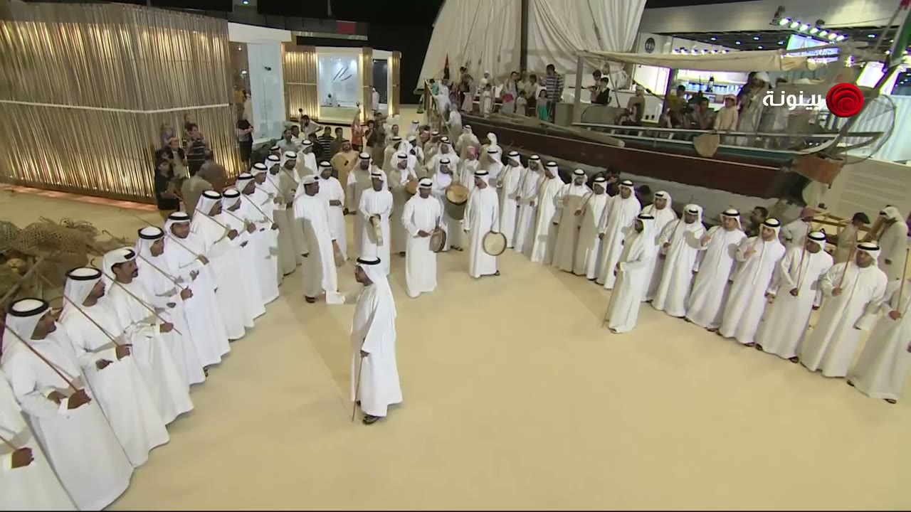
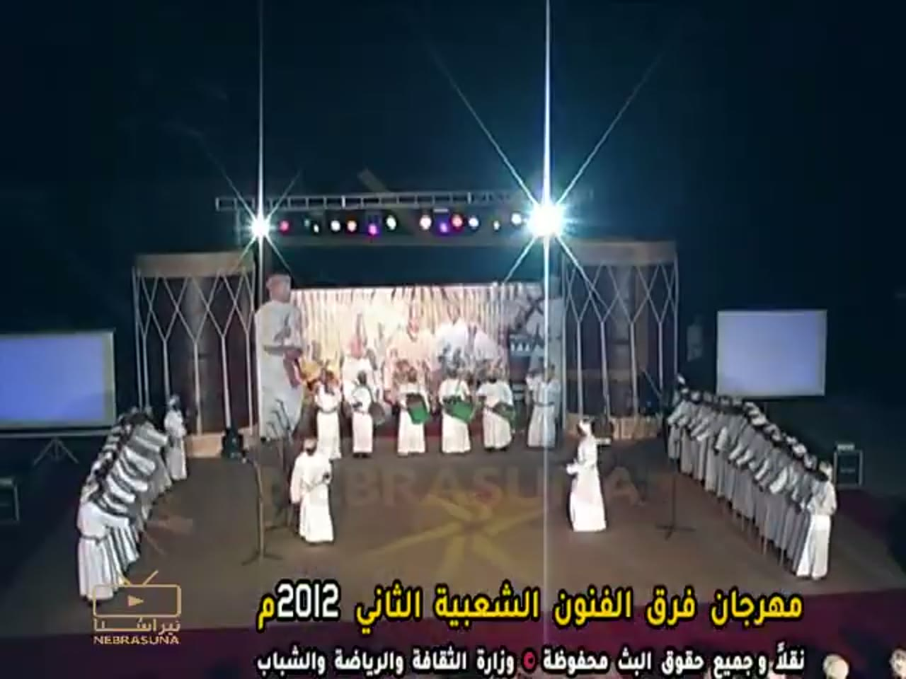
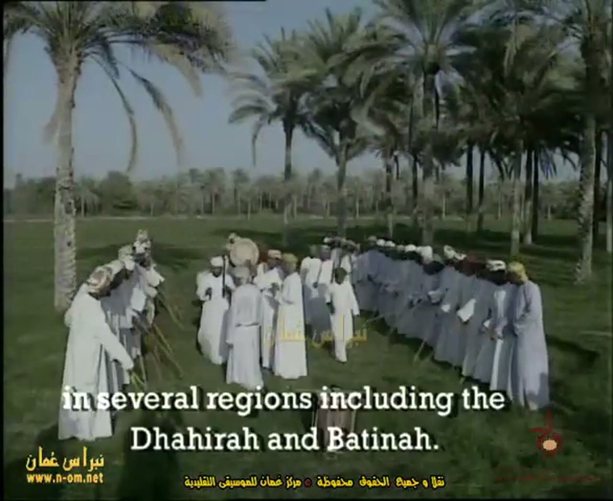
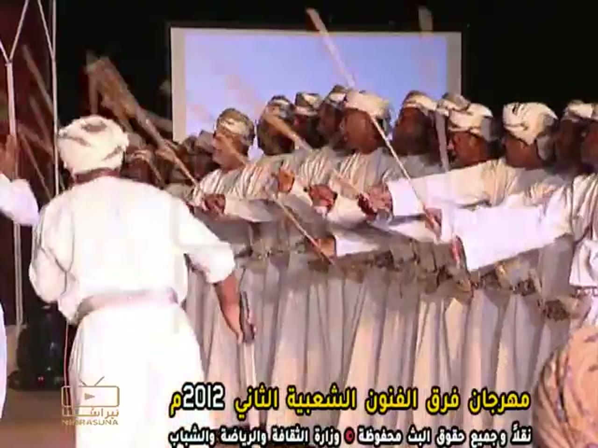
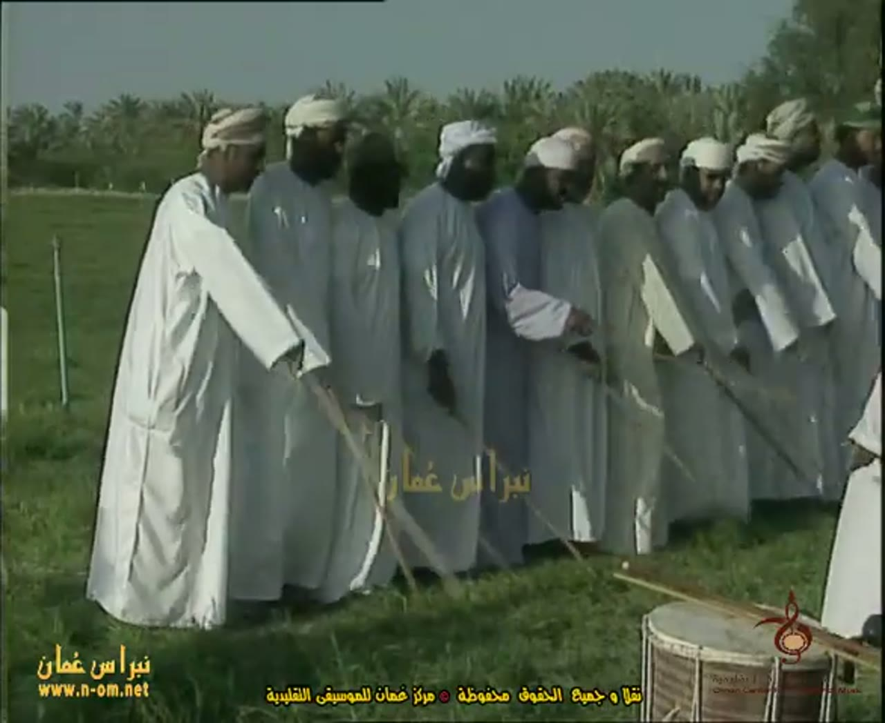
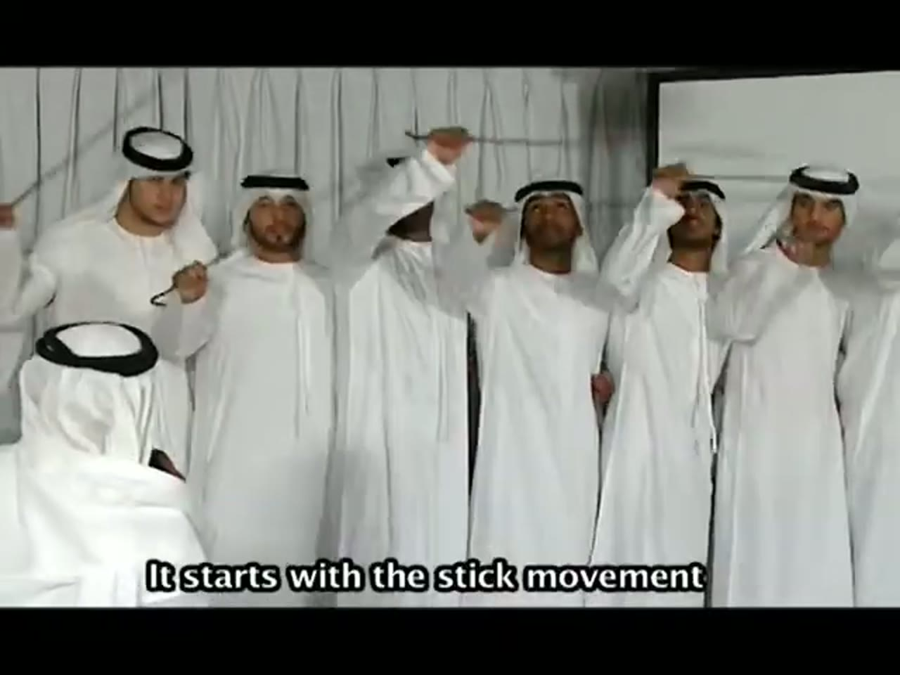
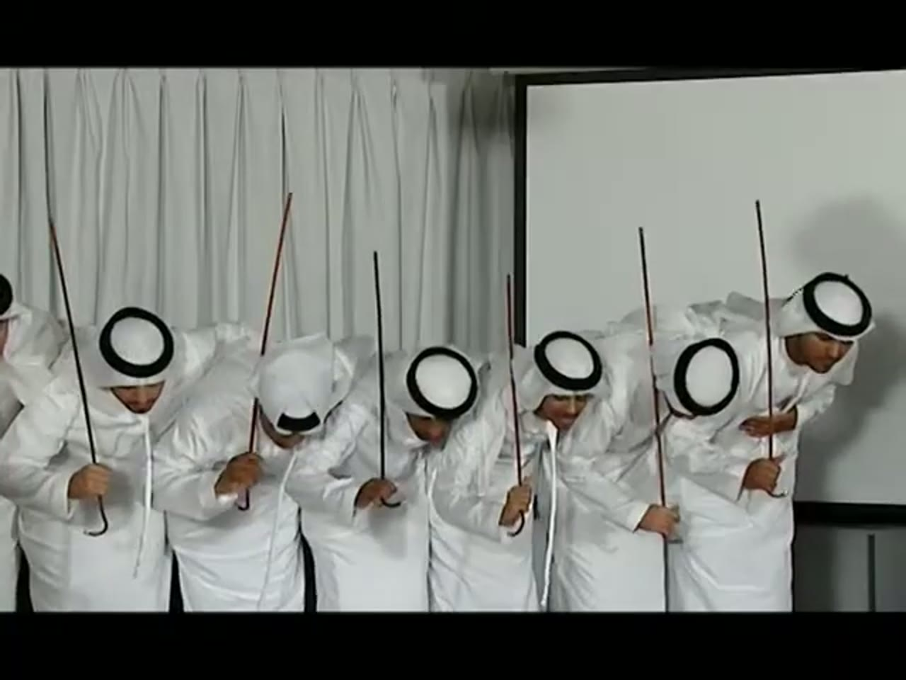
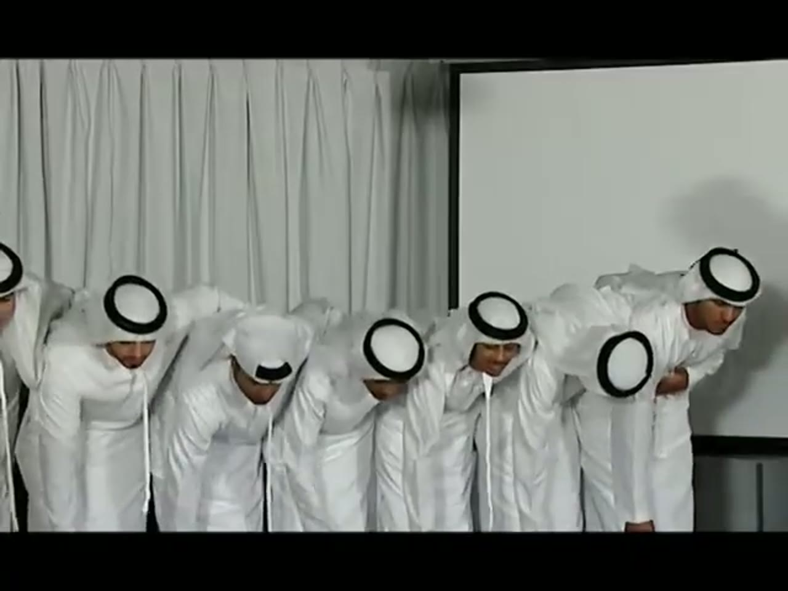
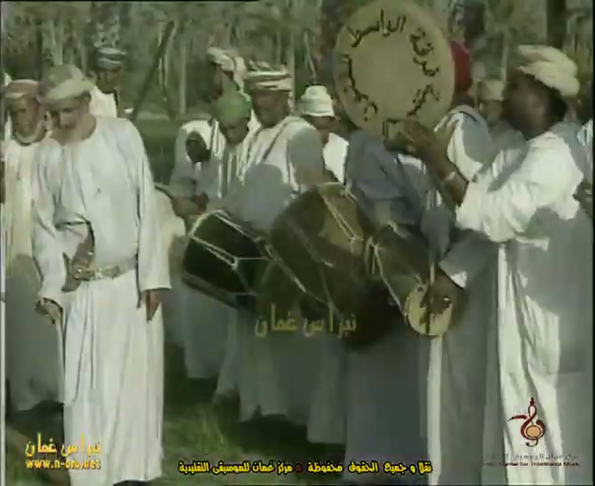
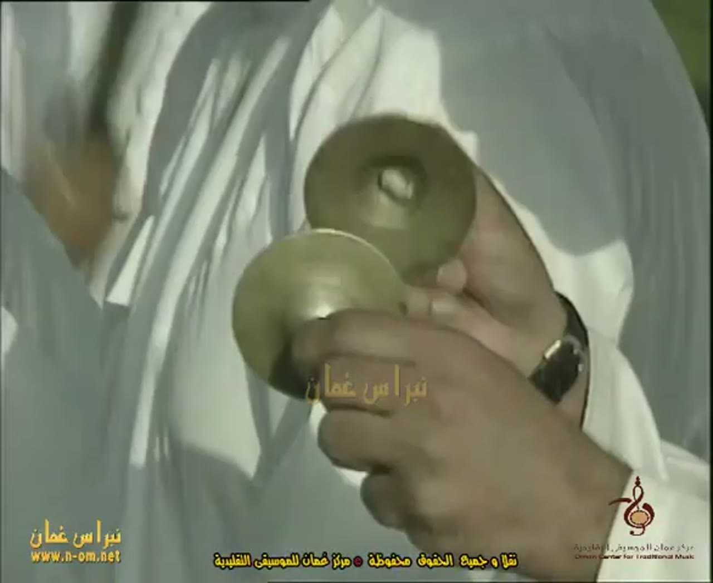

# Al-Ayyala (العيالة) reference keyframes

Reference for redrawing the Hikaya Al-Ayyala animation. Made 2026-10-04/05 from four
videos (`sources.txt`). Ten keyframes, each a different pose or moment, picked from
2,521 frames extracted at 1 per second (560 + 787 + 271 + 903). It also carries the
timing measurements (the **Timing** section).

**How to read the descriptions.** They cover only what is visible in the frame.
Where something can't be read (which hand, a cane tip, feet), the entry says so
instead of filling it in. When a performer's own left and right can't be told
reliably, hands are given by side of the frame ("frame-left hand"). Counts of men are
approximate ("about"). No distances are given in metres. The only measured sizes are
in the Timing section, each with its method.

## Where everything is

| What | Where |
|---|---|
| Keyframes (10 JPG, 1280 px wide) | `keyframes/` next to this file |
| Source URLs and titles | `sources.txt` |
| Contact sheets: every 2 s, timestamp on each tile | Drive `C:\ai\projects\arabic-app\Hikaya dance reference\ayyala\contact_ayyalaN.jpg` |
| 30 s clips with audio | Drive, same folder, `clip_ayyalaN.mp4` |
| Analysis folder: `LOG.md` (every command, raw output and hand count behind the figures below), onset csv files, spectrogram and motion png files, frame strips, helper scripts | Drive, same folder, `analysis\` |
| Full videos and all 1 fps frames | Machine A only: `C:\media\dances\ayyala\` (`frames\ayyalaN\ayyalaN_tSSSSs.jpg`, SSSS = second; `sheets\ayyalaN\pNN.jpg` = viewing pages) |
| This note, `sources.txt` and the keyframes in git | `arabic-buddy` repo, `docs/reference/ayyala/` (contact sheets, clips, analysis and videos are not in git) |

## Clips

| Clip | Source span | What's in it |
|---|---|---|
| `clip_ayyala1.mp4` | ayyala1, 4:24-4:54 | The indoor demonstration: a row of men with hooked canes, two bows (4:31.0-4:33.0 and 4:48.0-4:50.0) and the English subtitles "It starts with the stick movement" and "and then they move their hand and head". Quiet audio (mean -29.7 dB). I haven't listened to it |
| `clip_ayyala2.mp4` | ayyala2, 8:17-8:47 | 8:17.0-8:31.7 is one steady wide shot of both rows on the stage, bending and rising together; then cuts to closer shots. Loud audio (mean -15.4 dB, peaks at 0 dB). I haven't listened to it |
| `clip_ayyala3.mp4` | ayyala3, 0:30-1:00 | 0:30-0:55.7 is one steady shot of the leader at frame-left and the first men of the row, the cane moving about every 2 s (see Timing); then a cut. Audio mean -15.3 dB, peaks at 0 dB; this is the stretch with the steadiest pulse (Timing, 4a). I haven't listened to it |
| `clip_ayyala4.mp4` | ayyala4, 0:26-0:56 | 0:26.5-0:40.8 is one steady wide shot of both rows with drummers between them; then cuts to closer shots. Very quiet audio (mean -40.3 dB) with almost no drum onsets in 0:26-0:50 (Timing, 4a). I haven't listened to it |

---

## 1. Formation, wide, exhibition hall

`ayyala4_t0036s.jpg` · ayyala4 (Baynounah TV) at 0:36

- High camera over a sand-coloured floor. Two long rows of men in white stand along the frame-left and frame-right sides and curve away toward the back, so the floor between them is an open V. About a dozen men are visible in each row (not counted exactly).
- Costume, all the same: long white thobe, white ghutra with a black agal ring (some with the ghutra tail hanging).
- Frame-left row: the men are close together, shoulder to shoulder, and stand in profile, facing toward the open floor (frame-right). Each holds a long thin cane that runs diagonally across the picture, one hand gripping it at about waist-to-chest height; the tips are not visible. Frame-right row: the men are also shoulder to shoulder; a few thin canes can be seen standing or leaning near their hands.
- At the back, between the two rows, a cluster of men stands apart from the rows, about an arm's length apart. Four of them hold drums: one holds a round frame drum low at the hip by its rim; one holds a round frame drum with a dark skin at the hip with a short stick or a hand across it; one carries a tall barrel-shaped drum upright at chest height; one holds a round frame drum hanging at his side. (Checked on a zoomed crop.) A man in white stands in front of them, nearest the camera, facing frame-left, with a cane held low.
- Background: a wooden boat with spectators leaning on its rail (frame-right), a bamboo-slat wall (frame-left) and a heap of brown wicker or netting on the floor at the far left. A TV channel logo is at the top right.

## 2. Formation, wide, stage at night

`ayyala2_t0498s.jpg` · ayyala2 (NEBRASUNA) at 8:18

- High, wide shot of a lit stage at night. The picture is low resolution (640 x 480 source).
- Two rows of men stand along the frame-left and frame-right edges of the stage, each a long line receding toward the back. The men in both rows lean forward at the waist: their heads are down and their grey-shadowed backs face the camera. Whether they hold canes can't be read at this size.
- At the back of the stage, a line of about seven men in white stands in front of a painted backdrop. At least three hold drums with green bodies at waist level; the rest hold objects I can't make out. At the frame-left end of that line a taller figure in a grey-white robe stands, holding something yellow at chest height.
- Two more men in white stand in front of the line, well apart from each other and from the rows (one frame-left, one frame-right of centre), each beside a microphone stand.
- Overlays: an Arabic caption about the festival (in yellow), a line of Arabic credit text and the channel logo at the bottom left.

## 3. Formation, outdoors, palm grove

`ayyala3_t0092s.jpg` · ayyala3 (NEBRASUNA) at 1:32

- Wide shot on grass under date palms. Men in white and grey-blue robes with turbans or caps stand in file. A long line of them recedes away from the camera toward the frame-right (more than a dozen men); a group stands at frame-left, and a cluster stands in the gap between them. A large drum on the grass is cut by the bottom of the frame.
- Frame-left: a group of men stands close together with thin tan canes held low, pointing down and across. In the cluster in the middle of the picture, one man holds a round pale frame drum up at head height, and another holds a thin vertical stick. (Checked on a zoomed crop.)
- An English subtitle covers the lower picture ("in several regions including the Dhahirah and Batinah.").

## 4. Row with canes held forward

`ayyala2_t0700s.jpg` · ayyala2 (NEBRASUNA) at 11:40

- Close shot from the end of a row that recedes to the upper left. The men stand shoulder to shoulder in cream or white thobes, some with a decorated belt, and patterned cream-and-brown turbans.
- Each man's nearest arm is stretched forward at about chest height, forearm roughly level, and the hand grips a thin cane. The canes rise from the hands toward the upper left of the picture at about 45 degrees or more; some of the canes at the top and the left are blurred. Which hand holds the cane can't be read.
- Several men have their mouths open. In the foreground at frame-left a man in a white thobe with a white sash stands with his back to the camera, arms out. A stage screen is behind the row.
- Overlays: Arabic caption and credit lines and the channel logo at the bottom.

## 5. Arm out, cane pointing forward-down

`ayyala3_t0037s.jpg` · ayyala3 (NEBRASUNA) at 0:37

- At frame-left the leader of the row, in a white thobe seen from the side, with his arm stretched forward and down at about 45 degrees; his hand holds a long thin tan cane that runs from his hand down to the grass at the lower right. (Checked on a zoomed crop.) This is the pose called "arm out" in the Timing section.
- The row beyond him stands shoulder to shoulder in grey-blue thobes with white trim and turbans; their faces are in shadow.
- At the lower right, a large two-headed drum stands on its end on the grass, the upper skin pale grey, the body wrapped in cream rope lacing, with a long thin tan stick lying across the top. A channel logo and Arabic credit text are at the bottom.

## 6. Canes raised, standing (demonstration)

`ayyala1_t0265s.jpg` · ayyala1 (UNESCO) at 4:25

- Indoor, in front of a grey curtain and a white screen; the picture has black bars above and below. Six men stand in a line, in long white thobes and white ghutras with black agal rings. A seventh man in the same dress sits or kneels in the foreground at frame-left with his back to the camera.
- Canes are held in different positions: at frame-left a thin cane runs diagonally up and to the left from the first man's hand; the second man holds a hooked cane by its crook, the hook hanging down by his hand; the third and fifth men have an arm raised beside the head and a thin cane held level above the heads (the crook at one end, in the third man's hand).
- At least two of the men look up. The subtitle on screen reads "It starts with the stick movement".

## 7. Bow, canes upright

`ayyala1_t0272s.jpg` · ayyala1 (UNESCO) at 4:32

- The same group, seven men with the left-most cut by the frame edge, bent forward at the waist so the tops of their white ghutras and the black agal rings are seen from above. Heads are down; the men toward frame-right look down and toward frame-right; one man in the middle smiles toward the camera with his head dropped.
- At least four hooked canes stand upright, each with its crook at a hand at about belt height and the shaft rising past the head to the top of the picture. The right-most man grips his cane with one hand near the crook and the other hand around the shaft at chest height.
- The right-most man's head and the lower robe give a lateral lean of about 23-31 degrees (measured, see Timing 4b); the bend toward the camera can't be read.

## 8. Deeper bow

`ayyala1_t0289s.jpg` · ayyala1 (UNESCO) at 4:49

- The same group, again bent forward, further than in keyframe 7 for the men toward the frame-left and the middle: the picture shows mainly their backs and the tops of their ghutras with the agal rings, and their heads are lower in the picture than the right-most man's.
- No canes are visible in this frame. The right-most man has one hand flat against his chest.

## 9. Drums, close

`ayyala3_t0081s.jpg` · ayyala3 (NEBRASUNA) at 1:21

- Close shot among the men in the grove. At frame-right a man in a cream turban and white thobe, seen in profile facing frame-left, holds a large round frame drum up at head height; the skin is pale and has Arabic calligraphy written on it. His hand holding the drum from below wears a watch.
- In the middle a man in a blue-grey robe carries a large two-headed barrel drum slung at hip level, tilted; the skin is dark, and it has cream rope lacing in a diamond pattern. Behind it, at frame-left, a second, smaller two-headed drum shows its dark skin. A small round cream skin is at the lower end of the large drum, with a thin stick held upright across it by a hand. Who strikes which drum can't be read in this frame.
- At frame-left a man in a white thobe with a silver belt and a curved dagger at the centre front of the belt stands with his hands down; he wears a cream cap or turban.

## 10. Cymbals, close

`ayyala3_t0108s.jpg` · ayyala3 (NEBRASUNA) at 1:48

- Very close shot of one hand holding a pair of small brass cymbals, open: the upper disc is held between the thumb and the first fingers (centre right), the lower disc is in the fingers (centre left). Each disc is cup-shaped, with a raised dome in the middle; the dome of the upper disc has a pale spot at its centre.
- The wrist wears a dark watch; the sleeve and the robe behind are white. Whose hand it is, and where he stands in the row, is not shown.

---

## Timing

**Method.** Videos: ayyala1 (UNESCO, 9:20, 480p), ayyala2 (Oman festival 2012, 13:06, 480p, 30 fps made from 25 fps: about one frame in six is a repeat), ayyala3 (Oman Center for Traditional Music film, 4:30, 480p), ayyala4 (Baynounah TV, 15:02, 720p). Strokes: `audio.py` (percussive onsets, 3 s to 30 s stretches) with the interval statistics redone by hand-written helper scripts; tempo over time with `tempotrack.py` (12 s window, 6 s hop). Movement: `motion.py` and optical-flow scripts as leads, then hand counts or pose checks on frames; frame strips at 10 fps (+-100 ms by the strip's step, but I read blur by eye, so each change is good to about +-0.2 s), the ayyala1 demonstration at 2 fps (+-0.5 s). Repeated frames in ayyala2 were removed before any movement analysis. Everything is in `analysis\LOG.md` with the commands and raw output. Percussive onsets are only 3-43% of the sound's energy (voice and sustained sound are the rest), so all stroke figures are about the percussive onsets the script found, not a named instrument.

### 4a. Strokes

"Beat" = the intervals the script found in each stretch that are near the stretch's typical interval (0.8 to 1.25 times the median of the intervals between 250 and 450 ms). "Half-beat" = intervals shorter than 0.65 of that. Times m:ss, absolute video time.

| Video | Stretch | Onsets | Beat median (ms) | IQR (ms) | SD (ms) | BPM | Half-beat intervals | Note |
|---|---|---|---|---|---|---|---|---|
| ayyala1 | 1:40-2:08 | 86 | 360 | 343-377 | 28 | 167 | 22 | loose: 8 long gaps, 7 in between; overlaps the next by 8 s |
| ayyala1 | 2:00-2:30 | 87 | 360 | 348-371 | 17 | 167 | 8 | |
| ayyala1 | 2:30-3:00 | 86 | 354 | 342-360 | 14 | 169 | 7 | |
| ayyala1 | 6:30-6:54 | 77 | 337 | 325-348 | 15 | 178 | 10 | |
| ayyala2 | 8:10-8:40 | 96 | 404 | 389-417 | 21 | 149 | 43 (near 200 ms) | |
| ayyala2 | 10:00-10:30 | 112 | 372 | 361-383 | 20 | 161 | 61 | |
| ayyala2 | 11:40-12:10 | 118 | 337 | 330-343 | 14 | 178 | 60 | |
| ayyala3 | 0:30-1:00 | 94 | 343 | 332-354 | 15 | 175 | 12 | |
| ayyala3 | 1:10-1:40 | 118 | 337 | 325-349 | 27 | 178 | 48 | loose: pulse-lock only 0.35-0.38 |
| ayyala3 | 1:35-2:05 | 104 | 331 | 324-344 | 21 | 181 | 27 | |
| ayyala3 | 2:00-2:30 | 102 | 331 | 320-340 | 13 | 181 | 22 | |
| ayyala3 | 3:20-3:50 | 115 | 319 | 308-329 | 19 | 188 | 40 | |

ayyala4 has groups of one and two short intervals rather than a single beat, so it gets two columns: the short "unit" (intervals 190-300 ms) and the "double" (400-520 ms).

| Video | Stretch | Onsets | Unit median (ms), n, SD | Double median (ms), n, SD | BPM of the double |
|---|---|---|---|---|---|
| ayyala4 | 1:00-1:30 | 84 | 250, 46, 25 | 494, 28, 19 | 122 |
| ayyala4 | 1:50-2:20 | 80 | 238, 33, 27 | 487, 33, 18 | 123 |
| ayyala4 | 2:45-3:15 | 88 | 255, 54, 14 | 476, 32, 12 | 126 |
| ayyala4 | 6:20-6:50 | 84 | 244, 40, 25 | 464, 36, 17 | 129 |
| ayyala4 | 8:40-9:10 | 93 | 238, 54, 17 | 450, 36, 12 | 134 |
| ayyala4 | 10:30-11:00 | 83 | 238, 37, 13 | 439, 42, 20 | 137 |
| ayyala4 | 13:20-13:50 | 91 | 230, 48, 24 | 430, 37, 14 | 140 |

- **Is the pulse established?** In ayyala3 and the ayyala1 stretches the median interval stays within about 5% as the prominence threshold rises from 0.35 to 0.6 (for example ayyala3 0:30-1:00: 342.5 ms, then 345.4 ms; ayyala1 2:00-2:30: 359.9 and 359.9 ms); at the highest levels only the strongest strokes remain and the interval jumps to about one and a half to three beats. In ayyala2 and ayyala4 the median moves with the threshold because of the half-beats and groups. The autocorrelation peaks agree: ayyala3 0:30-1:00 343 ms (r 0.57), ayyala1 2:30-3:00 354 ms (0.69), ayyala2 11:40-12:10 337 ms (0.42), ayyala4 6:20-6:50 1416 ms (0.56, about six units).
- **Pattern.** ayyala1 and ayyala3: one evenly spaced beat (the spread of the beat intervals is 13-28 ms, 4-8%), with some half-beat intervals mixed in; ayyala2: a beat with about half of all intervals at half the beat; ayyala4: groups of one and two units (for example 1 1 2 2 1 1 2 2). No repeating block of up to 16 intervals (85% match) in any stretch of ayyala2, ayyala3 or ayyala4, nor in ayyala1 1:40-2:08.
- **The pulse speeds up through each film.** `tempotrack.py`, 12 s windows, median interval. ayyala3: 371 ms at 0:00-0:12, 337-348 ms over 0:18-1:24, 337 ms over 1:36-3:06, 325 ms at 3:06-3:30, 313 ms at 3:42-4:00, 325 ms at 4:12-4:30. ayyala2: 418 ms at 7:52-8:04, 383 ms at 8:28-8:40, 360 ms at 10:16-10:28, 337 ms at 11:04-11:24, 325 ms over 12:04-13:04. ayyala4's double interval goes from 494 ms (1:00-1:30) to 430 ms (13:20-13:50). ayyala1 stays near 348-372 ms over 1:48-3:06 and is 337 ms at 6:30-6:54.
- **Visible-strike cross-check (ayyala3, 1:48.0-1:50.4, cymbals in keyframe 10).** Read on native-fps strips (25 fps). I could see the cymbals close eight times, at 1:48.26, 1:48.54, 1:48.78, 1:49.10 (less sure), 1:49.32 (less sure, a long closed run), 1:49.72, 1:50.00 and 1:50.28. The intervals are 280, 240, 320, 220, 400, 280, 280 ms (median 280 ms, mean 289 ms). A colour-based count over 1:48.0-1:52.0 found eleven closures with a median interval of 280 ms. The audio onsets in the same seconds (ayyala3 1:35-2:05) have beat intervals near 330 ms. So the visible cymbals close about 15% faster than the audio pulse, and only 3 of the 8 closures fall within 50 ms of an audio onset (delays onset minus closure: +4, +67, +146, +145, -75, -4, -104, -48 ms). **They do not agree.** Either the cymbals play a rhythm different from the pulse the audio shows, or the closeup and the soundtrack are not from the same moment. This footage can't say which. No visible drum strike was matched, and no visible-strike check was made for ayyala1, ayyala2 or ayyala4.
- **What the onsets are.** Spectrograms (ayyala3 0:30-1:00, ayyala4 6:20-6:50) show gliding harmonic stripes (voices) plus narrow vertical bursts across many frequencies (struck sounds). The percussive share of the energy is 0.16-0.43 in ayyala1, 0.07-0.09 in ayyala2, 0.07-0.13 in ayyala3, 0.03-0.05 in ayyala4. I could not match the onsets to a visible striking action, so I do not name the instrument.
- **ayyala4 0:26-0:50** has almost no onsets (0 in the windows 0:26-0:38 and 0:32-0:44, 8 in 0:20-0:32, 5 in 0:38-0:50): that clip is not usable for stroke timing.

### 4b. The main repeating movement

In this dance the repeating movement is a cycle of the canes and the bodies together. What is measurable differs by video, so each row says what it is.

| Video | Span (steady shot) | What was timed | n cycles | Period | Method | Confidence |
|---|---|---|---|---|---|---|
| ayyala3 | 0:31.4-0:39.7 (shot 0:29.5-0:55.7) | Leader's cane: "cane up" to "cane up" | 4 | 2.08 s (starts at 31.4, 33.6, 35.6, 37.6, 39.7; SD of the 4 intervals 0.10 s). Counting the "arm out" starts (30.3, 32.0, 34.3, 36.1, 38.3 s) gives 2.00 s over 4 cycles (SD 0.29). A second read on a montage of the cane-up instants gives 2.03 s (4 cycles, 31.7-39.8 s). Reported: **about 2.0 s, +-0.1** | Hand count on 10 fps strips; the `motion.py` energy FFT agrees loosely (1.95 s peak, next to a 2.6 s peak) | medium-low |
| ayyala2 | 8:20.16-8:29.84 (shot 8:17.0-8:31.7, 13.5 s used) | Left row's cycle of canes forward and canes held in, and bending | 4 | 2.42 s (flow peaks at 500.16, 502.60, 505.04, 507.44, 509.84 s; intervals 2.44, 2.44, 2.40, 2.40). Right row's autocorrelation 2.36 s. **About 2.4 s** | Optical flow lead plus a check: in all 5 flow peaks the canes are splayed forward, and 1.2 s later they are held in. No bow-by-bow hand count | medium-low |
| ayyala4 | 0:28.7-0:38.3 (shot 0:26.5-0:40.8, 12 s used) | Horizontal flow of both rows | 3 | 3.21 s (right row peaks at 28.70, 31.94, 34.98, 38.34 s; left row 31.82, 35.06, 38.10 s). **About 3.2 s** | Optical flow lead only; I could not see the cycle on the frames I looked at | low |
| ayyala1 | 4:24-4:56 (indoor demonstration) | the three bows | 3 bows, no cycle | Bows at 4:31.0-4:33.0, 4:48.0-4:50.0 and 4:54.0-(at least 4:55.5): each lasts about 2 s, 17 s then 6 s apart | 2 fps strip | not a repeating cycle: the demonstration shows different movements one after another |

- **Strokes per cycle.** ayyala3, 0:31.4-0:39.7: the audio has 24 onsets in the 4 cycles, 21 of the 23 intervals are beats near 343 ms: about **6 beats per cycle** (2.0-2.1 s / 343 ms = 5.8-6.1). ayyala2, 8:20.16-8:29.84: 33 onsets, 15 beat intervals near 403 ms and 17 half-beats: 15 + 17/2 = 23.5 beats in 4 cycles = 5.9 per cycle (2.42 s / 0.403 s = 6.0). Both videos give about 6 beats per cycle; the tempo differs (343 ms and about 403 ms) and the period scales with it. ayyala4: not given (no pulse in 0:28-0:41).
- **Whether the two rows move together.** ayyala2: yes, as far as I could read it: on 10 fps side-by-side strips of the two rows at 8:17.5-8:23.4 both rows are bent forward at the same moments and upright at the same moments; the energy of the two rows is correlated at lag 0 ms (r 0.53, against 0.31 for a control patch) with no lag either way. ayyala4: the flow peaks of the two rows fall within 0.1-0.25 s of each other (low confidence). ayyala3 and ayyala1: only one group in the shots used.
- **Size (ayyala1 demonstration, keyframes 6-8).** Measured on a grid overlay (`grid.py`) for the right-most man, points read to about +-15 px. Lateral lean of the line from the middle of his lower robe to his head ring: 23-31 degrees in keyframe 7 (4:32) and 23-31 degrees in keyframe 8 (4:49); I report **about 27 degrees, +-8**, in both. This is only the sideways part (the men bow toward the camera and toward frame-right, and the hips are hidden by the robe), so the real forward bend is larger and can't be read from this view. The head ring drops by 178 px in keyframe 7 and 198 px in keyframe 8 compared with the standing keyframe 6 (4:25), that is **30% and 33%** of the 600 px from the head ring to the bottom edge of the picture in the standing frame (+-3%; his feet are cut off, so this is not his height). The bend of the wide-shot rows in ayyala2 and ayyala4, and the swing of the arm in ayyala3, are too small or too blurred to give in degrees.
- **Not measured: the sway.** I did not separate a side-to-side sway of the bodies from the bow; the footage I measured shows the forward bend (ayyala1, ayyala2) and the cane cycle (ayyala3).

### 4c. Pose timeline

Poses are named from what the frames show.

ayyala3, 0:30-0:40 (10 fps strips, +-0.2 s; the leader and the men next to him). Two poses: **cane up** (cane near vertical above the hand, forearm raised) and **arm out** (arm stretched forward, the cane pointing forward-down to about level; keyframe 5).

| Change (video, time -> pose) | Duration (ms) | Beats of 343 ms (counted onsets / duration / 343) |
|---|---|---|
| ayyala3, 0:30.0 -> cane up (the stretch starts in this pose) | about 300 | 1 / 0.9 |
| ayyala3, 0:30.3 -> arm out | about 1100 | 3 / 3.2 |
| ayyala3, 0:31.4 -> cane up | about 600 | 1 / 1.7 |
| ayyala3, 0:32.0 -> arm out | about 1600 | 5 / 4.7 |
| ayyala3, 0:33.6 -> cane up | about 700 | 2 / 2.0 |
| ayyala3, 0:34.3 -> arm out | about 1300 | 3 / 3.8 |
| ayyala3, 0:35.6 -> cane up | about 500 | 2 / 1.5 |
| ayyala3, 0:36.1 -> arm out | about 1500 | 4 / 4.4 |
| ayyala3, 0:37.6 -> cane up | about 700 | 3 / 2.0 |
| ayyala3, 0:38.3 -> arm out | about 1400 | 4 / 4.1 |
| ayyala3, 0:39.7 -> cane up | (stretch ends at 0:40.0) | |

Order: cane up, arm out, cane up, arm out ... 5.5 repeats in 10 s. Cane up lasts about 0.5 s on average (0.3-0.7 s), arm out about 1.4 s (1.1-1.6 s): about 1 or 2 beats and 3 to 5 beats. The change from arm out to cane up falls on a beat only to within the resolution (about 0.2 s, two thirds of a beat), so I can't say whether the changes are on the beat. Only 10 s could be labelled: after 0:41.5 the camera is closer and the leader is out of frame (0:40-0:50 is other/unclear), so this stretch is shorter than the 20 s asked for, and it is the only stretch with strokes counted against poses.

ayyala1, 4:24-4:56 (2 fps strip, +-0.5 s; the demonstration, no strokes counted because the clip is quiet with subtitles over it).

| Change (video, time -> pose) | Duration (ms) |
|---|---|
| ayyala1, 4:24.0 -> canes raised (canes up and waved above the shoulders; keyframe 6) | about 7000 |
| ayyala1, 4:31.0 -> bow (keyframe 7) | about 2000 |
| ayyala1, 4:33.0 -> hand to head (hands up beside the head, canes across the body) | about 8500 |
| ayyala1, 4:41.5 -> other/unclear (canes out diagonally, arms open) | about 2500 |
| ayyala1, 4:44.0 -> canes planted (canes upright at the side) | about 4000 |
| ayyala1, 4:48.0 -> bow (keyframe 8) | about 2000 |
| ayyala1, 4:50.0 -> canes planted | about 1000 |
| ayyala1, 4:51.0 -> canes overhead (crooks raised above the heads) | about 1000 |
| ayyala1, 4:52.0 -> other/unclear | about 2000 |
| ayyala1, 4:54.0 -> bow | at least 1500 (the strip ends at 4:55.5) |

There is no regular order or beat in the demonstration: the poses last 1 to 8.5 s, and the bow comes back after 17 s and then 6 s. It is a demonstration, with each movement shown in turn. ayyala2 and ayyala4 could not be labelled (the men are too small and the shots too short).

### 4d. The bow-and-sway cycle, and the two rows

- **Cycle length.** About 2.0 s (ayyala3), about 2.4 s (ayyala2), about 3.2 s (ayyala4, low confidence); about 6 beats of the audio pulse in the two films where it could be checked. See the table in 4b.
- **Strokes during it.** About 6 beats (ayyala3: 24 onsets in 4 cycles, 5.8-6.1 beats per cycle; ayyala2: 5.9 beats per cycle). ayyala2 also has a half-beat between most beats.
- **How far the body tilts.** About 27 degrees, +-8, as a sideways lean of the head from the hips in the ayyala1 demonstration; a lower bound (4b). The drop of the head is about 30-33% of the head-to-picture-bottom distance of the standing man.
- **What the canes do during it.** From the frames: in ayyala3 the leader's cane goes up to near vertical, then the arm swings forward and down with the cane pointing forward-down to about level (blurred in the frames), and returns, about every 2.0 s; in ayyala2 the canes of a row are held out forward at about chest height with the tips rising toward the upper left (keyframe 4), and in the wide shot they splay out in front of the row on one phase of the 2.4 s cycle and are held in against the body on the other; in the ayyala1 demonstration the canes are waved up, held across the body, planted upright (crook in the hand at about belt height) while the men bow, and raised overhead (keyframes 6-7). A repeating period of the cane alone was measured only for ayyala3.
- **Do the two rows move together or alternate?** Together, in ayyala2 (4b). Not measured in ayyala1 or ayyala3 (one group in the shots); low-confidence "together" in ayyala4.

### 4e. Proposed animation constants

| Constant | Value | Evidence | Confidence |
|---|---|---|---|
| `BEAT_MS` (time between pose changes) | about 1000 (cane up about 500 + arm out about 1400 per cycle, so a change about every 1.0 s) | ayyala3, 0:30.3-0:39.7, nine complete segments in 9.4 s = 1.04 s each; hand read, one stretch, +-0.2 s | low |
| `STROKE_MS` | 320-405 ms depending on the group, shortening through the dance: ayyala3 343 -> 319 ms (0:30-1:00 to 3:20-3:50); ayyala2 404 -> 372 -> 337 ms (8:10 to 11:40); ayyala1 337-360 ms; ayyala4 unit 250 -> 230 ms (double 494 -> 430 ms). Half-beats (about 170-200 ms) fill in between beats in ayyala2 and ayyala3 | audio.py in 19 stretches of 4 videos (4a). The visible cymbals closed about every 280 ms against a 331 ms audio pulse (ayyala3 1:48-1:50.4): the visible check does not agree | medium |
| `MOVE_PERIOD_MS` | about 2000 (ayyala3) to 2400 (ayyala2) = about 6 beats; ayyala4 about 3200 | ayyala3 hand count of 4 cycles 0:31.4-0:39.7 (2.0 s +-0.1) with a loose energy-FFT agreement; ayyala2 flow, 4 cycles 8:20.16-8:29.84 (2.42 s); both = 5.8-6.1 beats; ayyala4 flow lead only, 3 cycles | medium-low |
| `MOVE_SIZE` | about 27 degrees +-8 of sideways head lean from the hips (a lower bound for the bow); head drop 30-33% of the standing head-to-picture-bottom distance. Arm and cane swing: not measurable | ayyala1 keyframes 7-8 vs 6 on grid overlays (4b) | low |
| `SEQUENCE` | cane up -> arm out -> cane up -> arm out ..., a repeat every about 2.0 s (ayyala3). For a demonstration: canes raised -> bow -> hand to head -> canes planted -> bow -> canes overhead -> bow, in no regular order (ayyala1) | ayyala3 0:30-0:40 (5.5 repeats), ayyala1 4:24-4:56 (4c). "Cane up" frames of ayyala3 are not among the keyframes | low |

---

## Not covered by these frames

- **No single shot has everything.** No video shows both rows, the drummers and cymbals, and a bow large enough to read an angle, in one steady shot. The wide shots (keyframes 1-3) are too small to measure the bow; the close demonstration (ayyala1) shows one group only.
- **Cymbals** are seen only in one close shot (ayyala3, 1:48-1:52, keyframe 10); where those men stand in the formation is not shown. Their visible rate does not match the audio pulse (4a).
- **The drummers** between the rows are small in the wide shots (keyframe 1, 2); who strikes which drum, and how, was not read in any frame.
- **Which hand** holds a cane or a drum can't be read in most frames, and feet are hidden by the robes everywhere.
- **Sway** of the bodies was not separated from the bow, and the movement of heads and shoulders in the rows (the "moving heads" of the usual descriptions) was not measured.
- **Audio.** Voice dominates; the onsets are 3-43% of the energy and could not be matched to a visible strike, so the instruments are not named. ayyala4's soundtrack is very quiet and has almost no onsets in 0:26-0:50. I haven't listened to any clip.
- **Edited footage.** ayyala1 and ayyala3 are short documentary films with English subtitles and many cuts, not one continuous performance. ayyala1 also has a part with women performers (around 3:10) that I did not use or describe. ayyala2 and ayyala4 are long but cut between cameras; ayyala2, ayyala3 and ayyala1 are 480p, and ayyala2's 30 fps file repeats frames. ayyala2, ayyala3 and ayyala4 carry a channel logo or caption.
- **Measurement caveats.** The movement periods come from 8 to 12 s of steady shot each (the playbook asks for 15 s). The ayyala3 count is a hand count of 4 cycles; the ayyala2 and ayyala4 periods are optical-flow figures, only the ayyala2 one has a pose check, and the ayyala4 one is unconfirmed. The pose timeline for ayyala3 covers 10 s. The bow angle is a lower bound.
- **One candidate left unreviewed.** YouTube `YgMmFX2D2JA` (Sheikh Zayed Festival channel, a "Al-Sahah championship for the yowlah of Al-Ayyala" qualifier episode, 13:51, 720p) was downloaded and deleted after I failed to get a look at it; it is not used here and may be worth a look.
