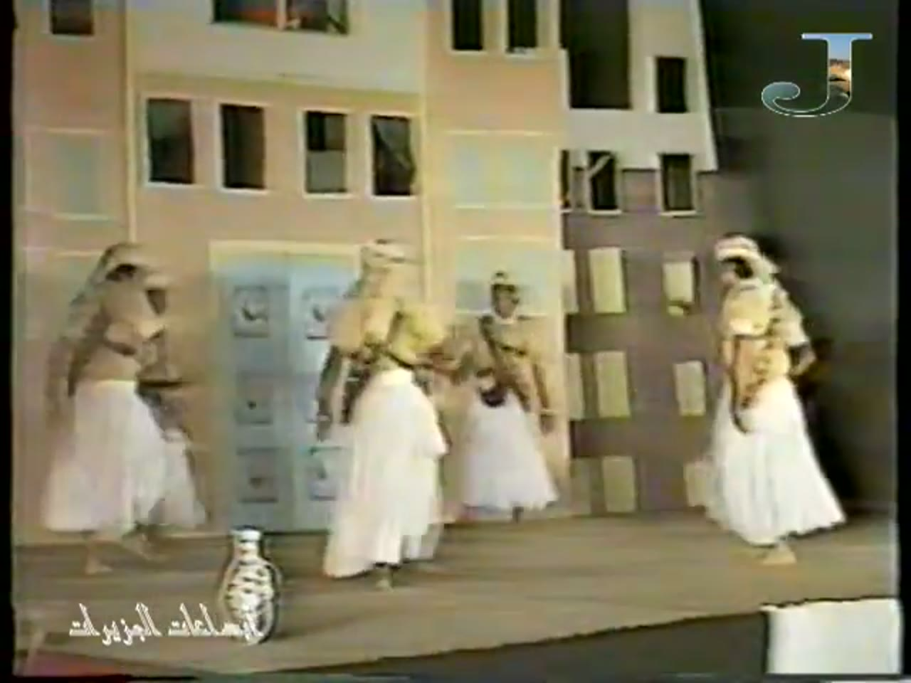
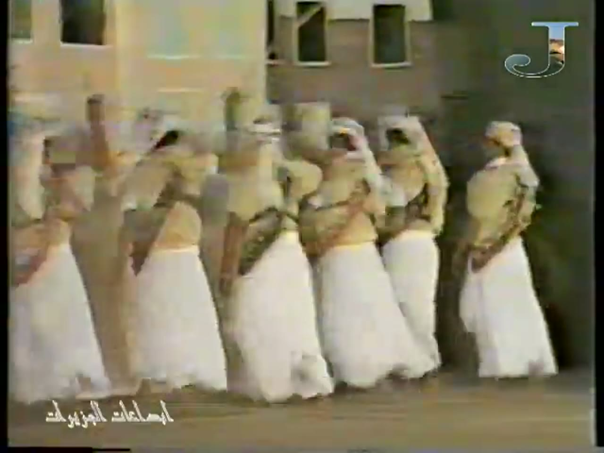
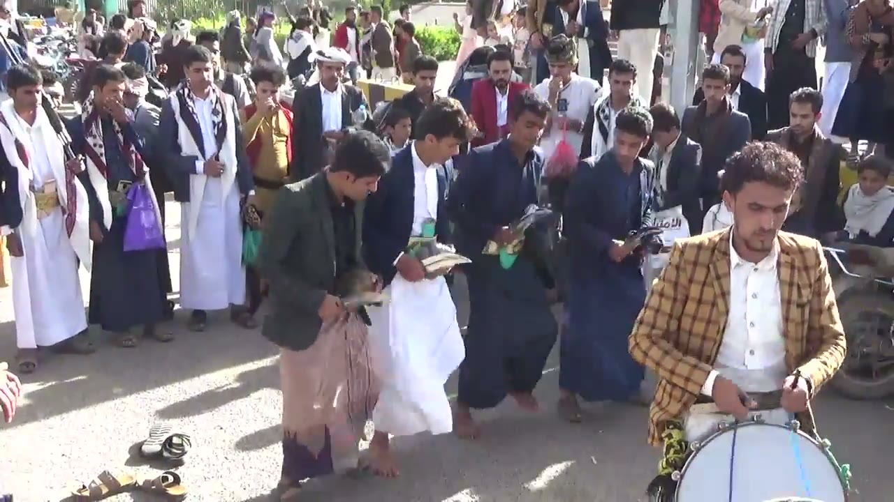
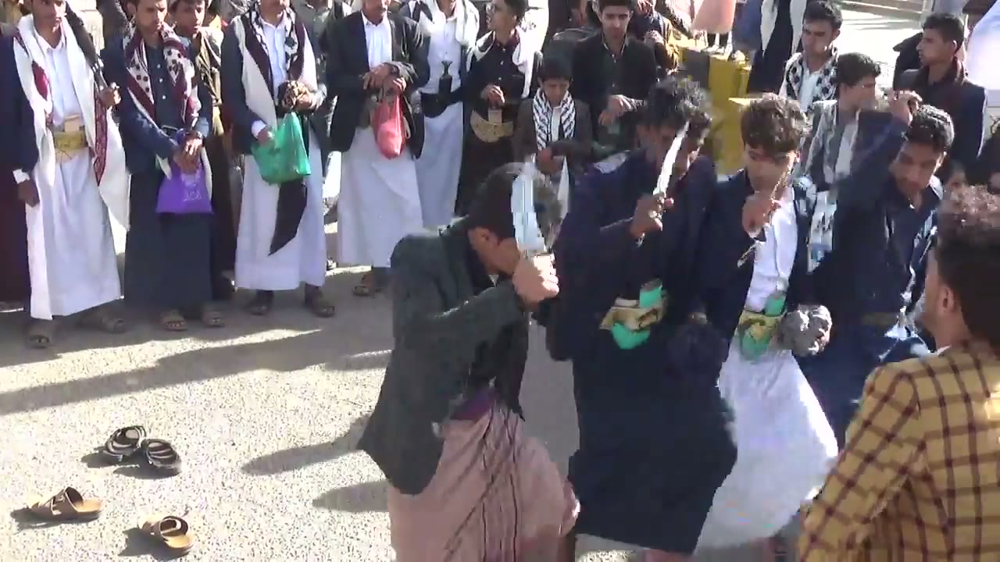
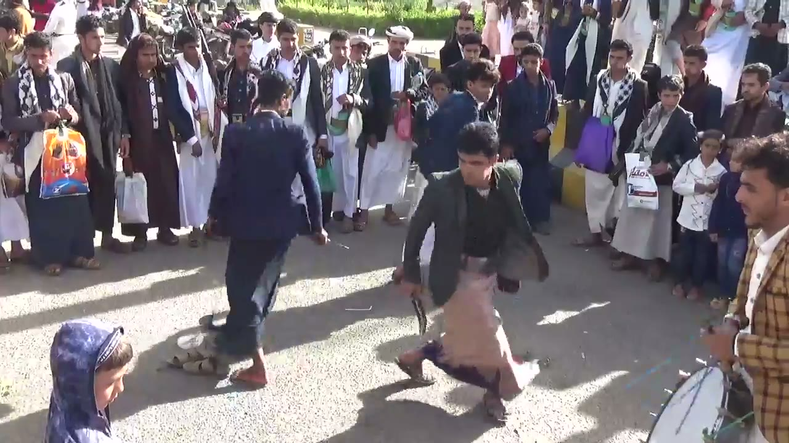
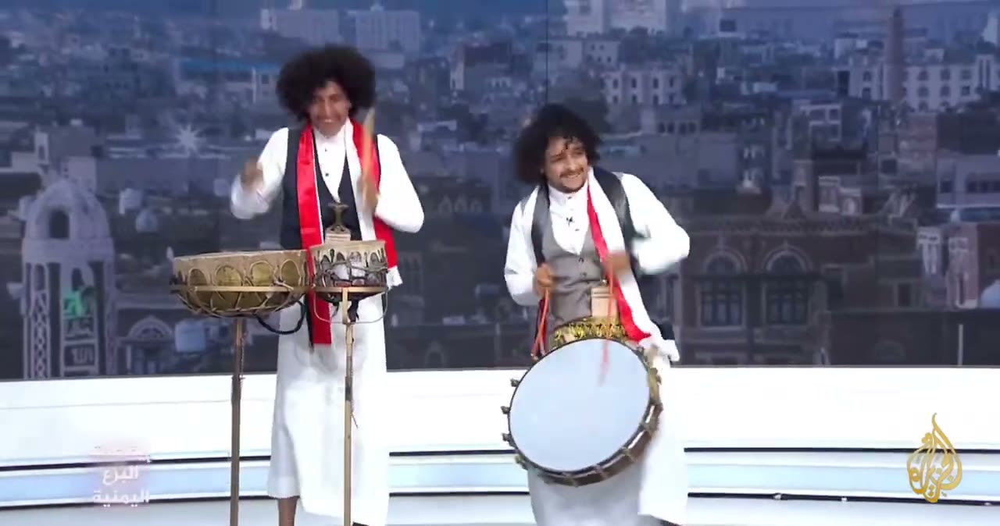
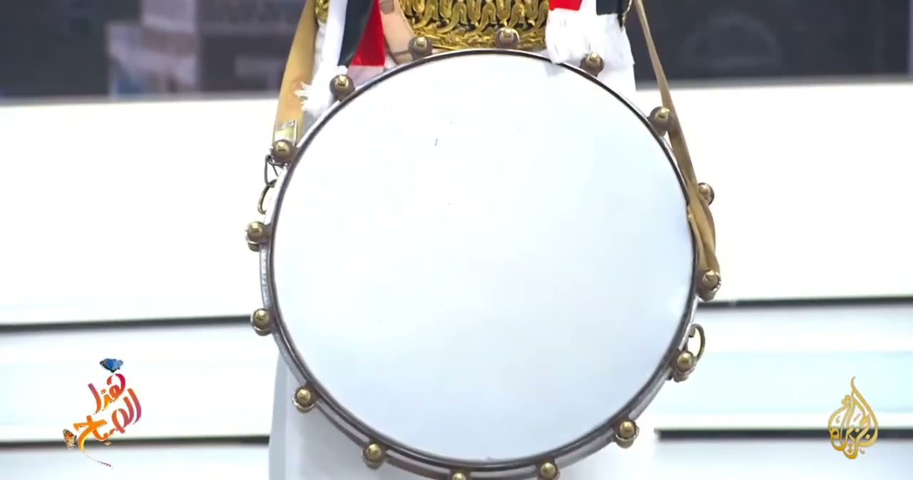
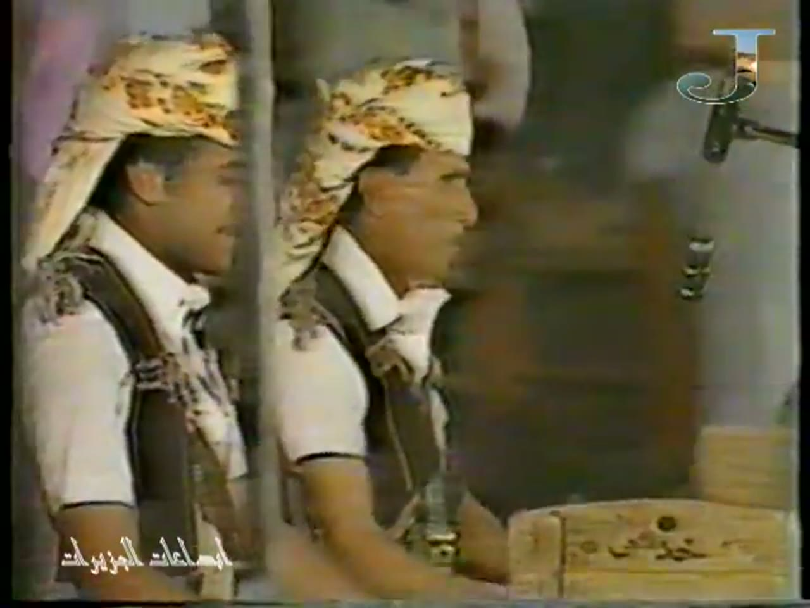
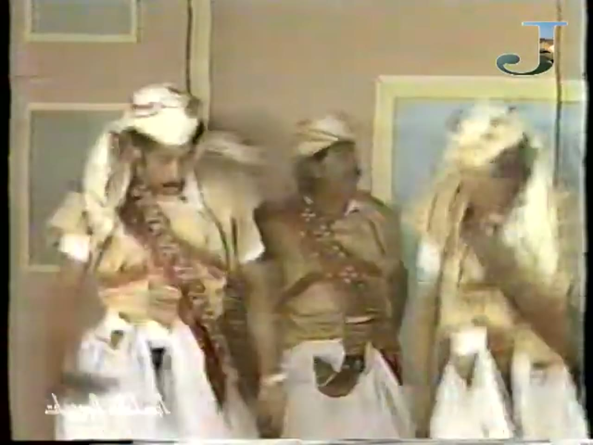
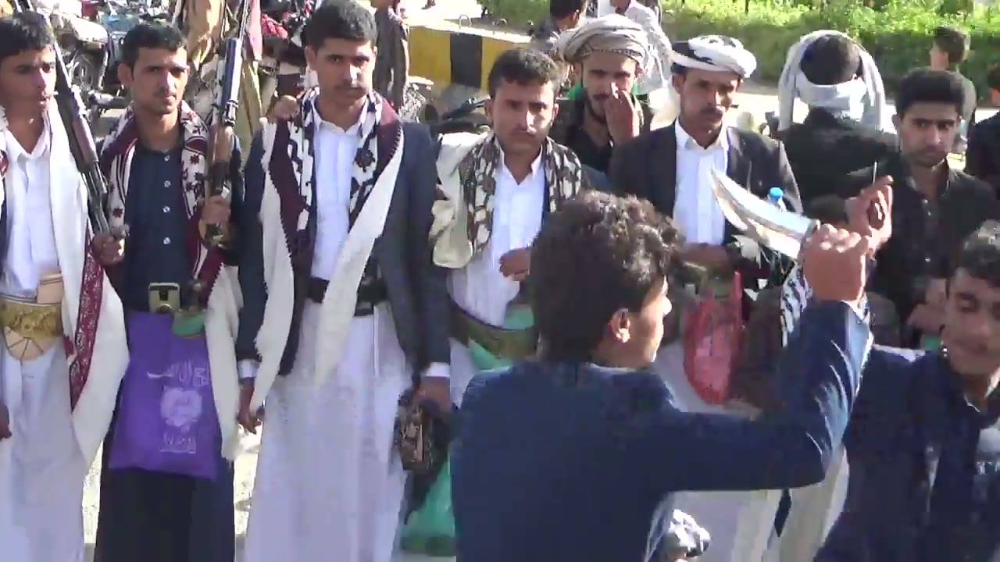

# Al-Bara' (البرع) reference keyframes

Reference for redrawing the Hikaya Al-Bara' animation (the Yemeni dagger dance of Sana'a and Haraz). Made
2026-10-04 and 2026-10-05 from three YouTube videos (`sources.txt`). Ten keyframes, each a different pose or
moment, picked from 1,936 frames extracted at 1 per second (772 + 388 + 776). It also carries the timing
measurements (section "Timing").

What the footage is, in one paragraph: **none of it is an official or festival recording of a large
formation.** I found no UNESCO listing video for the Yemeni Al-Bara' (the UNESCO "Al-Bar'ah" listing is
Oman's, a different dance), and nearly all the Bara' on YouTube is wedding or party phone video, which I did
not use. The three videos are: a staged troupe item from an old TV recording that its title attributes to
Aden TV (480p, VHS look, a private re-upload), a close handheld shot of a street Bara' in an open plaza (720p,
with a drummer; the video does not say where), and an Al Jazeera studio segment where two drummers
demonstrate (not a dance). There is no wide steady shot of a big line or
circle of dancers in any of them.

**How to read the descriptions.** They cover only what is visible in the frame. Where something can't be read
(what a blurred hand holds, which hand, feet), the entry says so instead of filling it in. When a performer's
own left and right can't be told reliably, hands are given by side of the frame ("frame-left hand"). Distances
are relative unless a measurement is named. Instrument names are not given from the dance's usual
vocabulary: the objects are described by what is held and how it is played, because nothing in the footage
labels them.

## Where everything is

| What | Where |
|---|---|
| Keyframes (10 JPG, 1280 px wide) | `keyframes/` next to this file |
| Source URLs and titles | `sources.txt` |
| Contact sheets: every 2 s, timestamp on each tile | Drive `C:\ai\projects\arabic-app\Hikaya dance reference\baraa\contact_baraaN.jpg` (N = 1, 2, 5) |
| 30 s clips with audio | Drive, same folder, `clip_baraaN.mp4` |
| Analysis folder (LOG.md, csv, png, strips, scripts) | Drive, same folder, `analysis\` (start with `analysis\LOG.md`) |
| Full videos and all 1 fps frames | Machine A only: `C:\media\dances\baraa\` (`frames\baraaN\baraaN_tSSSSs.jpg`, SSSS = second) |
| This note and the keyframes in git | `arabic-buddy` repo, `docs/reference/baraa/` (contact sheets, clips, analysis and videos are not in git) |

The video numbers 1, 2 and 5 are not consecutive: 3, 4 and 6 to 11 were downloaded, looked at and deleted
(reasons in `analysis\LOG.md`, section 2).

## Clips

| Clip | Source span | What's in it |
|---|---|---|
| `clip_baraa1.mp4` | baraa1, 8:40-9:10 | 640x480. About 8:44 a wide shot of three groups of men at the foot of the painted backdrop, then from about 8:54 close handheld views of heads, sleeves and skirts. The drumming-type sound changes from a slower to a faster pulse at about 8:54 (see Timing 4d). I haven't listened to it; its level was measured (mean -18.5 dB, max -4.8 dB) |
| `clip_baraa2.mp4` | baraa2, 1:50-2:20 | One handheld shot of four dancers in a row with drawn daggers and the drummer at frame-right. The dancers' up-down step cycle of about 440 ms is regular for the first 16 s of it (to about 2:06) and irregular after. Mean -15.1 dB, max -2.0 dB. Not listened to |
| `clip_baraa5.mp4` | baraa5, 6:34-7:04 | Studio. The two drummers play free flourishes and stops; no steady pulse (Timing 4a). Mean -19.4 dB, max -0.4 dB. Not listened to |

---

## 1. Stage, four men spread apart

`baraa1_t0088s.jpg` · baraa1 (old TV recording, title says Aden TV) at 1:28

- A theatre stage floor in front of a painted backdrop of pink-beige town houses with rows of dark windows and a pale blue panelled door. A black-and-white painted vase stands at front frame-left. A round "J" logo is at top-right and an Arabic-script watermark at bottom-left, on every frame of this video.
- Four men are spaced across the stage, a body-width or more apart, all angled toward frame-right and mid-stride (the frame-right man is the clearest, one foot ahead of the other).
- Costume: head cloths wrapped round the head, tan or yellow short-sleeved tops with a dark diagonal strap across the chest, long white skirts that flare wide at the hem.
- Feet and hands are small and blurred at this size; I can't tell what, if anything, they hold.

## 2. Line of six, arms raised

`baraa1_t0585s.jpg` · baraa1 at 9:45

- Low camera close to a line of six men that runs diagonally away to frame-left, all facing frame-right, touching or overlapping shoulder to shoulder.
- Each man has the near arm bent up with the hand at head height. Whether a dagger is in those hands can't be told: they are motion-blurred, and in at least two a slim dark or pale object shows in the raised hand but can't be named.
- Same costume as keyframe 1: head cloths, tan tops with a diagonal chest strap, white flared skirts. The backdrop is a plain wall behind them.
- This is from the middle fast section of the item (see Timing 4d: about 9:45 is inside the second tempo stage, 8:54-10:08).

## 3. Four dancers in a row with the drummer

`baraa2_t0120s.jpg` · baraa2 (Azal Tube) at 2:00

- Handheld close shot in an open plaza. Four dancers stand in a row across the frame, bent a little forward, barefoot (a pair of sandals lies on the ground at frame-left).
- From frame-left: a dark-green jacket over a tan wrap-skirt with a dark purple hem; a navy jacket over a white thobe; a navy jacket over a dark thobe; a blue jacket over a dark thobe, cut by the frame edge.
- The second dancer holds a curved dagger in his hand at waist-to-chest height, the blade lying roughly level; the third holds a similar grey object at the same height. A green-and-gold decorated sheath hangs at the front of their belts. A white cloth hangs from the second dancer's other hand (it may be the hem of his thobe held up; I can't tell). The frame-left dancer holds a flat tan object low at the hip that I can't identify at this size.
- At frame-right a drummer in a yellow-brown check jacket and white shirt, head turned toward the dancers. A large round drum with a pale skin and blue lacing hangs at the front of his body on a strap; his hands are at belt height, each holding a thin stick or beater.
- Behind them a ring of onlookers, many with patterned shawls over the shoulder, some with a curved dagger at the belt.

## 4. Daggers raised at the head

`baraa2_t0031s.jpg` · baraa2 at 0:31

- Close on four dancers. The frame-left dancer (dark-green jacket) is bent forward with a curved blade held across his forehead and face.
- The next two (navy jackets, the second in a white thobe) each hold a curved blade up beside the head, tip pointing up, the fist at about forehead height. The frame-right dancer (blue jacket) has an arm raised.
- A broad belt with a gold-and-green decorated sheath at the front on the second and third dancers.
- At frame-right edge the drummer's yellow-brown check jacket. Sandals on the ground at frame-left.
- In the zoomed crops of 0:26-0:35 the blade is held by its hilt in a fist; the blade is a crescent.

## 5. Low step with the dagger held low

`baraa2_t0248s.jpg` · baraa2 at 4:08

- Wider shot, two dancers in the open. Frame-left: navy jacket and dark thobe, barefoot and mid-step, a dagger held low in the hand at thigh level.
- Next to him: dark-green jacket over a tan wrap-skirt with a purple hem, knees deeply bent, feet wide apart, a dagger held low at his side.
- At frame-right the edge of the drummer's jacket; at the bottom-right the rim of the drum. At the bottom-left a child in a blue hooded top looks toward the camera. Sandals on the ground. A ring of onlookers behind.

## 6. The two studio drummers

`baraa5_t0412s.jpg` · baraa5 (re-upload of Al Jazeera) at 6:52

- Studio with a large photo backdrop of an old city of tower houses. The Al Jazeera logo is at lower-right and an Arabic caption at lower-left reading "إيقاعات البرع اليمنية" ("rhythms of the Yemeni Bara'").
- Frame-left: a man in a black vest over a white thobe with a red, white and black sash, standing behind two drums on a metal stand at waist height. The left one is wide and shallow with a brass-coloured body; the right one is smaller with a darker, patterned body. A small dagger hilt with a pale sheath shows between the two drums at belt height. He holds a thin stick in each hand, one raised.
- Frame-right: a man in a grey vest over a white shirt with a red and white sash, with a large round drum with a pale skin hung on a strap at his hip, tilted toward the camera, a ring of brass-coloured discs round its rim. He holds sticks or cords in both hands (one reads as red).

## 7. The hip drum, close

`baraa5_t0380s.jpg` · baraa5 at 6:20

- Close on the round drum worn at the hip: a blank white skin in a thin metal rim, with brass-coloured round discs or bosses spaced evenly round the rim (about sixteen visible), and a strap going up the frame-right side.
- Above it the player's gold-embroidered belt and the ends of the red-and-white sash.

## 8. Two seated men, a wooden box and a microphone

`baraa1_t0003s.jpg` · baraa1 at 0:03

- Opening shot of the item, close and in profile, both men facing frame-right. Each has a cream head cloth with an orange pattern wrapped as a turban, a dark brown-grey vest over a white short-sleeved shirt.
- A sheathed curved dagger hangs at the front of the frame-right man's body, the sheath grey with a brass-coloured fitting at its lower end. His mouth is open.
- At bottom-right a wooden box with Arabic writing on its front; at top-right the head of a microphone on a stand. Their hands are below the frame or behind the box: in the later frames of this shot (about 0:09-0:13) the frame-right man's arm moves at box level, blurred, and I can't see what it touches.

## 9. Costume close: head cloths and chest straps

`baraa1_t0660s.jpg` · baraa1 at 11:00

- Close, motion-blurred shot of three men in front of a beige wall with a pale blue door frame.
- Head cloths in cream or white wrapped round the head with loose tails; tan short-sleeved tops; across the chest diagonal straps: on the frame-left man a wide strap with rows of loops and red decorative bands, on the middle man a strap with red and white beads or loops. White skirts below.

## 10. Costume close: jambiya at the belt, shawls, a raised blade

`baraa2_t0320s.jpg` · baraa2 at 5:20

- Close view of the ring of onlookers. At frame-left two men in white thobes with jackets and black-and-white patterned shawls over the shoulder; each has a broad gold-embroidered belt with a curved dagger at the front (ornate hilt, a large embroidered sheath on the frame-left man).
- Two of the men hold long dark objects upright against the shoulder that look like rifles (barrel and body visible, nothing more).
- In the foreground at frame-right a dancer in a navy jacket holds a curved blade up above head height, the blade angled up toward frame-left, in a raised fist; his face is cut off.
- A man in the middle holds a purple bag.

---

## Timing

**Method note.** Tools: `audio.py` (percussive onsets from the audio, per stretch), `tempotrack.py` and my own
`pulsetrack.py` (a phase-lock pulse per 10 s window, input = `audio.py` onsets of the whole video), `strip.py`,
`kymo.py` (a space-time slice of the picture, one column per native frame, used to count cycles by eye) and
`vflow.py` (optical flow at the native frame rate). The last four scripts, `segment.py` and `cuts.py` are mine, in
`analysis\` on Drive; their methods are in the file headers, and every figure below traces to
`analysis\LOG.md` (sections 3 to 6). Audio onset times are good to about 6 ms (envelope hop), hand labels at
10 fps to +-100 ms, native-frame readings to one frame (40 ms at 25 fps, 33 ms at 30 fps). Time is the video's
own time, m:ss. "Percussive onset" means a peak in the percussive part of the sound; it is not proof of a
drum stroke. **Stability test**: for a real steady stroke the median interval barely moves as the
prominence bar rises (0.35, 0.6, 1.0). Where it fails I say so and do not call a median a stroke interval.

### 4a. Strokes (audio)

None of the three soundtracks gave a steady stroke interval from the plain median interval alone, but the
staged troupe item (baraa1) has a clear **phase-locked pulse that holds steady inside each tempo stage**.
Numbers per stretch (n = percussive onsets; BPM = 60000 / median; stability = median at prominence 0.35 / 0.6 / 1.0):

**baraa1 (old TV recording, 480p).** Percussive share of the sound energy 0.19-0.49, so the
sound is a mix of drumming-type bursts and voices.

| Stretch | n | Median ms (BPM) | IQR / SD ms | Stability | Phase-lock pulse (R) | Pattern |
|---|---|---|---|---|---|---|
| 7:50-8:50 (stage 1 of the second round) | 327 | 185.8 (323) | 162.5-203.2 / 31.8 | 185.8 / 191.6 / 580.5 | 188 ms (R .19; whole stage 188.8 by `pulsetrack`) | almost every interval is one pulse; autocorrelation peaks at 569 and 1126 ms = 3.0 and 6.0 pulses |
| 9:00-10:04 (stage 2) | 405 | 156.7 (383) | 133.5-174.1 / 33.8 | 156.7 / 162.5 / 484.7 | 162 ms (R .25; stage 158.9) | same; peaks at 476 and 958 ms = 3.0 and 6.0 pulses |
| 10:12-12:44 (stage 3) | 1031 | 145.1 (413) | 110.3-162.5 / 43.9 | 145.1 / 162.5 / 818.5 | 137 ms (R .11; stage 140.5) | same; peaks at 424 and 830 ms = 3.0 and 5.9 pulses |
| 0:24-1:40 (first round, slow) | 376 | 191.6 (313) | 150.9-238.0 / 74.0 | 191.6 / 232.2 / 542.8 | 184 ms (R .27) | peaks at 557 and 1115 ms = 3 and 6 pulses; the stretch has gaps |
| 3:46-4:26 (first round, fast) | 243 | 133.5 (449) | 116.1-232.2 / 64.3 | 133.5 / 243.8 / 487.6 | 120 ms (R .32) | peaks at 238 and 482 ms = 2 and 4 pulses |

The stability test passes between 0.35 and 0.6 in stages 1 and 2 (the median moves 3-4%), moves 12% in stage 3
and fails at 1.0 in all of them, where the bar removes 76-82% of the onsets and only the loudest are left.
Per-stage pulse and the stage boundaries are in 4d.

**baraa2 (Azal Tube, street Bara').** Percussive share only 0.03-0.05: the sound is mostly sustained (voices,
crowd, a drum with a long ring), though percussive onsets are dense.

| Stretch | n | Median ms (BPM) | IQR / SD ms | Stability | Phase-lock pulse (R) | Pattern |
|---|---|---|---|---|---|---|
| 0:00-0:12 | 84 | 133.5 (449) | 119.0-174.1 / 32.0 | 133.5 / 174.1 / 429.6 | 146 ms (R .55) | every interval = 1 pulse; autocorrelation peaks 435 ms (r .64) and 871 ms |
| 0:30-1:00 | 174 | 156.7 (383) | 127.7-203.2 / 68.6 | 156.7 / 226.4 / 557.3 | 143 ms (R .39) | peaks 430 (r .33), 859 (r .50) |
| 1:50-2:20 | 180 | 156.7 (383) | 121.9-203.2 / 61.5 | 156.7 / 243.8 / 580.5 | 140 ms (R .34) | peaks 418 (r .40), 836 (r .44) |
| 4:22-4:50 | 140 | 174.1 (345) | 127.7-226.4 / 162.7 | 174.1 / 226.4 / 238.0 | 209 or 132 ms (R .44 / .40) | peaks 232, 406, 1051 ms |
| 4:56-5:30 | 226 | 127.7 (470) | 121.9-174.1 / 50.8 | 127.7 / 145.1 / 365.7 | 121 ms (R .31) | peaks 244 (r .55), 493, 987 ms |

The median interval is **not** a stroke interval here (it moves 157 to 226 to 557 ms as the bar rises). What
does repeat is a period of about 430 ms (418-435 ms, autocorrelation r .33-.64) in the first 2:20, and 244 ms
at 4:56-5:30. Three pulses of 140-146 ms make 420-438 ms, so the pulse and the dancers' step cycle (4b) share
the 430 ms period. The pulse itself hops between about 108, 138 and 210 ms over the whole video (`pulsetrack`),
which I read as a change of which part of the drum pattern the tracker locks on, not as stages (4d).

**baraa5 (re-upload of Al Jazeera, studio demonstration).**

| Stretch | n | Median ms (BPM) | IQR / SD ms | Stability | Pulse (R) | Pattern |
|---|---|---|---|---|---|---|
| 6:34-7:14 | 190 | 180.0 (333) | 110.3-272.8 / 114.6 | 180.0 / 214.8 / 516.6 | 111 ms (R .23) | none |
| 12:00-12:40 | 186 | 197.4 (304) | 110.3-255.4 / 102.5 | 197.4 / 238.0 / 667.6 | 112 ms (R .21) | none |
| 12:04-12:28 | 112 | 214.8 (279) | 116.1-278.6 / 106.6 | 214.8 / 255.4 / 801.1 | 190 ms (R .23) | none |

**Not established** in any baraa5 stretch: the stability test fails each time, the intervals have SD 100-115 ms
on medians of 180-215 ms, and no repeating pattern was found. The two players play flourishes and stops. Taking
only the loudest onsets of 12:04-12:28 (prominence 1.0, 30 onsets, listed in LOG.md 5.5) gives irregular
intervals of 0.2 to 1.8 s.

**Visible-strike cross-check.** I tried it and could not do it. In none of these stretches could I see a stick
touch a skin, so the number of visible strikes matched to audio onsets is **0**:
- baraa2 1:58.0-1:59.2 (native frames, 25 fps, onsets at 1:58.12, 1:58.24, 1:58.36, 1:58.56, 1:58.68, 1:58.80, 1:58.96): the drummer's hands, each with a thin stick or beater, move at belt height above the drum and are blurred; the skin is mostly below the crop.
- baraa5 12:08.9-12:09.9 (30 fps; onsets at 12:09.114, 12:09.404, 12:09.712, 12:09.805): the stand drummer's sticks are mostly high above the head or blurred.
- baraa5 12:07.2-12:08.5 (onsets at 12:07.600 and 12:08.333): the hip drummer's hands are at belt level with no contact visible at 12:07.600, and a stick is above his head at 12:08.333.
(Two further native strips of baraa5 at 6:40-6:43 and 6:44-6:46 were made but their pictures did not display, so they were not used.)
So no audio/picture offset can be given.

**Ruling out what isn't the instrument.** baraa1: bursts that are broadband (to 10 kHz) with energy below 300 Hz and
no gliding harmonic stripes in the 2 s looked at in detail (8:00-8:02, a zoomed waveform and spectrogram; about
11 bursts in 1.9 s) and at 7:45-8:27 in the whole-stretch spectrogram (a regular vertical-stripe pattern all
through); voices are also in the mix (harmonic share 0.51-0.81). Whether those bursts are the two seated men's
hands at the box in keyframe 8, other drummers off screen or a recorded track can't be said: I never see a
stroke. baraa2 and baraa5: I did not manage to look at a spectrogram image after the restart (the pictures did not
display), so for these two I rely on the percussive energy share (0.03-0.07: mostly sustained sound) and on the
fact that in baraa5 the only people playing on screen are the two drummers. In baraa2 the drummer is at
frame-right but I cannot show that the onsets are his drum.

### 4b. Main repeating movement: the dancers' step and body bob (baraa2)

The dancers go down and up once per cycle; the feet region and the head region of the picture move with the same
period (optical flow in three regions of the same stretches, LOG.md 5.4 and 6.1).

| Stretch (baraa2) | Camera | Method and result |
|---|---|---|
| 0:26-0:42 (16 s) | handheld, steady enough | vertical flow of the dancer group: FFT peak 432 ms, autocorrelation 440 ms (r .79), 31 minimum-to-minimum intervals, median 440 ms (mean 502: one 1.64 s gap at 0:35.4-0:37.0 where the dancers stand and walk); legs only 432 ms; heads only 432 ms |
| 1:40-1:58 (18 s) | same | FFT 439 ms, autocorrelation 440 ms (r .71), 37 intervals, median 440 ms (mean 474 with a few long gaps); legs 439 ms |
| 1:58-2:14 (16 s) | same | FFT 421 ms, 37 intervals all between 360 and 480 ms, **mean 419 ms**, SD 41, median 440; legs 421 ms; heads 421 ms (36 intervals, SD 75) |

**Hand counts** (kymograph = the picture sliced at one band so a bob shows as a wave, one column per frame):
- 1:58.20 to 2:01.24: the 8 flow minima (1:58.20, 1:58.64, 1:59.08, 1:59.56, 1:59.92, 2:00.40, 2:00.80, 2:01.24) fall on 7 teeth of the wave, 7 full cycles in 3.04 s = **434 ms** per cycle (frame check: the frames at the minima show the dancers low, folded forward and bent at the knee; the frames half-way between show them taller).
- 1:59-2:03: about 9 crests in 4.0 s (read +-1) = about 440 ms (400-490).
- 1:58-2:06: a regular zig-zag one tooth per 11 frames (about 440 ms) through 8 s, irregular after 2:06 (the dancers turn).
- 0:26-0:29 (frames at the flow minima, 0:26.24-0:28.92): the frame-left dancer alternates between the blade near his head with the body upright and the blade across his face with the body folded forward.

The 430 ms cycle (419-440 ms across methods: mean 419, hand count 434, FFT and median 421-440) is regular in the first
2:14 or so and not later: 2:30-2:46 median 480 ms, 3:08-3:24 about 800 ms, 3:42-4:22 480 ms, 4:22-4:40 520 ms,
5:00-5:16 1000 ms, 5:24-5:40 560 ms, because the dancers there turn, crouch or walk. **Strokes per cycle:** three
audio pulses of 140-146 ms (0:00-0:12, 0:30-1:00, 1:50-2:20) fit one 430 ms cycle (2.9-3.0 per cycle; 7 percussive
onsets in 1:58.0-1:59.2 = about 3 per cycle). That is the audio's pulse, not a stroke I saw land.
baraa1 has no usable cycle: group-level bob periods per shot (LOG.md 5.3) run 367-767 ms and do not follow the
stage pulses; the 480p footage is too blurred to follow single dancers.

**Size, where measurable.** The head-top height of the middle dancer (white thobe) read on a pixel grid in four exact
frames (baraa2 1:58.20, 1:58.42, 1:58.64, 1:58.86; `grid.py --crop 380,100,830,700 --step 40 --scale 1.4`) is at
y = 170, 181, 158, 172 px, reading error +-8 px: a peak-to-peak change of about 23 px on a body that is about
420-520 px tall (head top to bare feet; the feet are cut off by the frame at times and the camera is handheld,
with perspective). That is about 5% of body height, plausible range 2-7%, from four frames only. How far the
dagger arm travels (the blade goes from head height to hip height between keyframes 4 and 5) was not measured.

### 4c. Pose timeline (baraa2)

Poses, named from the keyframes: `blade_at_head` (keyframe 4: body folded forward, curved blade in a fist at the
forehead or beside the head), `blade_low_bent` (keyframe 5: bent or crouched with the blade held low at hip or
thigh), `upright_dagger_at_waist` (keyframe 3: upright, dagger in a fist at waist or chest). Stretch read from 10 fps
strips, 20 s, labels in `analysis\labels_b2_026_046.csv`:

| Change (video, time -> pose) | Lasts | Strokes (onsets counted by `timeline.py`) |
|---|---|---|
| baraa2, 0:26.0 -> `blade_at_head` | about 6.4 s | 29 |
| baraa2, 0:32.4 -> `blade_low_bent` | about 1.2 s | 7 |
| baraa2, 0:33.6 -> `upright_dagger_at_waist` (to 0:46.0) | about 12.4 s | 74 |

Order: head, low, upright; it does not repeat in this stretch. The changes come on no beat I can show: they last
seconds, not a multiple of the 430 ms cycle (+-100 ms label resolution). The "strokes" column counts all percussive
onsets in the span and is not a stroke count (the audio is sparse at 0:26-0:32 and dense later; dividing the
durations by the 143 ms pulse gives 44.8, 8.4 and 86.7, which do not match). A second 20 s stretch (baraa2
2:30-2:50) was read at 10 fps but not turned into a timeline: each dancer there does something different (one with
a hand on the hip from about 2:38.8, one facing away with both hands behind the back at about 2:44.4-2:46.7, blades
held out sideways at about 2:41 and 2:47-2:49), so no single group pose can be named. baraa1 has no pose timeline.

### 4d. Tempo stages (baraa1, the staged troupe item)

**Do the steps quicken in stages? In the sound of baraa1, yes. In the picture I could not confirm it.** baraa2 (the
street Bara') has no stages. Method: `audio.py` over the whole of baraa1, then `pulsetrack.py` (10 s windows, 2 s hop:
the period that best phase-locks the onsets) as the lead, then `segment.py`, then `audio.py` on both sides of each
boundary and a look at the picture (LOG.md 5.1, 5.2). The item has a slow-to-fast staircase that **restarts once**: the
pulse falls from about 190 ms to about 116 ms by 7:42, jumps back to 196 ms at 7:46 and steps down again.

Second round (the clean one), baraa1, boundaries each +-4 s (window 10 s, hop 2 s):

| Stage | Start-end (video) | Duration | Median interval ms (BPM) from `audio.py` | Phase-lock pulse ms (BPM) | Factor from the previous stage | What the picture shows |
|---|---|---|---|---|---|---|
| 1 | 7:46-8:54 | about 68 s | 185.8 (323), n 327 at 7:50-8:50 | 188.8 (318) | the restart: 116 -> 196 ms | cut at about 7:48 to a medium shot of about 4 men in a line against the backdrop; 8:44-8:52 a wide shot of three groups of 2-3 men at the foot of the backdrop; the men move across the stage in groups of 3-6 |
| 2 | 8:54-10:08 | about 74 s | 156.7 (383), n 405 at 9:00-10:04 | 158.9 (378) | 188.8 / 158.9 = **1.19** | from 8:54 close handheld views of heads, sleeves and skirts; line of six with arms raised at 9:45 (keyframe 2); a row of 6-7 men with raised arms at 10:02-10:10 |
| 3 | 10:08-12:46 | about 158 s | 145.1 (413), n 1031 at 10:12-12:44 | 140.5 (427) | 158.9 / 140.5 = **1.13** | close shots of costume (keyframe 9 at 11:00) and groups; I can't name a change from stage 2 |

Number of stages in this round: **3**; factors between consecutive stages' tempos 1.19 then 1.13. Boundary
checks with `audio.py` on both sides: 8:40-8:50 median 185.8 ms, pulse 188 ms (R .46, n 56) vs 8:56-9:06 median 156.7 ms,
pulse 160 ms (R .75, n 60). The 2 to 3 change is a slide rather than a jump: the 10 s windows read 157 ms at
9:56-10:06, 153 ms at 10:00-10:10, 146.5 ms at 10:04-10:14 and 137 ms by 10:26-10:36, so "10:08" is the middle of a
slide of about 25 s and the stage-3 level is 137-141 ms. The picture does not confirm the changes independently:
the 8:54 boundary and the 7:46 restart both coincide with a cut to a close shot. Stage 3 may be two stages
(tempotrack at 8 s windows reads a median of 150.9 ms from 10:12 to 11:40, with excursions to 162-255 ms in a few
windows at 10:28-10:44, 10:50-11:02 and 11:26-11:34 whose cause I did not find); I treat it as one.
First round (0:14-7:46, less clean): about 188 ms from 0:24 to 1:48 (SD of the pulse 15 ms), 152 ms from 1:48 to
2:04, 142.5 ms from 2:14 to 3:44, 120 ms from 3:44 to 4:28, then a mixed stretch (4:28-6:50, mean 132 ms, the
tracker flips between P, 2P and a ratio near 4/3) and 116-126 ms from about 7:00 to 7:44 (a few windows lock on
2P). So the first round shows the same shape with more steps, ending about 1.6 times faster than it began
(about 188 ms at the start, 116 ms just before the restart). The first round's 188 ms and 142.5 ms plateaus match
the second round's stage 1 (188.8 ms) and stage 3 (140.5 ms) within 1.5%.

**Step/stroke relation.** baraa2: about 3 strokes (audio pulses) per 430 ms step cycle, in 3 stretches (4b).
baraa1: autocorrelation shows a grouping in threes in every stage (peaks at 3 and 6 pulses), and in several shots the
group's bob is about 3 pulses (0:36-0:52 and 1:19-1:39: 550-567 ms vs 3 x 184 = 552; 5:46-6:06: 500 ms vs 3 x 163 = 489;
10:27-10:36: 434 ms vs 3 x 141 = 423), but not in others (9:30-9:35: 367-382 ms = 2.4 pulses; 11:00-11:12: 367 ms = 2.6 pulses),
so the relation is **not established** for baraa1. I counted no individual steps by hand in baraa1 (blurred 480p).

### 4e. Proposed animation constants

| Constant | Value | Evidence | Confidence |
|---|---|---|---|
| `BEAT_MS` | not measurable | baraa2 0:26-0:46: pose changes after 6.4 s, 1.2 s, 12.4 s on no beat; baraa1 has no readable poses | n/a |
| `STROKE_MS` | 189 / 159 / 141 ms in stages 1 / 2 / 3 of the staged item (318 / 378 / 427 BPM); not established for the street footage or the studio demonstration | baraa1 7:46-12:46: median interval and phase-lock pulse agree within 3% (185.8 vs 188.8, 156.7 vs 158.9, 145.1 vs 140.5), and the first round's slow and fast ends match the second round's within 1.5%; audio only, no visible strike to cross-check | medium |
| `STAGE_FACTOR` | each stage's pulse is shorter than the one before by 1.19, then 1.13 | baraa1 second round, 3 stages | medium |
| `STAGE_SPAN_S` | about 68 / 74 / 158 s for the three stages (+-4 s each) | baraa1 7:46-12:46 | medium |
| `MOVE_PERIOD_MS` | 430 (419-440): one down-and-up of the dancers' bodies and feet | baraa2 0:26-0:42, 1:40-1:58, 1:58-2:14: flow FFT 421-439 ms, flow intervals (mean 419, median 440), hand count 434 ms (7 cycles in 3.04 s); only the first 2:14, not the whole video | high (for that stretch of one video) |
| `STEPS_PER_STROKE` | about 3 audio pulses (140-146 ms) per 430 ms cycle | baraa2 audio pulse in 3 stretches vs the flow cycle, agree within 3%; the pulses were never seen as strikes | medium |
| `MOVE_SIZE` | head-top height changes by about 5% of body height (range 2-7%) per cycle; dagger-arm travel not measured | baraa2 1:58.20-1:58.86, four frames on a pixel grid | low |
| `SEQUENCE` | not measurable (no regular order of poses) | baraa2 0:26-0:46 order head, low, upright, no repeat; 2:30-2:50 no common pose | n/a |

---

## Not covered by these frames

- **No wide steady shot of a large line or circle.** baraa1 is a staged item of about 6 men on a small stage at
  480p with a shot change every few seconds (`cuts.py` finds 303 cuts at the threshold I used in 771 s, about
  one per 2.5 s, some of them false alarms from motion blur; the longest unbroken shots are at 0:22-0:34, 0:36-0:52,
  1:19-1:40 and 5:09-5:36, of which I looked at 0:40 and 1:28, both medium-to-wide); baraa2 is a handheld close shot
  of 2-4 dancers in a ring of onlookers; baraa5 has no dancers.
- **Feet.** Bare feet are visible in baraa2 (keyframes 3 and 5) but the flow cycle was not matched to individual
  foot lifts by hand. In baraa1 the feet are blurred or out of frame.
- **What the hands hold in baraa1** (keyframes 2 and 8): blurred; no dagger could be identified in the dancers' raised hands.
- **No instrument is seen being struck in baraa1 or baraa2** (the seated men's hands at the box in baraa1, the drummer's hands
  in baraa2 are blurred and below the camera's reach), and no visible-strike cross-check could be made anywhere. The
  drum names in the brief (tasa and marfa') could not be confirmed from the pictures and the footage does not label
  them. What is seen: a large round drum with a pale skin and a ring of brass discs round the rim, worn on a strap at
  the hip and played with sticks (baraa5, keyframes 6-7); two drums on a stand, one wide and shallow with a
  brass-coloured body and one smaller (baraa5, keyframe 6); a large pale-skinned round drum hung at the front of the
  body on a strap and played with a thin stick in each hand (baraa2, keyframes 3 and 4).
- **Whether the sound belongs to the picture** is not established for baraa1 (the microphone and the two seated men at
  the box suggest a live item, but I can't match a sound to a hand).
- **Stages in the picture.** The staircase of tempos is in the sound of baraa1 only; the dancers' steps could not be
  followed through the cuts, so I can't say that the steps themselves quicken. The first round of baraa1 and the pulse
  in baraa2 are less clean than the figures above (flips between P, 2P and about 4/3 P).
- **Women's or group variants, Haraz versus Sana'a style, and costume details beyond what the keyframes show** are not
  covered. Where baraa2 was filmed is not stated in the video, and I did not verify that its dress and steps are
  the Sana'a or the Haraz style.
- Measurements of the head height (4b) rest on four frames; the 430 ms cycle holds only in the first 2:14 of baraa2.
- None of the three channels was verified as an official source; no UNESCO video for the Yemeni Al-Bara' was found.
