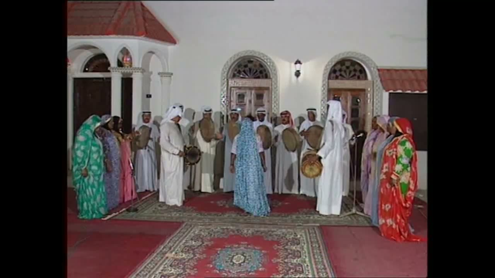
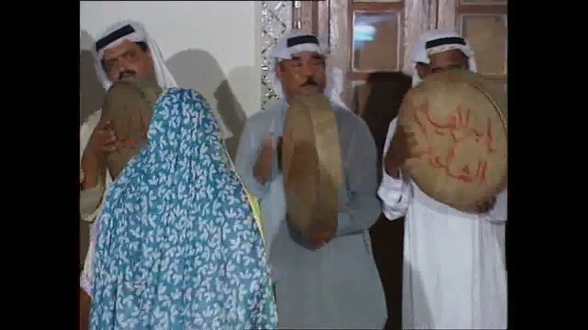
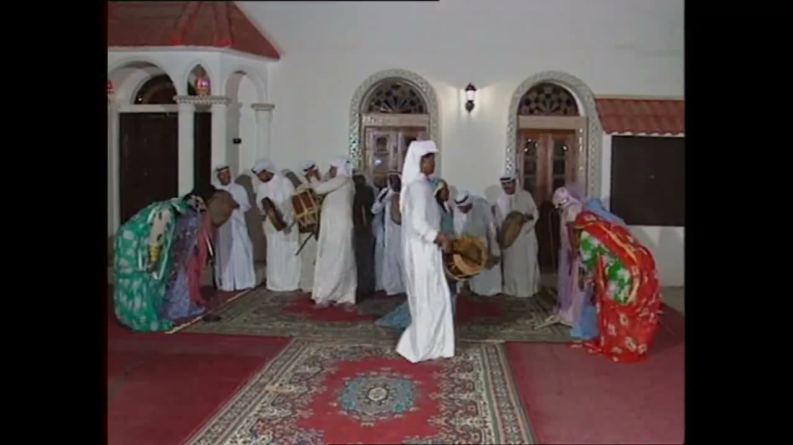
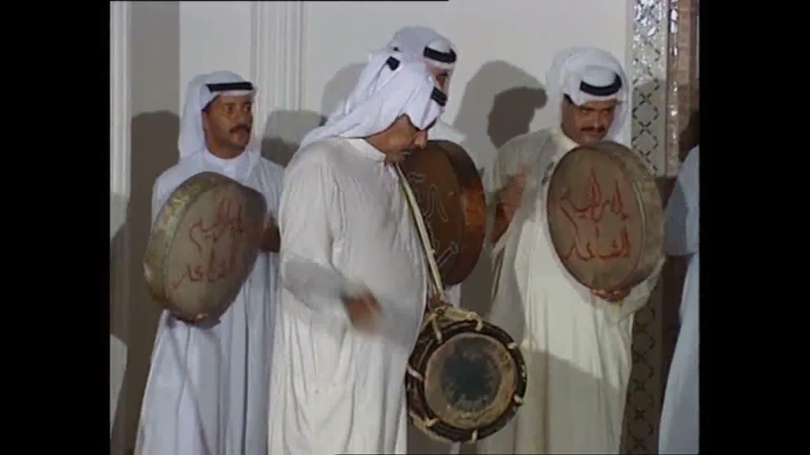
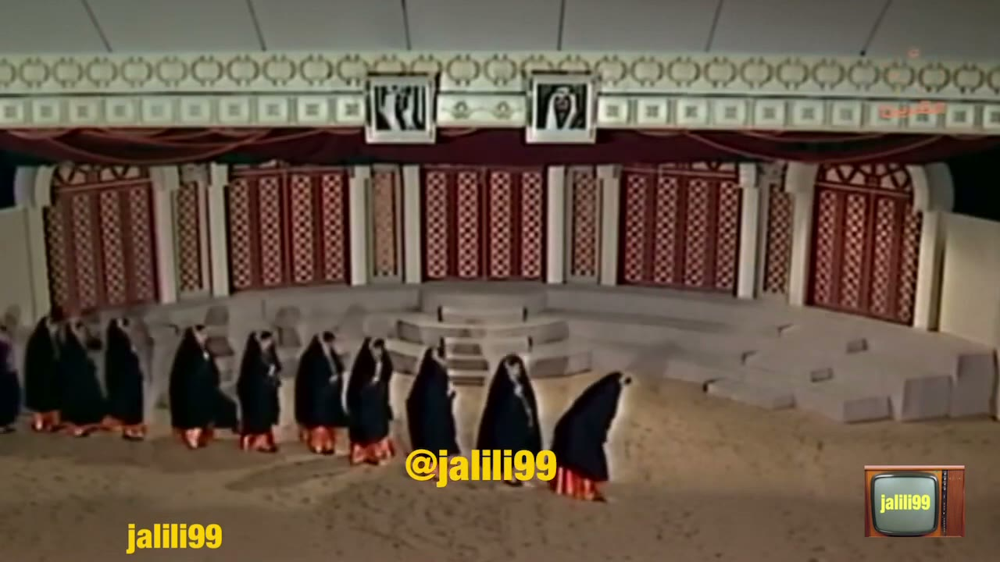
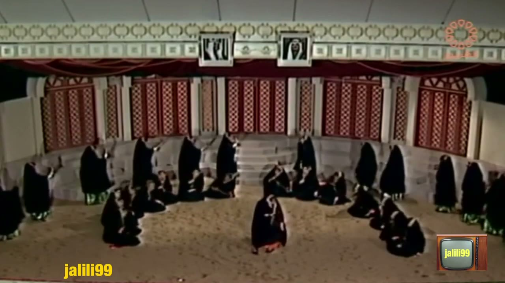
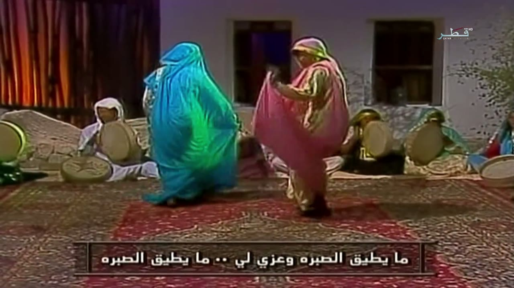
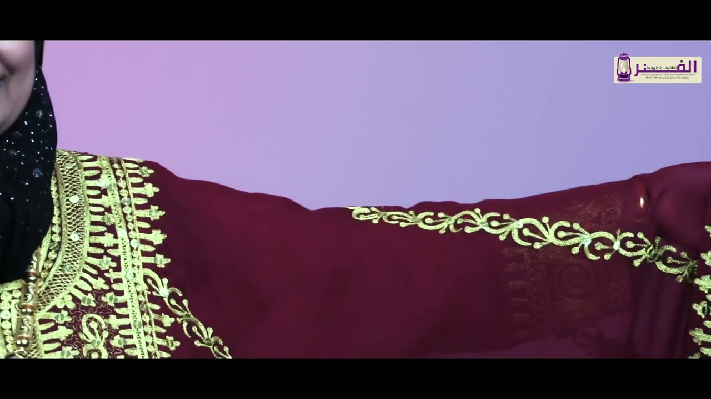
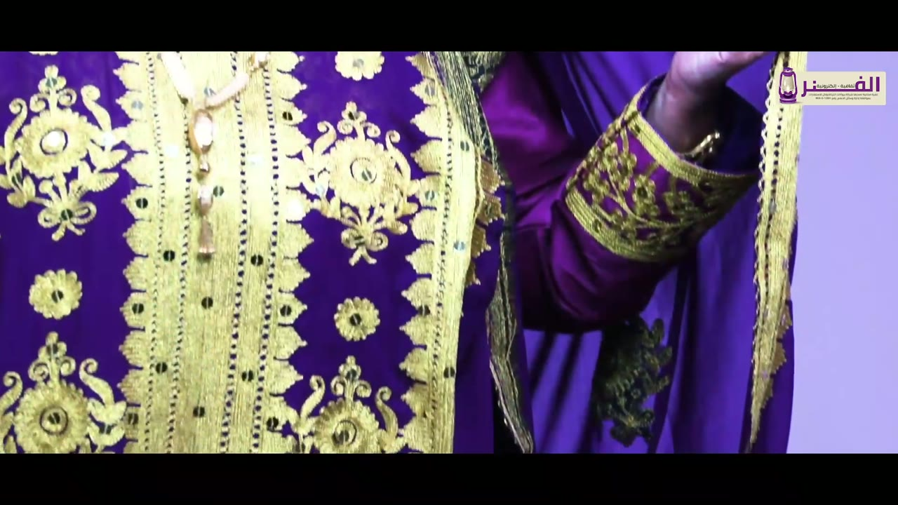

# Gulf women's dance (Khammari and related women's performances; the thobe al-nashal, ثوب النشل) reference keyframes

Reference for redrawing the Hikaya Gulf women's dance. Second pass, made 2026-10-06 from four videos (`sources.txt`):
nine keyframes, each a different pose or moment, picked from 3,072 frames extracted at 1 per second (558 + 394 + 390 + 1,730).
It also carries timing measurements (section "Timing"). The first pass (2026-10-05) found no footage that met the rules and
left a "no usable footage" note; this pass looked for **authentic** footage of the real women's performances even where it
does not match the brief, with the hard rules unchanged: television, stage or troupe footage only, hair covered, nothing that
looks covertly filmed at a private or women-only event.

**What this pack is, in short.** It is not a clean film of a woman dancing in a thobe al-nashal with her sleeves swinging.
No such footage was found that meets the rules. What it holds instead: (1) a Bahrain TV recording of **Khammari** (the
broadcaster's own caption names it) in which men lead the dance with frame drums and a barrel drum, one woman moves among them,
and two groups of women sing and bow; (2) a 1981 Kuwait TV stage "Khammari tableau" in which a group of dancers in black cloaks
walks, kneels, bows and lies forward; (3) a short Qatar TV archive excerpt of two women turning in long wraps; (4) a costume
film that shows the Bahraini thobe al-nashal in close view (costume footage, not dance). Read "The brief vs the footage" and
"Flags for the project owner" before using it.

**How to read the descriptions.** They cover only what is visible in the frame. Where something can't be read (a hand, a
face, a foot, a stick's contact), the entry says so instead of filling it in. When a performer's own left and right can't be
told reliably, hands are given by side of the frame ("frame-left"). Distances are relative unless a measurement says
otherwise. Women are described by costume, formation and movement only. Dance names are given only as a source gives them,
and each entry says who gave the name.

## Authenticity

| Video | What it is | Who names the dance | Why it counts as authentic, and what is uncertain |
|---|---|---|---|
| `gulf-women1` (LLv5UhVrd9E) | "Khammari art - Shamma bint Hamoud", Bahrain TV Zaman, 9:17, uploaded 2016-01-25 | The picture itself: a yellow on-screen caption "( فن .. خماري )" (Khammari art) from 0:18 to 0:48; the uploader's title agrees | A television production in a courtyard set: men in white with frame drums and a rope-laced barrel drum, women singing at microphones, live sound that belongs to the picture, heads covered throughout. I did not verify the channel as an official page. A multi-camera edit, so steady wide shots are short. The women do little dancing of their own: they sing, sway and bow. |
| `gulf-women2` (LduWzMy385k) | "Khammari tableau" (uploader's title), Kuwait TV, 1981, performed by "Sana al-Kharraz and Adailiya secondary school", jalili99 re-upload, 6:34 | The uploader only; not independently verified | A Kuwait television stage set (a round broadcaster logo sits top-right in the picture). The performers are named in the title as a singer and the students of a school, so the dancers are young. Group choreography in black cloaks drawn over the head. Old broadcast quality, a re-upload with a watermark. **Use 0:00-5:45 only**: see "Flags". |
| `gulf-women4` (Q2n6HQpKD5A) | "The culture of the Bahraini thobe al-nashal", ALFANREMAGAZINE, 6:30, uploaded 2020-12-07 | The video's own title names the gown | **Costume footage, not dance.** A studio presenter (head covered by a gold-edged hood over a black beaded scarf) shows gowns; close-ups of gold-thread embroidery. A magazine channel, not a museum or a ministry. |
| `gulf-women6` (7wTlb8Fu398) | "Folk Arts - episode 5", Qatar Television, 28:49, uploaded 2020-12-18 | No source I read names the dance. The programme is called "Folk Arts" and the excerpt carries only sung-lyric subtitles | An interview programme with archive television excerpts; only the excerpt at 3:27-4:07 is used. Standard-definition archive picture inside a 1080p file. The dance is **unnamed**. |

Context from two web pages read through page summaries (not checked further): a Saudi newspaper (Al-Yaum, 25 June 2025) reports a
researcher saying Khammari historically featured men and women together, women dancing to frame drums; a Kuwaiti newspaper
(Al Jarida, 16 July 2026) quotes an artist on the "mukhawas" thobe whose gold embroidery runs in wide straight bands, and on
her paintings of a Khammari dancer with a hand over half her face and of a turning dancer. These support "Khammari includes
women" and the costume name; they do not describe the footage here.

## The brief vs the footage

- **The brief expected** women dancing in the thobe al-nashal with wide, gold-embroidered sleeves moving. **The footage shows**
  no dancer in a visibly nashal-type gown with the sleeves in motion. In video 1 the women wear printed floral gowns with a
  cloth over the head, and the dance is led by men. In video 2 the dancers' gowns are hidden under black cloaks except the
  hems and cuffs. In video 6 the dancers wear long wraps over head and body.
- **The main repeating movement is a forward dip**: the women bend or lean forward from the waist, head down, and rise, about
  every 3.8 s in video 1 and every 3.0 s in video 2 (measurements below). Not a sleeve swing and not a spin.
- The thobe al-nashal itself is shown only in video 4 (costume footage): a maroon gown with a wide sleeve held out, a light-blue
  gown and a purple gown, all with broad gold-thread embroidery.
- Not usable under the rules, with ids (seen in the first pass or this one): the Iraqi National Troupe "Thobe Nashaal" clip
  (uncovered hair, `6MWseKYaQ1E`); the Diriyah Season show (`pj4jGHOV53k`) and the Kuwait Heritage stage clip (`B_RRWDuC4HQ`),
  both with hair visible; a 1979 Bahraini heritage fashion show (`RISxkjflYcc`, hair visible, watermarked).

## Flags for the project owner

1. **Video 2, the lead singer.** At 0:30, 0:36, 1:18, 4:54 and 5:54 the lead singer stands bare-headed at a microphone with long
   loose hair. She sings and gestures; she does not dance. The dancers (the cloaked group) have their heads covered. If the rule
   is read as "no bare-headed woman in the picture", video 2 fails; if it is read as "dancers' heads covered", it passes. Your call.
2. **Video 2, from 5:48 to 6:12**: rows of dancers in dark gold-embroidered gowns whose hair is visible. Not used, no keyframe from it.
3. **Video 2, young performers.** The uploader's title names the dancers as students of a secondary school. A close view of five
   of them (heads covered, faces visible) was picked as a keyframe while this pack was made and then taken out of the
   repo before merge as a precaution about identifiable young performers; the two video 2 keyframes that remain (5 and 6) are wide.
   The frame is still on machine A (`gulf-women2_t0024s.jpg`).
4. **Video 6, second excerpt (15:35-16:45)**: a woman in a white sequined wrap dancing in front of seated women with frame
   drums, children present, in a furnished room. Not used: it looks like a women-only room and I cannot tell whether it was
   staged for television.
5. **Video 1**: men lead the dance and the women's dancing is a small part of it.

## Where everything is

| What | Where |
|---|---|
| Keyframes (9 JPG, 1280 px wide) | `keyframes/` next to this file |
| Source URLs, titles and the authenticity line per video | `sources.txt` |
| Contact sheets (every 2 s, timestamp on each tile), 30 s clips with audio, and the `analysis\` folder (`LOG.md` with every candidate and every command and count, per-stretch audio/motion outputs and strips, search lists, screening sheets) | Drive `C:\ai\projects\arabic-app\Hikaya dance reference\gulf-women\` |
| Full videos and all 1 fps frames (`frames\gulf-womenN\gulf-womenN_tSSSSs.jpg`, SSSS = second) | Machine A only: `C:\media\dances\gulf-women\` |
| This note, `sources.txt` and the keyframes in git | `arabic-buddy` repo, `docs/reference/gulf-women/` (contact sheets, clips and videos are not in git) |

The video numbers are 1, 2, 4 and 6: numbers 3 and 5 were downloaded candidates that were dropped, and ids are not reused.

## Clips

| Clip | Source span | What's in it |
|---|---|---|
| `clip_gulf-women1.mp4` | gulf-women1, 7:52-8:22 | A wide shot of the courtyard: the women in both end groups bow forward and rise, a man in white walks in front of the line with a frame drum. Voices, hand percussion and drums on the soundtrack (mean level -11.9 dB, peak -0.3 dB, measured; I haven't listened) |
| `clip_gulf-women2.mp4` | gulf-women2, 0:40-1:10 | A close shot of cloaked dancers, then from 0:48.7 to 1:05.7 one steady wide shot of the line walking in file and bowing four times (a fifth bow starts at 1:04), then a close shot (mean -28.6 dB; mostly voices) |
| `clip_gulf-women4.mp4` | gulf-women4, 1:16-1:46 | The presenter, then close-ups of the maroon gown with the sleeve held out (about 1:22-1:27) and of the light-blue gown (about 1:31-1:33) (spoken commentary; mean -23.5 dB; I haven't listened) |
| `clip_gulf-women6.mp4` | gulf-women6, 3:25-3:55 | Cross-fade from the interviewee into the archive excerpt: two women turning in long wraps in a courtyard set, drummers seated behind, sung lyric subtitles (mean -27.8 dB) |

## 1. Formation, wide: men in a line, women in two groups at the ends

`gulf-women1_t0012s.jpg` · gulf-women1 (Bahrain TV Zaman) at 0:12

- Courtyard set: a white building with arched doorways, a red-tiled canopy roof at the top-left, red carpets on the floor with a patterned rug in the foreground. The camera is fixed and level.
- A line of roughly 15 men in white thobes with white or red-and-white checked headcloths stands across the middle. Most hold round frame drums at chest height.
- Women stand in two groups at the two ends of the line: frame-left in green, mauve and pink floral gowns, frame-right in pink, blue and red-and-green floral gowns. Every woman has a cloth drawn over her head.
- One person in a pale-blue gown with a white leaf print, the same cloth drawn over the head and down the back, stands among the men near the centre.
- No on-screen caption in this frame (the yellow Khammari caption appears from 0:18).

## 2. A woman bowing among the drummers

`gulf-women1_t0156s.jpg` · gulf-women1 (Bahrain TV Zaman) at 2:36

- Close shot. At frame-left a woman seen from behind and the side in the pale-blue white-leaf gown; the same print forms a cloth over her head and back. Her head is turned toward the men and bowed. Her face is not visible.
- Beside her, two men in white and pale grey thobes hold round frame drums at chest height: the frame-right drum faces the camera and carries red Arabic calligraphy; the other is seen from its edge. One man wears a red-and-white checked headcloth with a black agal.
- A third man at the frame-left edge holds another drum, partly hidden.

## 3. The line of women and men bowing together, wide

`gulf-women1_t0477s.jpg` · gulf-women1 (Bahrain TV Zaman) at 7:57

- The same courtyard, wide. At frame-left a woman in a green-and-white floral gown bends forward from the waist with her head cloth hanging forward; at frame-right a woman in a red gown with a green floral sleeve and a red head cloth bends forward in the same way.
- In the centre a man in a white thobe and white headcloth stands in front of the line holding a frame drum low. Behind him a row of men in white stands with drums.
- The feet of the two bowing women are hidden by the gowns. This is the "bow" pose of the Timing section; the woman at frame-right is the one measured there.

## 4. Instruments: frame drums and a barrel drum

`gulf-women1_t0090s.jpg` · gulf-women1 (Bahrain TV Zaman) at 1:30

- Close shot of three men in white thobes. The man at frame-left holds a round frame drum with its skin toward the camera, red Arabic calligraphy painted on it. The man at frame-right holds a similar drum, also with red calligraphy.
- The man in the centre, in a white headcloth, has a strap across his chest to a barrel drum hanging at his hip; its dark head faces forward and the body is laced with rope. His hand is blurred in motion; a stick is visible lying across the drum head in the neighbouring frames (1:28.0-1:28.1).
- No woman is in this frame.

## 5. The line walking in file, wide

`gulf-women2_t0054s.jpg` · gulf-women2 (Kuwait TV archive, jalili99) at 0:54

- A sand-floored, semi-circular stage set with grey step-like seating and red lattice panels behind; two framed portraits hang on the wall at the top.
- About nine dancers in black cloaks with orange hems walk in single file along the curve. The shot is steady and lasts from 0:48.7 to 1:05.7.
- A "@jalili99" watermark is in the lower middle.

## 6. A crescent of kneeling and bowed dancers, wide

`gulf-women2_t0150s.jpg` · gulf-women2 (Kuwait TV archive, jalili99) at 2:30

- The same stage, wide. More than a dozen dancers in black cloaks: several kneel or bend low on the sand in a crescent at the centre, others stand around it. Green fabric shows at the hem or cuff of some cloaks.
- The cloaks stay drawn over the head in every figure that can be read at this size.

## 7. Two women turning in long wraps (Qatar TV archive)

`gulf-women6_t0215s.jpg` · gulf-women6 (Qatar Television) at 3:35

- A courtyard set with a white wall with two windows and a red curtain; a red patterned carpet in front. Seated behind the dancers, men in white and women in coloured cloths hold round frame drums on their laps or upright.
- Two women in long wraps that cover head and body to the floor: one in teal-blue, one in pink with a yellow-green sheen. The pink one holds the edges of her wrap out at hip height on both sides and turns; the teal one stands a little apart with her back to the camera.
- An Arabic sung-lyric subtitle runs along the bottom; the Qatar Television logo is at the top-right. Picture is soft standard-definition.

## 8. Costume close: a maroon gown with the sleeve held out (costume footage)

`gulf-women4_t0086s.jpg` · gulf-women4 (ALFANREMAGAZINE) at 1:26

- COSTUME FOOTAGE, not dance. A maroon gown in close view: the wearer's arm is held out horizontally to the frame-right edge, so the wide sleeve hangs open below it. A broad band of gold-thread embroidery runs down the front opening and neckline, and a scrolling embroidered band runs along the sleeve.
- At the frame-left edge part of the wearer's face and a black beaded scarf are visible. Pinkish-purple backdrop; the channel's lantern logo is at the top-right.

## 9. Costume close: a purple gown, gold-thread panel (costume footage)

`gulf-women4_t0229s.jpg` · gulf-women4 (ALFANREMAGAZINE) at 3:49

- COSTUME FOOTAGE, not dance. The front of a purple gown: vertical panels of gold-thread embroidery with large medallions set with mirror-like discs and small sequins, and gold borders; a bead necklace hangs over the front.
- At the top-right a raised hand and a sleeve cuff covered in gold-thread embroidery. Lilac backdrop; the channel logo is at the top-right.

## Timing

**Method.** `audio.py`, `tempotrack.py`, `motion.py`, `strip.py` (10 fps or native), `grid.py` and `timeline.py` from
`C:\media\dances\_tools\`, plus two helpers of mine for the Kuwait line (kept on machine A, not in the repo). Every command, the
raw output and every hand label is in `analysis\LOG.md` section P2-3 (Drive). Hand labels at 10 fps carry about +-100 ms;
at 3 fps about +-333 ms. Times are m:ss.s of the named video. I did not name any instrument from sound alone.

### 4a. Strokes

**Video 1 (gulf-women1).** The soundtrack is voices over broadband percussive hits (frame drums, a barrel drum and, I think,
hand claps; I cannot separate them). Percussive energy is only 5-8% of the signal and voices dominate; the hits are broadband
vertical bursts in the spectrogram, not gliding voice stripes.

| Stretch | n perc onsets | median ms (IQR) | median across prominence 0.35 / 0.6 / 1.0 | beat period by autocorrelation (r) | finer grid by phase lock (R) |
|---|---|---|---|---|---|
| 0:24-0:54 | 73 | 485 (260-522) | 485 / 528 / 543 | 522 ms (0.54) | 260 ms (0.56) |
| 1:16-1:46 | 76 | 482 (250-508) | 482 / 505 / 528 | 511 ms (0.47) | 252 ms (0.73) |
| 3:15-3:50 | 95 | 395 (238-482) | 395 / 488 / 969 (unstable) | 488 ms (0.45) | 241 ms (0.74) |
| 3:56-4:26 | 74 | 464 (250-482) | 464 / 488 / 958 | 482 ms (0.46) | 239 ms (0.75) |
| 6:00-6:35 | 84 | 453 (273-482) | 453 / 482 / 935 | 476 ms (0.44) | 234 ms (0.66) |
| 7:48-8:40 | 160 | 244 (226-450) | 244 / 444 / 493 | 464 ms (0.49) | 234 ms (0.38) |

- The onsets sit on a grid of about 234-260 ms; the intervals are a mix of one and two grid steps (and a few of three or four),
  with **no repeating pattern** found (`audio.py` checks up to 16 intervals at 85% match). The dominant period is two steps,
  the "beat": **about 520 ms at the start, shortening to about 464 ms by the end**. `tempotrack.py` (12 s windows, 0-557 s) shows the
  same drift: autocorrelation period 546 ms at 12-24 s, 522 at 24-36, 511 at 78-90, 499 at 108-120, 488 at 144-156, 476 at
  216-228, 464 at 342-354, then 452-476 ms from about 5:40 on (BPM from 110 to 129). Where the median interval jumps with
  prominence (3:15-3:50, 7:48-8:40) the half-beat onsets at 244 ms are being counted as well.
- **Visible-strike cross-check: not achieved.** I read native-frame strips at 1:28.0-1:30.0 (the man with the barrel drum and
  stick) and 4:00.5-4:11 (hands at frame-left), both with the audio onsets marked. The stick and hands move, but no frame shows
  a contact I could tie to an onset frame: 0 strikes matched. So the onsets are audio only; they are not proven to be a
  particular instrument, and the picture-to-sound offset is unknown.
- 62 percussive onsets fall between 7:55.9 and 8:15.0 (5 dips, 19.1 s): one onset per 308 ms on average, about 12 per dip.

**Video 2 (gulf-women2): no instrument pulse established.** Percussive share is 1-5% (voices), and the percussive median changes
with prominence (200 / 392 / 1672 ms at 0:30-1:00; 203 / 366 / 389 at 3:30-4:00; 215 / 377 / 383 at 4:30-5:00). A 377 ms
autocorrelation peak (r 0.59) appears at 4:30-5:00 but I could not match it to visible hand movements. No stroke figure is given.

**Video 6 (gulf-women6), 3:27-3:53 (the archive excerpt's own sound).** 82 percussive onsets, median 308 ms (IQR 290-343,
SD 59), about 195 BPM; the median barely moves with prominence (308 / 372 / 656), phase lock at 315 ms (R 0.85), and all
intervals are one pulse of 315 ms apart from two double intervals and one zero. A steady pulse of about 315 ms. Sung lyrics are
subtitled, so the sound belongs to the picture; the frame-drum players are small and behind the dancers, so no visible strike was matched.

### 4b. The main repeating movement: the forward dip (bow or lean)

| Video, span | Method | n | Period |
|---|---|---|---|
| gulf-women1, 7:54-8:18 (right-end woman, red gown) | Hand labels at 10 fps: start of each dip at 7:55.9, 8:00.0, 8:03.8, 8:07.7, 8:11.4, 8:15.0 | 5 intervals | 4.1, 3.8, 3.9, 3.7, 3.6 s: **mean 3.82 s, SD 0.19 s** |
| gulf-women1, 7:48-8:35 | `motion.py` pc2 peak-to-peak (roi on the right-end woman), checked by eye on frames at each peak and midway | 11 intervals | mean 3.63 s, SD 0.35 s. Of 12 peak times, 8 show a bow or lean, 2 a slight lean, 2 an upright pose; all 11 midway times show her upright |
| gulf-women1, 6:00-6:26 | `motion.py` pc2 (roi on the right-end woman); machine result only, not hand-counted | 6 cycles | median 3.73 s, SD 0.15 s |
| gulf-women2, 0:50-1:05 (the line, steady wide shot) | Hand labels at 3 fps: bow starts at 0:52.3, 0:55.3, 0:58.3, 1:01.6, 1:04.2 | 4 intervals | 3.0, 3.0, 3.3, 2.6 s: **mean 2.98 s, SD 0.29 s** |
| gulf-women2, 0:50-1:05 | Mean height of the top edge of the dark cloaks across the line; minima at 0:53.0, 0:55.97, 0:58.8, 1:02.0, frames checked by eye | 3 intervals | 2.94, 2.86, 3.20 s: mean 3.00 s, SD 0.18 s |
| gulf-women6, 3:27-3:53 | `motion.py` on the two dancers | | not measurable: two dancers moving independently, the roi holds the drummers, results inconsistent |

- In video 1 the dips alternate: a deep **bow** at 7:56.2, 8:04.1 and 8:11.6 (7.9 and 7.6 s apart) and a shallower **lean** between them at 8:00.0, 8:07.7 and 8:15.0. One dip every 3.82 s is 8.2 beats of 464 ms (about 16 steps of the 234 ms grid).
- In video 2 the bow is not synchronous along the line: some dancers bend before their neighbours. The line is seen at an oblique angle.
- **Size.** One bow in video 1 was measured on `gulf-women1_t0474s.jpg` (upright) against `gulf-women1_t0477s.jpg` (bowed) with `grid.py`: hood top about 325 px upright and 345 px bowed, head about 70 px in front of the hem over about 215 px of height, a forward lean of **about 18 degrees, +-6** (read by eye from the grid), the head dropping about 8% of the standing height. Only this one bow was measured; the deep bows at 8:04-8:05 and 8:11.6-8:12.5 look similar or deeper. Video 2: tilt not measurable (angle of view, overlapping figures).
- **Strokes per cycle** (video 1, 7:55.9-8:15.0): 12.4 percussive onsets per dip (62 onsets over 5 dips) and 8.2 beats of 464 ms.

### 4c. Pose timeline

Poses: **upright** (torso vertical, head level), **lean** (head and shoulders dipped, torso inclined less than a bow), **bow** (torso bent forward, head down). Labels were read off the 10 fps and 3 fps strips.

Video 1, right-end woman (change points, +-100 ms):

| Time | -> pose | | Time | -> pose |
|---|---|---|---|---|
| 7:54.0 | upright | | 8:06.0 | upright |
| 7:55.9 | lean | | 8:07.7 | lean |
| 7:56.2 | bow | | 8:08.7 | upright |
| 7:57.8 | lean | | 8:11.4 | lean |
| 7:58.3 | upright | | 8:11.6 | bow |
| 8:00.0 | lean | | 8:12.7 | lean |
| 8:01.0 | upright | | 8:13.3 | upright |
| 8:03.8 | lean | | 8:15.0 | lean |
| 8:04.1 | bow | | 8:15.7 | upright |
| 8:05.7 | lean | | 8:17.9 | end |

- Durations: upright 1.7-2.8 s (median 1.9 s, n 7, about 4 beats); lean 0.2-1.0 s (median 0.5 s, n 9); bow 1.1-1.6 s (median 1.6 s, n 3, about 3 beats).
- Order: upright, lean, bow, lean, upright, lean, then (upright, lean, bow, ...) again: a block of six that repeats 3.2 times in this stretch; deep bow and shallow lean alternate. The changes do not fall on a clear beat (the upright spells of 1.7-2.8 s are 3.7-6.2 beats of 464 ms; there is no single multiple).

Video 2, the line (change points, +-333 ms):

| Time | -> pose | | Time | -> pose |
|---|---|---|---|---|
| 0:50.0 | bow | | 0:58.3 | bow |
| 0:50.6 | upright | | 0:59.2 | upright |
| 0:52.3 | bow | | 1:01.6 | bow |
| 0:53.7 | upright | | 1:02.9 | upright |
| 0:55.3 | bow | | 1:04.2 | bow |
| 0:56.5 | upright | | 1:05.0 | end |

- Bow 0.6-1.4 s (median 1.05 s, n 6; the first and last are cut off by the ends of the span), upright 1.3-2.4 s (median 1.7 s, n 5). The order bow-upright repeats 5.5 times; no beat reference (no pulse established in video 2).

### 4d. Dance-specific measurements

Nothing further was listed in the brief that this footage allows. The sleeves are not seen in motion in any dance footage here (gowns are under cloaks or wraps, or the wearer stands), so the **sleeve swing is not measurable**.

### 4e. Proposed animation constants

| Constant | Value | Evidence | Confidence |
|---|---|---|---|
| `BEAT_MS` (time between pose changes) | not measurable as one beat: dips every 3.8 s (video 1) and 3.0 s (video 2), poses of 0.2-2.8 s | Section 4c; changes do not land on a single multiple of the stroke period | not measurable |
| `STROKE_MS` (time between instrument strokes) | 464 ms beat (two steps of a 234 ms grid), drifting from about 520 ms at the start of the performance | Video 1, audio autocorrelation at 6:00-6:35 (476 ms, r 0.44) and 7:48-8:40 (464 ms, r 0.49), `tempotrack` plateau 452-476 ms from 5:40; no visible strike matched. Video 6's separate archive clip: 315 ms (82 onsets, R 0.85) | medium (one performance, audio only) |
| `MOVE_PERIOD_MS` (the forward dip) | 3,800 ms in video 1; 3,000 ms in video 2 (the two performances differ) | Video 1: hand count 3.82 s (n 5) and motion 3.63 s (n 11) and 3.73 s (n 6); video 2: hand count 2.98 s (n 4) and cloak-height 3.00 s (n 3) | medium (methods agree within 5% inside each video; the videos disagree with each other) |
| `MOVE_SIZE` (forward tilt) | about 18 degrees from vertical (+-6) at a bow; head drop about 8% of standing height | Video 1, `gulf-women1_t0474s` vs `t0477s` by `grid.py`, one bow | low (one bow, read by eye) |
| `SEQUENCE` | upright > lean > bow > lean > upright > lean, repeating (deep bow and shallow lean alternate), video 1; upright <> bow, video 2 | Section 4c: 3.2 repeats (video 1) and 5.5 repeats (video 2) | medium |

## Not covered by these frames

- **No dancer in a visibly nashal gown with moving sleeves.** The thobe al-nashal appears only in costume footage (video 4); the dancers' gowns in videos 1, 2 and 6 are printed gowns, cloaked gowns and wraps. Costume keyframes 8 and 9 are not dance.
- **Feet and steps** are hidden by the gowns or the camera angle in every dance shot; footwork is not described.
- **Video 1** has only short steady wide shots (0:00-0:19, 3:24-3:46, 6:00-6:27, 7:42-8:42), and the women's end groups are small in the frame. The woman who moves among the men is seen mostly from behind or inside her hood; her face is not used.
- **Video 2** is old broadcast quality; the wide shots show the line at an oblique angle; the lead singer is bare-headed (Flags, 1); the audio is mostly voices.
- **Video 6** gives a short excerpt (3:27-4:07) in soft standard definition; the dance is unnamed; the drummers are small.
- **Audio and picture** were not shown to be in sync: no strike was matched to an onset, and I have not listened to the clips (levels were measured).
- **Searched and not usable** (details and ids in `analysis\LOG.md`): about 70 further titles were followed up in this pass: Bahrain TV Zaman folk tableaux (seated or standing women singing, face veils), a Qatar TV standing women's chorus with frame drums (episode 7, no dance movement seen), Omani women's dances (a different tradition, dark archive), Kuwait TV archive concerts (hair visible), and the first-pass list (Emirati, Saudi and Kuwaiti stage clips with uncovered hair, or men only). **Not seen**: a Saudi troupe concert (`cXbZqhnPcjo`, download blocked), a TV report on the Bahraini nashal (`weNEXhtwPGY`, downloaded but never viewed) and the hour-long Bahrain Heritage Village and Kuwait TV heritage programmes beyond the sampled pages.
