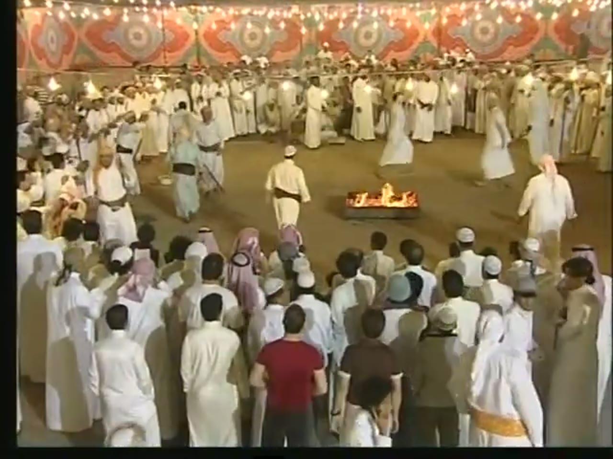
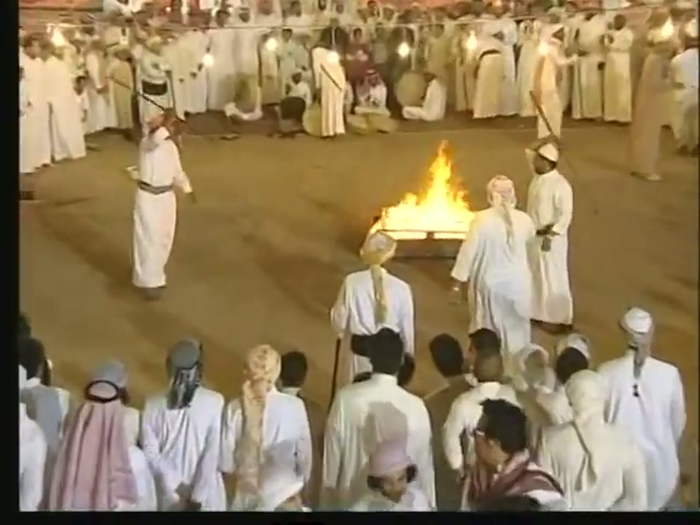
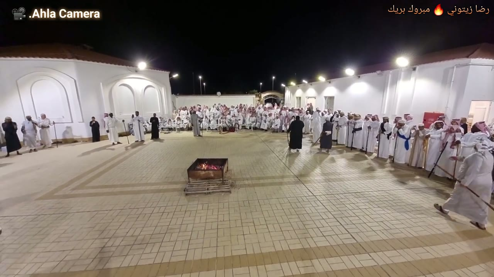
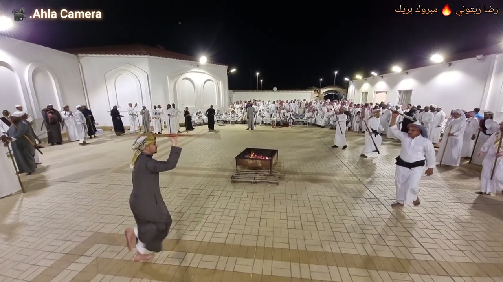
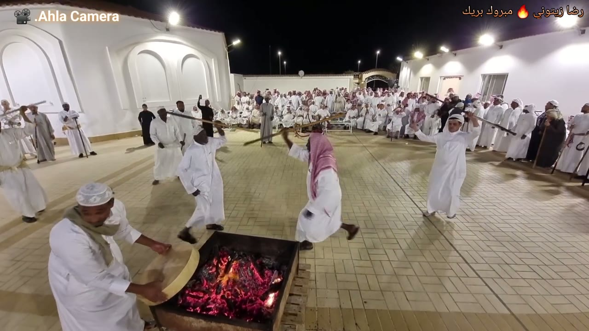
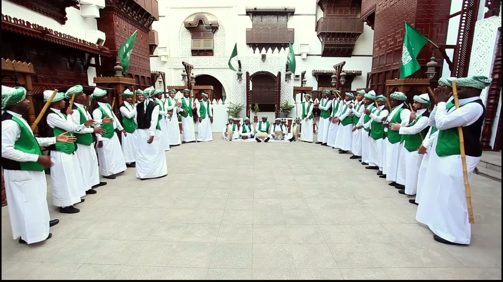
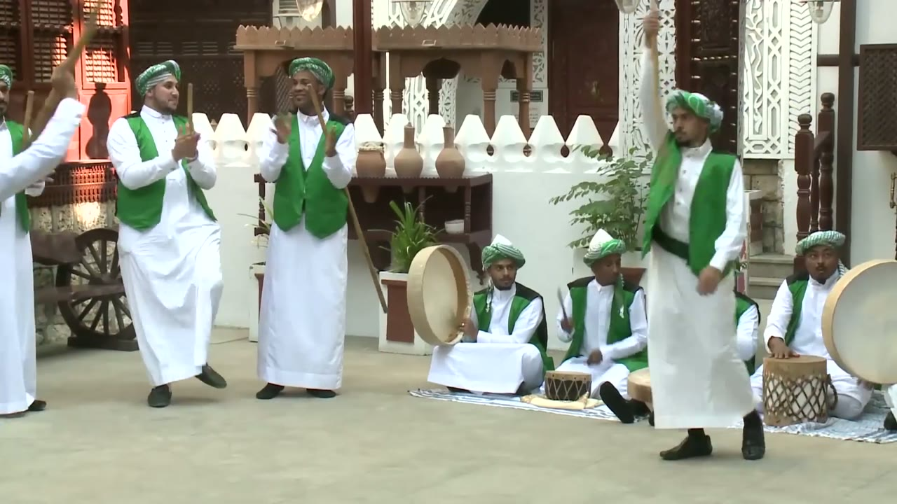
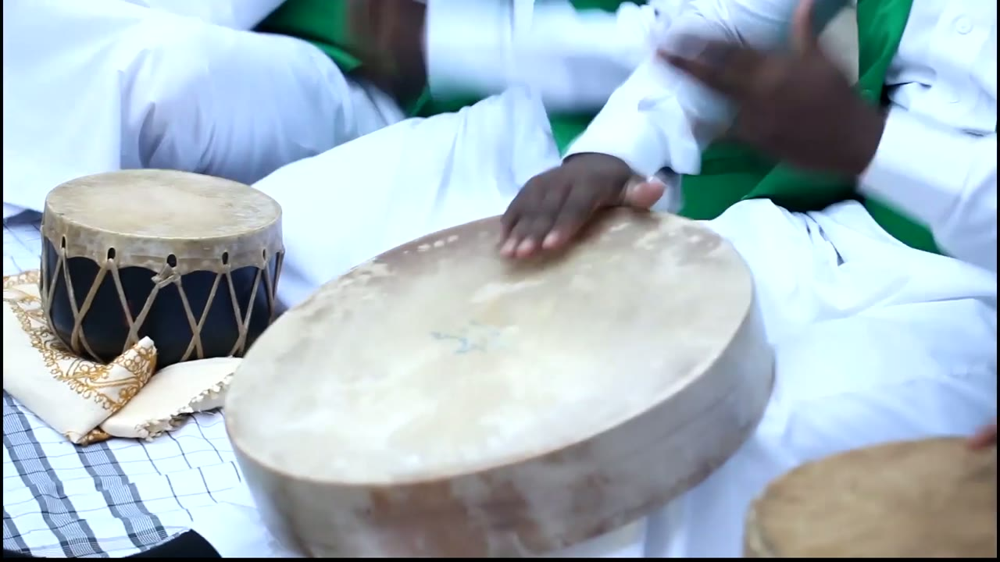
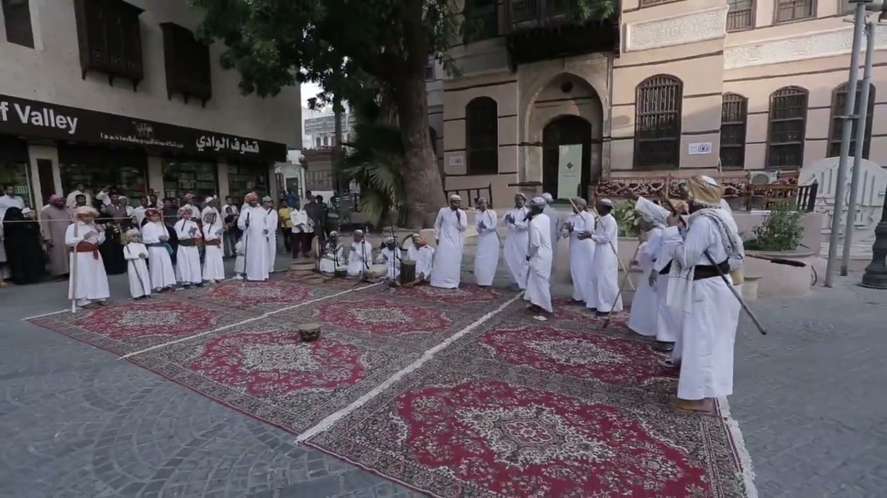
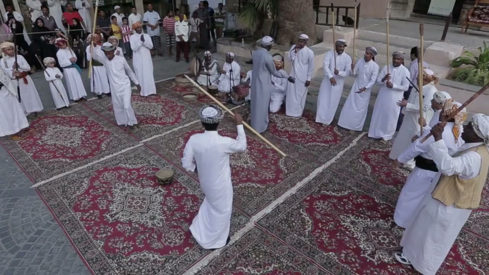

# Al-Mizmar al-Hijazi (المزمار الحجازي) reference keyframes

Reference for redrawing the Hikaya Al-Mizmar animation (the Hejazi stick dance). Second pass, rebuilt 2026-10-05 and 06 from four
YouTube videos (`sources.txt`): the UNESCO film kept from the first pass and three new ones. Ten keyframes, each a different
pose or moment, picked from 1,592 frames extracted at 1 per second (377 + 246 + 407 + 562). It also carries the timing
measurements, in the **Timing** section. The first-pass videos mizmar2 (Saudi TV tent stage) and mizmar3 (2011 camcorder) are
no longer in the pack: see "What changed from the first pass".

**How to read the descriptions.** They cover only what is visible in the frame. Where something can't be read (a hand, which
end of a stick is which, feet), the entry says so instead of filling it in. When a performer's own left and right can't be
told reliably, hands are given by side of the frame ("frame-left hand"). Distances are relative ("an arm's length") unless a
measurement is named; the measured sizes are in the Timing section with their method. Left and right of the frame are as the
camera sees it. The four videos are four different performances in four places with four costumes, so the keyframes do not
show one standard costume.

## Authenticity

"Authentic" here means: real practitioners, in a real or documented setting, the dance named by the source, and sound that belongs to the picture (not music laid over it). The
table says what each video is and what is uncertain. Nothing in it is verified beyond what is written in the video, its
credits and its page.

| Video | What it is | Who names the dance | Why it counts, and what is uncertain |
|---|---|---|---|
| mizmar1 (UNESCO, 6:17) | The film made for the 2016 UNESCO inscription. Men in white thobes on rugs laid on the paving of an old-town street square (the place is not named in the footage I saw), plus drum, singer and stick close-ups | The UNESCO title and a title card; the end credits (read on screen) name the Saudi Heritage Preservation Society as producer and the Ministry of Culture and Information as supervisor, with research credited to Dr. Damna Al Zahrani and Mr. Esam Junaid | Institutional, real performers in their own setting. Heavily edited (91 shots in 6:17, the longest dance shot is 12.5 s), the soundtrack is an edited mix, and no troupe is named |
| mizmar6 (4:06, 480p) | Archive video of a mizmar night in a large decorated tent: a ring of standing men round a floor with a fire box, dancers inside | The uploader (the music historian Esam Junaid's archive channel) calls it "the authentic Hejazi mizmar" played by people of Madinah and Yanbu | Community event; the sound looks like the event's own (singing with claps and drum bursts in the spectrogram; I have not listened); two long high shots (0:11-1:59 and 1:59-4:05) in which the camera sits still for stretches of 9-37 s and zooms between them. Place, date and performers are not given; the naming is the uploader's and is not independently verified. Standard-definition picture |
| mizmar8 (6:47, 1080p) | A community gathering in a paved yard at night: a large crowd of men (well over a hundred) along the walls and round a fire box, dancers with sticks, a man holding a frame drum over the fire, singers and drummers | The title says "mizmar" and names players ("Reda Zaitouni", "Mabrouk Brek", ...) | Filmed openly by a community videographer ("Ahla Camera", whose logo is on the picture); the sound looks like the event's own (spectrogram only); men only in view. No institution, occasion or date; the naming is the uploader's and is not independently verified. Hand-held with a wide lens: the camera never rests for 8 s in 0:45-6:40 (camshift.py) |
| mizmar10 (9:22, 1080p) | A documentary that re-stages the dance with a costumed troupe (matching green vests and turbans, flags) in a courtyard with carved wooden balconies (the opening shots are aerials of a coast road and an old-town block, and a map at 1:56 marks a spot on a western coast; the film does not name the courtyard or the city in the frames I read), and intercuts older footage of community performances | The film's own title card ("Almzmar, Saudi Arabia, A TRADITIONAL PERFORMING ART") | The troupe takes are staged for the camera: they show the movements, the rows and the instruments clearly, but they are not an event. The intercut clips (2:00-3:52, 7:08-7:32) are older footage of unnamed groups. Fixed-camera shots of 95 s and 59 s |

Women: none of the four videos shows women dancing. Women appear in the UNESCO film only as spectators in the street and in its interview inserts (3:28-3:56).

## The brief vs the footage

The brief expected a circle round the drummers, dancers twirling long staffs, and footwork. What the authentic footage shows:

- **No circle round the drummers, in any of the four videos.** Two formations are seen.
  1. **Two rows facing each other** across a gap, the drummers seated across the closed end or beside the rows: mizmar10 (the troupe, 1:00-1:55, 4:36-6:10) and the UNESCO film (rows along the edges of the rug area, keyframes 9 and 10). This matches the UNESCO inscription text, which says the performers "begin by standing in two rows opposite each other" and that "two performers go to the centre" (text of the UNESCO listing, element 01011; it is not footage).
  2. **A ring of standing men round an open floor with a fire box in it**, the dancers inside the ring: mizmar6 (keyframes 1 and 2) and mizmar8 (keyframes 3, 4 and 5). The ring is a standing crowd; in the stretches I looked at it does not move round the fire. In mizmar6 frame drums with seated men are at the back of the ring (keyframe 2). In mizmar8 the drummers are in close shots at 0:28-0:48 (about six men seated on rugs with frame drums and rope-laced barrel drums, standing men with sticks round them) and are not in the yard shots.
- **Up to three dancers at a time** are on the floor in the stretches I looked at: mizmar6 2:16-2:39 two to three; mizmar8 one to three (four or more at about 3:55-4:03); mizmar10 one in the wide shot, two in the close take.
  The rest of the men stand, sing and clap.
- **The sticks are long canes**, about as long as the dancer is tall (0.86 and 0.89 of the dancer's own height, measured on two
  frames). They are twirled, swung overhead and crossed with a partner's stick. A real twirl was timed (Timing, 4d).
- **The slow clapping stroke of the rows** is the one very steady thing in the footage: one clap every 1.32 s in mizmar10 (22
  intervals, SD 18 ms). Singing in answer between the two rows is not something I could verify from the pictures; the near men of
  the troupe sing with open mouths while clapping.
- **Instruments seen:** large round frame drums with a pale skin (played with the open hand, one man holds one over the fire
  coals), a rope-laced barrel drum with a white or dark skin, and small rope-laced drums. **No pipe (the "mizmar" of the name)
  is seen in any of the four videos** (see "Not covered" for two items outside the pack).
- **Footwork:** black shoes in the troupe; bare feet on one dancer of mizmar8 (the others' feet were not checked). A stride, a run and a hop on the spot were seen; one hopping dancer
  was timed (3.4 landings per second, Timing 4d).
- **Costume** varies: matching green vests, white thobes and green-and-white turbans (mizmar10); plain white thobes with dark
  belts and white or coloured head-cloths (mizmar6, mizmar8); white thobes with sashes and coloured turbans (mizmar1).

## What changed from the first pass

| Video | First pass | Now |
|---|---|---|
| mizmar1 UNESCO | kept | kept (re-authenticated from its credit cards). Its 7 keyframes of the first pass were reduced to 2 |
| mizmar2 Saudi TV, Janadriyah 32 | kept | **dropped**: a tent stage at night, cut every 2-6 s; the new videos show the dance far better. Its first-pass numbers (the 550 ms accent group) are no longer used |
| mizmar3 amateur 480p camcorder 2011 | kept | **dropped**: shaky, upscaled, sticks seen only as streaks. Its numbers are no longer used |
| mizmar4 wedding-hall troupe | rejected unseen | **seen** (`jcOxlloS_VQ`, `YLENYANfz70`) and not used: commercial wedding-hall footage, the company's name and phone numbers on screen |
| mizmar6, mizmar8, mizmar10 | not in the pack | **added** |
| First-pass rejections made from the title (`7yzsjQZFsJM`, `TByURwdpnqQ`, `5L_uGbYiI0U`, `CkWDViKXj9M`, the Ruba Al-Hijaz videos) | unseen | all **seen** now, with a reason each, in `analysis\LOG.md` |

## Where everything is

| What | Where |
|---|---|
| Keyframes (10 JPG, 1280 px wide; the mizmar6 frames are 1280x960, upscaled from a 640x480 source) | `keyframes/` next to this file |
| Source URLs, titles and the Authenticity line of each video | `sources.txt` |
| Contact sheets: every 2 s, timestamp on each tile | Drive `C:\ai\projects\arabic-app\Hikaya dance reference\mizmar\contact_mizmarN.jpg` (N = 1, 6, 8, 10) |
| 30 s clips with audio | Drive, same folder, `clip_mizmarN.mp4` |
| Analysis folder: audio and motion outputs (csv, json, png), `LOG.md` with every command, hand count and candidate decision, frame strips | Drive, same folder, `analysis\` |
| Full videos and all 1 fps frames | Machine A only: `C:\media\dances\mizmar\` (`frames\mizmarN\mizmarN_tSSSSs.jpg`, SSSS = second) |
| This note, `sources.txt` and the keyframes in git | `arabic-buddy` repo, `docs/reference/mizmar/` (contact sheets, clips, analysis and videos are not in git) |

## Clips

I checked what each clip shows on a 1 per second contact sheet of it (`analysis\clipsheets\c1.jpg`, `c6.jpg`, `c8.jpg`, `c10.jpg`).
Loudness was measured with ffmpeg `volumedetect`; I have not listened to the clips.

| Clip | Source span | What's in it |
|---|---|---|
| `clip_mizmar1.mp4` | mizmar1, 2:56-3:26 | 2:56-2:59 view from above of drums and robes on the ground. 3:00-3:04 two men with long sticks dancing in the street square. 3:05-3:13 wider and raised views of the two rows with a dancer between them. 3:14-3:15 close shots of a man with a stick beside men with a microphone. 3:16-3:21 a man in dark clothes walking at night. 3:22-3:25 night, seated drummers and men standing with sticks. Mean level -14.4 dB, peak 0 dB |
| `clip_mizmar6.mp4` | mizmar6, 2:10-2:40 | The high shot of the ring round the fire box: 2:10-2:15 the camera zooms from the whole ring to the floor, then 2:16-2:39 two to three dancers in white thobes with dark belts move on both sides of the fire box, some with sticks, seated drummers with large frame drums at the back edge of the ring, a crowd with its back to the camera in front. Quiet: mean -22.5 dB, peak -3.7 dB |
| `clip_mizmar8.mp4` | mizmar8, 3:05-3:35 | The paved yard with the fire box in the middle; one to three dancers with sticks come and go, one in a dark-grey thobe barefoot (the twirl at 3:15.7-3:17.3 is in this clip), the crowd standing and seated along the far wall. Loud: mean -11.9 dB, peak 0 dB |
| `clip_mizmar10.mp4` | mizmar10, 4:36-5:06 | The 95 s steady wide shot of the courtyard: two long rows of men in green vests facing each other, one dancer at a time in the gap, the slow clap at 1.32 s (first run 4:38.4-4:50.3). Quiet: mean -25.3 dB, peak -1.4 dB |

---

## 1. Ring of men round a fire box, wide, tent

`mizmar6_t0030s.jpg` · mizmar6 (archive of Esam Junaid, 480p) at 0:30

- High, fixed camera looking down into a large tent. The canopy cloth is red, orange and grey-blue with large medallion patterns, with strings of light bulbs along the top. The frame is upscaled from 640x480, so it is soft, with black bars at the left edge and the bottom.
- Standing men in white and cream thobes, many with dark belts, make a ring round an open floor of packed earth; the ring is several men deep at the back and the left. In the foreground are the backs of a crowd: white caps, red-and-white and grey checked head-cloths, and a young man in a dark red T-shirt at the bottom centre.
- On the floor, right of centre: a metal fire box with a low flame. A man in a cream thobe, white cap and dark belt, back to the camera, walks toward it. Two men in white thobes are mid-step at the upper right of the floor (one with his thobe flaring), and a man in a cream thobe and a red-and-white head-cloth stands at the right edge of the floor.
- At the left edge of the floor a man in a light-blue thobe holds a stick low, pointing down to frame-right, and a man in an orange head-cloth stands beside him; behind them a short row of men in white has arms stretched out or raised (what they hold can't be read).
- A thin line runs across the back of the ring at head height; I can't tell what it is.
- Seated drummers are not clearly visible in this frame (see keyframe 2).

## 2. The floor and the drummers, closer

`mizmar6_t0137s.jpg` · mizmar6 (archive of Esam Junaid, 480p) at 2:17

- The same floor after the camera has zoomed in. The fire box stands on a wooden pallet and has a tall flame; light bulbs hang in the background.
- Frame-left: a man in a white thobe with a dark belt, one arm raised, a long dark stick in his raised hand running up and to frame-left.
- Right of the fire box: two men stand close together, one in a red-and-white head-cloth seen from behind and one in a white cap with his arms by his sides; at the upper right a man in a cream thobe holds a dark stick slanted, with a man in a white head-cloth beside him.
- In front of the fire box, at the edge of the floor: a man in a cream-yellow turban and a black belt, seen from behind, holds a stick hanging vertical at his side; below him, the backs of the crowd.
- At the back of the ring, left of centre: two or three round frame drums with a pale skin and about five seated men among them, with a standing man in a white thobe holding a stick up and to frame-right beside them. Whether anyone is striking the drums in this frame can't be seen.

## 3. Yard with a fire box, wide, night

`mizmar8_t0170s.jpg` · mizmar8 (Ahla Camera, 1080p) at 2:50

- Wide-angle, hand-held camera at about head height at one end of a paved yard at night. White single-storey buildings with arched blind windows and bright floodlights; a tiled roof at the upper left. The videographer's logo is at the top left and a line of Arabic (the players' names) at the top right.
- A metal box with glowing coals stands on wooden pallets left of centre in the lower half of the frame. The paving round it is empty.
- At the left, about 8 men stand in a loose line by the wall, some in white and some in black thobes, with sticks planted upright beside them.
- At the back, a dense crowd of men, many seated on benches or steps, fills the space between the two wings (well over a hundred; they cannot be counted at this size).
- Along the right wall about 15 men stand in a line in white thobes, a few in black, some with blue sashes; long sticks stand upright or slant beside them. Two men in black thobes walk side by side near the middle of the back, one with a stick. At the right edge a man in a white thobe and white head-cloth walks past with a long stick held down and to frame-right.

## 4. Barefoot dancer, stick above the head

`mizmar8_t0196s.jpg` · mizmar8 (Ahla Camera, 1080p) at 3:16

- Left foreground: a barefoot man in a dark-grey thobe and a yellow-green and white checked head-cloth is mid-step with one foot lifted behind him, his frame-right arm raised with the hand at head height. A thin stick runs roughly level above his head from that hand toward frame-left. This frame is inside the twirl timed in the Timing section: the stick lies level at 3:16.000, half way through the first revolution (3:15.733 to 3:16.367, anticlockwise as the camera sees it).
- Right: a man in a white thobe with a black belt and a white-and-black checked head-cloth, barefoot or in thin sandals (can't tell), mid-step, his frame-left arm raised with a stick in the hand (its direction can't be read at this size). Behind him several men walk with sticks held low.
- Centre: the fire box with glowing coals, on pallets.
- At the left, men in white, grey and dark robes stand with sticks planted on the ground, one holding a stick slanted across his body. At the back, a crowd stands along the wall and sits on benches.

## 5. Dancers round the fire box, a frame drum over the coals

`mizmar8_t0247s.jpg` · mizmar8 (Ahla Camera, 1080p) at 4:07

- Bottom-left: a man in a white thobe and a white cap, with an olive scarf round his neck, holds a round frame drum by its rim in both hands, tilted over the fire box. The box holds glowing red coals; the drum's pale skin is turned toward the heat. The video does not say why (I did not hear anyone say).
- Behind the box four men move with sticks on the open floor, all in white thobes: one at the left with a thin stick held level at about head height, one stepping with his arms out, one in a pink-and-white head-cloth in mid-stride seen from behind with a stick that crosses the other long stick in front of him, and, right of centre, one in a white head-cloth with both arms raised and a stick behind his head. Two long sticks cross above the middle of the group at head height.
- At the left edge men stand with sticks planted; at the right a row of men stands with sticks slanted beside them; at the back a crowd sits and stands along the wall.

## 6. Two rows facing each other, drummers at the closed end

`mizmar10_t0279s.jpg` · mizmar10 (documentary, 1080p) at 4:39

- Fixed wide shot of a paved courtyard: carved wooden balconies, a white wall with arches and cut-out lattice, and four green Saudi flags on poles.
- Two rows of men stand facing each other across a wide paved gap: about 12 in the frame-left row and about 14 in the frame-right row (the rows overlap in depth, so these are rough counts). They wear green vests over white thobes (the near men and a few others have a black waistcoat under the green vest), green-and-white patterned turbans and black shoes. The rows bend in toward the far end.
- In both rows the hands are held out in front of the chest or belt, palms apart or just meeting, as in a clap; several mouths are open. Canes are held upright against the shoulder or in front of the body: the near man at the frame-right edge holds one upright in front of him.
- At the far end, between the ends of the rows, five or six men sit on a rug with drums in front of them (the drum types can't be read at this size).
- No dancer is in the gap in this frame; one is in the shot at other seconds.

## 7. Two dancers in front of the clapping men and the drummers

`mizmar10_t0476s.jpg` · mizmar10 (documentary, 1080p) at 7:56

- Closer take in the same courtyard (white crenellated wall, a shelf with clay jars, a wooden cart wheel).
- Frame-right: a dancer in a green vest and a dark green belt strides on black shoes, his frame-left arm raised with a thin cane held vertical above his head, the other hand low. At the left edge another man in white has an arm raised with a cane slanting up and to frame-left above him.
- Two standing men in green vests clap with their hands at chest height; one has a thin stick held upright beside his head, the other a long cane slanting down behind him.
- Seated on a mat at the right, in green vests and green-and-white turbans: the left-most holds a round frame drum upright against his side; the next has a small rope-laced drum in front of him and a thin stick in his raised hand; at the far right one man holds a large frame drum upright at his side with a rope-laced barrel drum in front of him and a hand on it.

## 8. Hands on a frame drum, close

`mizmar10_t0373s.jpg` · mizmar10 (documentary, 1080p) at 6:13

- A large round frame drum rests on a seated man's lap; its pale skin fills the lower middle of the frame and the rim is thick.
- A dark hand rests on the skin near its upper edge, fingers pointing to the lower left; a second hand, blurred, is raised at the upper right with its fingers up. The drum is played with the open hands; no stick is used on it in this frame.
- Left: a small rope-laced drum with a dark body and a cream skin stands on cream cushions with gold embroidery and a checked cloth. At the lower right is the rim of another frame drum.
- A green vest is visible at the upper right.

## 9. Rows along the edge of a rug area, street square

`mizmar1_t0104s.jpg` · mizmar1 (UNESCO) at 1:44

- Low wide-angle camera at ground level looking across red-and-cream patterned rugs laid side by side on paving, in a street square among old multi-storey buildings. A shop sign with "...f Valley" and Arabic is at the upper left.
- At the back, right of centre, about 8 men stand in a loose row in long white thobes and white or checked head-cloths; some hold long thin sticks upright beside them.
- Five men sit on the ground behind the rugs, left of the standing row, with a dark barrel-shaped drum and microphone stands in front of them.
- At frame-left, about 6 boys in white stand in a line, some holding thin sticks upright; adults and spectators stand behind a rope at the far left, among them a person in a black abaya.
- At the frame-right edge a man in a white thobe with a black belt and a head-cloth, seen from behind, holds a stick with its far end pointing down to frame-right; several men stand in a cluster beside him.
- One small round drum stands upright on its own on the rug in the middle.
- The men are not in a circle: the row is at the back and the seated drummers are beside it.

## 10. A dancer between the rows, raised view

`mizmar1_t0192s.jpg` · mizmar1 (UNESCO) at 3:12

- Raised camera looking down the length of the rug area. Along the back at frame-right a line of about 8 men in white thobes stands, about 5 of them with long sticks held upright; more men stand at the right edge, one in a yellow-and-cream vest holding a stick diagonal.
- At the back left, men sit on the rug with drums; a man in a grey thobe stands beside them.
- In front: one dancer seen from behind, white thobe, a black-and-white checked skullcap. His frame-right arm is raised with the elbow bent and the hand at about head height, gripping a long straight light stick that runs diagonally down to frame-right and ends on the rug.
- Measured on this frame with a pixel grid (Timing, "Size"): the stick is about 0.9 of the dancer's own standing height long and slopes about 38 degrees below horizontal.
- Frame-left: another man in white, arm bent, mid-step; spectators behind a rope at the top left; one small round drum on the rug.

---

## Timing

**Method.** All times are video time (m:ss.s) in the stated video; every command, hand count and raw output behind a figure is in
`analysis\LOG.md` (Drive copy; everything from section P2 on is the second pass, and P2.10 says which earlier lines were withdrawn). Tools in `C:\media\dances\_tools\`: `audio.py`
(percussive onsets after harmonic/percussive separation, autocorrelation, pulse search), `tempotrack.py` (a 12 s window slid in 6 s steps),
`motion.py`, `strip.py` (native frame rate = every source frame), `timeline.py`, `grid.py`; and my own helpers in `analysis\`
(`camshift.py` finds steady-camera runs, `trackcrop.py` and `stickangle.py` cut crops that follow one dancer, `onset_frames.py` cuts
frames round audio onsets). Hand labels from 10 fps strips are good to +-100 ms; counts at the native rate are good to one frame
(mizmar1 24 fps = 41.7 ms, mizmar6 25 fps = 40 ms, mizmar8 30 fps = 33.3 ms, mizmar10 24 fps = 41.7 ms).
Picture quirks that limit the analysis: **mizmar6** carries a repeating 3-frame (120 ms) pattern in its frame differences (checked with
`dupcheck.py` at 1:40-1:50: low, high, high, repeating), so `motion.py` on it is not used; **mizmar8** is a hand-held wide-angle recording with
irregular duplicate frames (62 of 299 frame transitions at 1:40-1:50, 3 of 119 at 3:15-3:19), so one 33 ms tile does not always carry
a new picture, but the timestamps are right; **mizmar10** is clean (no duplicate frames at 4:50-5:00).
The soundtracks of mizmar6, mizmar8 and mizmar10 look (in the spectrograms) like mixes of singing with clapping and drum bursts; mizmar1's is edited with the cuts.
I have not listened to any of them; what the onsets are is argued from the spectrogram and from visible strikes below.

### 4a. Strokes (percussive onsets, 20-34 s stretches)

"Onsets" are the percussive-part onsets from `audio.py`: claps, drums and other bursts together. Stability = median onset interval when only the
stronger onsets are kept (prominence 0.35 / 0.6 / 1.0); a single steady stroke would not move. "Perc share" is the share of percussive
energy (the rest is voice and sustained sound).

| Video, span | Perc share | Onsets | Median ms (BPM) | IQR ms / SD ms | Stability, ms | Autocorrelation peaks, ms (r) | Best phase-locked pulse, ms (R) |
|---|---|---|---|---|---|---|---|
| mizmar1, 1:40-2:10 (first pass) | 0.64 | 130 | 185.8 (323) | 133.5-249.6 / 201.8 | 186 / 250 / 438 | none above r 0.14 | 215 (0.24) |
| mizmar1, 4:06-4:36 (first pass) | 0.70 | 106 | 214.8 (279) | 156.7-330.9 / 191.6 | 215 / 314 / 488 | none above r 0.10 | 164 (0.24) |
| mizmar6, 0:15-0:45 | 0.34 | 157 | 180.0 (333) | 139.3-233.7 / 73.1 | 180 / 235 / 238 | 604 (0.33), 1213 (0.34) | 202 (0.33) |
| mizmar6, 1:10-1:40 | 0.34 | 155 | 180.0 (333) | 156.7-232.2 / 63.6 | 180 / 215 / 357 | 598 (0.39), 1202 (0.46) | 200 (0.55) |
| mizmar6, 2:05-2:35 | 0.11 | 173 | 168.3 (356) | 133.5-197.4 / 57.4 | 168 / 192 / 325 | 662 (0.41), 1324 (0.51) | 166 (0.60) |
| mizmar6, 3:10-3:42 | 0.09 | 186 | 162.5 (369) | 133.5-197.4 / 61.7 | 163 / 180 / 476 | 656 (0.35), 1306 (0.44) | 163 (0.41) |
| mizmar8, 0:28-0:48 | 0.31 | 80 | 214.8 (279) | 185.8-284.4 / 131.4 | 215 / 238 / 435 | none above r 0.13 | 228 (0.35) |
| mizmar8, 1:30-2:00 | 0.19 | 168 | 174.1 (345) | 127.7-191.6 / 59.1 | 174 / 192 / 424 | 604 (0.48), 1207 (0.53) | 152 (0.33) |
| mizmar8, 2:45-3:15 | 0.15 | 185 | 168.3 (356) | 116.1-185.8 / 53.5 | 168 / 186 / 401 | 580 (0.53), 1161 (0.63) | 194 (0.39) |
| mizmar8, 4:22-4:52 | 0.10 | 161 | 174.1 (345) | 156.7-220.6 / 63.4 | 174 / 215 / 401 | 563 (0.51), 1120 (0.63) | 187 (0.58) |
| mizmar8, 5:40-6:10 | 0.10 | 147 | 174.1 (345) | 150.9-238.0 / 78.8 | 174 / 247 / 482 | 552 (0.39), 1103 (0.53) | 184 (0.42) |
| mizmar10, 1:16-1:48 | 0.06 | 164 | 185.8 (323) | 156.7-214.8 / 75.6 | 186 / 232 / 430 | 563 (0.40), 1132 (0.41) | 188 (0.57) |
| mizmar10, 3:48-4:18 | 0.12 | 147 | 168.3 (356) | 133.5-224.9 / 112.4 | 168 / 226 / 456 | 1062 (0.29) | 177 (0.38) |
| mizmar10, 4:36-5:08 | 0.33 | 69 | 197.4 (304) | 161.1-516.6 / 470.2 | 197 / 221 / 525 | 1300 (0.40) | 164 (0.44) |
| mizmar10, 5:10-5:40 | 0.18 | 90 | 203.2 (295) | 156.7-284.4 / 351.5 | 203 / 215 / 447 | 1289 (0.28) | 107 (0.29) |
| mizmar10, 6:12-6:42 | 0.29 | 145 | 180.0 (333) | 133.5-262.7 / 100.1 | 180 / 290 / 688 | none above r 0.08 | 120 (0.17) |
| mizmar10, 7:36-8:06 | 0.05 | 160 | 162.5 (369) | 145.1-200.3 / 72.7 | 163 / 212 / 435 | 499 (0.43), 998 (0.56) | 166 (0.52) |
| mizmar10, 8:03-8:23 | 0.03 | 100 | 162.5 (369) | 145.1-206.1 / 95.9 | 163 / 253 / 511 | 505 (0.46), 1010 (0.52) | 168 (0.53) |
| mizmar10, 8:30-8:50 | 0.04 | 119 | 153.8 (390) | 139.3-190.1 / 55.9 | 154 / 192 / 566 | 499 (0.49), 998 (0.50) | 166 (0.63) |

What the table says:
- **No single stroke interval is established in any stretch.** The median interval (154-215 ms) moves with prominence in every row (for example mizmar8 4:22-4:52: 174, 215, 401 ms), so the onset train is a mix of clapping, drum strokes and voice bursts, not one instrument. `audio.py` found no repeating interval pattern in any stretch.
- **There is a regular accent group on top of a faster pulse** in mizmar6, mizmar8 and mizmar10 (not in mizmar1, whose edit cuts between places every few seconds: no autocorrelation peak above r 0.14, unchanged from the first pass).
  The autocorrelation peaks at 1.0-1.3 s (r 0.28-0.63; r 0.40 or more in 12 of the 17 stretches of mizmar6, mizmar8 and mizmar10; no peak above r 0.13 in mizmar8 0:28-0:48 and mizmar10 6:12-6:42, the two drum close-up stretches), usually with a peak at half of it (500-660 ms), and the phase-locked pulse inside is 152-228 ms (R 0.33-0.63) in 15 of the 17 stretches; in mizmar10 5:10-5:40 and 6:12-6:42 no pulse locks (107 ms R 0.29 and 120 ms R 0.17). Group sizes by ratio: mizmar10 7:36-8:50, three adjacent stretches: 998-1010 ms = 6 pulses of 166-168 ms; mizmar6 0:15-1:40: 1202-1213 ms = 6 pulses of 200 ms; mizmar6 2:05-3:42: 1306-1324 ms = 8 pulses of 163-166 ms (a cut at 1:59.5 separates the two recordings); mizmar8 1:30-6:10: 1103-1207 ms = 6 pulses of 184-201 ms (in 1:30-2:00 the best-locked pulse is 152 ms, R 0.33, which is 8 per 1207 ms). I cannot say that the pulse is a 6- or 8-count in the singers' own sense; these are ratios of measured periods.
- **The group period shortens in mizmar8.** `tempotrack` windows with autocorrelation r of at least 0.45, median period per minute (n windows): minute 1:00-2:00 1219 ms (7), 2:00-3:00 1161 (10), 3:00-4:00 1161 (10), 4:00-5:00 1126 (10), 5:00-6:00 1103 (10), 6:00-7:00 1103 (6): 9.5 % shorter over 5 minutes. mizmar6: 1196 and 1184 ms in minutes 0 and 1, then 1312 and 1300 in minutes 2 and 3 (the cut). mizmar10 per minute: 1149, 1126, 1196, 1080, 1300, 1161, 1115, 998, 998, 1022 ms (n = 6, 7, 5, 5, 4, 7, 3, 4, 10, 2): not monotonic, the courtyard take at 7:00-9:00 is 998 ms because it is a different take.

**What the onsets are (4a step 4).** In mizmar6, mizmar8 and mizmar10 the soundtrack is 66-97 % harmonic energy (singing and sustained sound), with percussive bursts on top. The spectrogram of mizmar10 4:36-5:08 (`m10_a1_audio.png`) shows two things: broadband vertical lines up to 8 kHz at the slow strokes (a clap or a drum stroke) and gliding harmonic stripes between them (voices). In mizmar8 4:22-4:52 (`m8_a3_audio.png`) the vertical lines are dense and the stripes are visible only in 4:41-4:43 and 4:46-4:51. The slow strokes of mizmar10 are claps, because the picture shows palms meeting at the onsets (below). The dense pulse is not tied to one visible instrument; some of it is drumming (hands on the drums are seen, keyframe 8 and mizmar8 0:36) and some is clapping.

**Slow strokes in mizmar10 (the steady wide shot, 4:35.25-6:10.00, no camera move).** Runs of consecutive percussive onsets 1.28-1.34 s apart (the rest of the soundtrack between them is voices; no other percussive onset lies between the strokes of run 1):

| Run | Strokes | Intervals ms | Median / mean / SD ms |
|---|---|---|---|
| 4:38.444-4:50.280 | 10 | 1300, 1277, 1324, 1300, 1329, 1330, 1341, 1317, 1318 | 1318 / 1315.1 / 18.5 |
| 5:00.76-5:07.38 | 6 | 1295, 1317, 1330, 1335, 1341 | 1330 / 1323.6 / 16.3 |
| 5:21.77-5:32.25 | 9 | 1278, 1341, 1323, 1306, 1300, 1301, 1323, 1306 | 1306 / 1309.8 / 17.8 |
| all three | 25 | 22 intervals | **1317 / 1315.1 / 18.5** (min 1277, max 1341; 45.6 per minute) |

**Visible-strike cross-check, slow strokes (mizmar10 4:38.4-4:50.3).** I cut five native 24 fps frames (-2 to +2) round each of the ten onsets of run 1 (`onset_frames.py`, strips `m10_clap_p01.jpg`, `p02.jpg`). The front man of the frame-left row (green vest, black waistcoat, a cane against his shoulder) and the men behind him bring their palms together, one hand sliding over the other, forearms pointing forward at about chest-to-waist height, at the onset frame (tiles at -2 and -1 frames show the hands apart and approaching, +1 and +2 sliding apart): **9 of 10 strokes show the palms meeting within one frame (+-42 ms) of the onset**; at 4:44.958 his hands hang at his sides and no clap is seen from him. So the audio median (1318 ms) and the picture agree, and there is no sound-to-picture offset larger than one frame in this video. In one native zoom of the same clap (4:39.35-4:40.18, strip `m10_2794c_p01.jpg`, onset on the frame 4:39.725) the hands of the front man are close but with a visible gap in 4:39.35-4:39.64, overlap in 4:39.683-4:39.767 and are spread apart, palms up, from 4:39.808 to the end of the strip: the contact lasts about 3 frames.

**Visible-strike cross-check, a drum (mizmar8 0:36.0-0:37.0, native 30 fps).** A seated man in a dark jacket plays a rope-laced barrel drum with a white skin between his knees (strip `m8_360b_p01.jpg`, 33 frames, red border on the frames with an audio onset; read as a picture). Both his hands rest on the skin in 0:36.000-0:36.233; his frame-left hand is then lifted and blurred above the skin at 0:36.233-0:36.333; a hand lands on the skin at about **0:36.367**, the frame-left hand lands again at **0:36.567** (fingers spread on the skin) and a third time at **0:36.800**. The percussive onsets in the same 1.03 s are at 36.168, 36.359, 36.551, 36.789 s (and 36.004 in the previous frame). Three landings coincide with an onset within one frame (-8, -16 and -11 ms, each good to +-33 ms): intervals from the picture 200 and 233 ms, from the audio 192 and 238 ms (n = 3 strikes, 2 intervals). The onsets at 36.0 and 36.17 s fall while both his hands are resting on the skin: they come from other drums or hands outside the picture, which fits the soundtrack being a mix of several drummers.
**mizmar1 (first pass, kept).** A hand lands flat on the skin of a frame drum at 4:15.083, 4:15.250, 4:15.542, 4:15.667, 4:15.917, 4:16.125 and 4:16.333 (7 contacts, +-83 ms each); intervals 167, 292, 125, 250, 208, 208 ms, median 208 ms (n = 6); three contacts coincide with an audio onset within one frame.
**Not done:** 8-10 visible strikes of the dense pulse in one stretch. The drummers are small in the wide shots and the hands are not separable in the close ones.

### 4b. Main repeating movement

The one repeating movement I could time is **the clap of the rows in mizmar10**, one clap every **1.317 s** (22 intervals, SD 18.5 ms, three runs of 11.8 s, 6.6 s and 10.5 s inside one steady 94.8 s shot; no run is the 15 s the playbook asks for, because the regular stroke is intermittent: between the runs there are denser bursts of onsets or only voices, see `m10_a1_audio.png`).
Hand count against the picture: the ten onsets of run 1 are 9 full clap cycles between the onsets at 4:38.444 and 4:50.280 = 11.836 s, 1315 ms per cycle, and the picture shows the palms meeting at 9 of the 10 (above).
Leads that I did not confirm by counting cycles in frames: `motion.py` at the native 24 fps on the front man's body only (ROI x 0-0.17, y 0.05-0.72), 4:36-4:58: energy autocorrelation 1292 ms (r 0.45), energy FFT peak 1339 ms, and a position component with a 2.58 s period (6 cycles, mean 2569 ms, SD 126 ms, autocorrelation r 0.70); 5:10-5:34: no energy peak above r 0.23 and a position period of 2.63 s (r 0.48, 4 cycles); 5:40-6:08: energy 1167 ms (r 0.40) and a position period of 2.29 s (10 cycles, SD 151 ms, r 0.87). The 2.3-2.6 s position period is about two claps; I did not look at what moves (a sway of the body is my guess, not a reading). A 15 fps run on the whole lower middle of the frame is not used: it showed peaks at multiples of 333 ms, which is the 8-frame beat of resampling 24 fps to 15 fps.
**Not measurable in the other three videos:** mizmar6's pictures carry the 3-frame artefact; mizmar8 is hand-held and never steady for 8 s (`camshift.py` with two regions, 0:45-6:40; `motion.py` on the row of men along the right wall, 2:47-4:05, found no autocorrelation peak); mizmar1 is cut every few seconds.

**Size, where measurable.**
- **Stick length against the dancer's own height.** mizmar10 at 4:39 (`mizmar10_t0279s.jpg`, 1280x720, `grid.py`, crop x 1000-1280, y 150-650, step 25): the right-hand man of the right row stands about 425 px tall in the picture (turban top at y 200, shoe sole at y 625, +-10 px). His cane runs from about (1150, 205) to (1207, 568): about 367 px (+-8) long, tilted about 9 degrees from vertical; **0.86 of his own standing height** (plausible 0.80-0.95; the camera is close). With the first-pass reading in mizmar1 at 3:12 (stick about 340 px, dancer about 383 px = 0.89, range 0.75-1.1) the two agree within 4 %. The lower end of the cane stands about 0.13 of his height above the floor line of his shoe, so it is held, not planted.
- **Twirl.** See 4d: the stick turns through 360 degrees, anticlockwise as seen by the camera, in mizmar8 at 3:15.733-3:16.367.

### 4c. Pose timeline

All three stretches are in the troupe's close take of mizmar10 (7:33-8:52), where the dancers are large enough to label. Poses, named from what the frames show (keyframe 7 shows the stride): **stick overhead** (a dancer's stick raised above his head, arm up), **sticks meet** (two men's sticks cross or strike), **stride, stick low** (a man stepping, running or hopping with the stick down or at his side), **no dancer in frame** (the camera shows only the clapping row), **other/unclear**. When two men dance, the label follows the one nearer the camera or, if sticks touch, "sticks meet".
Method: 10 fps strips (`m10_pose_p01-04.jpg` 7:36.0-7:55.9, `m10_pose2_p01-04.jpg` 8:03.0-8:22.9, `m10_pose3_p01-04.jpg` 8:30.0-8:49.9), one label per 100 ms tile, labels in `labels_m10_poseC1-3.csv` (made by `labels_C.py`), `timeline.py` with stroke-ms 166 (this take's pulse, 4a), outputs `timeline_m10_poseC1-3.txt`. Resolution +-100 ms.
**How reliable the labels are.** These labels (reading C) were made from the 12 strip pages after each was displayed to me. Two earlier labelling passes (A, B) were written while the strips had not displayed, and are not used; for what it is worth, C agrees with B on 523 of 600 tiles (87 %) and with A on 453 (76 %) (`labels_C.py` prints it). The main uncertainty is stick overhead against stride when a man steps with his arm raised, and tiles where the camera crops a dancer. In C, 48 of 114 segments are 200 ms or shorter, which is at the limit of the method: pose boundaries are good to about +-200 ms and segments below 300 ms are not reliable. I labelled each tile once; there was no second labeller.

Change points (`mizmar10, m:ss.s -> pose`; O = stick overhead, M = sticks meet, S = stride stick low, N = no dancer in frame, U = other/unclear):
- Stretch 1, 7:36.0-7:56.0 (40 segments): 7:36.0 O, 7:36.6 M, 7:38.3 O, 7:38.6 M, 7:38.8 O, 7:39.2 U, 7:39.3 O, 7:40.3 S, 7:41.5 M, 7:42.4 S, 7:42.6 M, 7:42.8 U, 7:43.2 O, 7:43.8 U, 7:43.9 S, 7:46.4 N, 7:46.7 S, 7:47.8 O, 7:48.4 S, 7:48.8 O, 7:49.0 S, 7:49.1 O, 7:49.2 M, 7:49.6 O, 7:50.2 U, 7:50.4 S, 7:50.6 N, 7:51.2 S, 7:51.7 O, 7:51.8 S, 7:51.9 O, 7:52.2 S, 7:52.4 M, 7:52.9 S, 7:53.2 O, 7:53.6 M, 7:53.8 S, 7:54.4 N, 7:55.4 U, 7:55.5 O, 7:56.0 end.
- Stretch 2, 8:03.0-8:23.0 (45 segments): 8:03.0 S, 8:03.2 O, 8:03.3 S, 8:03.6 M, 8:03.8 O, 8:03.9 M, 8:04.6 O, 8:04.7 S, 8:04.8 O, 8:04.9 S, 8:05.6 N, 8:06.7 S, 8:07.0 O, 8:08.1 S, 8:08.6 O, 8:08.9 S, 8:09.0 O, 8:09.1 S, 8:09.4 O, 8:09.8 S, 8:10.5 M, 8:11.1 S, 8:11.3 O, 8:11.4 S, 8:11.5 O, 8:12.6 M, 8:13.4 S, 8:13.6 M, 8:14.3 S, 8:18.0 U, 8:18.1 O, 8:18.2 U, 8:18.3 O, 8:18.6 S, 8:18.7 O, 8:18.9 S, 8:19.0 O, 8:19.1 S, 8:19.6 O, 8:20.5 S, 8:21.0 O, 8:21.3 M, 8:21.7 O, 8:22.2 U, 8:22.3 S, 8:23.0 end.
- Stretch 3, 8:30.0-8:50.0 (29 segments): 8:30.0 O, 8:31.4 S, 8:32.6 M, 8:32.8 O, 8:33.3 S, 8:33.9 O, 8:34.2 S, 8:34.6 O, 8:34.8 U, 8:34.9 O, 8:35.1 U, 8:35.2 O, 8:36.9 S, 8:38.4 O, 8:38.7 S, 8:39.3 O, 8:39.4 S, 8:39.5 O, 8:40.2 S, 8:40.3 O, 8:40.7 S, 8:42.4 O, 8:42.6 S, 8:42.7 M, 8:43.1 S, 8:43.2 O, 8:43.8 S, 8:46.4 U, 8:46.6 S, 8:50.0 end.

| Pose | n segments (3 stretches) | Median ms | Mean ms | Range ms | Total s of 60.0 s |
|---|---|---|---|---|---|
| stick overhead | 42 | 300 | 433 | 100-1700 | 18.2 |
| sticks meet | 15 | 400 | 540 | 200-1700 | 8.1 |
| stride, stick low | 42 | 350 | 693 | 100-3700 | 29.1 |
| other/unclear | 11 | 100 | 145 | 100-400 | 1.6 |
| no dancer in frame | 4 | 800 | 750 | 300-1100 | 3.0 |
| all segments | 114 | 300 (IQR 100-600) | 526 | 100-3700 | 60.0 |

- **Durations in strokes.** The pulse of this take is 166-168 ms (4a), so a 300 ms segment is about 2 pulses and the longest ones (2.5-3.7 s, all "stride") are 15-22. `timeline.py` counts 322 audio onsets in the 114 segments (60.0 s) against 361 expected at one onset per 166 ms (89 %); for the 17 segments of 1 s or longer it counts 162 against 175 expected (93 %). I did not test whether pose changes line up with the 998-1010 ms group of this take.
- **Order and repetition.** `timeline.py` finds no repeating block of labels in stretches 1 and 3 and a block of 22 labels repeated twice in stretch 2. That block is mostly an alternation of "stride" and "overhead", the two labels I find hardest to tell apart, and I cannot see a repeating phrase in the pictures; I treat it as an artefact of the coarse labels. The order is irregular: overhead, sticks meet and stride follow each other in changing order, with stride the commonest and the longest. **There is no regular pose order and no beat in these 60 s.**
- Two sticks meeting is the one move that involves both dancers at once: 15 times in 60 s, for 200-1700 ms each.

### 4d. Staff rotations, footwork, formation

**Staff rotation (native frames).**
1. **mizmar8, 3:15.567-3:17.400, one dancer** (dark-grey thobe, yellow-green head-cloth, bare feet; stick in his raised frame-right hand; tiles `m8_tcB_p01-03.jpg`, one tile per 30 fps frame, crops that follow him). I read the stick's axis angle on each tile (anticlockwise from horizontal as the camera sees it, +-10 degrees, +-20 in the blurred frames 3:15.5-3:15.75 and 3:16.0-3:16.37). The angle rises at every step, so it is one continuous turn in one direction. The axis is horizontal at 3:15.733, 3:16.000, 3:16.367 and 3:17.233: successive half-turns of 0.267 s, 0.367 s and 0.867 s. **One full revolution (3:15.733 to 3:16.367) takes 0.633 s = 1.58 revolutions per second, n = 1 revolution**; 1.5 revolutions between 3:15.733 and 3:17.233 take 1.500 s = 1.0 revolution per second on average. The turn slows after the first revolution: from 3:16.400 to 3:17.067 the axis moves 117 degrees in 0.667 s (0.49 revolutions per second). An automatic tracker on the orange-brown cane (`stickangle.py`, crops `m8_sa2_p02.jpg`) reads 13.4 degrees at 3:16.400 and 143.0 degrees at 3:17.100: 185 degrees per second (0.51 rev/s), within 6 % of the hand reading; it is not reliable in the blurred first half. The hand readings are in `labels_m8_twirl.csv`.
2. **mizmar1, 0:39.900-0:41.142, one dancer** (grey vest, yellow turban, stick held overhead in both hands; first-pass hand count at 24 fps, re-checked on the strip `m1_399_big_p01.jpg` in pass 2): in 0:39.900-0:40.650 he turns his body from back view to front view while the stick sweeps round above his head; the long end of the stick is at frame-left 0:39.900-0:40.192, near end-on 0:40.233-0:40.358, frame-right 0:40.400-0:40.692, near end-on 0:40.733-0:40.775 and frame-left again 0:40.817-0:41.142. **One full revolution in 0.93 s (1.07 revolutions per second, 22 frames per turn), n = 1.** The sense of the turn cannot be read from this side view.
3. **mizmar1, 3:02.17-3:02.96, two dancers in one shot** (first-pass, kept): dancer 1's stick pattern repeats every 6 frames (250 ms, 3 repeats) and dancer 2's about every 330-380 ms (2 intervals); they are not in step; at 24 fps I cannot tell whether a repeat is a full turn, a half turn or a wrist flick, so I give about 4 and about 3 cycles per second, not revolutions.
4. **mizmar10 (the troupe):** the sticks are swung overhead and crossed (keyframe 7, 7:36-8:50); at 24 fps they are mostly motion-blurred or partly hidden, and I did not find a turn I could count. **Not counted.**
5. **mizmar6, mizmar8 (other dancers):** the sticks of mizmar6 are small (a 640x480 picture); no rotation counted. mizmar8 3:06.0-3:06.77 (strip m8_1860_p01.jpg, the same dancer with his back to the camera): the stick is seen above his head, pointing up and to frame-left, at 3:06.000-3:06.133; it is hidden behind his head and arm at 3:06.200-3:06.350; it is seen again, slanting across above his head, at 3:06.400-3:06.770. I could not follow it through a turn; not counted.

So: one clean revolution in each of two videos (0.63 s and 0.93 s), two different dancers, 1.58 and 1.07 revolutions per second; the second turn of the mizmar8 dancer is slower (0.5 revolutions per second). Nothing here shows a sustained spin.

**Footwork.** Feet are visible in mizmar8 (bare feet), mizmar10 (black shoes) and for a few frames in mizmar1.
- **mizmar10 7:53.8-7:54.76 (native, one dancer in a green vest stepping and hopping on the spot with the stick above his head, strip `m10_4738_p01.jpg`, read as a picture):** both shoes are off the ground at 7:53.800-7:53.842 and down at 7:53.883; the frame-left foot is lifted at 7:54.050-7:54.133 and down at 7:54.175; lifted again at 7:54.342-7:54.425 and down at 7:54.467; a further lift is not clear before the strip ends at 7:54.758. Landings at 7:53.883, 7:54.175 and 7:54.467, 292 ms apart twice (7 frames; each good to +-42 ms): about 3.4 landings per second, n = 2 intervals, one dancer. The audio onsets of this second (473.792 to 474.918 s) do not coincide with the landings, and 292 ms is 1.76 of this take's 166 ms pulse: **no step-to-stroke lock seen**.
- Other footwork seen, not timed: long running strides and a lifted leg with a bent knee in the troupe take (7:49.2-7:50.3, 7:51.2-7:52.0, 7:52.9-7:53.6); bare-foot walking steps of the dancers in mizmar8 (3:15.6-3:17.4); a man standing on one foot with the other raised behind him (mizmar1 3:02.5-3:02.9, first pass). I did not get a count of steps per stroke.

**How the formation moves.**
- **No circle moves.** In mizmar6 the ring of standing men round the fire box does not move in 2:10-2:39 (strip `m6_130_p01.jpg`: the men stay in place, the dancers cross the floor); in mizmar8 the line along the right wall and the crowd at the back stay in place in 2:46-4:15 while the camera pans (strips `m8f_166_p01.jpg`, `m8f_196_p01.jpg`, `m8f_226_p01.jpg`); in mizmar10 the two rows stand in place in 4:36-5:35 (strips `m10_t1_p01.jpg`, `m10_t2_p01.jpg`) and the clapping men behind the dancers stay where they are in 7:36-7:56, 8:03-8:23 and 8:30-8:50 (they clap and shift their weight; one lifts a knee at 7:54.7); in the mizmar1 clip (2:56-3:26) the rows along the edge of the rugs stay in place. So there is no direction and no period to time.
- **Who is on the floor.** In mizmar10 steady wide shot (4:36-5:35, read at 1 fps from `m10_t1_p01.jpg` and `m10_t2_p01.jpg`) one man at a time is in the gap. A man in a black waistcoat is in it from 4:36 to 4:47; a man in white without a visible vest at 4:48-4:49; a man in a green vest from 4:50 to 5:11; the black-waistcoat man again at 5:13-5:15 (at 5:12 a man with a stick is at the left edge as he enters); green-vest figures at 5:16-5:29 (the vest is hard to see at 5:16-5:23); no dancer clear at 5:30-5:31; the black-waistcoat man from 5:32 to 5:35. So the turns seem to alternate between two dancers, with change-overs about 5 to 20 s apart (+-1 s); I did not relate the change-overs to the claps. Three dancers at a time in mizmar6 2:16-2:27 and two to three later in 2:10-2:39 (strip `m6_130_p01.jpg`); in mizmar8 (strips `m8f_166_p01.jpg` to `m8f_226_p01.jpg`) nobody dances in 2:46-3:04, one to three dancers at a time dance from 3:05, and four or more at about 3:55-4:03; a man in white holds a frame drum over the coals of the fire box at 3:20-3:25, 3:34-3:45 and for most of 3:46-4:14.

---

### 4e. Proposed animation constants

| Constant | Value | Evidence | Confidence |
|---|---|---|---|
| `BEAT_MS` | not measurable as a beat. Pose segments last 100-3700 ms, median 300 ms (IQR 100-600 ms), and the order is irregular | 114 hand-labelled segments in three 20 s stretches of mizmar10 (7:36.0-7:56.0, 8:03.0-8:23.0, 8:30.0-8:50.0, 10 fps, +-100 ms, one labeller), `timeline.py`; two earlier passes made without the strips displayed agree on 76-87 % of tiles | low: one staged take, coarse labels, no regular beat seen |
| `STROKE_MS` | **1317 ms** for the slow clap of the rows; the loud accent comes once every 1.3 s in the steady courtyard shot. No single stroke interval is established elsewhere (median onset intervals 154-215 ms vary with prominence) | mizmar10 4:38.4-4:50.3, 5:00.8-5:07.4, 5:21.8-5:32.3: 22 intervals, SD 18.5 ms; visible palms meet at 9 of 10 onsets within one frame | medium: one video, audio and picture agree; the same slow stroke is not seen in mizmar6 or mizmar8 |
| pulse, `PULSE_MS` (extra) | about 166 ms; a group of 6 pulses = about 1000 ms in the close take. In the community videos the pulse is 163-202 ms (mizmar6 200 then 163-166 ms; mizmar8 184-201 ms, falling by about 9 % over 5 minutes) | audio autocorrelation and phase-lock in 15 stretches (4a table); mizmar10 7:36-8:50: 166, 168, 166 ms, R 0.52-0.63 | medium for mizmar10 (three adjacent stretches, audio only), low across videos: the pulse differs by video and moves over a performance |
| `MOVE_PERIOD_MS` | **1317 ms**, the clap cycle (the same cycle as `STROKE_MS`); the front man's position moves with a period of about 2.3-2.6 s, two claps (lead, not hand-confirmed) | 4b: 9 cycles between the onsets at 4:38.444 and 4:50.280 = 1315 ms; `motion.py` leads | medium: one video; two methods (audio, eye) agree; none of the three runs reaches 15 s |
| `MOVE_SIZE` | cane about **0.86-0.89 of the dancer's standing height** long, tilted about 9 degrees from vertical when held at the shoulder; the twirled stick turns through the full 360 degrees; its overhead turn is anticlockwise as seen by the camera in the one counted case | mizmar10 4:39 (`grid.py`, 0.86 +-0.05), mizmar1 3:12 (first pass, 0.89, range 0.75-1.1); mizmar8 3:15.733-3:17.233 | medium for the length (two videos, two dancers, one method); low for the turn (one dancer) |
| `STICK_TURN_MS` (extra) | one revolution in **630 ms** (mizmar8, 1.58 rev/s) and 930 ms (mizmar1, 1.07 rev/s); the next half-turn of the mizmar8 dancer is slower (0.5 rev/s) | 4d items 1 and 2, native hand counts, n = 1 revolution each | low: two single events |
| `STEP_MS` (extra) | about 292 ms between landings of a hopping dancer (3.4 per second) | mizmar10 7:53.883-7:54.467, n = 2 intervals | low: one dancer, one moment |
| `SEQUENCE` | not measurable: no fixed sequence. Poses seen: stick overhead, sticks meet, stride with stick low, in changing order, with stride the commonest and the longest | 4c, three stretches, 114 segments; a repeating block in one stretch is an artefact of the labels | low |
| formation | rows (two facing rows, drummers at the closed end or beside) or a stationary ring round a fire box; dancers one to three at a time on the floor; nothing moves round a circle | mizmar10, mizmar1 (rows); mizmar6, mizmar8 (ring) | medium: four videos, by eye |

---

## Not covered by these frames

- **No circle round the drummers.** Not in any of the four videos. The rings seen are rings of standing men round a fire box, and they do not move; the rows of mizmar10 and mizmar1 do not move either. If a moving ring exists in a form of the dance I have not seen, it is not in this pack. In the other candidates I probed (30-tile sheets over the whole video, `analysis\LOG.md`) I saw rows, and rings of standing men round a fire or a bonfire, not men circling seated drummers; a sheet is 30 tiles, so a short circle could be missed, and I did not go through those videos frame by frame.
- **No pipe.** The name of the dance means the pipe; no pipe is seen in any of the four videos. Two items outside the pack show something to check: a man plays a flute-like pipe held to the side of his mouth for the first 11 minutes of a Jazan heritage-village item (`Ep7f-Pp1Fu4`, 23:30, probe sheet seen), and a 97 s street procession titled as the Jeddah heritage festival (`UG-i7THykWA`, 400x224, strip `ug_40_p01.jpg` seen) shows dozens of men in white and checked head-cloths with round frame drums and long black-and-white banded sticks, some held horizontally in two hands and some raised towards the mouth; at that size I cannot say whether any of them is a pipe. Neither is mizmar stick-dance footage.
- **The call-and-response of the two rows.** The near men of mizmar10 sing with open mouths while clapping; I did not check from the pictures or audio whether one row answers the other. The UNESCO text says so; I can't confirm it from this footage.
- **Women.** None of the four videos shows women dancing (women are spectators in the street scenes of mizmar1 and appear in its interview inserts).
- **Feet and steps per stroke.** Feet are visible in the close takes of mizmar8 and mizmar10, but only one hopping dancer was timed; no steps-per-stroke figure.
- **A sustained stick spin.** None seen: two single revolutions, 0.63 s and 0.93 s. The troupe's sticks in mizmar10 are motion-blurred at 24 fps.
- **The slow clap in mizmar6 and mizmar8.** It is not seen there; their accent group is 1.1-1.3 s but I did not check by eye that it is a clap.
- **Pose order.** No fixed order in 60 s of one staged take; the community videos could not be labelled (hand-held wide shots with small figures).
- **Candidates passed over.** Videos I looked at (a 30-tile sheet over the whole video, plus strips where noted) and did not use, because of the cap of four or a moving camera. All the reasons are in `analysis\LOG.md`:
  - Community bonfire gatherings in the same ring-round-a-fire form as mizmar6 and mizmar8: `MTxODAWtsLg` (90 min, 720p; sand yard, fire in a brick ring, a large crowd round it, dancers with long sticks from about 37 min on, camera steady for up to 45 s at a time by `camshift.py`; I looked at its sheet but made no measurement), `DYcY24vzYf8` (3 h, 240p, a fixed high camera over a ring of men round a bonfire, two or three dancers moving round it; the ring does not move), `PJgyJpHXaNA` (bonfire on sand with frame drums lying round it and seated drummers, hand-held), `ovBPaCwyks4`, `WWOvCrq__rE`, `kt6pHBePndI` (dark, hand-held), and short archive clips from the Esam Junaid collection.
  - Jeddah historic-district festival clips: `f9K_4gJ7IaI`, `8qRp5ZQtvL4`, `SiPQaOD_e08` (hand-held in crowds), and the Ministry of Culture and Information stage shows `TByURwdpnqQ` and `5L_uGbYiI0U` (a lit stage).
  - Two night street-square videos from the old town, `ByHBy8TXX54` (3:24) and `zjikVXszU2Y` (7:45; its uploader, a tour company, writes "Local Hijazis perform cultural dance for expatriates and locals", so it is a tour performance): two men in white thobes with black belts face each other and swing long sticks while onlookers sit round on chairs; hand-held, dark, no singers or drummers in view.
- **Quality.** mizmar6 is a 640x480 archive video (soft, with a 3-frame artefact); mizmar8 is hand-held wide-angle video with duplicate frames, with the camera at about head height; mizmar10 is a staged documentary; mizmar1 is a cut montage.
