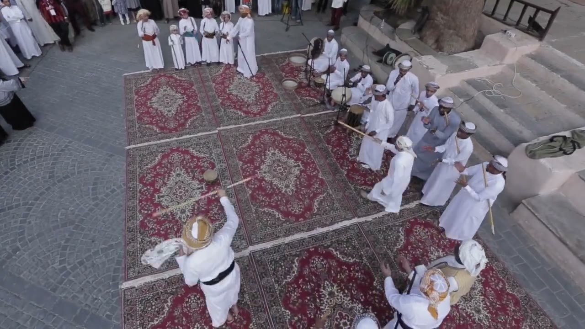
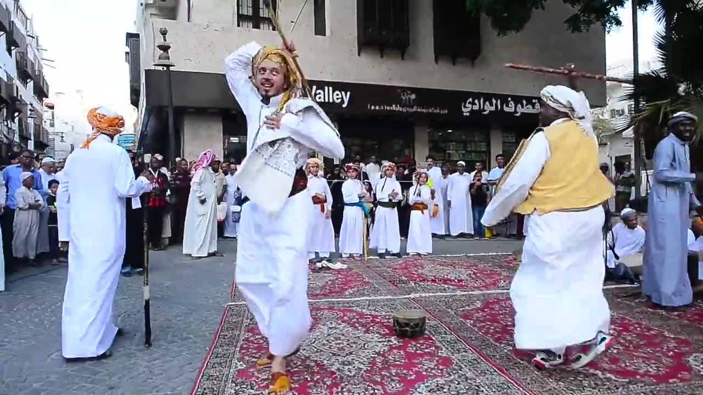
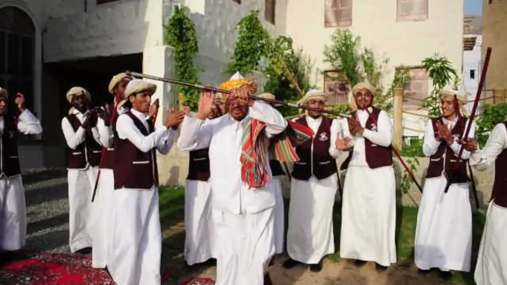
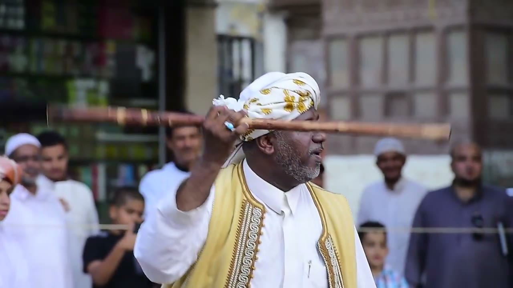
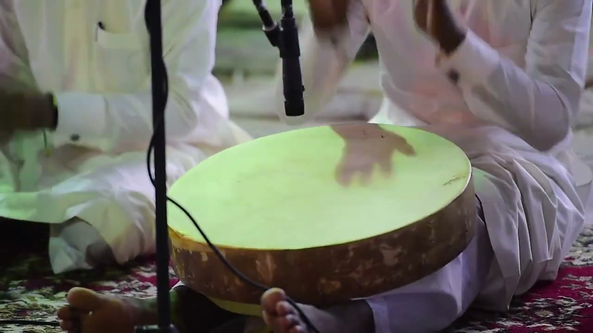
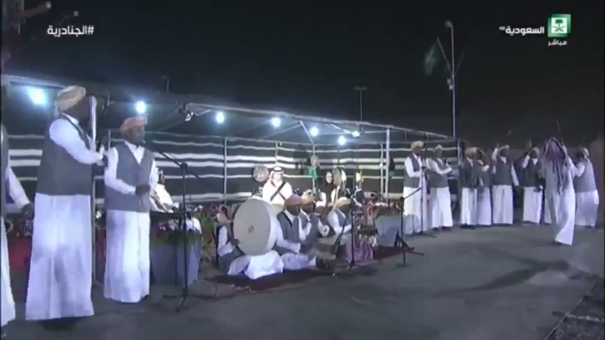
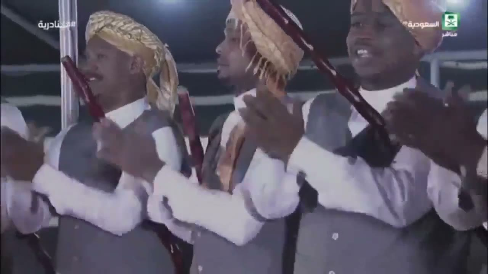
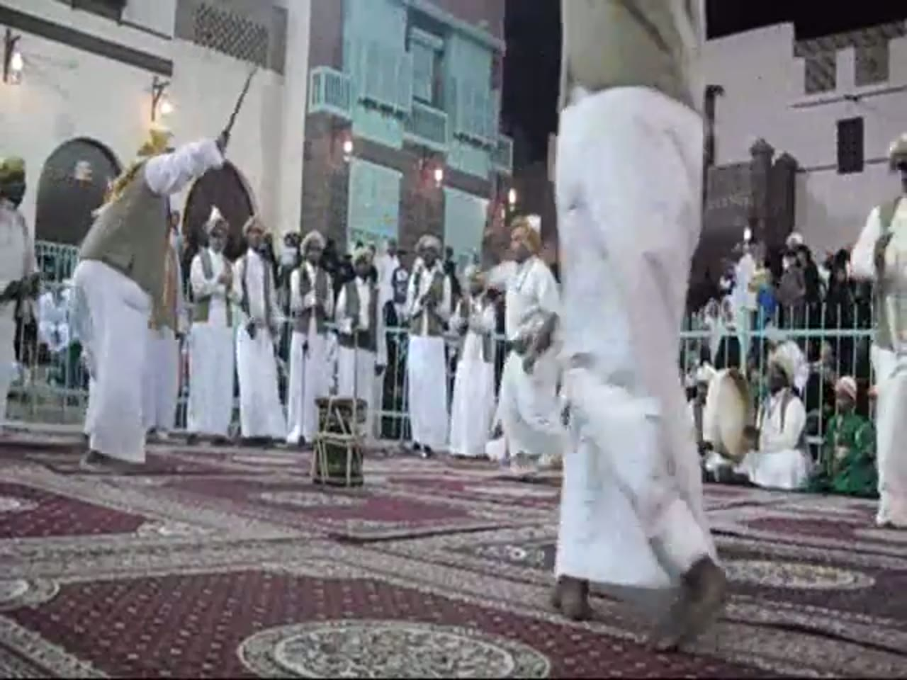

# Al-Mizmar (المزمار) reference keyframes

Reference for redrawing the Hikaya Al-Mizmar animation (the Hejazi stick dance). Made 2026-10-04 from three
YouTube videos (`sources.txt`). Ten keyframes, each a different pose or moment, picked from 1,319 frames extracted at
1 per second (377 + 369 + 573). It also carries the timing measurements, in the **Timing** section.

**How to read the descriptions.** They cover only what is visible in the frame. Where something can't be read (a
hand, which end of a stick is which, feet), the entry says so instead of filling it in. When a performer's own left and
right can't be told reliably, hands are given by side of the frame ("frame-left hand"). Distances are relative
("an arm's length") unless a measurement is named; the one measured size (stick length) is in the Timing section with
its method. The three videos are three different performances in different places and costumes, so the keyframes do
not show one standard costume. Left and right of the frame are as the camera sees them.

**Against the lead's brief.** The brief expected a circle round the drummers, dancers twirling long staffs and
footwork. In this footage: no circle is seen (the men stand in rows or along the edge of the carpeted area, see keyframes
1, 2, 3, 8 and 10); long staffs are held, swung and raised by several men, but twirls are mostly too fast or too blurred to count
at 24-25 fps (see 4d); feet are hidden by the thobe in nearly every shot. Drums seen are frame drums and a barrel-shaped drum
(keyframes 1, 2, 7, 8, 10); the men's clapping is visible in keyframes 5, 9 and 10.

## Where everything is

| What | Where |
|---|---|
| Keyframes (10 JPG, 1280 px wide; the mizmar3 frame is 1280x960 upscaled from a 640x480 source) | `keyframes/` next to this file |
| Source URLs and titles | `sources.txt` |
| Contact sheets: every 2 s, timestamp on each tile | Drive `C:\ai\projects\arabic-app\Hikaya dance reference\mizmar\contact_mizmarN.jpg` |
| 30 s clips with audio | Drive, same folder, `clip_mizmarN.mp4` |
| Analysis folder: audio and motion outputs (csv, json, png), `LOG.md` with every command and hand count, frame strips | Drive, same folder, `analysis\` |
| Full videos and all 1 fps frames | Machine A only: `C:\media\dances\mizmar\` (`frames\mizmarN\mizmarN_tSSSSs.jpg`, SSSS = second) |
| This note, `sources.txt` and the keyframes in git | `arabic-buddy` repo, `docs/reference/mizmar/` (contact sheets, clips, analysis and videos are not in git) |

## Clips

I checked what each clip shows by viewing a 1 per second contact sheet of it. Loudness was measured with ffmpeg
`volumedetect`; I have not listened to the clips.

| Clip | Source span | What's in it |
|---|---|---|
| `clip_mizmar1.mp4` | mizmar1, 2:56-3:26 | 2:56-2:59 view from above of drums and the men's robes on the ground. 3:00-3:04 two men with long sticks dancing in the street square (keyframe 4). 3:05-3:09 wider view of the same square. 3:10-3:13 raised view of the two rows with the dancers between them (keyframe 3 is 3:12). 3:14-3:15 close shots of a man with a stick beside men with a microphone. 3:16-3:21 a man in dark clothes walking at night. 3:22-3:25 night, seated drummers and men standing with sticks. Mean level -14.4 dB, peak 0 dB |
| `clip_mizmar2.mp4` | mizmar2, 3:25-3:55 | Tent stage at night: close shot of two men clapping, one at a microphone (3:25-3:27); wide shots of the stage with a dancer in front and seated drummers (3:28-3:30, 3:35-3:36); a close row of three clapping men with sticks (3:31-3:34, keyframe 9); close shots of hands on frame drums (3:37-3:43); a man singing into a microphone (3:44-3:50); close row again (3:51-3:52); men with frame drums in front of them (3:53-3:54). Quiet: mean -22.5 dB, peak -8.6 dB |
| `clip_mizmar3.mp4` | mizmar3, 7:02-7:32 | One hand-held low-camera take: dancers crossing in front of the camera, men in a row along the fence, seated drummers at frame-right. Sticks are visible on and off (for example 7:17, 7:22, 7:24, 7:28-7:31). Loud: mean -7.6 dB, peak 0 dB |

---

## 1. Formation, street square, wide

`mizmar1_t0104s.jpg` · mizmar1 (UNESCO) at 1:44

- Low wide-angle camera at ground level looking across several red-and-cream patterned rugs laid side by side on paving, in a street square among old multi-storey buildings. A shop sign with Arabic and "...f Valley" is at the upper left.
- At the back, right of centre, about 8 men stand in a loose row in long white thobes and white or checked head-cloths. Some hold long thin sticks upright beside them.
- Four men sit on the ground behind the rugs, left of the standing row, with a dark barrel-shaped drum and microphone stands in front of them.
- At frame-left, about 6 boys in white stand in a line, some holding thin sticks upright; adults and spectators stand behind a rope at the far left.
- At the frame-right edge, a man in a white thobe with a blue-and-white checked head-cloth and a black belt, seen from behind, holds a stick low, its far end pointing down toward the ground.
- One small round drum stands upright on its own on the rug in the middle.
- The men are not in a circle: the row is at the back and the seated drummers are beside it.

## 2. Formation from above

`mizmar1_t0140s.jpg` · mizmar1 (UNESCO) at 2:20

- High oblique camera looking down on a square covered with red-and-cream rugs.
- Bottom-left, closest to the camera: one dancer seen from behind and above, white thobe, black belt, a tan-and-white turban with a white cloth hanging at frame-left. His arm is raised with the hand at head height, gripping a long pale stick that points out to frame-right and slightly up, about 20 degrees above horizontal by eye, and runs back to frame-left below his hand.
- Top-left: a row of about 5 boys in white thobes with red or orange sashes, and a man at its right end. Top-centre: two men sit on the ground with drums and microphone stands; bowls and a frame drum lie on the rug beside them.
- Right: about 7 men stand in a loose line facing the dancer, in white thobes with white or checked head-cloths (one in a grey thobe). Several hold sticks upright.
- Bottom-right: two men seen from above, one in a gold-and-white head-cloth and one in a white one, with hands raised in front of them.

## 3. Rows and a dancer, raised view

`mizmar1_t0192s.jpg` · mizmar1 (UNESCO) at 3:12

- Raised camera looking down the length of the rugged square. Along the back at frame-right a line of about 7 men in white thobes stands with sticks held upright.
- At the back left, men sit on the rug with drums.
- In front: one dancer seen from behind, white thobe, black-and-white checked skullcap. His frame-right arm is raised with the elbow bent and the hand at about head height, gripping a long straight light stick that runs diagonally down to frame-right and ends on the rug.
- Measured on the frame with a pixel grid (Timing, "Size"): the stick is about 0.9 of the dancer's own standing height long, and slopes about 38 degrees below horizontal.

## 4. Two dancers with sticks

`mizmar1_t0183s.jpg` · mizmar1 (UNESCO) at 3:03

- Low camera close to the carpet, facing the dancers in the street square.
- Centre-left dancer: white thobe with a white embroidered over-shirt, a dark sash, an orange-gold turban with a tail, yellow-orange slippers, mouth open. His frame-left arm is bent up with the elbow at head height and the hand at the crown, holding a stick that points up out of the top of the frame. His frame-right hand is held against his chest.
- Frame-right dancer, in three-quarter view with his face turned toward frame-left: white head-cloth, yellow vest with gold trim over a white thobe, white-and-red trainers. He holds a red-brown stick with pale bands level above head height; it runs across the picture from about the middle to the right edge.
- The two are at different points in their movement: one stick is vertical, the other horizontal in the same frame.
- Frame-left: a man in a white thobe and an orange checked head-cloth, back to the camera, stands beside a black stick planted upright, hands together at chest height.
- Behind: a line of boys in white thobes with coloured sashes, one with a stick; spectators; a small rope-laced drum stands on the rug in the middle.

## 5. Close row, stick across the face, clapping

`mizmar1_t0024s.jpg` · mizmar1 (UNESCO) at 0:24

- Close, level camera on a row of men standing on grass and gravel in front of a white wall with climbing plants. About 8 men are in view.
- Costume: maroon vests with white edging over white thobes, white caps or turbans. The man in the middle also has a red, green and white striped shawl over his shoulder and a yellow-orange turban.
- The middle man has both hands up in front of his face, and a long dark stick lies across the picture at eye height between and in front of them, its left end above head height and its right end about at chin height, so it slopes about 10 degrees down toward frame-right (by eye on a pixel grid).
- The men beside him have their hands together at chest-to-chin height, some with palms apart, in a clapping pose; several mouths are open.
- At the right, men hold red-brown sticks upright or slanted beside them.

## 6. Close portrait, stick held level at forehead height

`mizmar1_t0159s.jpg` · mizmar1 (UNESCO) at 2:39

- Waist-up close shot of an older man with a grey beard, mouth slightly open, looking to frame-right. White turban with a yellow floral print; cream vest with gold-and-beige embroidered trim over a white thobe.
- A raised hand at frame-left of his face, at forehead height, grips a straight brown stick. The stick runs level across the whole width of the frame, about 3 degrees lower at the frame-right end, passing in front of his forehead. It has pale or gold bands along its length; its frame-left end is blurred. A ring with a light-blue stone is on a finger of that hand.
- Behind him, out of focus: spectators (boys and men) and a thin rope at chest height.
- This is the same dancer as in the pose timeline stretch of 2:38-2:40 (Timing, 4d, item 2).

## 7. Frame drum, hand on the skin

`mizmar1_t0255s.jpg` · mizmar1 (UNESCO) at 4:15

- Close-up of a round frame drum in greenish light. The skin is pale and fills the lower middle of the frame; the rim is thick, brown and worn. The rim rests against the knee of a man at frame-right; two bare feet show at the bottom.
- A motion-blurred hand lies on the skin at the centre, fingers spread, with its shadow on the skin; a second blurred hand is at the top right. Both come from men in white thobes seated at the left and right whose sleeves fill the sides of the frame.
- Two microphones: a black stand with a cable at the left and a microphone head hanging at the top centre.
- Struck with the open hand on the skin. No stick is used on this drum in this frame. In the 4:15-4:16 stretch the hand is on the skin 7 times (Timing, 4a).

## 8. Stage under a tent, night, wide

`mizmar2_t0032s.jpg` · mizmar2 (Saudi TV) at 0:32

- Night broadcast picture with the channel logo and a live label at the top right and a `#الجنادرية` caption at the top left. The canopy is black cloth with white stripes, with spotlights.
- Foreground-left: two men stand in grey vests over white thobes with tan head-cloths, close to the camera. A tent pole stands behind the first.
- Middle: about 6 men sit on a rug in grey vests and white thobes. One large frame drum with a pale skin stands upright facing the camera (about 150 px wide in the frame); another large drum is behind and to its right. Microphone stands are among them.
- Right: about 9 men stand in a line along the back in grey vests and white thobes; at least two have their arms raised above shoulder height. A man in a white thobe and a checked head-cloth walks in front of the line at the far right edge.
- A green flag on a pole at the top centre-right.

## 9. Three men clapping, sticks held at an angle

`mizmar2_t0212s.jpg` · mizmar2 (Saudi TV) at 3:32

- Close shot of three men in profile, all facing frame-left, in grey vests over white shirts. Two wear gold-woven and yellow-striped turbans; the middle one's has fringe hanging at the side.
- Each has a dark red-brown stick slanting through the picture from upper-left to lower-right at roughly 50-70 degrees from horizontal (by eye). How each man holds his stick (under the arm, in the crook of the elbow, in one hand) can't be read, because the arms are in front of it.
- Hands: palms together or just apart at chest height on all three, mid-clap. Mouths open on all three (singing).
- Behind them, the striped tent cloth. Logo and caption as in keyframe 8.

## 10. Low camera, dancers moving, stick raised

`mizmar3_t0440s.jpg` · mizmar3 (amateur, 480p) at 7:20

- Low hand-held camera at about knee height at the edge of a carpeted area at night. The frame is upscaled from 640x480 and soft.
- Frame-left: a dancer in an olive vest over a white thobe and a gold head-cloth leans forward from the waist, his frame-right arm raised with a thin dark stick held high, pointing up and to frame-right.
- Centre: a second man in white with a white head-cloth, mid-step with one foot lifted. Frame-right foreground: a man in a white thobe passes very close to the lens, motion-blurred; his bare feet and lower thobe are in the lower right.
- Behind them: a row of about 8 men in white thobes and vests stands in front of a green metal fence, some with hands together at chest height; spectators beyond the fence; buildings with arched windows and light-blue lattice balconies.
- A black-and-green rope-laced barrel-shaped drum stands on the carpet at the centre. At frame-right a seated man in white holds a round frame drum with a pale skin.
- This is the kind of frame the take gives: sticks appear as thin lines and often as streaks (see Timing, 4d).

---

## Timing

**Method.** All times are video time (m:ss.s) in the stated video; every command and hand count behind a figure is in `analysis\LOG.md` (Drive copy).
Tools in `C:\media\dances\_tools\`: `audio.py` (percussive onsets after harmonic/percussive separation, autocorrelation and pulse search), `tempotrack.py` (a 12 s window slid in 6 s steps),
`motion.py`, `strip.py` at the native frame rate (24 fps in mizmar1, 25 fps in mizmar2 and mizmar3, so one frame is 41.7 ms or 40 ms), `timeline.py`, `grid.py`.
Hand labels from 10 fps strips are good to +-100 ms; counts at the native rate are good to one frame. The soundtracks are broadcast or edited mixes of singing, clapping and drums, not a clean instrument recording.
Two things about the picture limit everything below. First, mizmar1 and mizmar2 are cut every 2-6 seconds and mizmar2 and mizmar3 are hand-held (the longest dance shots are 11.4 s in mizmar1 and 16.1 s in mizmar2, and no steady 15 s stretch of one movement exists),
so the playbook's "three steady stretches" could not be met for the main movement or the pose order. Second, mizmar3 carries a 5-frame (200 ms) pattern from its encoding (frame-difference spikes at every fifth frame, `dupcheck`),
which shows up as a false 200 ms movement period in every motion analysis of it; it is ignored.

### 4a. Strokes (percussive onsets, 30 s stretches)

"Onsets" are the percussive-part onsets from `audio.py`. They are claps, drums and other bursts together; I could not separate the instruments (see "What the onsets are").
Stability = median onset interval when only the stronger onsets are kept (prominence 0.35 / 0.6 / 1.0). A single steady stroke would not move; every stretch moves a lot.

| Video, span | Onsets | Median ms (BPM) | IQR ms / SD ms | Stability, ms | Autocorrelation peaks, ms (r) | Best phase-locked pulse, ms (R) |
|---|---|---|---|---|---|---|
| mizmar1, 1:40-2:10 | 130 | 185.8 (323) | 133.5-249.6 / 201.8 | 186 / 250 / 438 | none above r 0.14 | 215 (0.24) |
| mizmar1, 4:06-4:36 | 106 | 214.8 (279) | 156.7-330.9 / 191.6 | 215 / 314 / 488 | none above r 0.10 | 164 (0.24) |
| mizmar1, 4:10-4:40 | 111 | 191.6 (313) | 150.9-313.5 / 207.8 | 192 / 253 / 395 | none above r 0.11 | 145 (0.22) |
| mizmar2, 1:45-2:15 | 176 | 156.7 (383) | 121.9-185.8 / 76.9 | 157 / 186 / 395 | 563 (0.35), 1132 (0.49) | 141 (0.46), 188 (0.37) |
| mizmar2, 3:36-4:06 | 195 | 156.7 (383) | 110.3-180.0 / 56.2 | 157 / 180 / 540 | 557 (0.49), 1115 (0.62) | 186 (0.43) |
| mizmar2, 4:04-4:34 | 174 | 162.5 (369) | 121.9-185.8 / 67.9 | 163 / 180 / 552 | 552 (0.40), 1109 (0.55) | 139 (0.39), 185 (0.31) |
| mizmar2, 5:06-5:36 | 179 | 162.5 (369) | 116.1-180.0 / 79.2 | 163 / 168 / 380 | 552 (0.47), 1103 (0.49) | 184 (0.47), 138 (0.43) |
| mizmar3, 0:55-1:25 | 169 | 162.5 (369) | 127.7-191.6 / 69.7 | 163 / 226 / 563 | 563 (0.47), 1126 (0.48) | 188 (0.47), 141 (0.47) |
| mizmar3, 4:22-4:52 | 169 | 162.5 (369) | 145.1-203.2 / 70.0 | 163 / 203 / 517 | 528 (0.53), 1062 (0.48) | 177 (0.61) |
| mizmar3, 7:02-7:32 | 156 | 162.5 (369) | 150.9-209.0 / 85.1 | 163 / 192 / 366 | 517 (0.53), 1033 (0.52) | 172 (0.63) |

What the table says:
- **mizmar1: no pulse is established.** The median moves from 186 to 438 ms as weaker onsets are dropped, autocorrelation never exceeds r 0.14 in any of the three 30 s stretches, and `tempotrack` over 0:20-3:50 and 3:48-5:30 gives r of 0.07-0.33 with no stable period (one 12 s window holding only 4 onsets reached 0.46). The edit cuts between different places and sounds every few seconds.
- **mizmar2 and mizmar3 have a stable repeating accent, not a single stroke interval.** In all 7 stretches the autocorrelation has a clear peak at 517-563 ms (r 0.35-0.53) and another at about twice that, 1033-1132 ms (r 0.48-0.62). The "median onset interval" of 157-163 ms is not a stroke time: it moves with prominence.
  Inside the 517-563 ms group the pulse is either 3 x about 186 ms (172-188 in the best-locked stretches) or 4 x about 140 ms; the pulse search finds both with similar strength (for example mizmar3 0:55-1:25: 188 ms R 0.47 and 141 ms R 0.47) and I cannot choose between them from the audio. The onset-interval histograms peak at 150-200 ms.
  `audio.py` found no repeating interval pattern in any stretch (the intervals are mostly one pulse long with occasional two or none).
- **The accent period shortens through each performance.** `tempotrack` windows with autocorrelation r of at least 0.45 and a period of 500-610 ms (or half of 1000-1230 ms): mizmar3 per minute from 2:00 to 10:00 (n = 69 windows) 549, 540, 534, 528, 522, 517, 511, 511 ms; mizmar2 per minute from 0:00 to 6:00 (n = 54) 583, 569, 563, 557, 557, 551 ms.
  That is about 5-7 % faster over 4-7 minutes in both videos (a drop of 42 ms in mizmar3 between 2:16 and 9:22; 36 ms in mizmar2 between 0:06 and 6:00).

**What the onsets are.** In mizmar2 and mizmar3 the soundtrack is 93-97 % harmonic energy (singing and sustained chant) with percussive bursts on top; the spectrograms (`m2_a1_audio.png`, `m3_a2_audio.png`) show vertical bursts together with gliding harmonic stripes.
In mizmar2 at 4:13.0-4:14.2 (native strip, `m2_253n_p01.jpg`) the picture is one man singing into a microphone with no hand or instrument in view, while the audio finds 7 onsets (253.114, 253.305, 253.393, 253.509, 253.694, 253.950, 254.089 s): the bursts come from clapping and drums off-screen.
So in mizmar2 and mizmar3 the audio cannot be tied to any one instrument I can see. The mizmar1 stretches are 63-70 % percussive (the 4:06-4:40 ones lie in the hand-drum close-ups).

**Visible-strike cross-check.**
- mizmar1, frame drum, 4:15.000-4:16.375 (native strip `m1_255z_p01.jpg`): a hand lands on the skin at 4:15.083, 4:15.250, 4:15.542, 4:15.667, 4:15.917, 4:16.125 and 4:16.333 (7 contacts; each good to about +-2 frames = 83 ms, because the hand rests on the skin for 2-3 frames). Intervals 167, 292, 125, 250, 208, 208 ms, median 208 ms, mean 208.3 ms (n = 6).
  The audio finds onsets at 4:14.998, 4:15.247, 4:15.340, 4:15.683, 4:15.921, 4:16.234 s. Three contacts coincide with an onset within one frame (4:15.250 / 4:15.247, 4:15.667 / 4:15.683, 4:15.917 / 4:15.921), so there is no sound-to-picture offset larger than one frame in this clip. The other four contacts have no onset within 85-141 ms,
  and two onsets (4:15.340, 4:16.234) fall while the hand is lifted: other drums or hands off-screen. The visible median of 208 ms is within 4 % of the audio median of the 4:06-4:36 stretch (214.8 ms), but n is small and the two lists are not the same set of strikes.
- mizmar2, large drum, 5:28.0-5:29.0 (native strip `m2_328n_p01.jpg`): a hand comes down on the drum head at about 5:28.04-5:28.16 and again at 5:28.84-5:28.96, and onsets at 5:28.024 and 5:28.941 fall in those frames. Only 2 strikes are visible, so no interval.
- Not done: 8-10 visible strikes in one stretch for mizmar2 or mizmar3. The clapping hands are off-frame or too small, and mizmar3 is 480p hand-held.

### 4b. Main repeating movement

**Not measurable to the playbook standard** (three steady 15 s stretches). The reasons are in the method note: the cuts, the hand-held cameras, and mizmar3's 200 ms encoding pattern. Leads that I did not confirm by counting:
`motion.py` on mizmar2 0:10.9-0:26.8 (whole frame, 25 fps) found an energy period of 1146-1200 ms (autocorrelation r 0.50; 12 peak-to-peak cycles, mean 1197 ms, SD 134 ms), but the shot is hand-held on a group of dancing men (strip `m2_poseA_p02.jpg`) and I cannot say which movement it follows.
The same analysis on mizmar2 at 2:32-2:41.6, 2:49.6-2:59.2 and 5:42.7-5:53.2 found no consistent period (peaks at 2.0-3.9 s, autocorrelation r of at most 0.26). The movement that repeats at a readable rate is the stick, in 4d.

**Size (measured on one frame).** mizmar1 at 3:12 (`mizmar1_t0192s.jpg`, 1280x720, `grid.py`): the dancer in front, seen from behind, stands about 383 px tall in the picture (turban top at y 272, thobe hem at y 655, +-12 px).
His stick runs from about (480, 195) to (748, 405): about 340 px (+-15) long, sloping about 38 degrees below horizontal toward frame-right. Stick length is therefore **about 0.9 of the dancer's own standing height** (plausible range 0.75-1.1: the camera looks down at him, so both lengths are foreshortened differently).
A second reading, in the 2:38.9-2:39.8 swing (4d, item 2): the stick reaches **about 40 degrees above horizontal** (tracker readings 38-40 degrees at 2:39.375-2:39.417, +-5).

### 4c. Pose timeline

Only one stretch could be labelled, so no pose order or beat can be stated. **mizmar1, 3:01.1-3:05.2** (4.1 s, not the 20 s asked for): the camera follows one dancer (white thobe, maroon-and-black sash, gold turban; strips `m1_BB_p01.jpg`, `m1_BB_p02.jpg` at 10 fps, `timeline.py`).

| Video, timestamp -> pose | Lasts | Audio onsets in it | What the frames show |
|---|---|---|---|
| mizmar1, 3:01.1 -> other/unclear | about 1000 ms | 5 | He walks in from frame-right; the stick is not visible. |
| mizmar1, 3:02.1 -> stick overhead | about 1400 ms | 7 | Stick above the head in his raised arm; it swings, see 4d. |
| mizmar1, 3:03.5 -> stick low in front | about 500 ms | 2 | Stick vertical at his side at 3:03.5, then pointing down and forward in front of his hip, then out to frame-right. |
| mizmar1, 3:04.0 -> stick raised high | about 1200 ms (to 3:05.2, where the stretch ends) | 6 | Arm up, stick vertical or diagonal above the head, pointing up and out to frame-right from 3:04.2; the camera pans. |

Order in this stretch: unclear, overhead, low in front, raised high. It does not repeat inside 4.1 s. The audio in this span (`m1_a3`, 2:55-3:15: 86 onsets, median 197 ms, IQR 139-267 ms, SD 127 ms) has no steady pulse, so durations in strokes are not meaningful.
Durations are given to the 100 ms resolution of the labels. The other candidates fail the 20 s test: mizmar1 is cut every 2-6 s; mizmar2 has no run longer than 16 s on one dancer; mizmar3 shows sticks as thin lines and the camera sways (strips `m3_pose1_p01-p03.jpg`, 4:22.7-4:42.0).

### 4d. Stick rotations, footwork, circle

**Stick rotations.** Hand counts at the native frame rate (mizmar1 24 fps).
1. **mizmar1, 0:39.9-0:41.14**, one dancer (grey vest, yellow turban) turning on the spot with the stick overhead, close camera (native strips `m1_399_big_p01.jpg`, `m1_4085n_p01.jpg`; the shot runs 0:38.83-0:42.17). Frame by frame, the long end of the stick is at frame-left 0:39.900-0:40.192, near end-on (foreshortened) 0:40.233-0:40.358, frame-right 0:40.400-0:40.692, near end-on 0:40.733-0:40.775, frame-left again 0:40.817-0:41.142.
   The centres of the two frame-left runs are 40.046 s and 40.980 s: **one full revolution in 0.93 s, about 1.1 revolutions per second (about 22 frames per turn), n = 1 revolution.** Half-turns: 0.50 s (left to right) and 0.43 s (right to left). The second turn is cut short, since from 0:41.18 he lowers the stick. The near end-on states show the stick sweeping in a plane tilted away from the picture plane, but the sense of the turn as seen from above cannot be read from this side view.
2. **mizmar1, 2:38.9-2:39.9**, one dancer (white turban, cream vest with gold trim; keyframe 6 is the same man). Following the stick in the native frames: it points up and to frame-left from his raised hand until 2:38.83, lies level across behind his head at about 2:39.0, rises to about 40 degrees above horizontal at 2:39.375-2:39.417, falls back to level at about 2:39.8, and points down to frame-right from 2:39.92.
   That is **one slow swing of about 0.8 s between two level positions**, n = 1, not a repeated spin. (My automatic line tracker locked onto the vest trim in part of this shot, so only the hand-checked frames are used.)
3. **mizmar1, 3:02.17-3:02.96, two dancers in one shot** (zoomed native frames, `m1_stick182.jpg` and `m1_stick182_YV.jpg`). Dancer 1 (maroon-and-black sash, gold turban): the stick is near level and short (pointing along the line of sight) at 3:02.250, 3:02.500 and 3:02.750, and vertical or diagonal in between: **the pattern repeats every 6 frames = 250 ms, 3 repeats.**
   Dancer 2 (yellow vest): the stick is vertical at 3:02.167-3:02.292, 3:02.542 and about 3:02.875, i.e. about every 0.33-0.38 s (2 intervals). **They are not in step**: the rates differ (about 4 and about 3 per second) and the phases differ (at 3:02.333 dancer 1's stick is vertical while dancer 2's is level; both are vertical at 3:02.542).
   **Limit:** at 24 fps I cannot tell whether one repeat is a full turn, a half turn or a back-and-forth flick of the wrist. Dancer 1 shows only one tilt direction between the vertical states, which argues against a uniform fast spin but does not prove a rate. I report "about 4 stick cycles per second" for dancer 1, not revolutions per second. The direction of rotation as seen from the camera cannot be read.
4. **mizmar3, 7:35.00-7:35.96**, left dancer in the hand-held 480p take (strip `m3_455zz_p01.jpg`): the stick is a motion-blurred streak at 7:35.000-7:35.200 and a doubled image at 7:35.760-7:35.960. Clear frames: level pointing left at 7:35.240, held diagonal up and to frame-right for 6 frames (240 ms) from 7:35.320, vertical at 7:35.560. **The blurred frames mean the stick moved through a large angle within one exposure (1/25 s); the rotation rate there cannot be counted at 25 fps.**
5. **mizmar2** (0:17-0:27, several men with red-brown sticks held up diagonally, moving hand-held camera): no stick rotation visible at 10 fps; not counted. No comparison of several dancers in step beyond item 3.

**Footwork.** Not measured. In almost every shot the feet are hidden by the thobe or out of frame. Where legs are visible: mizmar1 3:02.5-3:02.9 (dancer 1) stands on one foot with the other foot raised behind him, a yellow slipper visible, and has the knee up at 3:02.9; mizmar3 4:26.7-4:26.9 shows a knee raised high; mizmar1 3:16.55-3:17.26 is a man walking at night, not a stick dancer.
I could not get a step count or steps per stroke from any of it. The movement looks like hops or skips with a lifted leg, at no countable rate.

**How the circle moves.** No circle is seen to move, and none forms. In mizmar1 (keyframes 1, 2, 3) men stand in rows along the edges of a rug-covered square, boys on one side, with seated drummers behind the middle of one side, and one or two dancers work in the open middle; in mizmar2 (keyframe 8) a line of men stands along the back right of the tent floor with the drummers seated at the middle left;
in mizmar3 (keyframe 10) men stand in a row along a fence and the dancers move on the carpet in front of seated drummers. In none of the frames I looked at do the standing men move around the drummers, so there is no direction or period to time.

### 4e. Proposed animation constants

| Constant | Value | Evidence | Confidence |
|---|---|---|---|
| `BEAT_MS` | not measurable | Only one 4.1 s stretch of pose changes could be labelled (mizmar1, 3:01.1-3:05.2: 4 poses lasting about 500-1400 ms, no beat). The footage is cut every 2-6 s or hand-held. | none |
| `STROKE_MS` | not measurable as one instrument's stroke. The nearest stable figure is the accent group below; inside it the pulse is about 186 ms (3 per group) or about 140 ms (4 per group), not separable. A visible hand on a frame drum: median 208 ms (n = 6 intervals) | Audio, 7 stretches in mizmar2 and mizmar3 (table in 4a): median onset interval 157-163 ms but it moves with prominence; no repeating pattern. Visible drum strikes: mizmar1 4:15.083-4:16.333 only. In mizmar1 no pulse is established | low |
| accent group, `ACCENT_MS` (extra) | about 550 ms (517-583 ms, shrinking about 5-7 % over a 4-7 minute performance); a double group of 1.03-1.13 s | Audio autocorrelation peaks in all 7 stretches (mizmar2 1:45-5:36, mizmar3 0:55-7:32): 517-563 ms (r 0.35-0.53); `tempotrack` per-minute medians 583 -> 551 ms (mizmar2, 0:00-6:00) and 549 -> 511 ms (mizmar3, 2:00-10:00) | medium: two videos, audio only (no second method; the source of the accent is off-screen) |
| `MOVE_PERIOD_MS` | not measurable | No steady 15 s stretch; 4b. Candidate stick figures (one revolution about 930 ms; dancer 1 pattern 250 ms; swing about 800 ms) are single events, below | none |
| `STICK_TURN_MS` (extra) | about 930 ms per full turn of an overhead stick (about 1.1 revolutions per second) | mizmar1 0:39.9-0:41.14, hand count at 24 fps, n = 1 revolution; half-turns 500 and 430 ms | low: a single event |
| `STICK_CYCLE_MS` (extra) | about 250 ms between repeats of the stick pattern for one dancer, 330-380 ms for another; the two are not in step; revolutions per second not countable at 24-25 fps | mizmar1 3:02.25-3:02.96; mizmar3 7:35.0-7:35.96 is motion-blurred | low |
| `MOVE_SIZE` | stick about 0.9 of the dancer's standing height long (0.75-1.1), tilted up to about 40 degrees above horizontal in the slow swing | mizmar1 3:12 frame (`grid.py`, one dancer, high camera angle); mizmar1 2:39.375-2:39.417 frames | low: one frame and one swing each |
| `SEQUENCE` | not measurable. In the one stretch: other/unclear, stick overhead, stick low in front, stick raised high | mizmar1 3:01.1-3:05.2, 10 fps labels | low: single 4 s stretch, no repeat seen |

---

## Not covered by these frames

- **No circle.** Nothing in the three videos shows men moving in a circle round the drummers, so the lead's "circle round the drummers" is not in this footage and not drawn from it.
- **Feet.** Hidden by the thobe in nearly every shot; the few frames with visible feet do not give a step pattern.
- **Staff spins.** Mostly too fast or too blurred to count at 24-25 fps; only one clean revolution (mizmar1 0:39.9-0:41.14) and one slow swing were counted.
- **Pose order and beat.** One 4 s stretch only. The dance as a sequence of poses is not established by this footage.
- **Instruments.** The sources of the audio pulse are off-screen in mizmar2 and mizmar3. Seen being played: hands on frame drums (keyframe 7, and 3:37-3:43 in mizmar2); the other drums (keyframes 1, 2, 8, 10) are seen but not seen being struck. I did not check whether music is laid over any soundtrack.
- **Costume varies by troupe.** Maroon vests (keyframe 5), grey vests (8, 9), olive vests (10), white thobes with a yellow vest (4, 6), all different performances. There is no single costume to take from these frames.
- **Video quality.** mizmar1 is an edited UNESCO montage with title cards, interview shots (3:28-3:52) and credits from 5:36; mizmar2 is a Saudi TV broadcast of a night stage with a channel logo; mizmar3 is amateur 480p camcorder footage from 2011 (not an official source) that is soft, shaky and upscaled.
- **Searching.** Footage was chosen from candidate titles and descriptions; several other videos were rejected from title, channel and length without my seeing their pictures (listed in `LOG.md`), so usable footage may exist that I passed over.
