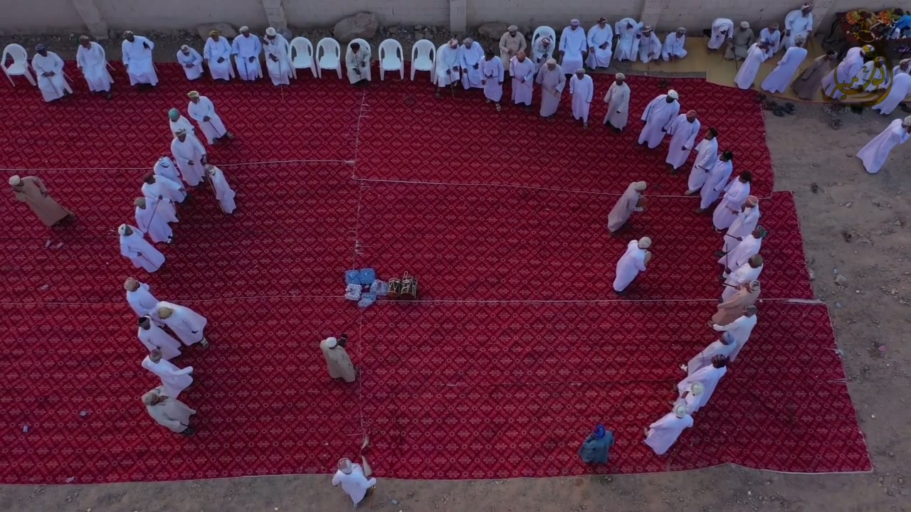
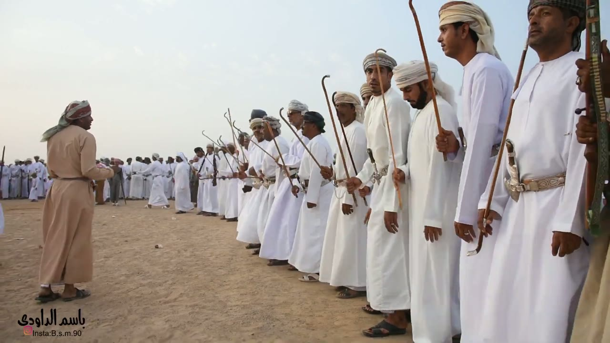
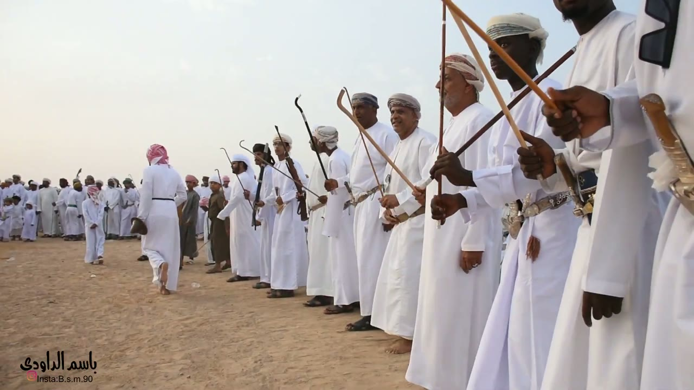
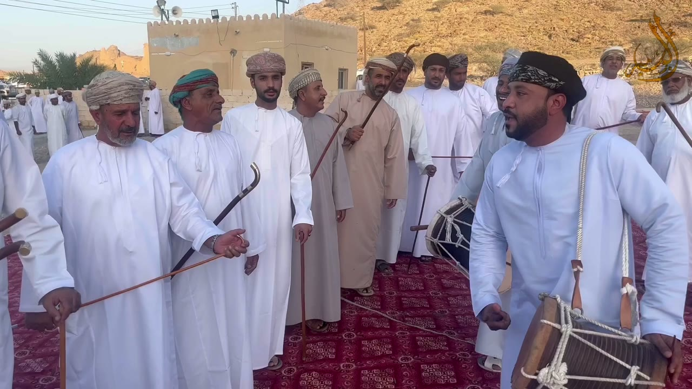
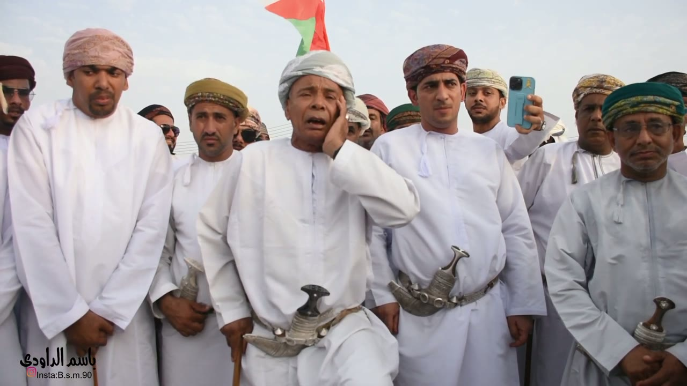
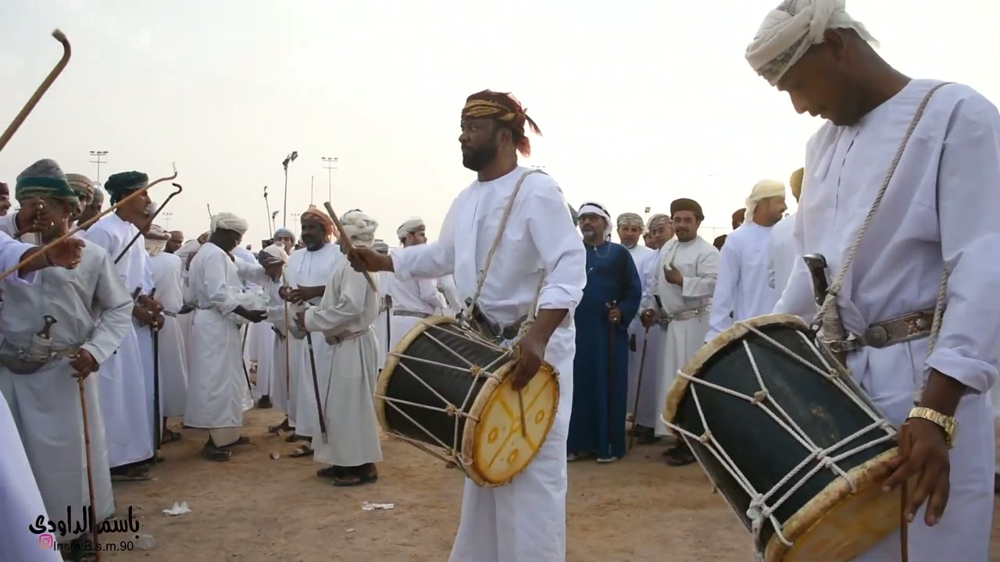
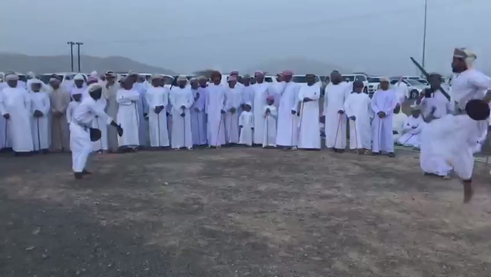
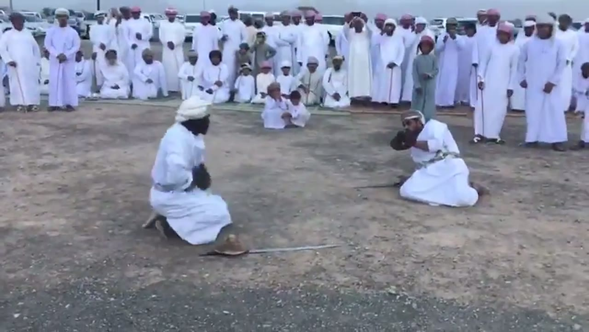
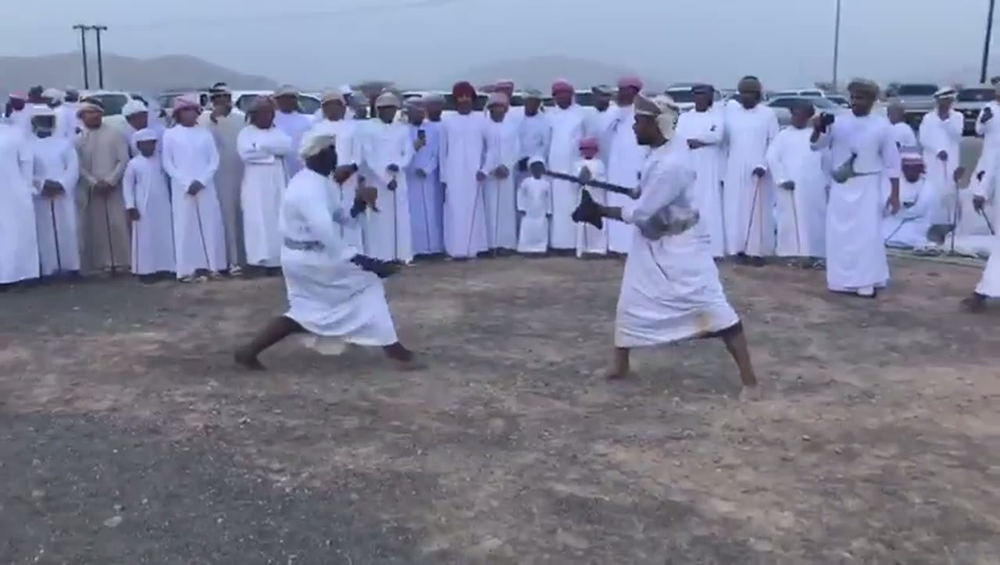

# Razha (الرزحة) reference keyframes

Reference for redrawing the Hikaya Razha animation (Oman). Second pass, 2026-10-05 and 2026-10-06 (the first
pass was 2026-10-04). Made from four videos (`sources.txt`): ten keyframes, each a different pose or moment, picked from
1,437 frames extracted at 1 per second (razha1 496, razha12 507, razha17 46, razha20 388). It also carries timing
measurements (see **Timing**). The first pass built the pack from an archive film and a festival troupe; this pass
rebuilt it around footage of Razha at weddings and village gatherings, because the project owner asked for authentic footage even
where it does not match the original brief.

**What Razha is, as these films show it.** Razha is the Omani men's art in which long rows of men stand in the open,
in two facing rows or arcs that close into an oval (seen from the air in razha20), sing verses led by a soloist, and have drummers walk
between the rows; men in the rows carry hooked canes (and, in
razha1 and razha12, a few rifles), and a few men at a time step out of the rows to fence with a straight sword and a round shield. It is
not Al-Razfa, the UNESCO-listed art of the UAE and Oman, which the UNESCO page
(`ich.unesco.org/en/RL/al-razfa-a-traditional-performing-art-01078`) describes with wooden replica rifles; none of
the four videos is titled Razfa and none shows replica rifles. Where I say what the dance is, I mean what is in these
four films, not a general account of Razha.

**What changed from the first pass.** razha1 (Qatar Digital Library, part 1) is kept, with its first-pass audio and
picture checks. razha2 (Qatar Digital Library, part 2) and razha5 (the Al Amerat troupe at the Muscat Festival 2018)
are dropped: both were genuine, but the pack is limited to four videos, razha2 is the second half of a film already
represented, and razha5 is a festival-stage item while this pass found Razha in its own setting. The first pass's
body-bob hand count (0.73 s, razha2) and razha2's and razha5's audio and sword checks leave the README with them (they
stay in `analysis\LOG.md`). Three videos are new (razha12, razha17, razha20), nine of the ten keyframes are new, and
the Timing section is rewritten.

## Authenticity

| Video | What it is | Who names the dance | Why it counts as authentic, and what is uncertain |
|---|---|---|---|
| razha1 | Qatar Digital Library / British Library film "Al-Raz-Ha Dance and Music (1)", a wedding in a suburb of Sur, 2014-02-20, by Rolf Killius; 8:16, 1080p | The film itself (title card "Al-Raz-Ha") and its description | Archive documentary of a real wedding event, the recording team invited by the host. Field sound. Its description asks users to respect creators and traditional cultural expressions and to follow the British Library's Ethical Usage Policy; this is reference use only |
| razha12 | "The Razha was held in Ja'alan Bani Bu Hassan on Friday 17/6/2022", a wedding, filmed by Basim Al-Dawoodi; 8:27, 1080p, 50 fps | The uploader (channel الرزحة العمانية); the videographer's name and handle are burned into the picture | A community film made inside a real wedding Razha by one open camera. Field sound of voices and drums. Dance, place, date and wedding are the uploader's text; I could not check them independently |
| razha20 | "The documentary film: the art of Razha", community channel Abu Numair, uploaded 2023-01-13; 6:27, 1080p, 30 fps; drone and hand-held camera, a commentary in parts, credits at 6:12-6:24 | The film itself (on-screen title "The art of Razha" at 0:08, and the credits) | A documentary made by the community's own film-makers at a Razha gathering on a red carpet beside a mountain (the place is not named in what I read). Edited, not a single performance: drone shots, close-ups, voice-over and a logo; 4:34-5:11 is one continuous 37 s hand-held shot. The sound is field sound with the commentary on top in parts; I could not separate them |
| razha17 | "The Ja'alan sword zafin" at a Razha in Wadi Nam, uploaded 2019-07-21 by the poet Jum'a Mas'ud al-Sa'idi, whose description names the two swordsmen (Sa'id al-Sawa'i and Jum'a al-Sa'idi) | The uploader, who is one of the named swordsmen | A community film of a real bout inside a dense ring of onlookers. Named by the uploader only; not independently verified. Only 46 s long, 848 x 480 |

## The brief vs the footage

The brief expected a sword tossed and caught, leaps, two rows facing each other, and poetry traded between two groups.
Here is what the authentic footage shows instead.

- **Sword toss: not in the four videos (n = 0).** One 23 s clip I found (not kept) is titled by its uploader as a sword
  thrown in a Razha. It shows a long blade high above a crowd, but not the thrower or the catch, and it is slowed or
  edited, so no air time can be given (see 4d and "Footage found and not kept").
- **Leaps: yes, but only in the sword-and-shield fencing, not in the rows.** razha17 has five timed leaps (and a jump I could not time) in one 46 s bout, each
  0.40 to 0.50 s in the air. The men in the rows (razha1, razha12, razha16) stand and step; I saw none of them leap.
- **The rows carry canes, not swords.** In razha1, razha12 and razha16 the rows hold hooked canes and walking sticks, and
  in razha1 also rifles. Swords and round shields are in the hands of the two men fencing (razha17; razha1 about 1:43-1:56). The first pass's festival troupe (razha5) showed whole rows with swords; no kept film does. Among the videos not kept, razha15 (a troupe of about 60 men) and razha13 (a large gathering) show swords and round shields in several men's hands at once, so swords are not limited to one pair.
- **Two rows facing each other: yes, seen from the air in razha20** (keyframe 1): two arcs of roughly 20 and 25 men
  face each other across a red carpet, one man deep, with onlookers on chairs along the wall at the back (the other
  drone tiles show the arcs closing into an oval). razha12 and razha1 are filmed from one end of one row. The Qatar Digital Library description of razha1 says two long rows face each other, one poet for each row, and
  one row sings several verses before the other takes over. I did not see or hear that alternation (see 4d).
- **The poet is a soloist with a hand cupped at the ear** (razha12 keyframe 5; razha1 4:20-5:32, first pass). In razha12
  a man at the centre sings with the men standing around him from the start until the drummers come in at about
  2:50; in that stretch (0:24-2:30) the audio has no drum onsets.
- **The fencing is mostly on the ground.** In razha17, about 10 s (6.2-16.6 s) of the 45.9 s have both men squatting or
  kneeling facing each other. The leaps come in two rounds (about 2.4-4.6 s and 28.6-32.0 s), each followed by a
  low-lunge phase. (A night bout in a video not kept, razha16 8:23-9:28, is also fought mostly on the knees.)
- **Drums.** Rope-laced barrel drums and yellow-skinned frame drums, played with a thin stick, carried on a sling, with
  drummers walking in the lane between the rows (razha12 from 2:52, razha20, razha1). In razha12 the drumming is a steady
  stroke about 197 ms apart that starts after nearly three minutes of unaccompanied singing, and the poet-soloist's
  stretch has no drum in the audio (4a).
- **The men in the row point their canes toward the drummer** (razha20 4:34-5:11, keyframe 4): the men near the camera
  hold hooked canes and long sticks pointing diagonally forward and up toward the drummer at the end of the row, lower
  them to horizontal, raise them again, and hold them upright at the end; each man is out of step with the next and no
  common beat is visible (4c).

**How to read the descriptions.** They cover only what is visible in the frame. Where something can't be read (which
hand, blade direction, feet), the entry says so instead of filling it in. When a performer's own left and right can't be
told reliably, hands are given by side of the frame ("frame-left hand"). Distances and angles are relative or marked
"not measured" unless a measurement is given with its method. Nothing is transcribed or translated from the singing: I
can't read words from the audio. Timestamps are m:ss in the source video. All dancers in these films are men.

## Where everything is

| What | Where |
|---|---|
| Keyframes (10 JPG, 1280 px wide) | `keyframes/` next to this file |
| Source URLs, titles, authenticity notes | `sources.txt` |
| Contact sheets: every 2 s, timestamp on each tile | Drive `C:\ai\projects\arabic-app\Hikaya dance reference\razha\contact_razhaN.jpg` |
| 30 s clips with audio | Drive, same folder, `clip_razhaN.mp4` |
| Analysis folder (LOG.md with every command and hand count, audio, motion and tempo outputs and plots, the helper scripts) | Drive, same folder, `analysis\` |
| Full videos and all 1 fps frames | Machine A only: `C:\media\dances\razha\` (`frames\razhaN\razhaN_tSSSSs.jpg`, SSSS = second) |
| In git | only this note, `sources.txt` and `keyframes/`, in `arabic-buddy`, `docs/reference/razha/` |

The video numbers skip 2-11, 13-16, 18, 19 and 21: those were downloaded or looked at and not kept (see "Footage found and not
kept" and `analysis\LOG.md`).

## Clips

| Clip | Source span | What's in it |
|---|---|---|
| `clip_razha1.mp4` | razha1, 1:30-2:00 | 1:30-1:37 is a mid-shot of men carrying frame drums, one with his hand at the skin, over a drum-only track (no voices, by the spectrogram); voices come in at about 1:37.5. About 1:43-1:56 is a two-man sword-and-round-shield bout, filmed from the side; at about 1:56 the camera swings to men with rifles. I haven't listened to it; its audio was analysed (see 4a) |
| `clip_razha12.mp4` | razha12, 6:12-6:42 | The camera stays at the near end of a very long straight row of men holding hooked canes and sticks, close at 6:12-6:20 and then further back (hand-held, low), the canes angled up and forward in places. A man in a beige robe stands in the lane facing the row from about 6:38. The picture-period measurement (4b) includes this stretch. Voices and drums are in the audio by the spectrogram. I haven't listened to it |
| `clip_razha20.mp4` | razha20, 4:34-5:04 | One drone tile (4:34.0, the men in an oval on the carpet), then one continuous hand-held shot (from 4:34.25) along a row of men on a red carpet holding hooked canes and long sticks, with a drummer in a light-blue dishdasha carrying a rope-laced barrel drum at the end of the row from about 4:35, who turns and sings in front of the row from 4:54, and a second barrel drum in the row from about 5:00. The canes point toward the drummer, then lower, rise again and end upright (4c). Voices and drums are in the audio by the spectrogram, with the commentary possibly mixed in; I haven't listened to it |
| `clip_razha17.mp4` | razha17, 0:00-0:30 | One continuous shot of two men fencing with swords and round shields inside a ring of onlookers: the near man walks in and runs (0:00-3.9), the man at frame-right jumps with a sword overhead (about 2.4 s, not timed), both leap (about 4.05-4.6, see 4d), both go to the ground and kneel from about 5.6, and a second round of leaps by the frame-right man starts at about 28.6. I haven't listened to it |

---

## 1. Formation from the air: two arcs of men facing across a carpet

`razha20_t0124s.jpg` · razha20 (documentary "Fan al-Razha", Abu Numair channel) at **2:04**

- A drone looks down at a red patterned carpet laid on bare ground in front of a breeze-block wall (top of the frame). Men in white and beige dishdashas with caps and turbans stand in two arcs that face each other across the carpet: a left arc of roughly 20 men running from about (270, 150) at the top down to about (240, 580) at the bottom, and a right arc of roughly 25 men from about (930, 140) down to about (940, 610) (both counted by eye). The arcs are one man deep and the men stand a body-width or less apart. Between the arcs is open carpet; both ends of the oval are open (the width is not measured).
- Along the wall at the top, about 30 men sit on white plastic chairs or stand in a line, and at the top-right corner a man in white and a gold-patterned garment stands by a table of coloured objects (not identified). These look like onlookers, not part of the arcs.
- On the open carpet: a small group of blue water bottles and one small drum at about x 485-590, y 380-430; a man in a beige robe near the middle (about x 450-500, y 470-540); a man in beige and one in white at the right (about x 855-915, y 255-410); a man in a brown robe at the far left edge (about x 15-100, y 245-320); a man in white holding a stick at the bottom (about x 465-525, y 640-710); and a person in a blue-green wrap near the bottom right (about x 815-860, y 600-650).
- Some men in the arcs hold thin sticks or canes (for example the man at about (300, 165) at the top of the left arc). I can't read who is singing or which way the men face.
- The same layout is in other drone tiles of the film (0:12, 0:36-0:44, 1:12-1:16, 2:04, 4:28-4:34, 6:00-6:04).

## 2. Formation: one long row seen from its end, canes held at an angle

`razha12_t0400s.jpg` · razha12 (Ja'alan wedding Razha, filmed by Basim Al-Dawoodi) at **6:40**

- A low camera at the near end of one straight row of men standing shoulder to shoulder on open sand under a hazy sky. All the men face frame-left, in profile; about 17 are clear and the row runs on toward frame-left for dozens more, with a crowd beyond. Their feet are planted; none is mid-step.
- Costume: white ankle-length dishdashas; turbans and caps in white, cream, grey and chequered patterns. The nearest man (frame-right) wears a wide silver-threaded belt with a curved, silver-sheathed dagger at the front (about x 1060-1090, y 300-410). Sandals are visible on several men (about x 805, y 690; x 650, y 580).
- Held: long thin canes, many with a hooked top (about x 680, 790, 590 in the 1280 x 720 frame), gripped by one hand at chest to belt height and upright or leaning slightly toward frame-left in the nearest men (about 10 degrees from vertical) and tilted up and toward frame-left, the direction the men face, at roughly 30 to 60 degrees in the men further down (not measured); the other hand hangs or rests at the belt. At the right edge, close to the lens, a green-and-gold decorated shaft (probably a rifle stock) rises past a man's hands (about x 1225-1275, y 0-490).
- At frame-left a man in a beige ankle-length robe and a grey-and-red head cloth stands alone on the sand, facing the row, in sandals, with one arm bent toward it.
- The videographer's name and handle are burned in at the bottom-left.

## 3. The row from close: hooked canes, rifles, daggers

`razha12_t0385s.jpg` · razha12 at **6:25**

- The same row, closer, from its near end. The nearest men (frame-right) hold canes diagonally across their bodies, crossing each other (light canes from about (1030, 200) up to (820, 0); a dark one from (850, 290) up to (1060, 90)); their hands grip at belt height.
- Down the row the canes are held up in front of the men at various angles, several with hooked tops (hooks at about x 545-560, 630-650, 445-520, y 165-340). A man in the middle (about x 500-570, y 235-400) holds a rifle with a dark brown wooden stock upright against his body; another dark rifle stands at about x 470-485, y 265-415.
- Costume: white dishdashas; curved daggers with gold-brown and silver sheaths at the belts of the nearest men (about x 930-1100, y 290-420 and x 1180-1280, y 175-340), and a belt tassel of brown cords at about x 985, y 440-480. Turbans in white, red-and-white and grey; most men wear sandals, one is barefoot (about x 735, y 635). A black rectangular object with a pale rim shows at the top-right corner (not identified).
- At frame-left a man in white with a red-and-white head cloth walks away across the sand carrying a small brown object in one hand (about x 255, y 415); boys and men stand in a crowd beyond.

## 4. A drummer with a barrel drum beside a row with hooked canes

`razha20_t0300s.jpg` · razha20 at **5:00**

- A hand-held close view of a row of men at dusk. At the right edge a bearded man in a light-blue dishdasha and a black-patterned headband sings with his mouth open, looking toward frame-left. He carries a rope-laced barrel drum on a strap over his shoulder (dark wood body, cream rope; the drum is at the bottom right, about x 950-1240, y 540-720); his hands are low, one at the drum's lower edge (about (1240, 690)) and one near his waist (about (910, 590)). No stick is in his hands in this frame.
- A second barrel drum, black-bodied with rope lacing, hangs at about x 790-880, y 365-505, held by a man standing behind the singer.
- To the left stand about ten men in white, beige and grey dishdashas and embroidered turbans (green-and-red, grey-and-cream, pink, white). Several have their mouths open. They hold hooked canes: the man at about x 330-480 holds a cane with a hooked top (hook at about (465, 320)) in one hand and a long thin cane pointing down-left in the other; a man at the lower left (about x 100-410, y 440-600) holds a long thin cane pointing to the left; the man at the left edge holds two short canes (about x 0-50, y 390-480); a man in beige at the back (about x 650-780, y 85-290) holds a cane sloping up toward frame-right.
- Behind: a mud-brick building with battlements, a palm tree and a mountain in warm evening light; the carpet is red with a pattern. A gold calligraphic logo sits at the top-right.

## 5. The soloist: right hand cupped at the ear

`razha12_t0044s.jpg` · razha12 at **0:44**

- A chest-height view of a close group of men. At the centre an older man in a grey-and-white turban has the hand on frame-right of his face pressed flat against his ear and cheek, his mouth open.
- The men around him have their mouths closed and their hands low, clasped or on cane tops (cane tips show at the bottom edge at about x 175, 440 and 985). One man behind him holds up a phone in a blue case (about x 945-1000, y 140-240), filming. An Omani flag (red, white and green) is held up behind the soloist at the top of the frame (about x 495-610, y 0-100).
- Curved silver daggers show at the belts of four men (about x 330-380, 450-640, 725-930 and 1180-1260). Turbans: pink, olive-and-gold, brown patterned, grey-and-white, teal-and-gold; some men wear dark glasses.
- In the 4 s sheet tiles he is in this stance in most of 0:12-0:44 and again at 1:36-2:32; no drum is in the picture or in the audio over this stretch (4a).

## 6. Two drummers: rope-laced barrel drums and a thin stick

`razha12_t0173s.jpg` · razha12 at **2:53**

- Two men carry barrel drums on rope slings across the chest. The drum bodies are black, laced with pale rope; the skins are pale yellow with a brown cross-shaped mark, facing frame-right and downward toward the camera.
- The man at the centre has a short beard and a red-brown head cloth with a yellow band; he looks toward frame-left. He holds a thin, light stick raised to about shoulder height (stick from about (480, 335) up to (420, 265)); his other hand steadies the rim of the drum at about (670, 460). The man at frame-right, in a white turban with a grey cloth, has his head bowed over his drum; a gold wristwatch shows at about (1195, 540) and a belt with a silver dagger at about (1050-1100, 330-440).
- Behind them the men of the row stand with walking sticks planted and hooked canes (a hooked cane at the top-left, about x 0-90, y 40-190, and another at x 140-230, y 220-330); a man in a dark blue robe stands at the centre-back. Floodlight masts stand beyond the open sand, which has litter on it.
- The audio's first strong run of drum onsets begins at about 2:51, and this is the first drummer picture in the 4 s sheet (2:52) (4a).

## 7. A leap in the sword-and-shield fencing

`razha17_t0029s.jpg` · razha17 (Ja'alan sword zafin) at **0:29**

- Open stony ground; behind the two men a long wall of men and boys stands in white and lilac dishdashas, some holding canes planted on the ground, with parked cars, power lines and hills behind.
- The man at frame-right is in the air: one bare foot hangs below the robe at the right edge (about x 1215, y 480-530), the body is tilted back, and a round dark shield is at his waist (about x 1245, y 285). A dark sword is held at his shoulder and above his head, slanting up and to frame-left (about x 1070-1170, y 150-260). I can't tell which hand holds which.
- The man at frame-left is in a half-crouch, knees bent and leaning forward, a dark round shield in one hand (about x 245, y 350) and the other arm stretched toward frame-right (hand at about x 310, y 340).
- This frame is inside the leap read at 28.633-29.100 s (4d, leap 3).

## 8. Both men down on the ground, shields up

`razha17_t0010s.jpg` · razha17 at **0:10**

- Two men face each other on bare ground with open ground between them, both down. The man at frame-left (white turban, dark beard, seen from behind in three-quarter view) squats low, one knee on the ground, with a round dark shield held at his chest (about x 435, y 385). The man at frame-right (white dishdasha, a head band, a green-grey sash) sits back on his heels with a round dark shield held up against his face and shoulder with both hands (about x 880, y 300).
- On the ground: a tan round object (a shield, about x 440-540, y 515-555) with a straight blade running from it to about x 740, y 538 lies in front of the frame-left man; a thin blade lies to the left of the frame-right man, pointing toward the other (about x 770-880, y 400-410).
- Behind them stand men in white along the far side, and several small children sit on the ground in front of them (about x 570-670, y 190-280).
- This is the stance of the long phase 6.2-16.6 s in 4c.

## 9. Wide lunges, blade and shield meeting

`razha17_t0033s.jpg` · razha17 at **0:33**

- Both men are in wide, low stances facing each other, barefoot. The man at frame-left (white turban) is in a deep, wide lunge, legs far apart (feet at about x 320 and 515, y 460), trunk leaning forward; the man at frame-right stands in a wide stance with his legs apart (feet at about x 790 and 960, y 480-500), his front arm stretched out toward the other man.
- The man at frame-right holds a dark blade level toward the other man at chest height (about x 700-815, y 225-250) with a small round dark shield in front of him (about x 735-775, y 245-290). The man at frame-left holds a dark round shield low at about x 440-510, y 330-350, with both forearms forward. I can't tell which hand holds which.
- Behind them the ring of standing onlookers, men and boys, some holding a cane; at the right one man holds up a phone (about x 1050, y 155).

## 10. An archive line with canes and rifles

`razha1_t0016s.jpg` · razha1 (Qatar Digital Library) at **0:16**

- A low view of a straight line of about 12 men on bare ground, facing the camera. Behind them are a road with a power line, parked cars and a flat, low skyline under a hazy sky.
- Costume: ankle-length white or cream dishdashas (one grey, one dark brown) with caps and turbans in red, brown, white and green. One man near frame-left has a maroon sash hanging at his front. Several men wear a wide belt with a curved dagger at the centre front.
- Held: at least three men hold rifles with dark wooden stocks upright against the body, muzzles up (about x 520-575, 605-640 and 935-955). Others hold long thin canes upright, two with a hooked top (about x 175, y 130 and x 1195, y 120); the man at the frame-right edge (grey dishdasha) raises a cane above his head with one arm.
- The men wear sandals; a few are barefoot. Several smile or have their mouths open. No swords are visible in this frame.

---

---

## Timing

Every figure below is in `analysis\LOG.md` (on Drive) with its command and raw output. Figures from the first pass are kept only for razha1, the one first-pass video still in the pack; the first pass's razha2 and razha5 measurements are not used.

**Method.** Audio: `audio.py` (percussive onsets after harmonic/percussive separation, 30 to 40 s stretches, absolute video time), `tempotrack.py` (12 s windows, 6 s hop) as a lead. Picture: `strip.py` strips at 5 fps, 10 fps, 20 fps and at native fps (25 fps razha1, 29.97 fps razha17, 30 fps razha20, 50 fps razha12), `bob.py` and `bobdiff.py` (vertical shift of a region by phase correlation; `bobdiff.py` subtracts the shift of a ground region as a camera reference), `slitscan.py` (one pixel column per frame, stacked in time), `timeline.py`. Resolution: audio onsets are resolved to about 6 ms; a time read off the picture is good to one frame (20 ms at 50 fps, 33 ms at 29.97 fps, 40 ms at 25 fps), so each edge of a hand-read air time is +-1 frame; pose change points read at 5 fps are good to +-0.2 s, at the changes in razha20 and the slow cane changes in razha12 to +-0.5 to +-1 s. "Core intervals" are onset-to-onset gaps between 150 and 330 ms, which drops doubled onsets and missed strokes; the share of gaps that are core is given. Every video's audio is the event's own sound with voices on top: none has studio music laid over it, as far as the picture-and-sound match goes, but I have not listened to any of it.

### 4a. Strokes (what is struck: barrel drums and frame drums with a thin stick)

| Video, stretch | Onsets (n) | Median gap, all (IQR, SD) | Core gaps: n (share), median, SD | Stable when weak onsets are dropped? | Strongest autocorrelation lags |
|---|---|---|---|---|---|
| razha12 2:50-3:20 | 120 | 198 ms (191-250, 105) | 87 (73%), 197 ms, 21 | yes: 197, 203 ms, then 383 | 197 ms (r 0.48), 772 ms (0.40) |
| razha12 3:30-4:00 | 117 | 198 ms (191-367, 116) | 79 (68%), 197 ms, 14 | yes: 197, 203, then 377 | 197 ms (0.46), 772 ms (0.38) |
| razha12 5:30-6:00 | 133 | 197 ms (184-209, 113) | 103 (78%), 197 ms, 20 | yes: 197, 203, then 482 | 197 ms (0.45), 778 ms (0.50) |
| razha12 6:20-7:00 | 169 | 197 ms (186-209, 110) | 129 (77%), 192 ms, 19 | yes: 197, 197, 203 | 192 ms (0.48), 766 ms (0.45) |
| razha12 6:40-7:10 | 128 | 197 ms (180-209, 108) | 103 (81%), 192 ms, 19 | yes: 197, 197, 209 | 192 ms (0.46), 766 ms (0.47) |
| razha20 4:34-5:12 (one continuous shot, 37 s) | 166 | 203 ms (145-285, 119) | 95 (58%), 214 ms, 49 | **no**: 203, 290, 813 | 929 ms (0.13) |
| razha17 0:00-0:45.9 | 174 | 250 ms (145-366, 139) | 74 (43%), 244 ms, 46 | **no**: 250, 459, 761 | 766 ms (0.27) |
| razha1 1:00-1:30 | 101 | 258 ms (238-293, 125) | 68 (68%), 255 ms, 21 | yes: 258, 267, then 470 | 731 ms (0.50) |
| razha1 1:30-2:00 | 94 | 255 ms (238-325, 126) | 64 (69%), 252 ms, 23 | yes: 255, 261, then 447 | 731 ms (0.52) |
| razha1 2:00-2:30 | 103 | 250 ms (216-271, 205) | 59 (58%), 250 ms, 26 | yes: 250, 267, then 464 | 731 ms (0.63) |
| razha1 3:36-4:06 | 111 | 250 ms (226-273, 111) | 70 (64%), 249 ms, 21 | yes: 250, 273, then 470 | 720 ms (0.64) |
| razha1 1:30-1:37.3 | 26 | 255 ms (226-261, 87) | 20 (80%), 253 ms, 19 | not tested (too few) | not run |

Percussive share of the sound (script's energy split): razha12 0.20, 0.26, 0.24, 0.13 (6:20-7:00), 0.16; razha20 0.27; razha17 0.07; razha1 0.40, 0.21, 0.28, 0.29 (low means voices dominate).

**Reading it.**
- **razha12: a steady drum stroke about 197 ms apart (about 305 BPM; the pulse search finds 191 to 195 ms at phase-lock R 0.45 to 0.77).** The core median is 192 to 197 ms in all five stretches between 2:50 and 7:10, the median gap holds as weak onsets are dropped, and the share of core gaps is 68 to 81%. The script's interval list is mostly single pulses with a two-pulse gap (one stroke missing) at irregular intervals, 2 to 10 pulses apart (read from `r12_a392`); no pattern repeats at the 85% level in any stretch. The autocorrelation has a second line at 766 to 778 ms, 4 strokes (`tempotrack`: 30 of 83 windows between 0:00 and 8:26 have this lag as their strongest, mean 773 ms, mean r 0.58; of the 52 windows with 15 or more onsets the median gap is 200 ms).
- **When the drums start (razha12).** 0:24-2:30 has no percussive onsets (`tempotrack` windows between 0:24 and 2:30 have 0 onsets; a few isolated onsets fall at 2:30-2:49) and the picture over that stretch (sheets p01-p02, every 4 s) shows only the soloist and the men standing; the audio's first run of 3 to 6 onsets per second starts at about 2:51, and the first picture of drummers is the 2:52 tile. So the onsets come with the drums' appearance, which is the main evidence that they are the drums.
- **razha12 visible strikes: 0.** At 2:53.00-2:53.46 (native 50 fps, `r12_nat_1730_p01` and a zoom of 2:53.00-2:53.28) the barrel drummer's stick is raised at head height at 2:53.000-2:53.040 and swung down to the drum's upper-left rim by the onset 2:53.060, but no frame shows it on the yellow skin; at the onset 2:53.220 the stick is out of view, and by 2:53.340-2:53.440 (onset 2:53.440) his arm is stretched out to frame-left with the stick well away from the drum. At 5:32.00-5:34.95 (20 fps, `r12_drum_20a_p01`) one man in frame holds his stick high from 5:33.25 to 5:34.00 while onsets keep falling every 0.2 to 0.35 s (5:33.350, 5:33.600, 5:33.950), so those are not his strokes. Several drums sound at once and only one is in frame at a time, so no visible-strike interval and no audio-to-picture offset can be given for razha12.
- **razha20: no stroke pulse established.** In the continuous shot at 4:34-5:12 the sound is a chorus of voices with drum onsets among them (spectrogram `r20_a274_audio.png`: gliding harmonic stripes from about 4:37.5 on); the median gap changes from 203 to 290 to 813 ms as weak onsets are dropped and no pulse locks (R 0.25 at 154 ms). Over the whole film (`tempotrack`, 58 windows) only three windows reach an autocorrelation r of 0.5 (0:06-0:18: 302 ms, r 0.57; 2:12 and 2:18: 569 and 1138 ms, r 0.55 and 0.52). The commentary is in the sound in parts, so the onsets are not all drum.
- **razha17: no stroke.** The sound is voices and a crowd (percussive share 0.07); the gap median changes from 250 to 459 to 761 ms as weak onsets are dropped.
- **razha1: a steady stroke about 250 ms apart (about 240 BPM)**, first-pass result: core medians 249 to 255 ms in four stretches between 1:00 and 4:06, the pulse search 241 to 245 ms (R 0.55 to 0.76), and 253 ms (SD 19, n = 20) over 1:30-1:37.3, where the first pass read the spectrogram as drum only. Its strongest autocorrelation lag is 720 to 731 ms, three strokes. Visible strikes (razha1 1:30.4-1:31.6, native 25 fps, `vz1_A_p01`, `ons_r1_a`): the drummer's hand or stick is at or just above the skin of a frame drum in the frames of the onsets 90.440, 90.720, 90.960, 91.200 and 91.440 s and blurred in the others; I could not isolate a frame of contact, so no visible-strike interval is given. A frame-difference check in the first pass on the same crop found the audio onsets and picture motion peaks agree to within one frame (median lag -5 ms, IQR -59 to +52 ms) but not on the interval (picture motion peaks 320 ms apart against about 255 ms for the audio).

### 4b. The main repeating movement

No cycle of the dancers' own movement was hand-counted in these four films: the men in the rows step in small steps in place with the hooked canes held upright (razha1 0:12-0:14.4 at native 25 fps, `r1_feet_nat_p01`: the feet stay on the ground in sandals, with small weight shifts and swaying hems, and no step can be counted), the slit-scans through the men's heads and shoulders (razha1 0:12-0:17, `slit1_12a`, shows one man's body and a cane passing as the camera pans and no wave; the razha12 slit-scans `slit12_393` and `slit12_396a` of 6:33-6:40 show the heads and canes of different men sliding past as the camera moves, one head about every second, and no regular crest sequence), and the camera is hand-held in all of them. What there is, from machines only:

| Video, stretch | Method | Result |
|---|---|---|
| razha12 6:12-6:40, 6:40-7:20, 6:52-7:32, 7:32-8:20 | `bobdiff.py`: vertical shift of the men's region minus that of a ground region, 50 fps | a line near 775 ms (766 to 784 ms) in all four, at 0.41, 0.59, 0.69 and 0.43 of the strongest line of the men's signal (those strongest lines are camera-sized swings of 2.8 to 3.3 s); the ground region alone has it at 0.22, 0.29, 0.27 and 0.33 of its strongest line; the 700-850 ms band's amplitude (arbitrary units) is 500, 365, 221, 326 for the men against 90, 546, 143, 180 for the ground: larger for the men in three of four stretches |
| razha1 0:12-0:20 | `bob.py` on the whole line | FFT line at 727 ms (strongest); peak list 8 intervals, median 740 ms, SD 281 ms (peaks are often missed) |
| razha12, razha1 (audio) | `tempotrack` autocorrelation | accent lags 773 ms (razha12) and 731 ms (razha1), described in 4a |
| razha12 6:20-6:46 (picture, a sky band above the heads) | `caneangle.py`: mean orientation of the strong edges in the sky band | the canes' mean orientation moves between about -5 and -40 degrees off vertical with no regular cycle (FFT lines 2.9 s and 2.6 s); camera tilt and cane movement are mixed |

- **Period: about 775 ms in razha12 and about 730 ms in razha1, a machine lead, not a hand count.** It matches the 4-stroke accent of the drums (4 x 194 ms = 776 ms) in razha12 and the 3-stroke accent in razha1 (3 x 250 ms = 750 ms), so the men are probably moving with the drums' accent, but this has not been confirmed against a counted cycle and the camera is hand-held.
- **Size: not measurable.** The up-down amplitude cannot be read as a fraction of body height: the cameras are hand-held and move, the men overlap, and the regions hold many men.

### 4c. Pose timeline

Three stretches, each labelled by what is in the frame (poses as named in the table; `other/unclear` where the picture does not allow a label).

**razha17, 0:00 to 0:45.9 (the whole film; two men fencing, one continuous shot).** `timeline.py r17_labels.csv`, change points read from the 5 fps pages (`z_c6_5_p01`-`p07`), resolution +-0.2 s:

| razha17, timestamp -> pose | Duration | What the frame shows |
|---|---|---|
| 0:00.0 -> walk-in-sword-low | 2400 ms | the near man walks and runs forward, sword low pointing frame-right, a round dark shield in the other hand |
| 0:02.4 -> right-man-jump | 700 ms | the near man runs away from the camera; the man at frame-right comes in from the edge of the picture and is in the air with a sword overhead at 2.4 s (not timed: his take-off is outside the frame) |
| 0:03.1 -> close-in-guard | 950 ms | the right man lands with his shield in front; both close in with shields up and swords low |
| 0:04.05 -> leap-both | 600 ms | both leave the ground (4d, leaps 1 and 2) |
| 0:04.65 -> low-lunges | 750 ms | both land in low lunges and crouches |
| 0:05.4 -> go-to-ground | 800 ms | both go down on the knees |
| 0:06.2 -> squat-facing | 10400 ms | both squat or kneel facing each other with round shields up and a blade on the ground; small movements only |
| 0:16.6 -> spring-and-grapple | 1800 ms | the near man springs up on his knees and grapples the far man's shield in a dust cloud |
| 0:18.4 -> reset-pick-up-shield-and-sword | 6600 ms | the man at frame-left stands bent forward, walks (19.0-21.4), bends to the ground and picks up a round shield (22.6-23.0) and a sword (in his hand from 23.6, swung at 24.0); the other man kneels at the frame-right edge |
| 0:25.0 -> far-man-kneels-while-other-circles | 3000 ms | the man at frame-right kneels with shield and sword (25.0-26.0) and rises (26.0-26.4) while the other man, now small at the back of the ground, circles with his shield (25.4-28.0) |
| 0:28.0 -> leap-series-right-man | 4200 ms | the camera has moved closer to the man at frame-right, who leaps with sword overhead and shield at the hip three times (4d) while the other man guards at frame-left |
| 0:32.2 -> wide-lunge-exchange | 3700 ms | both in wide, low lunges, blade and shield meeting between them |
| 0:35.9 -> stand-and-watch | 7300 ms | the man at frame-left stands, sword down; other men walk through the picture (37.6-39.0, 41.6-42.4) and the other fencer steps in and out of the picture (40.0-41.4) |
| 0:43.2 -> boy-with-sword | 2700 ms | a boy in a white cap holds a long sword up in one hand and a round shield in the other; a man at the frame-left edge holds a phone up |

Order: the pair "jump, close in" at 2.4-4.05 s precedes the pair "leap, low lunges" at 4.05-5.4 s, and "leap series, wide lunges" at 28.0-35.9 s; otherwise the order does not repeat and the durations (0.75 to 10.4 s) show no regular beat. The audio has no stroke (4a), so strokes per pose are not counted.

**razha20, 4:34.25 to 5:11.25 (one continuous hand-held shot of a row of men with hooked canes and a drummer).** `timeline.py r20_labels.csv --video razha20`, change points read from the 4 fps pages (`r20_274_4_p01`-`p04`), resolution +-0.5 s because the men's canes move individually and the camera moves:

| razha20, timestamp -> pose | Duration | What the frame shows |
|---|---|---|
| 4:34.25 -> canes-pointing-forward-up | 11500 ms | the near men hold hooked canes and long sticks pointing diagonally forward and up toward frame-right, the end of the row where a drummer in a light-blue dishdasha with a barrel drum stands from about 4:35 (angles not measured), several canes crossing in front of him |
| 4:45.75 -> canes-lowered-forward | 4250 ms | the canes are lowered to about belt height, pointing forward toward the drum, one man bending in toward it (4:47-4:49.5) |
| 4:50.0 -> canes-pointing-forward-up | 3750 ms | the near men raise their canes forward and up again, several crossing |
| 4:53.75 -> canes-held-upright | 17500 ms | canes held near vertical or leaning, hooks up (5:04-5:11), not thrust forward; the drummer turns and sings in front of the row (4:54-5:03); a second barrel drummer stands in the row from about 5:00 |

Order: pointing forward-up, lowered, pointing forward-up, upright. The states do not change together: at any moment some men have their canes up and others down, and the changes above are for the men nearest the camera. No repeating beat is visible (the shortest state is 3.75 s, the longest 17.5 s). The audio has no stroke pulse here (4a), so strokes per pose are not counted. razha20's other shots are cuts of 2 to 10 s and give no second stretch.

**razha12, 6:20.0 to 7:00 (a row of men with canes; hand-held camera at the row's end).** `timeline.py r12_labels.csv --onsets r12_a380_onsets.csv --stroke-ms 197`, change points read from the 5 fps pages (`r12_372_5_p01`-`p05`), resolution +-0.4 s at the sharp changes and +-1 s where the change is gradual:

| razha12, timestamp -> pose | Duration | Percussive onsets counted | Duration / 197 ms |
|---|---|---|---|
| 6:20.0 -> canes-upright (hooks up, held at about chest height) | 3100 ms | 10 | 15.7 |
| 6:23.1 -> canes-raised-crossing (held diagonally across the body, tips up and forward at about 45 degrees, crossing) | 3900 ms | 12 | 19.8 |
| 6:27.0 -> canes-held-low (hand at the belt, canes slanting down and forward, one nearly level at 6:28.2-6:30.0) | 4000 ms | 17 | 20.3 |
| 6:31.0 -> other/unclear (mixed, canes up and crossing, camera moving) | 2200 ms | 12 | 11.2 |
| 6:33.2 -> canes-upright (the men nearly still; a man in a beige robe stands at frame-left from 6:39) | 12400 ms | 56 | 62.9 |
| 6:45.6 -> canes-raised-forward-up (raised forward and up at about 45 to 70 degrees, hooks forward and crossing; drummers walk along the row from 6:50.4 to 6:54.6) | 14400 ms | 62 | 73.1 |

Order: upright, raised and crossing, held low, mixed, upright, raised forward and up: the sequence upright then raised occurs twice (6:20-6:27 and 6:33-7:00), the second time with a long stand first (12 s) and a long raised phase (14 s). The first three states change every 3 to 4 s; the long ones last 12 to 14 s. Counted onsets are 0.6 to 0.9 of duration / stroke because about one stroke in five is left out of the pulse (4a). The cane changes do not follow the 197 ms stroke or the 775 ms accent: they take 3 to 14 s.

### 4d. Sword in the air, and the leap

| Measure | Result |
|---|---|
| Sword tossed and caught: n tosses, air time | **none seen in the four videos (n = 0), air time not measurable.** Looked at: razha17 all 46 s at 0.2 s steps (`z_c6_5_p01`-`p07`); razha12 every 4 s (sheets p01-p05) and at 5 fps for 6:12-7:00; razha20 every 4 s over the whole film (sheets p01-p04) and at 4 fps for 4:34-5:11; razha1 at 5 fps for 1:43-2:03, native fps for 2:12.0-2:13.9 (first pass). No blade leaves a hand in any of them. A toss shorter than the gaps between viewed frames (4 s in the sheets) could be missed outside the 5 fps stretches |
| A thrown sword in a separate clip (not kept) | `Qgx_224AO3Q`, 23 s, titled by its uploader as a sword thrown in a Razha: two sightings of a long thin dark blade high in the sky, one near vertical and rising at 7.4-9.6 s, one tilted about 45 degrees and descending at 15.0-20.8 s (`r14_2fps_p01`, `r14_15A_p05`; tracked by frame differences: rising at 0.19 frame-heights per second, descending at 0.03 to 0.18 frame-heights per second over 15.4-20.5 s). A thrown sword is in the air for a second or two; this one is in view for 5.8 s on the way down, so the clip is slowed or edited, by an unknown factor. The thrower and the catch are not in it. Not used for any number |
| Leap: n leaps, air time, height | **n = 5 timed leaps in razha17** (4 by the man at frame-right, 1 by the man at frame-left; leap 5 is the least certain, a hop with one knee raised). Native 29.97 fps, hand-read from the strips by foot height against the ground: (1) airborne 4.083-4.551 s, air time **501 ms** (+-33), man at frame-right; (2) 4.234-4.568 s, **400 ms** (+-66), man at frame-left, seen from behind (his take-off is read from the dust patches under him); (3) 28.633-29.100 s, **500 ms** (+-33); (4) 30.117-30.517 s, **434 ms** (+-34); (5) 31.700-32.067 s, **400 ms** (+-33). **Mean 447 ms, SD 51 ms, median 434 ms, range 400-501 ms.** Each air time is the mean of two readings: first airborne to last airborne frame, and last grounded to first grounded frame. A sixth jump by the man at frame-right (in the air with a sword overhead at 2.43-2.47 s, a knee up with the shield at about 2.5-2.9 s, the feet coming down at 3.07-3.10 s) is not timed: he enters at the frame edge and I cannot see his take-off |
| Leap height | from the air time on level ground with real-time playback, h = g T^2 / 8 = 0.31, 0.20, 0.31, 0.23, 0.20 m, mean 0.25 m, range 0.20-0.31 m; as a fraction of an **assumed** 1.7 m standing height, mean 0.15, range 0.12-0.18. A pixel read of leap 1 (grids of the frames at 4.00 and 4.34 s, 848 x 480) gave a foot rise of about 85 px (100 px minus 15 px of camera pitch, judged from the crowd's feet line) against a standing figure of about 200 px (turban top to feet, arm raised): about 0.42 (0.35 to 0.5 for +-10 px readings). The two differ (the foot rises more than the body's centre when the knees are tucked; the man also moves along the ground), so the pack gives both, both with low confidence |
| Leaps in the rows (razha1, razha12, razha20) | none seen: the men in the rows step in place or stand; no frame in the viewed stretches shows both feet clear of the ground |
| Other things in the air | the fencers' leaps carry the sword raised over the head (leaps 1, 3, 4) and a round shield at the hip; none of the men throws or releases a blade |
| Text sources | several articles describe Razha duellists as leaping and throwing their swords in the air (one summary attributes the name to the swordsmen "labouring under the weight" of their swords and leaping high, and a Wikipedia passage that mixes Razha and Razfa also says swords are tossed and caught). The leaps are in the footage; the sword tosses are not in these four films |
| Limit | the leaps are all from one 46 s film of one bout (two men), one camera, 848 x 480; whether the leap is a regular part of the dance or one pair's style is not shown by this footage |

### 4e. Proposed animation constants

| Constant | Value | Evidence | Confidence |
|---|---|---|---|
| `BEAT_MS` | not measurable (no regular beat) | the fencing poses last 0.6 to 10.4 s with no repeating order (razha17, 4c); the cane states last 2 to 14 s (razha12, 4c); neither follows the drum stroke | n/a |
| `STROKE_MS` | about **197 ms** (305 BPM) with a stroke left out at irregular intervals; a lag at 4 strokes, about 775 ms (razha12); about **250 ms** (240 BPM) in razha1 | razha12: core median 192-197 ms in five stretches between 2:50 and 7:10 (SD 14-21 ms), stable when weak onsets are dropped, pulse search 191-195 ms; razha1 (first pass): core medians 249-255 ms in four stretches. razha12 visible strikes: none matched (4a). razha17 and razha20: no stroke. The two videos give different tempos, so the speed of the drums depends on the gathering | medium for razha12 (one video, one method, no visible strike); low for razha1's 250 ms (first pass, audio and a partial picture check) |
| `MOVE_PERIOD_MS` | about **775 ms** (razha12) / about **730 ms** (razha1), the lead for the men's up-and-down movement | `bobdiff.py` line at 766-784 ms in four razha12 stretches (larger than in the ground reference in three of four); razha1 `bob.py` 727 ms; audio accents 773 ms (razha12) and 731 ms (razha1). Not hand-counted, camera hand-held | low |
| `MOVE_SIZE` | not measurable | hand-held cameras, overlapping men, no body-height reference (4b) | n/a |
| `SEQUENCE` | the fencing pair's order in razha17: walk in, jump (right man), guard, leap (both), low lunges, go to ground, squat facing (about 10 s), spring and grapple, reset, run off and back, leap series, wide lunges, stand; and the row's cane states (razha12 6:20-7:00): upright, raised and crossing, held low, upright, raised forward and up; (razha20 4:34-5:11): pointing forward-up, lowered forward, pointing forward-up, upright | razha17 0:00-0:45.9 and razha12 6:20-7:00 pose tables (4c); each seen once, one bout and one row | low |
| `SWORD_AIR_MS` | not measurable | no toss in the four videos; the only clip with a thrown blade is slowed or edited (4d) | n/a |
| `LEAP_AIR_MS` | about **450 ms** (range 400-500 ms) | razha17, 5 leaps by two men, native 29.97 fps, hand-read (4d); +-33 to +-66 ms each; one video, one bout | medium-low |
| `LEAP_HEIGHT` | about **0.15 of body height** from air time (range 0.12-0.18; assumed 1.7 m); a pixel read of one leap gives about 0.42 for the lowest foot | razha17 (4d); the two methods disagree by a factor of nearly three | low |

---

## Footage found and not kept

All of these were looked at on a sheet of 12 to 36 frames (a 360p-480p copy) or a strip, and most of the first ones also at full quality with a 1 fps frame set; the video files were then deleted from disk. `analysis/LOG.md` on Drive lists each with what was seen. "Why not kept" is mostly the 4-video limit.

| Video (YouTube id) | What it is | What the sheets show | Why not kept |
|---|---|---|---|
| razha15 (`GnDeXvKJ4Ts`) | Shumukh Al-Wafi troupe at the Al-Harash Razha forum, wilayat Al-Kamil and Al-Wafi, 7:46, 1080p | Dozens of men in pale blue dishdashas with orange-red head cloths on an artificial lawn: a row standing and singing (0:06-1:49), drummers with barrel and frame drums (2:02-2:28), the row with canes, rifles and swords held diagonally (2:54-4:50), two men with rifles in the lane (4:12), a lone man in the glare with drums on the grass (5:03-6:21), a ring with drums and men with swords and round shields (6:47-7:38) | the 4-video limit. First to add: a clean, steady view of one troupe with swords, shields, rifles and drums |
| razha13 (`UnYAOfyJdcE`) | Ja'alan Razha, afternoon of 17 or 18 June 2022, TV-crew style film with a "SUR FOX 2" logo, 29:17, 1080p | close shots of men with canes, rifles and swords (0:24-8:32), a dense block of men in grey and lilac (11:47-12:36), men with rifles at a sports ground (15:03-15:51), and from about 18:00 a very large open ground ringed by thousands of men with scattered pairs fencing | the 4-video limit and length (29 min) |
| razha10 (`rb3y9ajs8uE`) | Razha in wilayat Ibra, village of Al-Hayma, 20 April 2018, filmed by Basim Al-Dawoodi, 7:03, 360p | in a large tent with a red carpet, a row of men with canes and daggers standing and singing, drums on the carpet (3:37), canes raised from about 5:23 | 360p; razha12 shows the same thing at 1080p |
| razha11 (`Qpq8yOXKLGw`) | Razha in wilayat Sur, Musaffiya, 22 November 2019, 6:26, 352p, watermark "Insta:B.s.m.90" | about 15 men standing and singing by a mosque with two drums on the ground (0:05-2:46), then men dancing in the lane, a man in a black robe with a sword (4:33-4:43, 5:58) | 352p |
| razha14 (`Qgx_224AO3Q`) | "Al-Khatiri excels at throwing a sword in a Razha", uploaded 2019-08-16, 0:23, 640 x 352, KineMaster watermark | a crowd under a long awning with a minaret behind; a thin dark blade, near vertical, high above the awning at 7.4-9.6 s; the camera tilts up and the sky is empty with a few specks at 10-14.5 s; a long thin blade, tilted about 45 degrees, descends across the sky at 15.0-20.9 s; then the camera drops to the crowd (2 fps and 15 fps strips). The thrower and the catch are not in the clip, and the blade is in view for about 6 s on the way down, so the clip is slowed or edited | the only footage of a thrown sword I found, and unusable for timing; see 4d |
| razha18 (`MioKHCfwDQM`) | Oman TV / Oman Centre for Traditional Music archive, title card "al-Razha al-qasafi" and the year 1985, 2:23, 1080p, "omanvideo.tv" in the picture | a long line of men in a palm grove; a man with a long blade at the front of the line (0:52-0:57); a swordsman crouching and lunging (0:58-1:06); a man hopping with his legs tucked, apparently off the ground in several 5 fps tiles (1:08-1:14), and two men doing the same (1:26-1:30); a man bending far back with an arm over his head (1:16-1:25) | 2:23, cut with dissolves, SD at 25 fps; the leaps are seen, not timed. An official archive source for the leaps |
| razha19 (`GnFiUa4Wo2o`) | "Razha from the memory of 1985", a Nizwa-based channel, 2:26, 720p; the picture carries the year and the channel's mark | a steady wide shot of a school yard with a flag: two very long rows of men (hundreds) facing each other across a wide gravel lane, and single men and pairs walking and running along the lane with long sticks or swords (0:21-2:22); pink cast, low definition; the original film is not named | the 4-video limit; it is the clearest view of two facing rows that I found |
| `sw4qbIKXLQ0` | Oman TV (via the archive channel NEBRASUNA), Ibri folk-arts festival, 18 Feb 2005, 4:15, 1440p, burned-in date | hundreds of men in white with straight and curved swords raised, round hand drums, mountains behind; wide shots and close shots, cut every few seconds | an edit with no steady 20 s shot, swords held by the mass |
| `WW3Jtylora4` | Oman Centre for Traditional Music film via NEBRASUNA, 4:55, 480p, English subtitles | men with swords and a singer (0:04-1:01), a horn blower (1:09, 1:17), subtitle "A musical form found in most of the Sultanate's regions." (about 1:26), "barghum" over a frame-drum shot (1:34), a long line of men with drummers walking along it in a palm-shaded courtyard (3:28-4:50) | 480p; it names the dance, which is useful, but the wide shots are small |
| `3tUpCNpEk7U` | "Al-Razha 1985, Nizwa and Birkat al-Mouz", via NEBRASUNA, 3:59 | a ring of men with frame and barrel drums on gravel under palms, dancers in the middle (0:23-0:36, 2:09-2:36, 2:55-3:22); an Arabic caption naming Birkat al-Mawz at about 1:09 | a ring, not rows; SD |
| `g3Mw2l1pS1Y` | Sultan Qaboos University National Day celebration, Nov 1986, via NEBRASUNA, 14:03, 480p | a staged presentation in a hall with a presenter, rows of men on a stage, drummers; later a stage with women in costume | staged; women on a stage |
| `R2M1VaSP8UQ` | a Qurayyat troupe at a 1997 conference in Muscat, 9:45, 480p | a staged item in a hall in front of an audience | staged |
| `juAcbJ8BoZA` | Oman TV, 2025, 2:55, 1080p | a produced film with title graphics, the Sultan, children and a troupe at a fort with swords, shields and rifles; music laid over | an edit with music |
| `mnUsu-3D3zY` | Al Najoom troupe, "Razha and Al-Azi", 36:46, 1080p | a produced multi-camera shoot in a painted courtyard, men with rifles and drums, a caption "Najoom Ja'alan", seated women in dark cloaks in the picture | staged, women in frame, mostly Al-Azi |
| razha16 (`EKlf6l-43LY`) | "Razha of Al-Sayfa", 24 March 2017, an individual's channel, 9:44, 1080p, hand-held, night on a floodlit pitch | a man in a cream robe with a barrel drum walks the lane between two long rows of men with thin sticks (0:00-1:56); two barrel drummers play beside him (3:12-4:00); the pitch is ringed by men (6:00-7:56); two men fence with long blades and small round shields mostly kneeling and sitting (8:23-9:28). The audio has no stroke pulse (percussive share 0.12-0.28; a repeating accent about 0.9 s apart) | it was in the pack until razha20 showed the same two-row formation from the air; shaky, with the drums not isolated. It is the one video in which I read a ground duel on the knees outside razha17 |
| `qY2X0Oo9jDc` | "Fan al-Razha", Al Burj folk arts troupe, Inmedia, 13:00, 1080p | a produced film in a mud-brick village: troupe in white with red head cloths, interviews and cut-aways, a row of about 12 men and a drummer (4:09), a man with a sword and round shield (1:15), rifles in numbers, the title caption at 12:48 | produced film, not a performance |
| `ptwu0ufJQ8s` | Nizwa Fort Festival 2022, Oman Spire, 5:20, 2160p, 24 fps | a promotional film with captions: a black-and-white photograph captioned "Razha: Folklore singing and dancing" (1:06-1:24), men in brown dishdashas with swords, daggers, rifles and barrel and frame drums in the fort's courtyard (1:33-5:06), a man in a deep lunge in front of a row of drummers (1:51-2:08), a caption "Musical instruments: shell horn and 3 drums" (2:35) | an edit with captions and cuts of a few seconds; a festival setting |
| `pETZ6AizV9c` | Yanqul popular festival, National Day 48 (2018), Yanqul News, 10:30, 720p, drone | a night courtyard seen from a drone: a long row of men in yellow-lit robes along the near side, groups of men in the open ground, drummers (2:28-9:45); channel logo and a caption strip | a staged festival item with a channel logo |
| `0ieAB2cET8Y` | Mahara festival 2019, 2:55, 1080p | drone views of a ring of men and camels with one or two dancers in the middle | a ring, not rows |
| `4g6T5Uq3-c4`, `aeQMZ88Iv58`, `8QmjiBntk9A` | the Al-Futooh troupe at the Ministry's folk-arts festival 2010 (240p, night); a students' festival, South Batinah, National Day 45 (460p, night stadium); "Razha of Sur in the eighties" (1:00, 360p, men dancing with rifles in a ring) | rows of men on a lit pitch, canes and drums; short or low resolution | resolution |
| `i6rs-JihD0Q`, `7yDkgqZmU54` | the Taraneem Al-Turath troupe in an exhibition hall (Omani Dates Festival 2019, 7:01) and a stage performance of the Badiyah wilaya troupe on Al-Sharqiyah TV (3:10) | one troupe in a row in a hall, with a drummer, canes and swords; a stage with a backdrop | a hall and a stage, not the open-air setting |
| other community and troupe videos (Basim Al-Dawoodi's films of weddings and Eid gatherings in Ja'alan, Sur, Ibra and Tiwi; the "Tars al-Zafin" and Khalid Taib channels; troupe items from the Muscat Festival 2016-2019) | screened at 480p or 360p on sheets of 12-36 frames: rows of men standing and singing with drummers in the lane, canes, sometimes sword pairs; several are filmed in portrait or rotated phone video | | the 4-video limit; the list with titles and ids is in `analysis\LOG.md` |

Searched and not looked at: well over 100 other hits were not downloaded (short clips of one song, studio recordings, interviews, a 71-minute talk by a poet on the origin of the art, many more wedding and Eid clips by the same few channels). Their titles are in `analysis\p2_search_*_utf8.txt`. The first pass's razha3 (an Oman TV studio programme) shows Razha only in an inset and was not used.

---

## Not covered by these frames

- **A sword tossed and caught: not in the four videos.** The one clip titled as a toss (razha14, not kept) is slowed or edited and shows neither the thrower nor the catch (4d).
- **Leaps by the men in the rows: not seen.** The leaps that are in the footage are two fencers' leaps in razha17 (and, seen but not timed, a swordsman's hops in the 1985 archive clip razha18). The leaps are all in one 46 s bout: whether the leap is a regular part of the dance is not shown.
- **Poetry traded between the two rows: not verified.** The soloist with his hand at his ear is seen in razha12 (0:12-2:32) and razha1 (4:20-5:32). I did not see or hear two groups taking turns, and I did not transcribe or translate any words. The Qatar Digital Library text says a poet for each row improvises lines and one row sings several verses before the other takes over; that is the film's description, not something checked against the picture here.
- **Two rows facing each other: from the air in razha20 only (keyframe 1, and the same layout in other drone tiles).** At ground level razha12 and razha1 are filmed from one end of one row, and razha20's long shot is of one row; I have no steady ground-level shot of both rows. The 1985 clip not kept (razha19) shows two facing rows from the ground.
- **Feet and steps.** razha1 has ground-level shots at about 2:48-3:08 (first pass) and razha1 0:12-0:14.4 at native fps shows small steps in sandals (the step pattern was not read). In razha12 the dishdashas cover the ankles in the line shots.
- **No picture-based stroke interval.** razha12's onsets are the sound of several drums together; the single strokes seen at 50 fps could not be matched to onsets (4a). razha1's check found the picture and sound agree on timing but not on the interval.
- **No hand-counted body movement.** The movement period is a machine lead on hand-held footage (4b).
- **Only one bout** supplies the fencing figures (razha17, 46 s, 848 x 480).
- **Heights.** The leap height comes from the air time with an assumed 1.7 m body height; the one pixel read differs from it by a factor of nearly three (4d).
- **Audio.** All audio is field sound with voices on top; the spectrograms show drum and voice with no sign of laid-on studio music, but I have not listened to any of it.
- **No official broadcast in the pack.** The official sources found (Oman TV, Oman Centre for Traditional Music, archive channels re-posting them) are edits, 480p or staged (table above); razha1 is the one archive film kept. Its description asks users to respect the creators and the traditional cultural expressions and to follow the British Library's ethical usage policy.
- **Women.** All dancers in the four videos are men. Seated women appear in the background of razha19 and razha18 (not kept); no footage with women performing was used.
