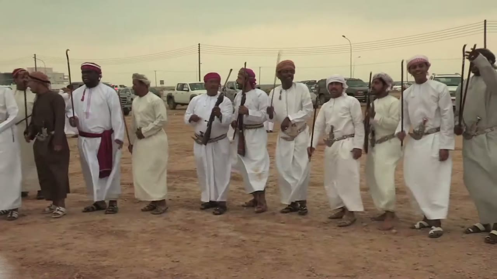
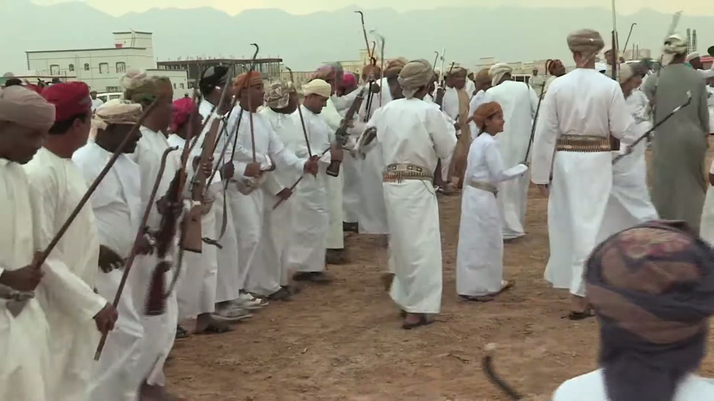
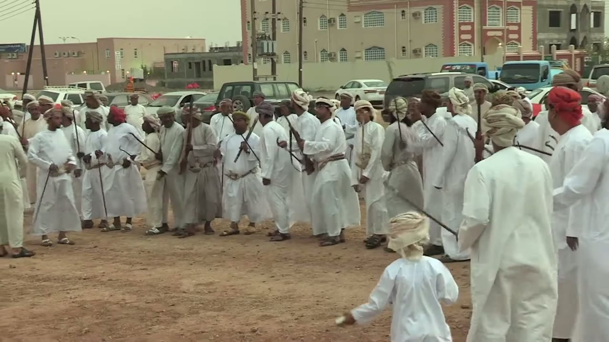
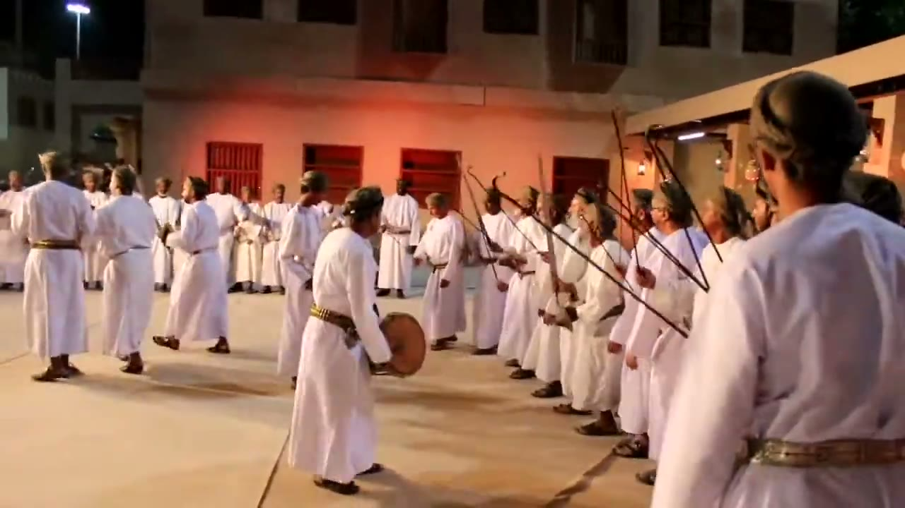
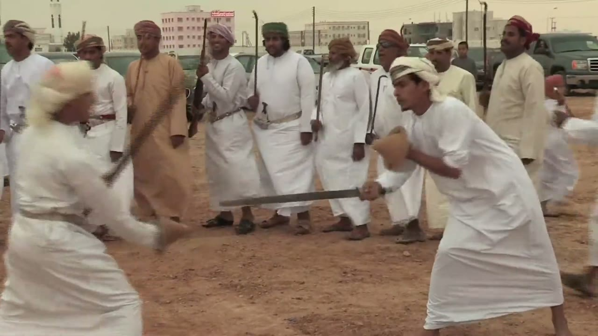
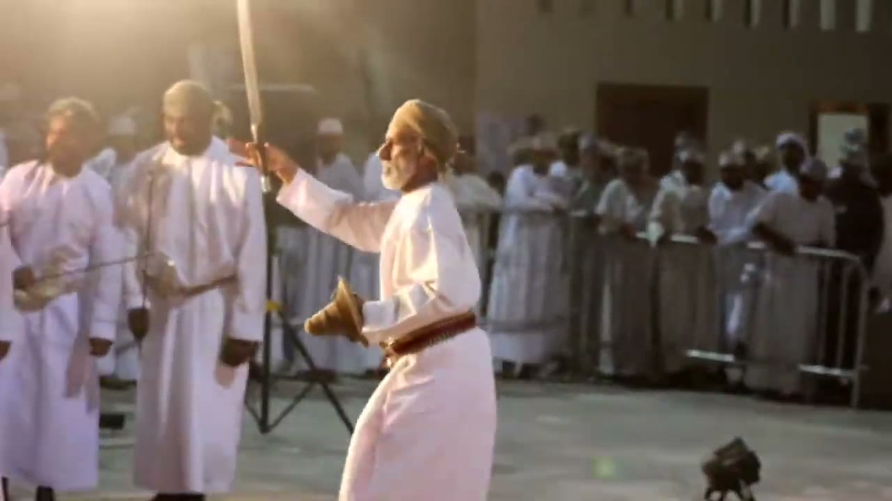
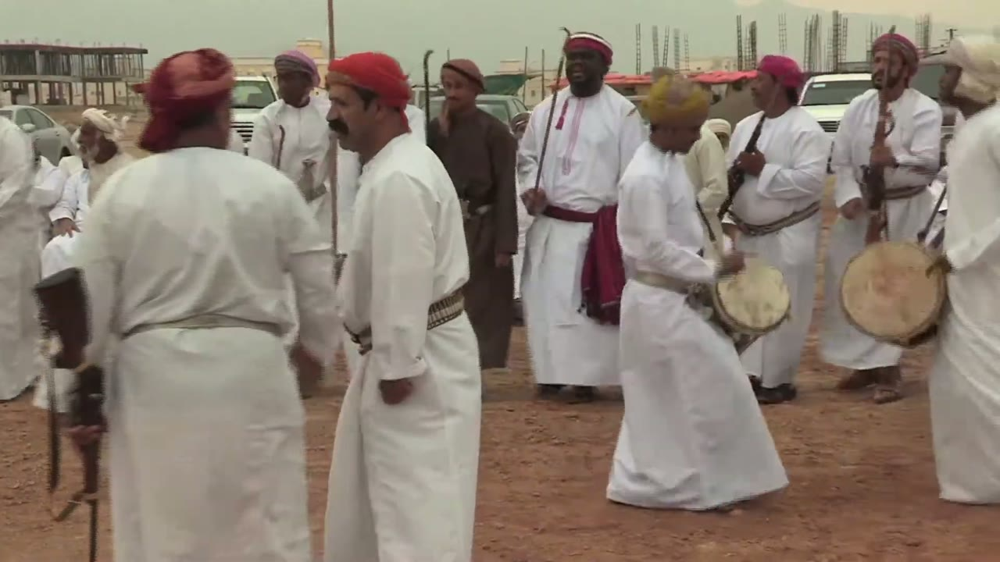
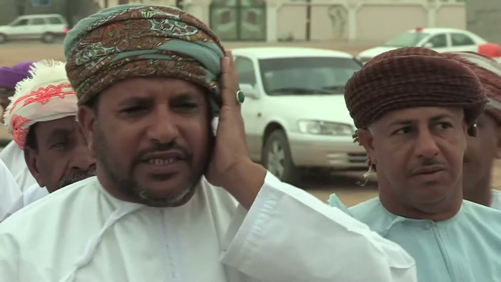
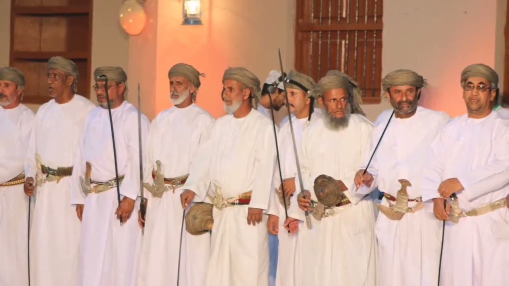
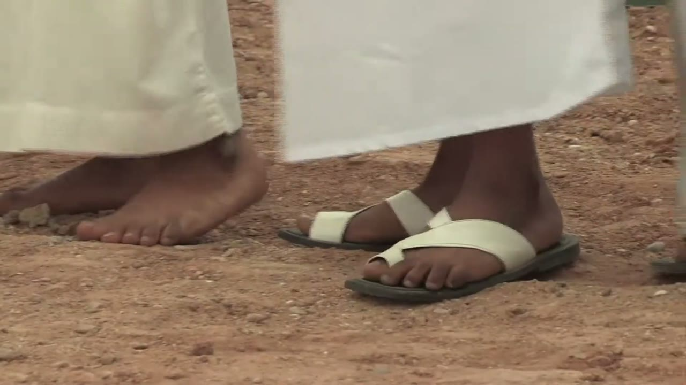

# Razha (الرزحة) reference keyframes

Reference for redrawing the Hikaya Razha animation (Oman). Made 2026-10-04 from three
YouTube videos (`sources.txt`). Ten keyframes, each a different pose or moment, picked
from 1,246 frames extracted at 1 per second (razha1 496, razha2 332, razha5 418). It also
carries timing measurements (see **Timing**).

**What this footage is.** Razha is the Omani form with swords, hooked canes, rifles and
frame drums, in which men form a line and dance in front of or along it. It is not
Al-Razfa (the UNESCO-listed performing art of the UAE and Oman, danced with wooden
replica rifles, per the UNESCO listing text at
`ich.unesco.org/en/RL/al-razfa-a-traditional-performing-art-01078`); none of the three videos is labelled Razfa and none shows wooden replica
rifles. razha1 and razha2 are two parts of one film of a Razha at a wedding in Sur, Oman,
as the Qatar Digital Library (QDL) description says (QDL spells it "Al-Raz-Ha");
razha5 is a festival troupe at the Muscat Festival. A leap, a sword tossed
and caught, and poetry traded between two groups were in the brief: **none of the first two
was seen, and the third could not be verified** (see **Timing** 4d and **Not covered**).

**How to read the descriptions.** They cover only what is visible in the frame. Where
something can't be read (which hand, blade direction, feet), the entry says so instead of
filling it in. When a performer's own left and right can't be told reliably, hands are
given by side of the frame ("frame-left hand"). Distances are relative ("shoulder to
shoulder", "an arm's length apart") unless a measurement is given with its method.
Nothing is transcribed or translated from the singing: I can't read words from the audio.
Timestamps are m:ss in the source video.

## Where everything is

| What | Where |
|---|---|
| Keyframes (10 JPG, 1280 px wide) | `keyframes/` next to this file |
| Source URLs and titles | `sources.txt` |
| Contact sheets: every 2 s, timestamp on each tile | Drive `C:\ai\projects\arabic-app\Hikaya dance reference\razha\contact_razhaN.jpg` |
| 30 s clips with audio | Drive, same folder, `clip_razhaN.mp4` |
| Analysis folder (LOG.md with every command and hand count, audio/motion outputs and plots, the helper scripts) | Drive, same folder, `analysis\` |
| Full videos and all 1 fps frames | Machine A only: `C:\media\dances\razha\` (`frames\razhaN\razhaN_tSSSSs.jpg`, SSSS = second) |
| In git | only this note, `sources.txt` and `keyframes/`, in `arabic-buddy`, `docs/reference/razha/` |

The video numbers skip 3 and 4 (downloaded, then not kept: see `analysis\LOG.md` on Drive).

## Clips

| Clip | Source span | What's in it |
|---|---|---|
| `clip_razha1.mp4` | razha1, 1:30-2:00 | 1:30-1:37 is a mid-shot of men carrying frame drums, one with his hand at the skin, over a drum-only track (no voices, by the spectrogram); voices come in at about 1:37.5. About 1:43-1:56 is a two-man sword-and-round-shield bout, filmed from the side; at about 1:56 the camera swings to men with rifles. I haven't listened to it; its audio was analysed (see 4a) |
| `clip_razha2.mp4` | razha2, 0:42-1:12 | Camera behind and beside a long line of men in white, stepping in place shoulder to shoulder; the body-bob count (4b) was done inside this span (0:44-0:53); from about 1:10 the camera moves in among men with canes, one in a grey dishdasha bent over. Voices dominate the audio by the spectrogram. I haven't listened to it |
| `clip_razha5.mp4` | razha5, 6:12-6:42 | A row of men in white holding swords (6:12-6:19), a man with a round shield stepping out and back (about 6:13), a lone man seen from behind (6:20-6:27), then a man in profile raising a sword in one hand (6:27-6:29), then crowded pairs with swords and round shields (6:34-6:41). I haven't listened to it |

---

## 1. Formation: a line of men on open ground

`razha1_t0016s.jpg` · razha1 (Qatar Digital Library) at **0:16**

- Side-on, low view of a straight line of about 11 men standing and stepping on bare ground, facing the camera. Behind them are a road with a power line, parked cars and a flat, low skyline under a hazy sky.
- Costume: ankle-length white or cream dishdashas (one grey, one dark brown) with caps and turbans in red, brown, white and green. One man near frame-left has a maroon sash hanging at his front. Several men wear a wide belt with a curved dagger at the centre front.
- Held: two men near the middle hold rifles with wooden stocks upright against the body, muzzles up. Several others hold long thin canes upright, some with a hooked top. The man at the frame-right edge (grey dishdasha) holds a cane raised above his head.
- The men are mid-step, many with one foot lifted, in sandals. A few smile or have their mouths open.
- No swords are visible in this frame.

## 2. Two rows with canes and rifles angled forward

`razha1_t0196s.jpg` · razha1 at **3:16**

- Close view along one row, from its near end, of about eight men on the frame-left side facing frame-right. They hold long canes or rifles out in front at hip height, angled up and forward at roughly 45 degrees (not measured); hooked tops show at the top of the frame on several.
- A rifle with what looks like a red tassel hangs from the hands of a man in the middle of the row.
- Frame-right: a boy in a white dishdasha and cap walks through the gap. Two men in white with wide belts (one with rows of small loops) stand with their arms down. In the background a man in a grey dishdasha holds a hooked cane upright.
- Bottom-right foreground: the back of a head in a patterned turban and a hooked stick.
- Caps and turbans are red, brown, white and green. Most men look toward frame-right.

## 3. Loose crowd with canes pointing down

`razha2_t0292s.jpg` · razha2 (Qatar Digital Library) at **4:52**

- An open lot with parked cars and a pink-and-white apartment block behind. About 20 men in white or cream dishdashas stand in a packed, uneven group, in caps and turbans of red, white and tan.
- Most hold canes diagonally across the body, some tips pointing down and forward at about 45 degrees (not measured); one or two men appear to hold rifles.
- Foreground: a small boy in white with a tan turban, seen from behind, and a taller man's back filling the frame-right side.
- This is the loose throng that razha2 shows from about 2:00 to 5:08, rather than the straight line of keyframe 1.

## 4. Night: a row side-on, a man with a hand drum facing it

`razha5_t0300s.jpg` · razha5 (Muscat Festival, troupe of Al Amerat) at **5:00**

- A paved courtyard at night in front of a mud-coloured building lit orange, with red shutters and a lantern. Men in white dishdashas stand across the back; at frame-right a row of about 10 men is seen side-on from its near end, facing frame-left.
- The row holds thin rods or blades out in front at about chest height. They rise toward the upper left of the frame, the direction the men face, and cross each other. At least one has a hooked top. At this size I can't tell a cane from a blade.
- At frame-left a man in white with a wide gold-and-brown belt stands with his back half turned, holding a round hand drum at hip height with the skin facing frame-right (drum at about x 540-600, y 440-530 in the 1280 x 720 frame). No stick is visible.
- A man in white with a tan cap, seen from behind, fills the frame-right edge.

## 5. Sword and round shield: a crouched lunge

`razha1_t0107s.jpg` · razha1 at **1:47**

- Two men face each other on the open ground in front of the standing line. The one at frame-right wears a white headcloth and a white dishdasha; his torso leans forward about 35 degrees from vertical toward frame-left (+-8, read off the 1280 px frame, see `analysis\LOG.md`), knees bent, feet below the bottom of the frame.
- He holds a straight, wide, grey blade out in front at hip height. It is nearly level (about 4 degrees, +-3), about 350 px long in the 1280 px frame, with the hilt hand at frame-right and the tip toward frame-left. A small rounded tan object sits in front of his chest in his other hand; it looks like the small round shield seen in razha5 but is seen from the side, so I can't confirm it.
- The man at frame-left is blurred by motion: cream turban, white dishdasha, his arm swinging forward and down with a long dark-grey shape across his body that is probably a blade. It isn't readable.
- Behind them about nine men stand in a row facing the camera, holding canes and rifles upright, with daggers at their belts, in white with one in tan; caps and turbans are red, white and green.
- Sword and shield only appear on these two men in razha1 (about 1:43 to 1:56).

## 6. Sword raised in one hand, shield at the hip

`razha5_t0389s.jpg` · razha5 at **6:29**

- An older man with a white beard, a tan cap and a white dishdasha, in profile facing frame-left, stands in an open space with a barrier and a crowd of men behind him.
- His arm is raised: the hand at about (365, 215) in the 1280 x 720 frame grips the hilt, the pommel shows below the fist, and the pale, slightly curved blade rises to the top edge of the frame, tilted about 5 degrees from vertical toward frame-left (+-4). It is cut off by the frame top, so its length is not read.
- His other hand holds a round tan shield with a conical boss at his hip (about x 440-525, y 400-495). A wide belt with rows of small loops circles his waist.
- At frame-left another man in white holds a sword low, blade nearly level toward frame-left, and a camera tripod stands between them.
- At native 30 fps (6:28.1 to 6:29.0) the hand stays on the hilt in every frame; see Timing 4d.

## 7. Frame drum at the hip, hand at the skin

`razha1_t0091s.jpg` · razha1 at **1:31**

- Mid-shot of the men in front of the standing line. At centre-right a man in a white dishdasha and a yellow turban bends toward a frame drum carried at hip height, its pale, yellowish skin with brown mottling facing frame-right and a dark rim. His striking arm comes from the frame-left side of the drum; the hand is blurred. In neighbouring frames (1:30.6 to 1:30.8, 1:31.4 to 1:31.6) a thin stick shows across the skin in his hand.
- At the far frame-right edge another man carries a second, larger frame drum at the hip, skin facing the camera, with a rifle with a wooden stock beside him.
- Foreground: two men in white face each other, one seen from behind in a red-and-white turban, the other with a black moustache, a red cap and a belt with rows of small loops.
- Behind them stand men with canes upright (one in white with a maroon sash holding a thin cane) and a man in a brown robe. A man at the frame-left edge holds a rifle muzzle-down.

## 8. The man chanting, hand cupped at the ear

`razha1_t0264s.jpg` · razha1 at **4:24**

- Close-up of a man with a dark moustache and beard, a green, teal and brown patterned turban, and a white dishdasha. His mouth is open. The hand on the frame-right side of his face is cupped flat against his ear; a ring with a green stone shows on it.
- Around him: a man in a maroon cap and a teal shirt at frame-right, looking toward frame-left; at frame-left a man in a white turban with red embroidery. Parked white cars and a gravel lot are behind.
- The same man is shown in close shots from about 4:20 to 5:32, with a white-bearded man in a striped shawl beside him from about 4:48 (sheet p03). No microphone is visible. I can't tell what he sings or says.

## 9. Costume close: belts, daggers, swords, shields

`razha5_t0068s.jpg` · razha5 at **1:08**

- A row of nine older men stands shoulder to shoulder, seen from the waist up, in a lit courtyard with a wooden shutter and an orange wall behind.
- Costume: white dishdashas with a plain round neck; grey-green cloth wound as turbans with the end hanging at the side; wide belts decorated with silver thread and red, green and blue stripes; and, at the centre front of each belt, a curved dagger with a silver sheath and the hilt end up.
- Swords: thin dark blades hang point-down from hands at belt height on at least four men. One man, second from frame-right, holds his blade diagonally up toward the frame-right (hand about (913, 433), tip about (987, 280): roughly 25 degrees off vertical, +-6).
- Round tan shields with a woven or ridged look are held against the belt on two men (about x 470-530, y 515-590 and x 790-860, y 440-520 in the 1280 x 720 frame).
- At least one man has his mouth open; the others look in different directions.

## 10. Feet: bare and in sandals

`razha1_t0180s.jpg` · razha1 at **3:00**

- Ground-level close-up: on bare red-brown gravel a bare foot stands flat with the toes spread, beside a foot in a white leather sandal with straps over the toes and the instep and a dark grey sole.
- The white dishdasha hems hang to the ankle and don't touch the ground.
- In the surrounding strip (2:48 to 3:00, 5 fps) the men's feet move in small steps with heels lifting. Some are barefoot and some in sandals. I can't read a step pattern from it.

---

## Timing

Every figure below is in `analysis\LOG.md` (on Drive) with its command and raw output.

**Method.** Audio: `audio.py` (percussive onsets after harmonic/percussive separation, 30 s stretches, absolute video time), `tempotrack.py` (12 s windows, 6 s hop) as a lead. Picture: `strip.py` strips at 3 to 10 fps and at native fps (25 fps for razha1 and razha2, 30 fps for razha5), `motion.py`, and two helper scripts of my own kept in `analysis\` (`bob.py`: vertical shift of a region by phase correlation; `slitscan.py`: one pixel column per frame, stacked in time). Resolution: audio onset times are resolved to about 6 ms (the script steps 256 samples at 44.1 kHz); a time read off the picture is good to one frame (40 ms at 25 fps, 33 ms at 30 fps). Durations read at 4 to 10 fps strips are good to about +-100 to 250 ms, so they are quoted as "about". "Core intervals" below are the onset-to-onset gaps between 150 and 330 ms, which drops doubled onsets and missed strokes; the share of gaps that are core is given.

**What the audio is.** razha1 and razha2 are field recordings made at the event, with voices, a crowd and frame drums together. razha5 is a festival recording with a loud chorus and a microphone on the stage. Onsets are counted from sound, so each stretch mixes drum, voice and hand events; the table says how far each can be trusted.

### 4a. Strokes (what is struck: frame drums with a thin stick, razha1 1:30 to 1:33; the others not matched to a striker)

| Video, stretch | Onsets (n) | Median gap, all (IQR, SD) | Core gaps: n (share), median, SD | Stable when weak onsets are dropped? | Strongest autocorrelation lag |
|---|---|---|---|---|---|
| razha1 1:00-1:30 | 101 | 258 ms (238-293, 125) | 68 (68%), 255 ms, 21 | yes, 258 / 267 ms at two prominence levels, then doubles to 470 ms | 731 ms (r 0.50) |
| razha1 1:30-2:00 | 94 | 255 ms (238-325, 126) | 64 (69%), 252 ms, 23 | yes, 255 / 261, then 447 | 731 ms (r 0.52) |
| razha1 2:00-2:30 | 103 | 250 ms (216-271, 205) | 59 (58%), 250 ms, 26 | yes, 250 / 267, then 464 | 731 ms (r 0.63) |
| razha1 3:36-4:06 | 111 | 250 ms (226-273, 111) | 70 (64%), 249 ms, 21 | yes, 250 / 273, then 470 | 720 ms (r 0.64) |
| razha1 1:30-1:37.3 (drum only, no voices) | 26 | 255 ms (226-261, 87) | 20 (80%), 253 ms, 19 | not tested (too few) | not run |
| razha2 1:00-1:30 | 108 | 203 ms (177-357, 149) | 57 (53%), 191 ms, 32 | **no**: 203, then 447, then 714 ms | 714 ms (r 0.51) |
| razha2 2:40-3:10 | 102 | 203 ms (180-354, 163) | 57 (56%), 180 ms, 23 | **no**: 203, then 531, then 708 ms | 702 ms (r 0.57) |
| razha5 1:36-2:06 | 155 | 168 ms (128-261, 70) | 85 (55%), 261 ms, 42 | partly: 168, then 261, then 531 ms | 267 ms (r 0.53) |
| razha5 4:18-4:48 | 129 | 261 ms (139-284, 104) | 77 (60%), 273 ms, 48 | partly: 261 / 279, then 441 | 279 ms (r 0.46); 557, 836, 1115 ms nearly as strong |

Stretch spans are in the video's own clock: razha1 60-90, 90-120, 120-150, 216-246 s; razha2 60-90, 160-190 s; razha5 96-126, 258-288 s. Percussive share of the sound (the script's energy split) is 0.40, 0.21, 0.28, 0.29 for razha1 (low means voices dominate), 0.13 and 0.14 for razha2 and 0.21 and 0.12 for razha5.

**Reading it.**
- **razha1: a steady stroke about 250 ms apart (about 240 BPM).** The core median is 249 to 255 ms in all four stretches (span 60 to 246 s of the film), and the audio pulse search locks onto 241 to 245 ms (phase-lock R 0.55 to 0.76; the 60-90 s stretch picked 122 ms, half of it, with R 0.63 against 0.64 for 245 ms). The strokes are mostly evenly spaced. In 1:30 to 1:35 the script's interval list reads, in pulses of 245 ms, "1 1 1 1 2" three times: four even strokes, then a gap of two pulses (one stroke missing), a cycle of about 1470 ms. Later in the stretches the list is irregular and the script finds no pattern that repeats at the 85% level. The strongest autocorrelation lag is 720 to 731 ms in all four stretches, which is three strokes.
- **razha2: no stroke pulse established.** The percussive share is 0.13 to 0.14 (chant dominates the spectrogram) and the median gap jumps from 203 to 447 to 714 ms as weak onsets are dropped, which is the pattern the script warns about for voice. What is repeatable is an accent about 710 ms apart: autocorrelation 702 to 714 ms in both stretches, and `tempotrack` finds 697 to 720 ms (mean 706 ms) in 31 of the 46 windows between 0:30 and 5:14 (windows whose strongest lag is 690 to 730 ms with r of at least 0.5). The 180 to 191 ms core gaps could be hand events or voice and are not reported as a stroke.
- **razha5: gaps of about 260 to 280 ms, not matched to a striker.** The core median is 261 and 273 ms, and the autocorrelation peaks sit at 267 to 279 ms and its multiples up to 1115 ms (`tempotrack`: strongest lag 1115 to 1126 ms in 16 of the 58 windows between 1:00 and 6:54, with r of at least 0.5). The sound is a dense chorus, the low band finds more onsets than a drum would play (218 in 30 s, median gap 133 ms in 4:18-4:48), and no striker was matched in the picture (one man holds a round hand drum at 5:00 but no stick is visible). It might be a drum or hand claps; I can't tell.

**Is it the instrument? (razha1 1:30 to 1:37.3.)** The spectrogram of 1:30-2:00 shows only vertical broadband bursts, with energy down to the low band (below about 300 Hz), until about 1:37.5, then voices appear as gliding harmonic stripes from about 700 Hz upward. So 1:30-1:37.3 is a drum-only stretch (26 onsets, core median 253 ms, SD 19 ms), and the picture shows a man carrying a frame drum at hip height with his hand and a thin stick at its skin (keyframe 7). Elsewhere in razha1 the voices are present and the onset list includes voice events, which is why "all gaps" SDs are large and the core gaps are given beside them.

**Visible-strike cross-check (razha1 1:30.4 to 1:33.0, native 25 fps, crop of the drum).** I looked at every frame around 7 of the audio onsets (90.447, 90.708, 90.958, 91.184, 91.445, 91.933, 92.194 s; strips `vz1_A`, `vz1_B`, `ons_r1_a`). In all 7 the player's hand or stick is at the skin or just above it in the frame within one frame (40 ms) of the onset, with motion blur in the neighbouring frames. **I could not isolate the single frame of contact** (the drum swings with his walking, the hand blurs, and the thin stick is lost against white cloth), so these are not 8 to 10 independent contact times, and I don't give visible-strike intervals. A computed check on the same crop (`handmotion.py`, frame differences, 1:30 to 1:34) finds 10 motion peaks against 13 audio onsets in the same 4 s. Their median gap is 320 ms (IQR 320 to 400) against about 255 ms for the audio: the picture and the audio do **not** agree on the interval, because fast strokes 250 ms apart blur into one arm movement. They do agree on timing: the mean distance from an onset to the nearest motion peak is smallest with no shift (73 ms at 0, against 81 at -40 ms and 77 at +20 ms), and the median lag is -5 ms (IQR -59 to +52 ms). So I see no audio-to-picture offset larger than one frame. razha2 and razha5: 0 strikes seen (no striker visible).

### 4b. The main repeating movement: the body rising and falling as the men step

The men in the lines step in place and the body rises and falls about once per step. razha2 (a steady wide shot from behind the line, then a handheld camera) gave the clearest picture.

| Video, stretch | Method | Result |
|---|---|---|
| razha2 0:44-0:47.4 and 0:49.4-0:52.8 (belt line of one man in a slit-scan) | hand count of crests, 25 fps | 5 intervals: 0.83, 0.60, 0.72, 0.77, 0.74 s. Mean **0.73 s**, SD 0.085 s, range 0.60-0.83 s. The crests in 49.4-52.8 are at about 50.11, 50.83, 51.60, 52.34 s (3 clean intervals: 0.72, 0.77, 0.74). In 44.0-47.4 one crest (near 46.5 s) is hidden by a passing figure, so only 2 clean intervals |
| razha2 0:42-1:06 | `bob.py` FFT of vertical shift | strongest lines at 737 ms (rel. 1.0) and 715 ms (0.85); also 3040 and 2702 ms |
| razha2 3:25-3:50 | `bob.py` FFT | 703 ms (0.90); the strongest line is 2813 ms |
| razha2 2:30-2:55 and 3:56-4:16 | `bob.py` FFT | no 700 ms line; strongest are 2813 ms and 2897 ms |
| razha2 0:36-1:06 | `motion.py` energy | peaks at 1430 ms (n=20 cycles, mean 1430, median 1400, SD 221 ms) = twice the 715 ms movement frequency, as expected for energy |
| razha2 0:30-5:14 (audio) | `tempotrack` autocorrelation | 706 ms mean, 697-720 ms, in 31 of 46 windows (strongest lag 690-730 ms, r of at least 0.5; mean r 0.60) |
| razha1 0:36-7:48 (audio) | `tempotrack` autocorrelation | 731 ms mean, 720-743 ms, in 30 of 71 windows (strongest lag 700-760 ms, r of at least 0.5; mean r 0.66) |
| razha1 0:40-1:10 and razha5 4:57-5:11 | `motion.py` | no stable period (several men moving independently, camera moving); not used |

- **Period: about 730 ms** (razha2 hand count n = 5, mean 0.73 s, SD 0.085 s; the FFT lines at 703 to 737 ms and the audio accents at 706 ms (razha2) and 731 ms (razha1) all sit within 4% of it).
- **Strokes per movement cycle:** the picture period (razha2) and the stroke period (razha1) come from different videos, so this is only a ratio of the two audio figures in razha1: its 731 ms accent lag / 251 ms stroke is 2.9, i.e. about **three strokes** per 730 ms. Whether razha1's dancers bob at that period was not measured. razha2: not measurable (stroke level not established). razha5: not measurable.
- **An unresolved slower term.** A vertical oscillation of 2.7 to 3.0 s (FFT lines at 2813, 2813, 2897, 3040 ms) shows in all four razha2 stretches (about four movement cycles). I can't tell whether it is the dancers or the handheld camera, since the whole region shifts together.
- **Size: not measurable.** The up-down amplitude cannot be read as a fraction of body height: the camera is handheld and moves, the men overlap, and the region holds many men. razha1 and razha5 gave no usable cycle count either.

### 4c. Pose timeline: not produced

No stretch of 20 s or more shows one dancer or one group going through a named sequence of poses in a way I could label frame by frame. razha1 1:45.0-1:52.9 (10 fps) is one 8 s shot of the sword-and-shield man: the blade swings between low-forward and raised-diagonal during a crouched, barefoot lunge, but it is often hidden behind his body or blurred, and the shot is under 20 s. razha5 6:12-6:57 (4 fps) cuts between at least six different men or groups. razha1 and razha2 line shots hold many men at different moments. So **the order of poses, how long each lasts, and whether the sequence repeats are not measurable from this footage.**

### 4d. Sword in the air, and the leap

| Measure | Result |
|---|---|
| Sword tossed and caught: n tosses, air time | **none seen (n = 0)**, air time not measurable. Checked at native 30 fps: razha5 6:27.6-6:29.0 (the only candidate, a man looking up with a raised sword: the hand grips the hilt in every frame, the blade stays above the fist), razha5 6:18.8-6:20.0 (a man raises a round tan object on his raised arm from 6:19.0 to about 6:19.7; it stays in his hand), razha5 6:56.0-6:57.0 (a man swings a blade in a wide arc; no release seen). Also at 4 fps: razha5 6:12-6:57; at 5 fps: razha1 1:43-2:03 |
| Leap: n leaps, air time, height | **none seen (n = 0)**, not measurable. No frame shows both feet clearly off the ground. Native 25 fps: razha1 2:12.0-2:13.9 (a man steps forward with a rifle raised, one foot always on the ground), razha1 0:41.0-0:42.9 (a boy dances in front of the line); 5 fps: razha1 0:12-0:22, 0:40-0:50, 2:48-3:00 (and 10 fps, 1:45-1:53); razha2 2:06-2:14, 3:50-3:58 |
| Swords at all | razha1: one bout, about 1:43-1:56 (sword and round shield); razha5: many men from 0:08, rows with swords at 1:00-1:36, 2:12-3:13, 4:19-5:07 and 6:12-6:57. razha2: canes and rifles only |
| Limit | most of each video was scanned at 4 s (contact sheets) or 0.2 to 0.5 s (strips) spacing, so a toss or jump shorter than that could be missed outside the stretches checked at native frame rate |

### 4e. Proposed animation constants

| Constant | Value | Evidence | Confidence |
|---|---|---|---|
| `BEAT_MS` | not measurable | no pose timeline could be made (4c) | n/a |
| `STROKE_MS` | about **250 ms** (240 BPM); about three strokes per 730 ms accent (razha1 audio only) | razha1, audio only: core median gap 249, 250, 252, 253 and 255 ms in five stretches between 1:00 and 4:06 (SD 19 to 26 ms), pulse search 241-245 ms. A visible-strike check agrees on timing to one frame but did not isolate contact frames and did not agree on the interval (motion peaks 320 ms). razha5's 261-273 ms gaps are similar but not matched to a striker; razha2's stroke level was not established | medium (one video, one method plus a partial picture check) |
| `MOVE_PERIOD_MS` | about **730 ms** | razha2 hand count at 0:44-0:47.4 and 0:49.4-0:52.8, n = 5 (mean 732, SD 85 ms); FFT lines 703-737 ms in two razha2 stretches; audio accents 706 ms (razha2) and 731 ms (razha1). The picture count is from one stretch of 9 s and the range is 600 to 830 ms | medium |
| `MOVE_SIZE` | not measurable | handheld camera, overlapping men, no body-height reference (4b) | n/a |
| `SEQUENCE` | not measurable | no pose timeline (4c) | n/a |
| `SWORD_AIR_MS` | not measurable | no toss in the footage (4d) | n/a |
| `LEAP_AIR_MS`, `LEAP_HEIGHT` | not measurable | no leap in the footage (4d) | n/a |

---

## Not covered by these frames

- **A sword tossed and caught: not in the footage.** No release was seen in any frame checked at native frame rate (4d). The one candidate (razha5 6:28) is a sword raised in one hand and held there.
- **A leap: not in the footage.** No frame shows both feet clearly off the ground (4d). The stepping and the lunges are the only large movements seen.
- **Poetry traded between two groups: not verified.** razha1 shows one man chanting with his hand cupped at his ear (4:20-5:32, keyframe 8) and razha5 shows a man at a microphone stand (about 4:16-4:22) with rows of men behind. I did not see two groups taking turns, and I did not transcribe or translate any words. The Qatar Digital Library description of razha1 and razha2 says a poet for each row improvises lines and one row sings several verses before the other takes over; that is the uploader's text, not something checked against the picture here.
- **Swords are thin in the footage.** razha1 has one sword-and-shield bout (about 1:43-1:56) and razha5 has many men with swords, but razha2 shows canes and rifles only. razha1 is mostly canes, rifles and frame drums; razha2 canes and rifles.
- **Feet** are seen only in razha1's ground-level shots (about 2:48-3:08, keyframe 10) and in the 1:45-1:53 bout. In the line shots the dishdashas cover the ankles and many frames are cropped at the knee.
- **Audio.** Stroke timing is from razha1 only. razha2's audio is chant-dominated (no stroke pulse established) and razha5's gaps are not matched to a striker. All audio is field or festival sound with voices on top; the spectrograms show drum and voice with no sign of laid-on studio music, but I have not listened to any of it.
- **One picture measurement of the movement.** The 730 ms body-bob period comes from one 9 s stretch of razha2 (5 intervals, range 600-830 ms) plus audio. A slower 2.7-3.0 s oscillation in razha2 could be the dancers or the handheld camera; I couldn't separate them. The size of the movement is not measured.
- **No pose timeline and no pose order.** The poses seen (the line stepping, the sword-and-shield lunge, the sword raised in one hand) never run in a measurable sequence in the footage.
- **Not a whole staged performance.** razha1 and razha2 are two parts of one film of a wedding Razha filmed at dusk; razha5 is a short festival item that cuts between groups and angles. No wide, steady shot shows both rows and the drummers together for 20 s.
- **Two rows facing each other** are not clearly shown in any frame I checked. The QDL text describes two long rows facing each other; razha1 and razha2 are filmed from one side or from behind, and razha5 at about 4:24-5:08 (night) shows one long row with men in front of it.
- **No official broadcast footage.** The one Oman TV programme on Razha found (16 Sep 2018, 20 min) is a studio discussion with Razha shown only in a small inset under a caption bar, so it wasn't used. razha1 and razha2 are from the British Library / Qatar Foundation Partnership Project; their description asks users to respect the creators and the traditional cultural expressions and points to the British Library's ethical usage policy. razha5 is from an individual's channel.

