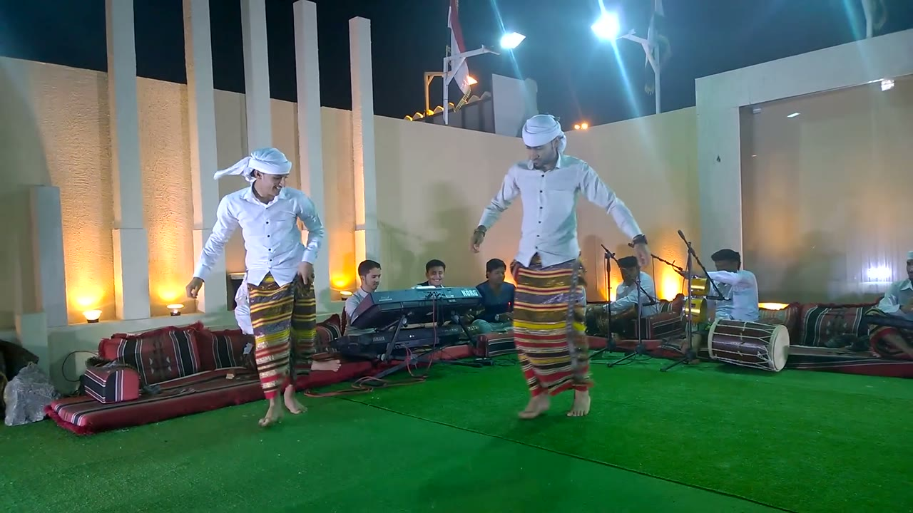
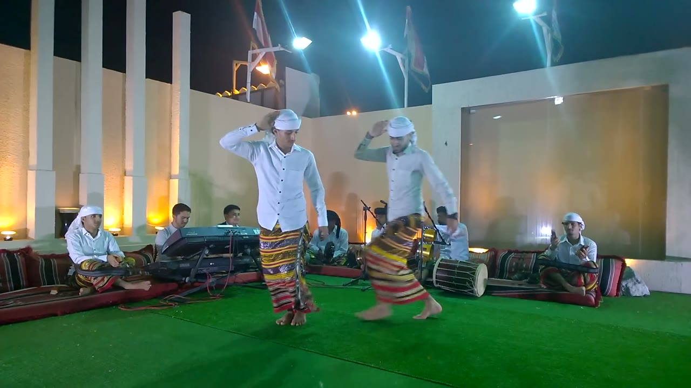
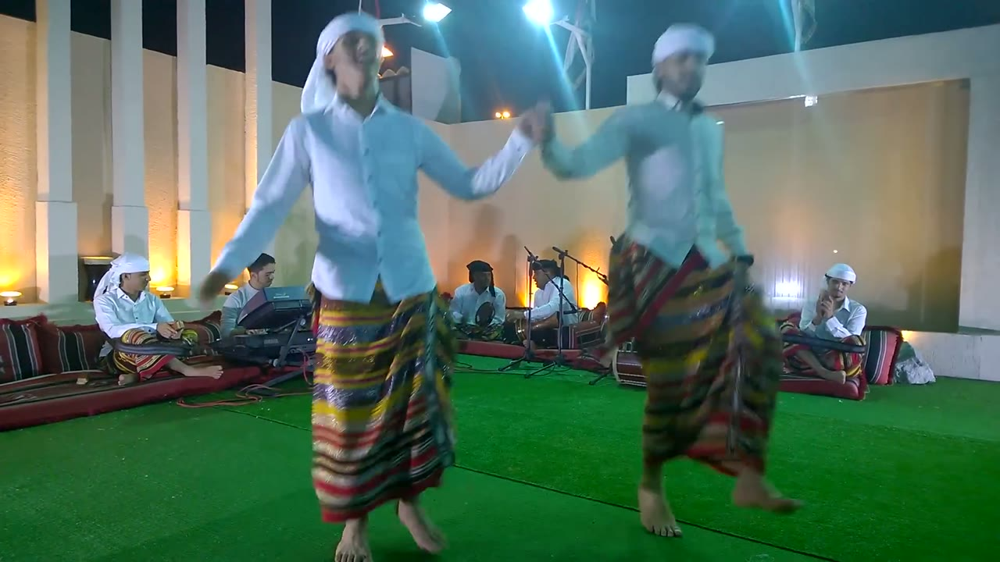
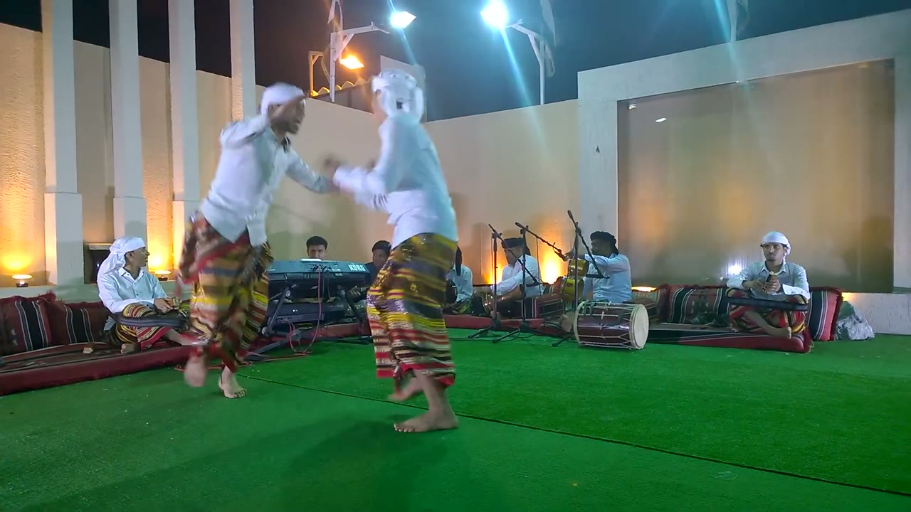
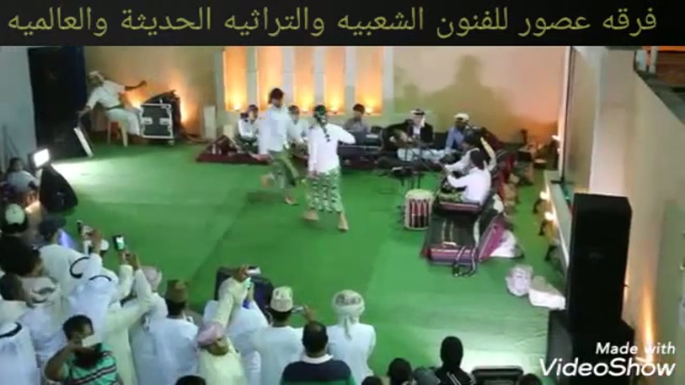
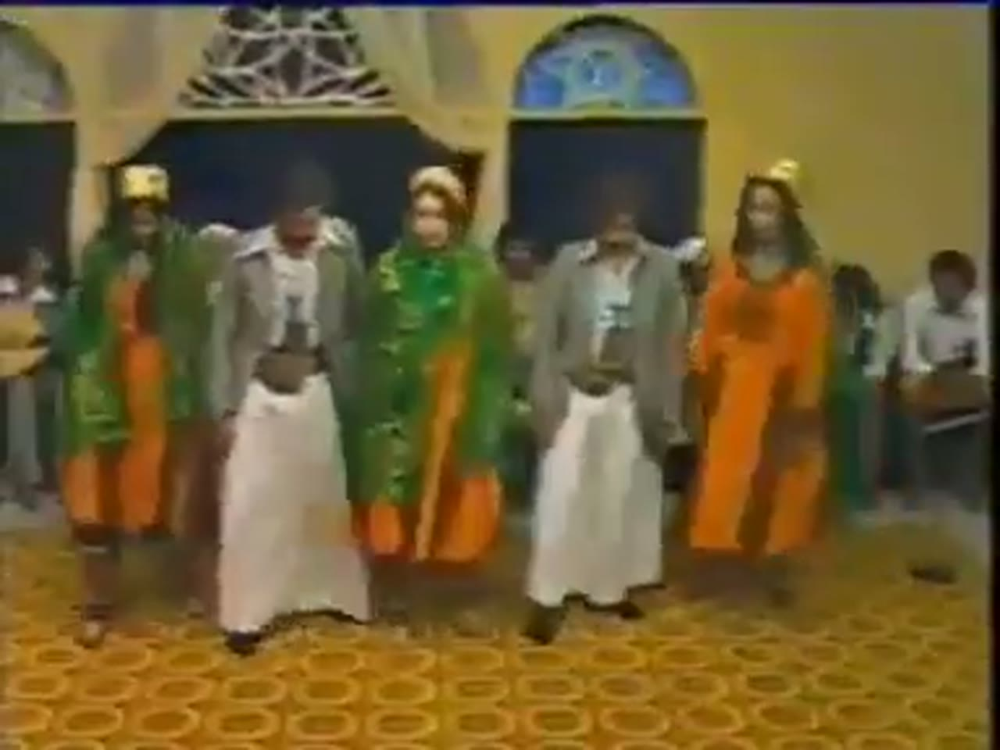
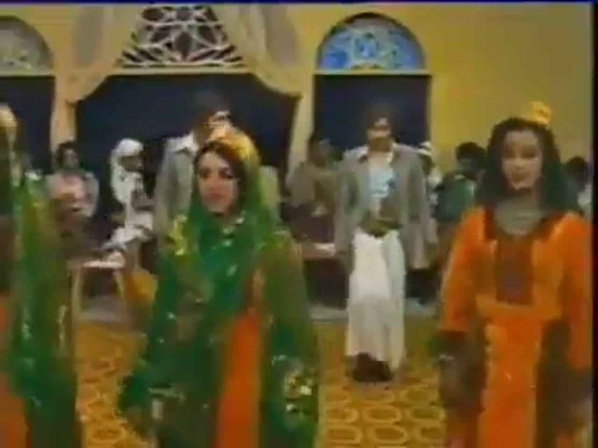
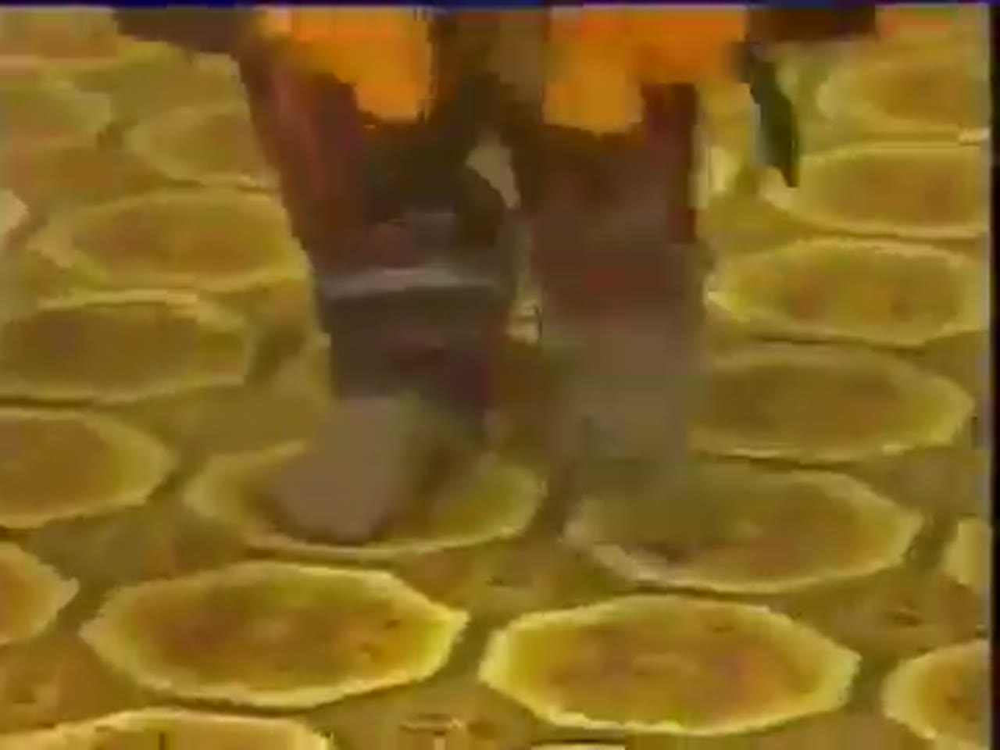
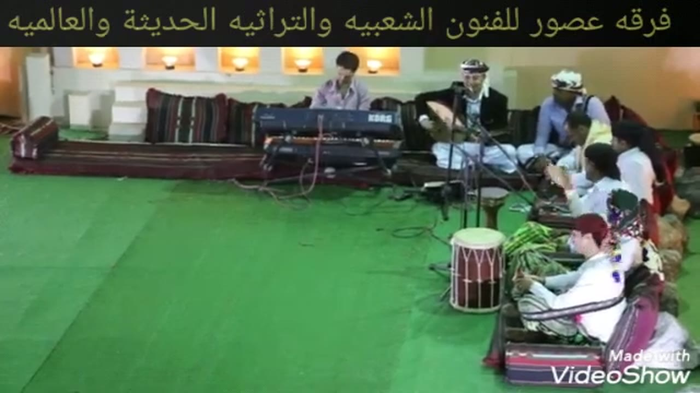
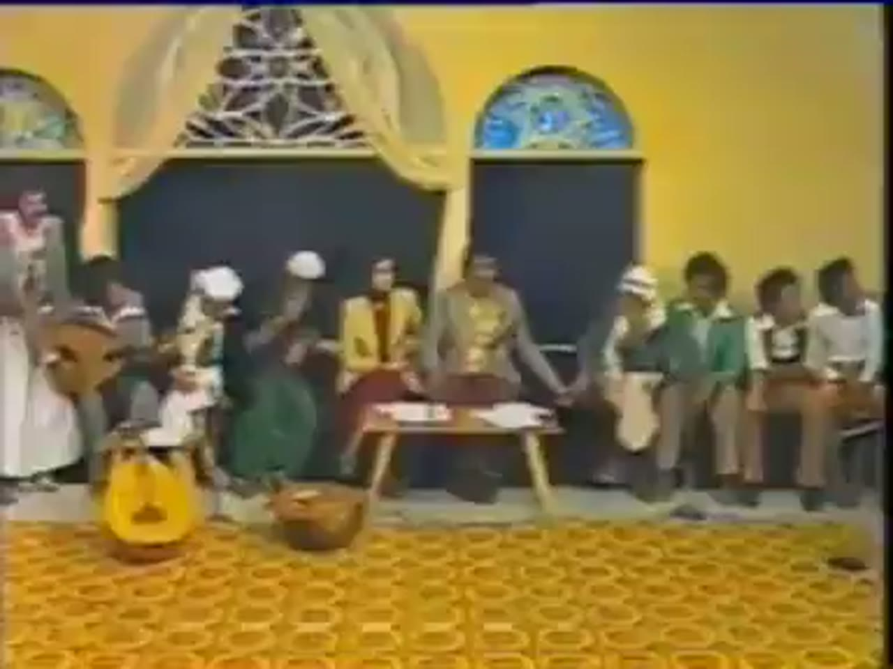

# Sana'ani dance (الرقص الصنعاني) reference keyframes

Reference for redrawing the Hikaya Sana'ani dance animation. Made 2026-10-04 from three
YouTube videos (`sources.txt`). Ten keyframes, each a different pose or moment, picked
from 912 frames extracted at 1 per second. It also carries the timing measurements
(see `## Timing`).

None of the three videos is an official institutional upload, and none is a clean full
performance by a named Yemeni troupe: sanaani8 is a hand-held clip of two men dancing in
front of a band, sanaani6 is a clip from a channel named after a troupe, the same kind of scene filmed from above
with a crowd, sanaani5 is an old TV-studio recording (uploader's date: 1980s) with men and
women. Everything below is what the frames and sound show; where the footage doesn't show
something, the entry says so.

**How to read the descriptions.** They cover only what is visible in the frame. Where something
can't be read (a hand, what a seated man holds, who is singing), the entry says so instead of
filling it in. When a dancer's own left and right can't be told reliably, hands are given by
side of the frame ("frame-left hand"). Distances are relative (shoulder widths of the nearer
man, measured by eye on the frame with a pixel grid, about +-15 %), never metres, because
nothing of known size is in the picture. Women appear only in sanaani5, a staged TV-studio
dance; for them only costume, formation and movement are described. Every figure in `## Timing`
names its video and timestamps; the working log is `analysis/LOG.md` on Drive.

## Where everything is

| What | Where |
|---|---|
| Keyframes (10 JPG, 1280 px wide) | `keyframes/` next to this file |
| Source URLs and titles | `sources.txt` |
| Contact sheets: every 2 s, timestamp on each tile | Drive `C:\ai\projects\arabic-app\Hikaya dance reference\sanaani\contact_sanaaniN.jpg` (N = 5, 6, 8) |
| 30 s clips with audio | Drive, same folder, `clip_sanaaniN.mp4` |
| Analysis folder: `LOG.md`, audio and motion outputs, onset csvs, frame strips, helper scripts | Drive, same folder, `analysis\` |
| Full videos and all 1 fps frames | Machine A only: `C:\media\dances\sanaani\` (`frames\sanaaniN\sanaaniN_tSSSSs.jpg`, SSSS = second) |
| This note, `sources.txt` and the keyframes in git | `arabic-buddy` repo, `docs/reference/sanaani/` (contact sheets, clips, videos and analysis are not in git) |

File numbers are not contiguous (5, 6, 8) because the other downloaded candidates were
dropped; the reasons are in `analysis/LOG.md`.

## Clips

| Clip | Source span | What's in it |
|---|---|---|
| `clip_sanaani8.mp4` | sanaani8, 2:42-3:12 | Hand-held shots of the two men: stepping side by side with arms low (2:44.7-2:49.9), then at close range from 3:03 circling and passing each other. I haven't listened to it; the audio measurement for 2:42-3:06 is in `## Timing` |
| `clip_sanaani5.mp4` | sanaani5, 1:40-2:10 | Starts on close shots of feet (1:40 to about 1:47), then the row of five dancers in the studio set stepping in place. I haven't listened to it |
| `clip_sanaani6.mp4` | sanaani6, 1:24-1:54 | The band at the back wall, then one man in white crossing the floor alone (about 1:35-1:47) and a pair of men dancing from about 1:50. The crowd, banner and watermark are in shot. I haven't listened to it |

---

## 1. Formation: the pair in front of the band, courtyard at night

`sanaani8_t0005s.jpg` · sanaani8 (Afzal Plus) at 0:05

- Open-air courtyard at night: pale walls with columns, floodlights, a green turf floor, cushion seating along the back wall. Hand-held camera, wide shot.
- Two men dance in the middle of the floor, side by side. Their body centres are about 2.6 shoulder widths apart (390 px between centres, 152 px shoulder width, on the 1280 px frame).
- The frame-left man is turned a quarter toward the other; the frame-right man faces the camera with both arms hanging and slightly out from his sides.
- Costume, both: white long-sleeved buttoned shirt, white head cloth wound round the head (the frame-left man's has a loose end hanging at the side), a wrap-around skirt in horizontal stripes of yellow, red, blue and black reaching about mid-shin, bare feet. I see no dagger and nothing held in their hands.
- Behind them along the wall, the band is seated: two keyboards on a stand (the upper one reads "KORG"), three young men behind it, a rope-laced barrel drum with pale heads standing on the floor at frame-right of centre, and at frame-right a man in white seated by two microphone stands, with a stack of gold-coloured discs on a stand beside him. Further left and right, seated men in white head cloths. Who is singing can't be told from the frame.

## 2. Pose "hand to head"

`sanaani8_t0070s.jpg` · sanaani8 (Afzal Plus) at 1:10

- Same two men, same costume, now closer together than in keyframe 1: about 1.2 shoulder widths between body centres (read by eye, +-20 %), facing the camera.
- Both do the same thing: the frame-left hand is raised to the side of the head cloth, with the elbow out and bent and the palm against the cloth (confirmed on a zoomed crop of 1:10.0). The other arm hangs. They copy each other with the same hand; they do not mirror.
- Knees are slightly bent and they are mid-step; which foot is down can't be read at this size.
- The band sits behind unchanged: keyboards at the left, the rope-laced barrel drum at the right of centre, seated men in white head cloths at both ends.

## 3. Pose "hands joined"

`sanaani8_t0155s.jpg` · sanaani8 (Afzal Plus) at 2:35

- Camera closer; the men fill the frame from the knees up, still side by side.
- The frame-left man's frame-right hand is clasped with the frame-right man's frame-left hand. The two arms run out sideways and slightly down, the joined hands at about chest-to-waist height (zoomed crop at 2:34.4 shows the clasp). The free hands hang low at the sides.
- The frame-left man has his mouth open and his head up; the frame-right man looks ahead. Both are on bare feet mid-step.
- At 2:34.4 the body centres are about 1.6 shoulder widths apart, i.e. the two arms together span the gap. The pose holds from 2:34.2 to about 2:39.9.

## 4. Pose "arms out, circling" (close range)

`sanaani8_t0184s.jpg` · sanaani8 (Afzal Plus) at 3:04

- The men are now close together, turned toward each other; the frame-left man leans to frame-left with his head up, and the frame-right man's head cloth has loose ends flying.
- The forearms meet in the middle at about chest height; the hands are motion-blurred so I can't say whether they clasp. In another close frame (3:03.7) one man has an arm thrown out to the side and the other has both hands on his hips.
- Both skirts swing with the movement. Behind them are the keyboard players and, at frame-right, a seated man in a dark head cloth by microphone stands.
- This phase, with the partners circling and passing each other with arms out, runs about 3:03-3:17 in this video.

## 5. Same kind of scene from above, with a crowd (second troupe video)

`sanaani6_t0200s.jpg` · sanaani6 (Usur troupe's channel) at 3:20

- High camera at one end of a hall. A green turf floor in the middle; the band sits along the far wall with a keyboard and seated players; a rope-laced barrel drum stands on the floor at frame-right.
- Two men dance on the floor, mid-step, barefoot, about one body width apart. Both wear white shirts and green wrap-around skirts (the frame-right man's is patterned in white and green). The frame-right man, seen from behind, has a dark head cloth with a long braid-like tail hanging down his back and his frame-right arm out sideways at shoulder height; the frame-left man's head looks bare or covered in something dark (checked on a zoomed crop; it is only 360p).
- A crowd of men in white thobes and head cloths watches from the lower left; several hold phones up. A man sits on a chair at the far left, in white, with an arm raised.
- Top of the picture: a black banner with the troupe's name in Arabic (فرقه عصور للفنون الشعبيه والتراثيه الحديثة والعالميه). Bottom right: a "Made with VideoShow" mark.

## 6. Row of five in the studio set (men and women alternating)

`sanaani5_t0160s.jpg` · sanaani5 (YeMeN22MaY) at 2:40

- TV-studio set: yellow walls, a dark arched alcove, an arched window with blue glass, a carpet in a yellow-and-brown ring pattern. The picture is only 384x288 upscaled, so it is soft.
- Five dancers stand side by side in one row, centre to centre about 1.2 shoulder widths apart, bodies nearly touching. From frame-left: woman, man, woman, man, woman.
- Women: long orange dresses, two of them with a dark green shawl with gold-coloured decoration over the head and shoulders, all three with a small gold crown-shaped cap. Arms hang at the sides.
- Men: grey jackets over white shirts, a long white wrapped skirt down to the ankles, a curved dagger worn at the front of the belt, black shoes. Arms bent low in front, hands near the belt.

## 7. Costume close

`sanaani5_t0056s.jpg` · sanaani5 (YeMeN22MaY) at 0:56

- Three dancers fill the frame: a woman left of centre in a dark green shawl with gold sequins over an orange dress and a gold cap (another green-shawled dancer is cut off at the left edge), a woman at frame-right in an orange dress with a dark embroidered panel on the chest and a gold cap, and between and behind them a man in a grey jacket and a white skirt (his belt is out of frame).
- The shawl covers the head and shoulders and hangs down the front; the frame-right dress has long sleeves.
- Arms hang loosely. Seated spectators in the background, one in a white turban.

## 8. Feet, close

`sanaani5_t0100s.jpg` · sanaani5 (YeMeN22MaY) at 1:40

- Close shot of two feet and lower legs on the ring-patterned carpet, under the orange hem of a dress: dark red-brown trousers with grey-blue bands at the ankle, bare feet. The feet are flat on the floor, about a foot-length apart. They look bare or in soft grey footwear; I can't tell which.
- The dress hem and trousers are the women's costume of keyframes 6 and 7. Feet appear in several close-ups in this video (on the viewing sheets about 1:20-1:44, 2:16-2:36, 3:20-3:32 and 4:04-4:12); I tried a native-frame-rate strip of 1:24-1:26.5 and could not count steps on it.

## 9. The band close (second video): lute-type instrument, keyboards, drums

`sanaani6_t0030s.jpg` · sanaani6 (Usur troupe's channel) at 0:30

- Band seated along a wall on cushions, camera high. At the left a man in a purple-grey shirt sits behind two keyboards on a stand (the upper reads "KORG").
- Centre-right: a man in a black jacket and a white head cloth sits cross-legged holding a round-bodied, light-coloured lute-type instrument across his lap, with microphone stands in front of him. I can't see the strings or a plectrum at this size, and the picture doesn't show his picking hand.
- Beside him a man in a blue shirt and a white-and-black head cloth; to the right, more men in white or light shirts seated in a row from back to front. What they hold in their hands can't be read at this size.
- In front of the band: a rope-laced barrel drum with pale heads (red body) standing on the floor and a smaller drum on a stand behind it. No dancer is in frame.
- The top banner with the troupe's name and the "Made with VideoShow" mark are in shot. The first 10 s of this video are a logo animation; the band is on screen from about 0:10.

## 10. Musicians' corner in the studio set, before the dancers come on

`sanaani5_t0006s.jpg` · sanaani5 (YeMeN22MaY) at 0:06

- At the far left edge a man in a white robe holds a round-bodied lute-type instrument; men in white caps sit on the bench beside him. On the floor at bottom-left: a round yellow-orange object with a dark opening (it looks like the body of a lute set down) and a copper-coloured vessel beside it.
- In the middle, behind a low wooden table with papers, sit a woman in a yellow jacket and a man in a gold embroidered vest. At frame-right, young men in green shirts and tan trousers sit in a row watching.
- Behind: a carved wooden screen above an arched opening and a blue stained-glass window.
- No dancer yet. Who sings, and what is being struck, can't be told from this frame.

---

## Timing

**Method.** Audio: `audio.py` (percussive onsets, 5.8 ms resolution, prominence 0.35), `tempotrack.py` (12 s windows, 6 s hop) to find steady stretches, and a small helper `fold.py` that folds the percussive onsets modulo a period and finds the period with the best phase lock R (1.0 = perfect). Movement: `motion.py` does not work here (all three videos are hand-held and the camera re-frames the dancers all the time; see below), so I used a helper `flowtrack.py` (optical flow of a box on one dancer, camera motion subtracted). Poses: 10 fps strips read by eye, then `timeline.py`. Resolution: hand-labelled pose changes are +-100 ms, so durations are quoted "about"; onset times about +-6 ms (one analysis hop). Every number below is in `analysis/LOG.md` (Drive) with its command; the helper scripts are in `analysis/` too. Pose analysis was done on sanaani8 only; the other two videos have audio and movement measurements but no pose timeline.

### 4a. Strokes (the percussive pulse under the song)

audio.py, percussive-onset row, and the folded pulse, per stretch (m:ss absolute video time):

| Video | Stretch | n onsets | median interval ms | BPM from median | IQR ms | SD ms | folded pulse ms (R) |
|---|---|---|---|---|---|---|---|
| sanaani8 | 0:06-0:30 | 157 | 150.9 | 397.5 | 116-174 | 52 | 146.4 (0.65) |
| sanaani8 | 1:42-2:12 | 188 | 150.9 | 397.5 | 128-174 | 47 | 146.4 (0.69) |
| sanaani8 | 2:42-3:06 | 159 | 148.0 | 405.3 | 122-174 | 38 | 146.4 (0.77) |
| sanaani8 | 3:12-3:42 (music stops about 3:39.4; the pulse fold uses 3:12-3:39) | 188 | 150.9 | 397.5 | 128-174 | 101 (includes the stop) | 146.4 (0.72) |
| sanaani6 | 1:12-1:36 (onsets sparse until about 1:15) | 118 | 185.8 | 323.0 | 151-221 | 89 | 187.1 (0.62) |
| sanaani6 | 2:18-2:42 | 110 | 197.4 | 304.0 | 168-226 | 93 | 187.4 (0.70) |
| sanaani6 | 4:00-4:30 | 137 | 191.6 | 313.2 | 180-210 | 83 | 187.4 (0.81) |
| sanaani5 | 1:40-2:10 | 155 | 209.0 | 287.1 | 186-226 | 56 | 215.6 (0.59) |
| sanaani5 | 3:00-3:30 | 153 | 209.0 | 287.1 | 138-226 | 69 | 214.3 (0.60) |
| sanaani5 | 4:00-4:30 | 157 | 209.0 | 287.1 | 173-226 | 58 | 213.3 (0.64) |

Three more sanaani8 stretches (1:05-1:25, 2:30-2:50, 3:00-3:20, used for the pose timeline) fold to 146 ms with R 0.64, 0.54 and 0.65.

- **Pulse.** Each video has one steady pulse, found in every stretch I tried (R 0.54 to 0.81): **sanaani8 146.4 ms (about 410 per minute)**, **sanaani6 187.3 ms (about 320 per minute)**, **sanaani5 214.3 ms (about 280 per minute)**. The folded period agrees between stretches to within about 1 % in each video (sanaani8 identical, sanaani6 0.1 %, sanaani5 1.0 %). audio.py's median interval sits a few percent above the pulse (it is on a 5.8 ms grid and misses some onsets); I trust the folded value. The median interval does not move with prominence in sanaani5 (209 to 215-221 ms between prominence 0.35 and 0.6); in sanaani6 and sanaani8 it rises as the weakest onsets drop out, but the fold does not move. These are rates of the percussive layer, not of the song: the tune's beat is probably a multiple of the pulse, but I did not establish which multiple.
- **Pattern.** The strokes are evenly spaced. Folding at the longer periods (3 and 6 pulses in sanaani8, 2 and 8 in sanaani6, 2 and 4 in sanaani5) gives low R (0.02 to 0.20) and the phase slots of those periods hold equal shares of the onsets, audio.py finds no repeating pattern in sanaani5 and sanaani6, and its "every 1 interval" for sanaani8 is the trivial one. I found no accent or rest pattern. Most intervals are 1 pulse; a smaller group are 2 pulses (a missed or merged onset).
- **What the onsets are.** The audio is mostly harmonic (percussive share of energy 0.02 to 0.19: voice, keyboard, strings), with a thin layer of percussive onsets that is phase-locked far tighter than voice or crowd flutter would be. On the spectrograms I looked at (sanaani5 1:40-2:10, sanaani6 1:12-1:36 and 4:00-4:30, sanaani8 3:12-3:42) the pulse is a row of regular thin vertical bursts over continuous low-frequency energy, under gliding harmonic stripes (voice). I **cannot say which instrument makes it**: seated men hold hand-held things, a rope-laced barrel drum stands in front of the band, and in sanaani6 and sanaani8 a keyboard is playing as well. Claps, hand drums and keyboard are all candidates.
- **The oud.** In sanaani6 (0:30) a man holds a round-bodied lute-type instrument and in sanaani5 (0:06) a lute is held and a lute-body-like object stands on the floor; no lute is visible in sanaani8. I could not separate a lute strum from the rest of the sound, so I give no oud-only pulse; the pulse above is the whole band.
- **Visible-strike cross-check: not achieved.** I looked for strikes I could time to the frame in native-frame-rate strips with the onsets marked, at sanaani8 0:00.5-0:01.47 and 0:08.0-0:08.97 (a seated man's hand over a drum), sanaani8 2:00.0-2:01.57 (a seated man clapping or beating at his face), and sanaani6 1:20.0-1:21.96 (the lute player and two seated men). Hands are blurred, hidden behind microphone stands or dancers, or too small at 360p. **I could time 0 of the 8 to 10 strikes** the method asks for, so the sound-to-picture offset is unknown. The only independent check on the pulse is the dancers' own cycle (4b): it is an exact multiple of the pulse, which agrees with the music but is not a visible strike.

### 4b. The main repeating movement

In sanaani8 the two men step on bare feet with a small rise and fall of the body at each step; in sanaani5 the row steps in place with the same kind of bob. `motion.py` gave nothing usable: its strongest periods vary from run to run between 1.8 and 6.2 s with none at the step period, which is the dancers travelling across the picture and the hand-held camera moving (background drift of 3 to 66 px of 320 per 5 s block in sanaani8). So I followed one dancer's box with optical flow, subtracted the camera motion, and took the period from the spectrum of the box's vertical velocity:

| Video | Span (15 s each) | Strongest periods ms (relative amplitude) | Bounce size, peak to peak |
|---|---|---|---|
| sanaani8 | 0:05-0:20, frame-left man | 884 (1.0), 442 (0.36) | 3.1 % of picture height |
| sanaani8 | 1:42-1:57, frame-left man | 884 (1.0), 442 (0.87) | 2.4 % of picture height |
| sanaani8 | 2:05-2:20, frame-left man (near the camera, weak signal) | 442 (1.0), 470 (0.70) | 0.8 % of picture height |
| sanaani5 | 1:48-2:03, the man second from frame-left in the row of five | 430 (1.0), 386 (0.69), 836 (0.49) | 0.4 % of picture height |

- **Period.** In sanaani8 the body's up-and-down repeats every **884 ms** in two stretches (with a 442 ms component, i.e. two bounces per 884 ms) and every 442 ms in the third. 884 ms is 6.04 pulses of 146.4 ms and 442 ms is 3.02 pulses. In sanaani5 the period is 430 ms, 2.01 pulses of 214.3 ms. So the body cycle is locked to the pulse: **one cycle = 6 strokes in sanaani8, 2 strokes in sanaani5**. n = 3 stretches in sanaani8, 1 in sanaani5. I do not give a mean with an SD over single cycles: the peak-spacing counts from the same tracks (SD 160 to 436 ms) are too noisy because the picker skips and doubles beats.
- **No hand count.** I could not count foot contacts frame by frame (native-frame-rate strip of the frame-left man's legs, 0:09.0-0:11.7, and of the row's feet, 1:24-1:26.5): the feet stay near the floor, shifting weight in small alternating steps, and I could not separate the contacts at that tile size. So the periods above are machine measurements confirmed only by the agreement with the pulse and by the up-and-down visible on the 10 fps strip at 0:08-0:14 (roughly one rise and fall every 0.8 to 0.9 s, not counted cycle by cycle). I do not know whether 884 ms is one step on each foot.
- **Size.** The bounce is small and comes from integrating a velocity, so it is an order of magnitude only: 6.6 to 8.5 px peak to peak at 480 px picture width in the two clean stretches, about 2.4 to 3.1 % of picture height. The man is about 145 to 162 px tall in those two stretches (same 480 px scale, read off the frames with a grid, +-10 px), so the bounce is roughly **4 to 6 % of his standing height**. The near-camera sanaani8 stretch and sanaani5 give smaller numbers (0.4 to 0.8 % of picture height) because the box there is larger or the signal weaker; I don't trust them.

### 4c. Pose timeline (sanaani8)

Poses, named from the keyframes: `hand_to_head` (keyframe 2), `arms_low_step` (side by side, arms low), `hands_joined` (keyframe 3), `arms_out_circling` (keyframe 4), `apart_arms_low` (partners walk a few body widths apart, arms low), `other_unclear` (camera on legs only, motion blur, or too small). Three 20 s stretches read on 10 fps strips (every tile looked at). "Strokes counted" is audio onsets inside the segment; duration / 146.4 ms is the check, and it is higher where onsets were missed.

| Video, timestamp -> pose | Duration about | Strokes counted | Duration / 146.4 ms |
|---|---|---|---|
| sanaani8, 1:05.0 -> other_unclear | 1,800 ms | 10 | 12.3 |
| sanaani8, 1:06.8 -> hand_to_head | 15,300 ms | 93 | 104.5 |
| sanaani8, 1:22.1 -> other_unclear | 400 ms | 3 | 2.7 |
| sanaani8, 1:22.5 -> hand_to_head (to 1:25.0) | 2,500 ms | 15 | 17.1 |
| sanaani8, 2:30.0 -> arms_low_step | 600 ms | 4 | 4.1 |
| sanaani8, 2:30.6 -> other_unclear | 3,600 ms | 23 | 24.6 |
| sanaani8, 2:34.2 -> hands_joined | 5,700 ms | 32 | 38.9 |
| sanaani8, 2:39.9 -> other_unclear (camera on legs) | 4,800 ms | 30 | 32.8 |
| sanaani8, 2:44.7 -> arms_low_step (to 2:50.0) | 5,300 ms | 32 | 36.2 |
| sanaani8, 3:00.0 -> other_unclear | 1,300 ms | 7 | 8.9 |
| sanaani8, 3:01.3 -> hand_to_head | 800 ms | 5 | 5.5 |
| sanaani8, 3:02.1 -> arms_low_step | 900 ms | 5 | 6.1 |
| sanaani8, 3:03.0 -> arms_out_circling | 13,800 ms | 89 | 94.3 |
| sanaani8, 3:16.8 -> other_unclear | 1,400 ms | 9 | 9.6 |
| sanaani8, 3:18.2 -> apart_arms_low (to 3:20.0) | 1,800 ms | 10 | 12.3 |

- **Order.** Stretch 1: hand_to_head for 15 s, nearly unbroken. Stretch 2: arms_low_step, then (camera close, unclear), hands_joined, (camera on legs), arms_low_step. Stretch 3: arms_low_step briefly, then arms_out_circling for 13.8 s, then the partners walk apart. The order differs from stretch to stretch and I see no repeating order. Poses recur across the video (hand_to_head, arms_low_step and hands_joined appear more than once) but not in a fixed cycle.
- **Beat.** The poses change on no clear beat: the long ones last 38.9, 36.2, 94.3 and 104.5 pulses, with no common unit, and a pose change is not tied to the 6-pulse body cycle (an 884 ms multiple) either. Poses last from under 1 s to about 15 s. Inside `hand_to_head` the raised hand moves against the head cloth but the pose does not change; I could not give changes within it.
- The "unclear" segments are mostly camera work (legs only at 2:39.9-2:44.7) and are likely to hide short changes; in stretch 3 the poses inside `arms_out_circling` (arms spread, hands meeting at chest height, hands on hips) change faster than I could label.

### 4d. Pair measurements

- **Oud and song pulse.** See 4a: one percussive pulse per video, 146.4 / 187.3 / 214.3 ms, evenly spaced, no repeating pattern; not attributable to the lute; no visible strum matched.
- **Repeating step or sway.** Period of the body's up-and-down: **884 ms (6 strokes)** in sanaani8, **430 ms (2 strokes)** in sanaani5; sanaani6 not measured (the dancers are small and the camera moves).
- **How long figures last.** Table in 4c: from 0.4 s to 15.3 s; the long ones (hand_to_head, hands_joined, arms_out_circling, arms_low_step) last about 5 to 15 s (36 to 105 strokes). Order and repetition: no fixed order, poses recur irregularly.
- **How far apart the partners are** (centre to centre, in shoulder widths of the nearer man; by eye on the frame, +-15 to 20 %; n = 5 side-by-side frames of sanaani8 and 1 of sanaani5): 2.6 at 0:05, about 1.25 at 1:10, 1.5 at 1:42, about 1.6 with hands joined at 2:34.4, 2.6 at 2:15 (near the camera, perspective inflates it), and within about one shoulder width at close range (3:03-3:10, bodies overlapping in the picture). In sanaani5's row at 2:40, adjacent dancers are about 1.2 apart, bodies nearly touching. With hands joined the gap is bridged by the two arms, so roughly an arm's length per man. No metric values.

### 4e. Proposed animation constants

| Constant | Value | Evidence | Confidence |
|---|---|---|---|
| `BEAT_MS` | not measurable | Poses change on no clear beat (4c: durations of 38.9, 36.2, 94.3 and 104.5 pulses, no common unit; sanaani8 1:05-1:25, 2:30-2:50, 3:00-3:20) | n/a |
| `STROKE_MS` | 146.4 (sanaani8), 187.3 (sanaani6), 214.3 (sanaani5): the percussive pulse of the whole band, not an oud-only value | `fold.py` on audio.py onsets, 3 to 4 stretches per video, agree within 1 % inside each video (4a); independent check only through the dancers' cycle being an exact multiple (884 = 6.04 x 146.4; 430 = 2.01 x 214.3), no visible strike matched | medium |
| `MOVE_PERIOD_MS` | 884 (sanaani8, 6 strokes); 430 (sanaani5, 2 strokes) | optical-flow FFT, sanaani8 0:05-0:20 and 1:42-1:57 (a third stretch gives 442), sanaani5 1:48-2:03; no frame-by-frame count of cycles | medium |
| `MOVE_SIZE` | body bounce about 4 to 6 % of the dancer's standing height (peak to peak) | integrated optical flow, sanaani8 0:05-0:20 and 1:42-1:57, height read off frames with a grid; an order of magnitude | low |
| `SEQUENCE` | no fixed order. Observed poses: `arms_low_step`, `hand_to_head` (about 15 s), `hands_joined` (about 6 s), `arms_out_circling` (about 14 s), `apart_arms_low` | sanaani8 stretches 1:05-1:25, 2:30-2:50, 3:00-3:20 (4c); order differs between stretches | low |

---

## Not covered by these frames

- **Whether this is the dance as danced in Sana'a.** None of the three clips is verified as Yemeni-staged in Yemen: the uploaders place sanaani8 and sanaani6 at a Yemeni pavilion in Dubai (sanaani8's title says Global Village; sanaani6's description says the same), and sanaani5 is dated to the 1980s only by its uploader. None is an official or institutional upload. I found no full-length official performance of the paired dance (the UNESCO video of the song, `kdHbypelaJQ`, was not reviewed by picture; see `analysis/LOG.md`).
- **Steps.** Feet are visible only in wide shots (sanaani8, sanaani6, too small or too blurred) and in the close-ups of sanaani5. I could not count foot contacts, so I can't say which foot is down when, whether the bounce is one step per foot, or how the two men's steps relate (same foot or opposite).
- **Hands on instruments, and the singer.** No strumming hand or striking hand could be timed (4a). No lute is visible in sanaani8. Who sings is not identifiable in any frame; microphone stands stand in front of several seated men.
- **Sound.** All rhythm numbers are for the percussive layer of the whole soundtrack, not an oud, and I don't know the tune's beat relative to it. Whether the sound is live in sanaani5 (a TV recording) is not known.
- **Poses.** Timed in sanaani8 only, in three 20 s stretches (1:05-1:25, 2:30-2:50, 3:00-3:20); the rest of that video (0:00-1:05, 1:25-2:30, 2:50-3:00, 3:20-3:39) is not labelled, and sanaani5 and sanaani6 have no pose timeline. Labels are +-100 ms. Inside `arms_out_circling` (3:03-3:17) the partners' hands meet, arms spread and hands go to hips faster than I could label, and I did not resolve whether hands clasp there. Which hand each man raises in `hand_to_head` is given by side of the frame; I did not work out his own left or right.
- **Men and women together (sanaani5).** Only the row of five (keyframe 6) and costume are described. The pairs that turn and face each other in the sheets (about 3:16 and 3:36-3:48) are not described: I did not zoom on their hands.
- **Camera.** All three are hand-held or re-framing, so `motion.py` could not be used and sizes are relative; the bounce size is an order of magnitude from integrated flow. sanaani8's last seconds (from 3:39.4) are applause after the music stops.
- **Picture quality.** sanaani5 is 384x288 (upscaled keyframes are soft), sanaani6 is 360p with a top banner and a watermark, and its first 10 s are a logo animation.
- **Other candidates.** Three downloaded candidates were dropped without a usable picture review (a UNESCO song video, a Calgary festival clip, a 1984 Cultural Week archive clip); their URLs and reasons are in `analysis/LOG.md`. Two wedding videos were dropped (a hired-videographer session described as private, and a wedding hall with a large watermark).

