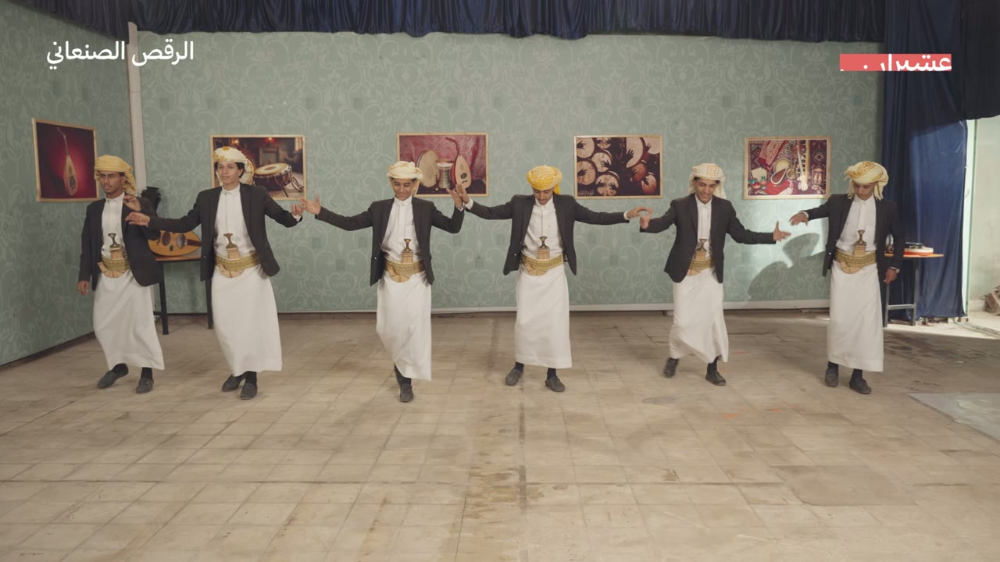
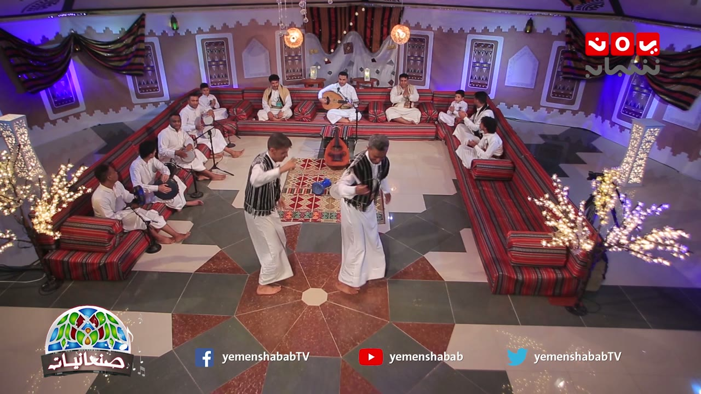
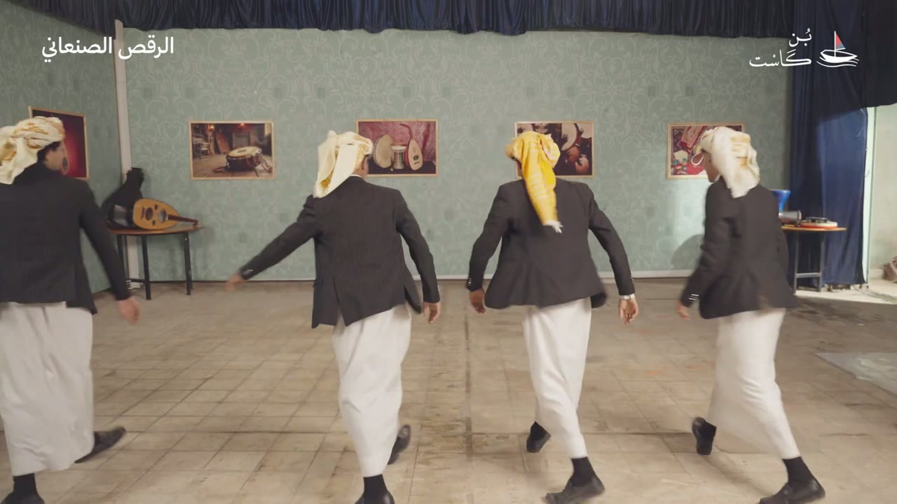
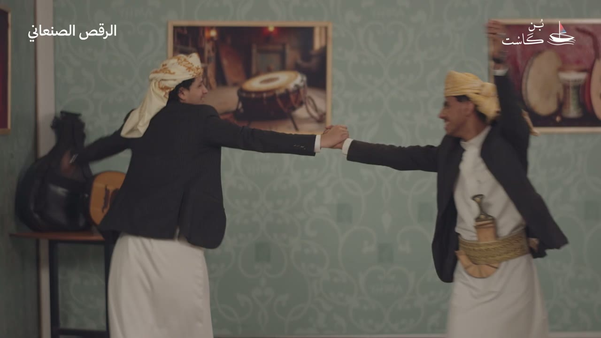
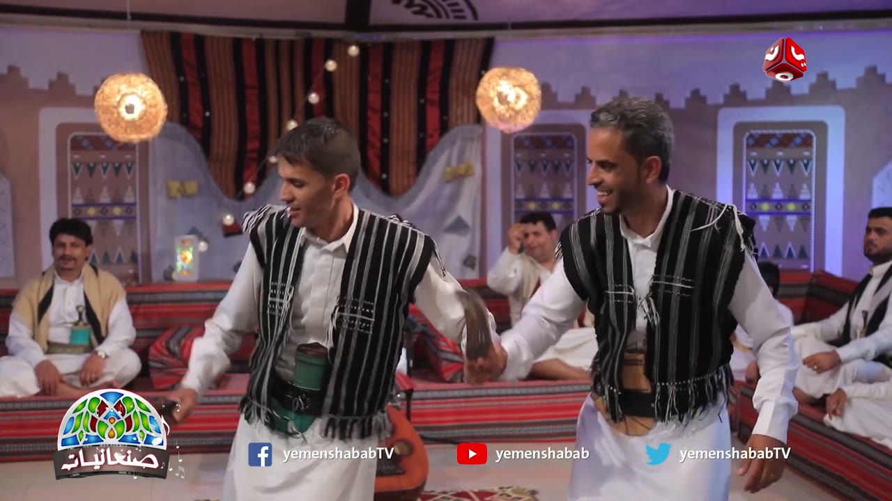
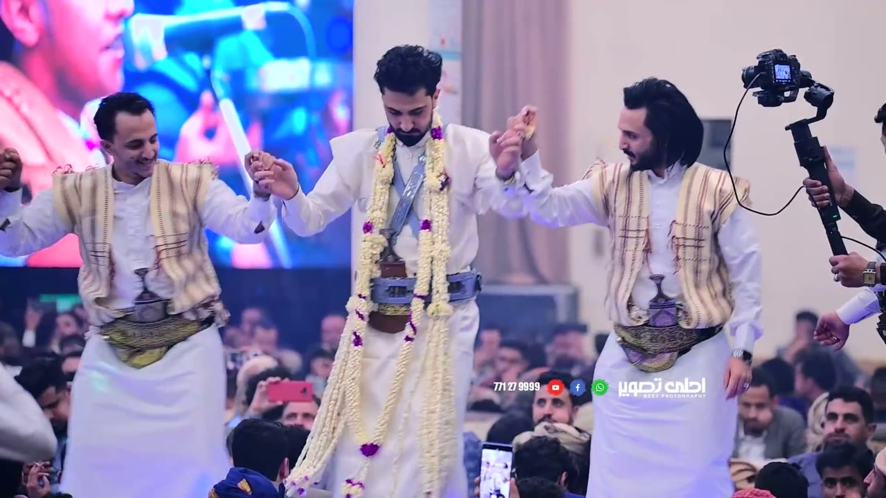
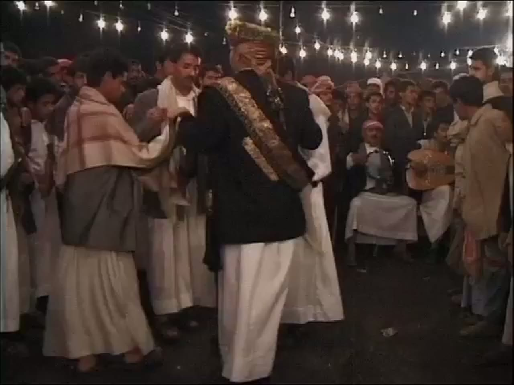
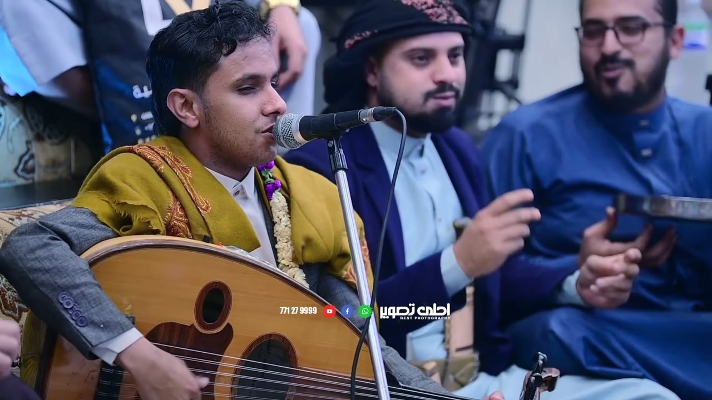
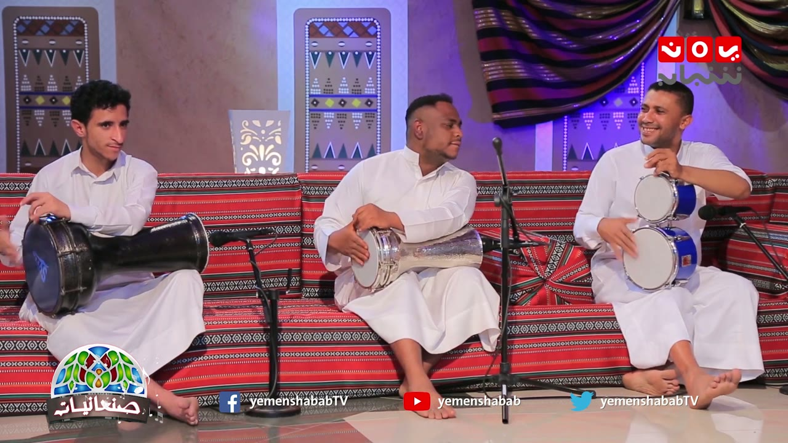
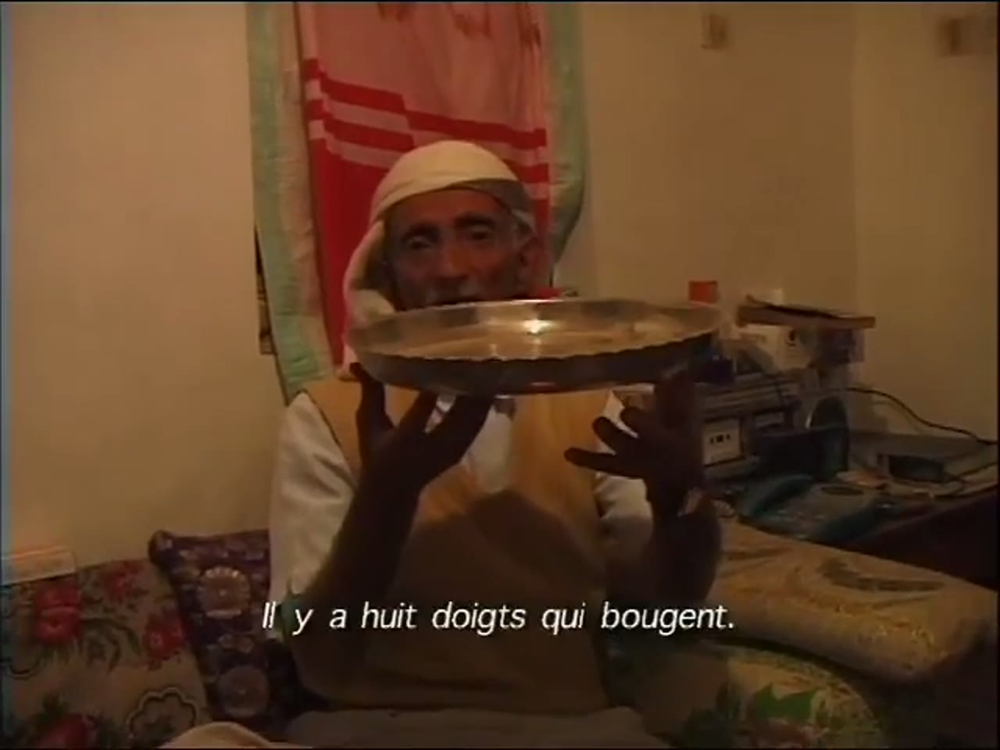

# Sana'ani dance (الرقص الصنعاني) reference keyframes

Reference for redrawing the Hikaya Sana'ani dance animation. Second pass, made 2026-10-05 and 2026-10-06 (the first pass of 2026-10-04 is replaced; this
note is one pack, not an appendix). Built from four YouTube videos (`sources.txt`): ten keyframes, each a different pose or moment,
picked from 1,885 frames extracted at 1 per second (322 + 522 + 502 + 539). It also carries the timing measurements (see `## Timing`).

**What changed from the first pass.** All three first-pass videos are dropped. Two (a Yemen pavilion show at Global Village, Dubai, with
keyboards) are a tourist stage, not the dance's own setting. The third (an old TV studio recording) shows a woman whose long hair is
uncovered under a small cap, which the app's rule for women's footage excludes. The four videos below are new: a UNESCO film, a
heritage-documentation film made with UNESCO/EU/AFAC funding, a Yemeni satellite-TV programme about Sana'ani song, and a studio's video of a men's
wedding in Sana'a (video 4: a private event filmed by hired videographers; see the Authenticity table). Everything below is what the frames and sound show; where the footage doesn't show something, the entry says so.

## The brief vs the footage

The brief expected "the paired dance to oud and song". The authentic footage shows this instead:

- **The sources name the song, not the dance.** UNESCO's listing text (quoted in the description of video 1) describes a solo singer with
  two instruments, the qanbus (lute) and a copper tray, at samra marriage evenings and at the afternoon magyal gathering. It says nothing
  about dance. The UNESCO film shows the instruments and the singing, and shows men dancing only in one street wedding scene (about
  0:19-0:41) where nothing names the dance. Only video 2 puts the words "the Sana'ani dance" on screen; video 4's title says "heritage
  session ... and the dancing of" a family; video 3 names the song.
- **It is not a pair by rule.** In the four videos the men dance as a pair (video 3), as a chain of six (video 2), as a line of three with
  the man in garlands in the middle, hands joined, which becomes a line of four (video 4), and as twos and threes in a crowd (video 1). The
  pair of video 3 dances in the middle of a seated majlis to a live oud, drums and a boy's claps.
- **Arms: joined hands, held out sideways.** In videos 2 and 4 neighbours hold hands, with the arms out to the sides at about shoulder
  height, and the body bobs; in video 3 the pair clasp one hand each and the other hand holds a drawn dagger.
- **A ring exists in footage I did not use.** A wedding video by the Usur troupe (`sanaani67`, studio watermark and "subscribe" cards over
  it, so not kept) shows several dozen men in matching cream thobes with dark belts dancing in rings and in rows, hands joined (5:48-6:34;
  I looked at about a minute). None of the four kept videos has a ring. The first pass's `sanaani6` was also an Usur troupe clip.
- **Men only.** Every dancer in the four videos is a man. Women appear only in one short house scene in video 1 (a woman in a dark head
  covering holds a tray, about 1:00-1:08); no woman dances.
- **Dress.** A white skirt or ankle-length thobe and a curved dagger at the belt in all four videos (video 4: daggers in sashes and
  belts, in jambiya form); a striped waistcoat in videos 3 and 4, a dark blazer in video 2, a dark jacket in video 1; bare feet in
  video 3, shoes in video 2, sandals or shoes in video 1, feet not visible in video 4.
- **The pulse I can measure belongs to the whole group, not to the oud alone.** Video 4 has one percussive pulse of about 196 ms that holds
  for the whole 8.7 minutes; video 3 has about 180 ms and about 159 ms. I could not match any single visible strike (oud hand, drums,
  claps, tray hands) to a sound onset at the 5 % level (see 4a), so I cannot say what makes the pulse.

## Authenticity

| Video | What it is | Who names the dance, and how | Why it counts, and what is uncertain |
|---|---|---|---|
| 1. `sanaani11` UNESCO, "The Song of Sanaa" (2009, 5:22, 640x480) | UNESCO's own film for the Intangible Cultural Heritage listing of the Song of Sana'a. A night street and a wedding crowd in old Sana'a (0:03-0:42), a lute-type instrument being played and made (0:43-2:52), a metal tray held up and explained (2:57-4:26), men singing (4:31-4:52), old-city views | UNESCO names the *song* (title, description quoting the listing). French subtitles name two practitioners (Hassan al-'Ajami at 1:57, Mohammed Isma'il al-Khamisi at 2:57). The *dance* is not named anywhere in the film | Official institutional source, real setting. The dancing is filmed from inside a crowd at night, is not named as a dance, and has no clear steps. Sound is the film's live sound with narration/subtitles over it. 480p is the best size offered |
| 2. `sanaani17` Boncast, "الرقص الصنعاني \| محافظة صنعاء" (2026, 8:42, 1080p) | A heritage-documentation film, shot in a studio room: a man is interviewed on a sofa, with a short preview of the dance and a close-up of a dagger (0:00-0:58; the caption at 0:32 names him), then the same man (same red shirt and beige vest) stands in jeans and demonstrates steps (from about 1:05 to 4:28), then six men dance (4:32-8:29). End card (8:36-8:40): implemented by Boncast Cultural Organization within the Cultural Atelier grants of the Arab Fund for Arts and Culture (AFAC), in partnership with UNESCO, project "Youth Employment through Heritage and Culture in Yemen" funded by the EU | On-screen caption "الرقص الصنعاني" (top-left of every dance shot) and the title. Interviewee caption at 0:32 reads "أ. علي المحمدي / مدير الفنون الشعبية في المركز الثقافي" (director of folk arts at the Cultural Centre). The video description thanks him and "Al-Salam Arts Troupe" | The best-documented footage of the dance itself, funded by UNESCO/EU/AFAC, with credits on screen. It is staged for the camera in a studio, and **the sound looks like a recorded track laid over the film** (see 4a): no musician is visible and the beat changes tempo twice while the dancers' own rhythm does not follow it |
| 3. `sanaani54` Yemen Shabab TV, "الجمالية - ياهل الهوى \| صنعانيات" (2018, 8:21, 1080p) | An episode of the channel's programme "Sana'aniyat" on a studio set dressed as a Sana'a majlis. Singer on oud, drummers, a clapping boy, about 15 men and boys seated; two men dance in the middle | The programme logo "صنعانيات" is on every shot; captions give the song "الجمالية" with "كلمات: تراث" (words: traditional), "غناء: مجاهد الصانع" (singing: Mujahid al-Sani') and "ألحان: أبو نصار" (melody: Abu Nassar). The dance is not named by a caption | A broadcast by a Yemeni satellite channel (the description lists its Nilesat frequencies). The sound is live: singer, oud, drums and clapping are all in the picture. Staged on a TV set, not a real majlis. I did not verify the channel as "official" beyond that |
| 4. `sanaani62` Ahla Taswir studio, "حمود السمه اصيل ابوبكر جديد 2022 جلسة من التراث ... ورقص عيال الشاوش" (uploaded 2021-10-20, 8:58, 1080p at 60 fps) | A men's wedding in a very large hall in Sana'a, filmed by the photography studio hired for it and published on the studio's own channel (its description says it films weddings and posts the sessions). Two singers with ouds on a low stage (0:28-0:52, 2:20-2:31, 6:04-8:52), a seated man with a metal tray, a crowd of thousands of men; between them a man in long flower garlands dances with two friends, hands joined, and later a fourth man joins (dance shots 0:00-0:27, 1:07-1:50 and many others) | The title says "a heritage session ... and the dancing of" a family (the title also gives the wedding's family names, left out here). The singers are named in the description (Asil Abu Bakr and Hamud al-Sama; I can't tell which is which on screen). The dance is not called "Sana'ani" on screen or in the title; siblings of this video from the same studio carry the words "Sana'ani dance" in their titles | The only footage here of the dance in its own setting: a real wedding in Sana'a, live sound from the PA, a visible oud and tray, a continuous 8.7 minutes, 1080p60. Uncertain (the project owner reviewed the use of this video and decided to keep it): it is a private event filmed by hired videographers and published by them, so the groom and guests are identifiable private people (only men appear, nothing looks covert); the camera is a hand-held gimbal, so every shot moves |

Dropped for the record (details in `analysis/LOG.md` on Drive): a Yemen TV studio recording of 2008 (`sanaani20`, 240p, men with a
singer, oud and tambourines: measured, not used because 240p and a better video replaced it); the 1979 Ministry of Culture troupe
interview and the first-pass TV recording (uncovered hair); the Bir al-Azab troupe's 1976 and 1984 festival films (a pipe-and-drum
dagger dance of the Sana'a governorate, authentic archive but a different dance from the one to oud and song); the Global Village
Dubai shows; wedding and phone clips with women or crowds; staged studio sessions for hire with big watermarks.

**How to read the descriptions.** They cover only what is visible in the frame. Where something can't be read (a hand, what a seated
man holds, a blade, who is singing), the entry says so instead of filling it in. When a dancer's own left and right can't be told
reliably, hands are given by side of the frame ("frame-left hand"). Distances are relative (shoulder widths, measured by eye on the
frame with a pixel grid, about +-20 %), never metres, because nothing of known size is in the picture. Every figure in `## Timing`
names its video and timestamps; the working log is `analysis/LOG.md` on Drive. Video numbers 1-4 are the ones in the table above
(`sanaani11`, `sanaani17`, `sanaani54`, `sanaani62`); the frame files keep those names.

## Where everything is

| What | Where |
|---|---|
| Keyframes (10 JPG, 1280 px wide) | `keyframes/` next to this file |
| Source URLs and titles | `sources.txt` |
| Contact sheets: every 2 s, timestamp on each tile | Drive `C:\ai\projects\arabic-app\Hikaya dance reference\sanaani\contact_sanaaniN.jpg` (N = 11, 17, 54, 62) |
| 30 s clips with audio | Drive, same folder, `clip_sanaaniN.mp4` |
| Analysis folder: `LOG.md`, audio and motion outputs, onset csvs, frame strips, the triage sheets of every candidate (`ov\`), helper scripts | Drive, same folder, `analysis\` |
| Full videos and all 1 fps frames | Machine A only: `C:\media\dances\sanaani\` (`frames\sanaaniN\sanaaniN_tSSSSs.jpg`, SSSS = second) |
| This note, `sources.txt` and the keyframes in git | `arabic-buddy` repo, `docs/reference/sanaani/` (contact sheets, clips, videos and analysis are not in git) |

File numbers are not contiguous (11, 17, 54, 62): the other downloaded candidates were dropped; the reason for each is in `analysis/LOG.md`.

## Clips

| Clip | Source span | What's in it |
|---|---|---|
| `clip_sanaani17.mp4` | sanaani17, 4:56-5:26 | The six men in the chain, wide and close: hands let go at 4:57.0 and 5:10.0 (clip 0:01.0 and 0:14.0) and the walk across the floor, then the chain again. The track's beat steps from about 200 to about 230 ms at about 5:16 (clip 0:20). Level checked by measurement (mean -13.4 dB); I have not listened to it |
| `clip_sanaani54.mp4` | sanaani54, 6:53-7:23 | The pair dancing with drawn daggers in the middle of the majlis, close (6:53-7:04) then from a high camera (7:04-7:16.4), then shorter shots from 7:16.5 (the three percussionists first). Mean level -16.2 dB; I have not listened to it |
| `clip_sanaani62.mp4` | sanaani62, 0:10-0:40 | The man in garlands and two friends, hands joined, bobbing (0:10-0:24), the friend at frame-right bows forward (0:24-0:27), a cut at 0:27.7 to the singer with the oud, a seated man with a tray and a second man (0:28-0:40). The camera moves. Mean level -13.8 dB, peaks at 0 dB; I have not listened to it |
| `clip_sanaani11.mp4` | sanaani11, 0:14-0:44 | The street wedding in old Sana'a (to 0:42) and the first seconds of the man with the lute-type instrument. Mean level -21.9 dB; I have not listened to it |

---

## 1. Pose "chain_step": six men in a line, hands joined, arms out

`sanaani17_t0300s.jpg` · sanaani17 (Boncast) at 5:00

- Fixed wide camera in a studio room: pale green wall with a damask pattern, a bare tiled floor stained in places, a dark blue curtain along the top and a blue curtain at the right, five framed photographs of an oud and drums on the wall, a small round table at frame-left with an oud lying on it (partly hidden by the second man) and a table with objects at frame-right. Caption "الرقص الصنعاني" at top-left; a red tag at top-right ("عشيران", partly clipped).
- Six men stand in one straight row facing the camera. Their body centres are about 160 to 200 px apart on the 1280 px frame and a man's shoulders are about 105 px wide: about 1.8 shoulder widths (+-0.3), with the arms stretched between.
- Every man wears a dark blazer over a white shirt, a white ankle-length skirt, a gold-coloured belt with a curved dagger worn at the front (the handle shows above the belt), black shoes with black socks, and a head cloth wound round the head: cream with a gold pattern on four of them and yellow on the first and the fourth from frame-left.
- Arms are held out to the sides, bent a little, at about shoulder height; the hands of neighbours meet or are joined. The outer arms of the two end men hang low or are bent in. The third man from frame-left is up on the balls of his feet; the others stand with the feet apart, flat or with one foot forward. From this frame I can't tell which foot carries the weight.
- The same line, with the same posture, is seen in many shots between 4:32 and 7:41.

## 2. Formation: a pair in the middle of the majlis, high camera

`sanaani54_t0425s.jpg` · sanaani54 (Yemen Shabab TV) at 7:05

- High, steady camera over a studio set built as a Sana'a majlis: red-striped cushioned benches along three sides, wall panels with geometric patterns, round lanterns, strings of lights, light-up lanterns at the corners, a patterned carpet and a floor of grey, white and brick-red tiles in a star pattern. An oud with a round back stands upright in front of the far bench, and a blue goblet-shaped drum lies on its side on the carpet.
- About 15 men and boys sit on the benches. At the far wall the singer sits cross-legged with an oud; at frame-left four men sit along the bench with drums and microphone stands; at frame-right men and boys sit watching.
- Two dancers use the open floor in front of the carpet, about 180 px apart centre to centre on the 1280 px frame, each about 75 px across the shoulders: about 2.4 shoulder widths (+-0.4). Both are barefoot, in white shirts, black waistcoats with white vertical stripes and white skirts. Each holds one forearm bent in front of the chest (the frame-left man's fist at chest height, the frame-right man's hand across his waistcoat); the other arm hangs at the side.
- Programme logo ("صنعانيات") at bottom-left, the channel's social-media names along the bottom, a red channel logo at top-right.

## 3. Pose "release_walk": hands let go, the men walk across the floor

`sanaani17_t0311s.jpg` · sanaani17 (Boncast) at 5:11

- Same room, same camera. Four men are seen from behind and a little from the side, walking across the floor (the leftmost is partly cut off). Nobody's hands are joined: arms hang loosely a little out from the sides; the second man from frame-left has his frame-left arm swung out and back.
- The head cloths show their tails hanging down the back (a yellow one on the third man from frame-left). Skirts swing with the stride; black shoes and socks are mid-step, one foot lifted behind each man.
- Behind them the oud on its small round table (frame-left, with a black case behind it) and the table with objects at frame-right are in the same places as in keyframe 1, so the camera has not moved; the men have turned and walked.
- This is the second pose of the cycle in `## Timing` 4c: the line lets go, walks, turns back to face the camera, and joins hands again.

## 4. Pair turn at the end: two men clasp hands, arms out straight

`sanaani17_t0492s.jpg` · sanaani17 (Boncast) at 8:12

- Medium shot in the same room. Two men face each other; the clasp of their hands is at about the middle of the frame (x about 715, y about 290 on 1280x720).
- The frame-left man is seen from behind and the side in a dark blazer and a cream head cloth with gold pattern, leaning toward the other with his frame-right arm stretched straight out to the clasp and his other arm swung back to frame-left.
- The frame-right man faces the camera, laughing, in a yellow head cloth, with his frame-left arm stretched straight to the clasp and his other arm thrown up overhead; his blazer is open and the gold belt with the curved dagger at the front shows.
- The two arms together span the gap: about 690 px between body centres, shoulders about 260 px wide, so about 2.6 shoulder widths (+-0.4).
- Behind them: a large photograph of a drum on the wall (and a smaller one at the right), a black oud case and an oud on a small table at frame-left.
- In the minute before this (8:08-8:24) pairs and threes spread across the floor and turn round each other; this is one frame of that.

## 5. Costume close, and a blade between the pair

`sanaani54_t0416s.jpg` · sanaani54 (Yemen Shabab TV) at 6:56

- Two dancers close to the camera, both smiling, the frame-left man looking down. Both wear a white long-sleeved shirt, a black waistcoat with thin white vertical stripes and a knotted fringe along the hem and shoulder, and a white skirt.
- The frame-left man (short straight dark hair) wears a dark belt with a green sheath at the front. His frame-left hand is low at the bottom-left edge and partly out of the picture.
- The frame-right man (short grey hair) wears a tan fringed leather belt with a curved sheath at the front.
- Their near hands meet at about waist height in the middle of the frame, and a dark curved blade (the blade of a dagger) shows between them, pointing up and to frame-left. I can't tell whose hand holds it.
- Behind them seated men in cream and white sit on the red cushions; the one at frame-left wears a cream shawl waistcoat with a dagger in a teal sheath at his belt. The programme logo is at bottom-left, the channel logo at top-right.

## 6. A man in garlands and two friends, hands joined (wedding in Sana'a)

`sanaani62_t0013s.jpg` · sanaani62 (Ahla Taswir) at 0:13

- Close shot from a hand-held gimbal camera in the wedding hall: a big LED screen behind at frame-left shows a close-up of a singer at a microphone, spectators' heads fill the bottom of the picture (one holds up a red phone, one a white phone), a pale curtain and a loudspeaker box are at the back. A videographer's gimbal and camera, and his hands and a wrist watch, are at frame-right. Studio logo at the bottom centre.
- Three men stand in a row facing the camera. Body centres are about 400 px apart on the 1280 px frame and the middle man's shoulders are about 270 px wide: about 1.5 shoulder widths (+-0.3), with the arms between them.
- Frame-left man: white long-sleeved shirt, a cream waistcoat with brown vertical stripes, a gold-embroidered belt with a curved dagger in a pale-handled sheath, a white ankle-length garment; he smiles, looking down to the frame-right.
- Middle man: white jacket, a grey-blue shoulder strap, a blue-grey belt with a dagger and a brown leather sheath, and two long garlands of white flowers with purple blossoms hanging from the neck to below the belt; his head is bowed and his eyes are down. I take him to be the groom; no caption says so.
- Frame-right man: the same cream striped waistcoat, belt and dagger, long dark hair to the shoulders and a beard, looking down.
- Near hands are joined: the frame-left man's frame-right hand clasps the middle man's frame-left hand at about chest height, and the middle man's frame-right hand holds the frame-right man's frame-left hand raised to about face height. The frame-left man's outer fist is raised at the left edge; the frame-right man's outer hand hangs low, with a ring on a finger.
- Feet are out of frame.

## 7. Men dancing at a wedding in the street, old Sana'a

`sanaani11_t0030s.jpg` · sanaani11 (UNESCO) at 0:30

- Night, strings of bare bulbs overhead, a dense crowd of men around a small open space of bare ground; a hand-held camera inside the crowd.
- At the centre a man in a black jacket with a broad gold-embroidered sash across his chest and a wreath of leaves and flowers on his turban is seen from behind; in the shots around this one he wears garlands (I take him to be the groom: no caption says so). To his frame-left, a man in a grey jacket with a pink-checked shawl over his shoulders and a man in a cream scarf hold the ends of a cloth between them, their hands meeting at about waist height, and step in a small circle.
- At frame-right a seated man in a dark waistcoat and a white cap holds a round frame drum with a metal rim at chest height, and beside him a man holds a light-brown round-bodied lute-type instrument on his lap.
- Everyone in view is a man, in white thobes, grey or dark jackets and shawls. The dancers wear sandals or shoes. Dancing is seen in this shot and in 0:19-0:41; nothing on screen names it.

## 8. A singer with an oud, a man with a metal tray (wedding in Sana'a)

`sanaani62_t0050s.jpg` · sanaani62 (Ahla Taswir) at 0:50

- Close shot, hand-held, of three seated men at the singers' stage; a banner with partly readable writing is behind at the left, spectators' hands above. Studio logo at the bottom centre.
- Frame-left: a young man in a grey jacket with a mustard-yellow shawl with orange embroidery over his shoulders, a garland of white and purple flowers round his neck, sings into a microphone on a stand, eyes half closed. A round-backed oud with a pale soundboard lies across his lap; his picking hand and wrist show at the bottom edge, near the strings by the bridge, partly cut off.
- In the middle: a bearded man in a dark blue jacket over a pale blue shirt, with a black head cloth with embroidered edge and a curved dagger with a pale sheath at his belt, looks at the singer; his frame-right hand is raised with the fingers curled and pointing.
- At frame-right: a bearded man with glasses in a blue thobe holds a flat metal tray, tilted, at chest height; its rim runs off the right edge, and his fingers are on or under it. From this frame I can't see which fingers touch it or whether it is sounding.
- This is the only frame of the pack where an oud and a tray are both in the picture at an event.

## 9. The three percussionists

`sanaani54_t0402s.jpg` · sanaani54 (Yemen Shabab TV) at 6:42

- Three men sit barefoot on the cushions in white thobes. Frame-left: a black goblet-shaped drum with a black head across his knees, his frame-left hand raised at the picture edge. Middle: a silver goblet-shaped drum with a white head held on his knee, both hands on the head, looking toward the man at frame-right. Frame-right: two small blue-rimmed drums with white heads held together at chest height, smiling.
- A microphone stand stands between the middle and right men and another in front of the left man.
- This is the group whose hands are measured in `## Timing` 4a; the frame doesn't show which drum makes which sound.

## 10. A metal tray held in both hands, with subtitle

`sanaani11_t0184s.jpg` · sanaani11 (UNESCO) at 3:04

- An old man in a cream cap with a cloth wound round it and a mustard-coloured waistcoat sits in a house room and holds a round metal tray with a scalloped rim in front of his chest, tilted toward the camera, supported from below by both hands with the fingers spread.
- French subtitle: "Il y a huit doigts qui bougent." (There are eight fingers that move.) Earlier (2:57) the subtitle names him "MOHAMMED ISMA'IL AL-KHAMISI".
- Behind him a red-and-white striped cloth hangs on the wall; at the right a radio or cassette player with wires and a telephone on a shelf.
- The UNESCO listing names this tray, with the qanbus, as the accompaniment of the Song of Sana'a. It is shown here as an instrument being explained, not played with a song.

---

## Timing

**Method.** Audio: `audio.py` (percussive onsets, resolution one analysis hop of 5.8 ms), `tempotrack.py` and a sliding-window pulse search `p2_pulsetrack.py` (10 s window; best period 150-260 ms by phase lock R, 1.0 = perfect) to find steady stretches and tempo changes, and `p2_cycle.py` (folds the onsets at 2-16 pulses and prints each slot's share of onsets: equal shares = no accent). Picture: native frame rate (25 fps in videos 1-3, 59.94 fps in video 4), so one frame is 40 ms or 17 ms. `motion.py` was run but not used: it reports a 200 ms energy period in every run, including a region of sanaani54 where nobody moves, so that is a 5-frame rhythm of the video, not the dance. The body's rise and fall was measured with `flowtrack.py` (optical flow of a box on one dancer, camera flow subtracted) and, for sanaani17, `p2_headtrack.py` (the centroid of the yellow head cloth, frame by frame); the strokes of hands were looked for with `p2_hit.py` and `p2_perm.py` (frame-difference peaks of a box on a hand against the audio onsets, with a test against random event times). Poses were read by eye on 2-5 fps strips (labels good to +-0.2-0.5 s, said per table), then `timeline.py`. Every number below is in `analysis/LOG.md` (Drive) with its command; the helper scripts are in `analysis/` too. Percussive share of the energy is 0.04-0.13 in sanaani54, 0.17-0.21 in sanaani17, 0.12-0.36 in sanaani62 and 0.31-0.37 in sanaani11.

### 4a. Strokes (the percussive pulse)

**sanaani62 (wedding in Sana'a; live sound, singers and oud in picture).** Folded pulse per stretch, m:ss absolute video time:

| Stretch | n onsets | median interval ms | BPM from median | IQR ms | SD ms | folded pulse ms (R) |
|---|---|---|---|---|---|---|
| 0:05-0:28 | 124 | 191.6 | 313.2 | 165-212 | 53 | 197.8 (0.63) |
| 0:29-0:52 | 98 | 209.0 | 287.1 | 186-238 | 92 | 197.4 (0.79) |
| 1:26-1:48 | 110 | 191.6 | 313.2 | 180-209 | 72 | 195.9 (0.64) |
| 2:05-2:30 | 112 | 197.4 | 304.0 | 186-221 | 91 | 195.4 (0.77) |
| 5:00-5:28 | 142 | 185.8 | 323.0 | 151-226 | 69 | 195.9 (0.38) |
| 7:15-7:48 | 182 | 180.0 | 333.4 | 145-209 | 60 | 195.3 (0.40) |

- **One steady pulse for the whole performance.** In 52 consecutive 10 s windows from 0:00 to 8:40 (`p2_62_pulsetrack.txt`) the best pulse is 192.6-200.0 ms with R 0.46-0.91; it drifts slowly from about 198-200 ms in the first minute to about 195-196 ms from 2:00 to 8:30, a speed-up of about 2 % over 8 minutes: **about 196 ms, about 306 per minute**. It does not step at picture cuts. A hand-played pulse drifts like this; a laid-on loop would not. I can't tell what makes it: the percussive layer is 12-36 % of the energy (the rest is voices and ouds), and the instruments in the picture are two ouds, a tray and the crowd.
- **Accent.** Folded at 2-12 pulses the onsets are shared mostly equally (4 pulses: 29/21/25/25 at 0:05-0:28, 26/26/25/22, 26/25/23/26, 28/20/27/24, 26/23/26/25; the stretch 0:29-0:52 is the exception with 31/30/23/16). At 8 pulses (about 1,570 ms) two slots 6 pulses apart carry 14-17 % of the onsets each (12.5 % would be equal) in five of the six stretches (15 10 10 15 10 11 17 10 at 0:05-0:28; 15 14 6 12 13 12 15 11; 15 10 13 13 12 12 15 12; 15 9 13 12 13 12 14 11; 15 14 11 12 13 11 14 11; the sixth, 15 12 12 12 11 14 12 12, has only slot 6 weaker), R at 8 pulses 0.03-0.07: **a faint 8-pulse accent, not a firm pattern** (low confidence). The envelope's autocorrelation (tempotrack, r 0.5-0.7) peaks at about 1,570 ms (8 pulses) in 1:00-1:25 and 2:25-3:15, and at about 1,160-1,195 ms (6 pulses) in 4:45-5:25 and 6:10-8:45.
- **Visible-strike cross-check: not achieved.** The close-up of 0:28-0:52 (hand-held gimbal, 60 fps, so a pulse is about 12 frames) shows the singer's oud (the strumming hand at the bottom edge, mostly out of frame) and a seated man holding a metal tray whose fingers are partly in frame at the right edge. I read the native strips `s62_tray_35_p01` (0:35.000-0:36.051) and `s62_tray_50_p01` (0:50.000-0:50.784) with the onsets marked: the tray stays tilted in one hand and fingers move under it, but no contact frame can be read (the hands move 1-2 px per frame and are blurred and partly cut). I timed 0 strikes by eye. Frame-difference peaks of a box on the tray hands (0:46.5-0:55.5, 53 events, offset to the nearest onset median 0 ms, median abs 58 ms against 65 ms for random event times, P(random <= observed) = 0.21) and of the oud-hand region (89 events, 69 ms against 65 ms, P 0.74) are no better than random; the control region of the picture gives P 0.61. Offset between sound and picture: not measurable.

**sanaani54 (Yemen Shabab TV; live sound, players in picture).** Folded pulse per stretch:

| Stretch | n onsets | median interval ms | BPM from median | IQR ms | SD ms | folded pulse ms (R) |
|---|---|---|---|---|---|---|
| 0:04-0:34 | 168 | 174.1 | 344.5 | 157-186 | 68 | 176.1 (0.47) |
| 0:12-0:42 | 164 | 174.1 | 344.5 | 162-192 | 75 | 176.2 (0.58) |
| 0:44-1:14 | 159 | 180.0 | 333.4 | 162-197 | 77 | 180.0 (0.58) |
| 1:15-1:45 | 179 | 174.1 | 344.5 | 157-186 | 50 | 177.9 (0.53) |
| 2:40-3:10 | 182 | 174.1 | 344.5 | 110-192 | 61 | 181.9 (0.61) |
| 4:58-5:28 | 188 | 156.7 | 382.8 | 134-186 | 33 | 159.0 (0.53) |
| 6:00-6:30 | 183 | 174.1 | 344.5 | 128-192 | 40 | 159.4 (0.38) |
| 6:36-6:54 | 97 | 185.8 | 323.0 | 139-203 | 53 | 161.0 (0.52) |
| 7:00-7:25 | 150 | 174.1 | 344.5 | 128-192 | 42 | 158.2 (0.50) |

audio.py's median sits on a 5.8 ms grid and misses onsets (it reads 174 where the folded pulse is 159); the folded value is the pulse.

- **Two tempo stages.** The sliding window (`p2_54_pulsetrack.txt`) gives about 171 ms at 0:08-0:12 (R 0.95), slowing gradually to about 180 ms by 0:45 and 182-184 ms from 1:40 to 4:12 (R 0.4-0.8): **stage A, about 180 ms, about 333 per minute**. It steps down to about 162 ms between 4:13 and 4:21 (4 s windows: 253-257 s 185.2 ms, 254-258 s 177.0, 256-260 s 168.8, 260-264 s 164.2, 262-266 s 162.2) and then holds at 158-163 ms to about 8:00 (R 0.4-0.67): **stage B, about 159 ms, about 377 per minute**. Every stage-B stretch folds to 158.2-161.0 ms (four stretches, 1.8 % apart).
- **Accent pattern.** Stage A: no accent (shares 35/34/32 at 3 pulses and 27/22/27/23 at 4 pulses at 0:12-0:42; 38/27/35 at 1:15-1:45). Stage B, folded at 4 pulses (about 636 ms): shares 36/34/19/11 (4:58-5:28), 36/16/17/31 (6:00-6:30), 39/11/19/31 (7:00-7:25) with R 0.12-0.14, but 31/26/26/17 (6:39.5-6:47, R 0.06) and 29/18/27/27 (6:36-6:54, R 0.04): **a repeating 4-pulse pattern with a strong first and last slot in three of five stage-B stretches, weak or absent in the other two**. The autocorrelation of the percussive envelope peaks at 534-546 ms in stage A (3 pulses, r 0.55-0.70 from about 0:15) and at 626-650 ms in stage B (4 pulses, r 0.6-0.8 from 4:17 to 7:55).
- **What the onsets are.** The sound is mostly harmonic (voice, oud) with a thin percussive layer (share 0.04-0.13) that is phase-locked to one pulse in each stage (R 0.5-0.6). On the spectrogram of 4:58-5:28 (`p2_54_d_audio.png`, read) it is a dense row of regular thin vertical lines running from the bass up to 8 kHz, with the harmonic stripes of voice and oud between them. The players are in the picture: an oud (strummed), two small blue-rimmed drums, a silver and a black goblet-shaped drum, and a boy who claps. So the pulse belongs to the picture; which player makes which onset is not established.
- **Visible-strike cross-check: not achieved at the 5 % level.** I tried four players on native 25 fps strips with the onsets marked (a frame is 40 ms, a quarter of a pulse of 160-180 ms). Events against audio onsets (offset = nearest onset minus picture event; P = share of 5,000 random sets of the same number of events in the same window that match the onsets at least as well):

| What | Window | n events | median offset | median abs offset | random sets | P |
|---|---|---|---|---|---|---|
| boy's palms meet (labelled by eye on `s54_clap_120_p01`, `s54_clap_122_p01`: 2:00.20, 2:00.92, 2:01.28, 2:02.00, 2:02.40, 2:02.80, 2:03.56, 2:03.92) | 2:00-2:04 | 8 | -13 ms | 59 ms | 52 ms | 0.68 |
| silver-drum player's hand, frame-difference peaks | 6:39.7-6:47.0 | 17 | +18 ms | 32 ms | 45 ms | 0.11 |
| frame-drum player's hand, frame-difference peaks | 0:49.0-0:50.9 | 9 | +20 ms | 21 ms | 39 ms | 0.07 |
| oud strumming hand, frame-difference peaks (`s54_pick_8_p01`: the hand rocks over the soundboard by a few pixels, no contact frame readable) | 0:06.8-0:10.6 | 19 | +1 ms | 44 ms | 40 ms | 0.66 |

  I timed 8 claps by eye, and 0 strokes of the oud (the plectrum is not visible). The claps are 719, 359, 719, 400, 399, 760, 359 ms apart = 3.9, 2.0, 3.9, 2.2, 2.2, 4.1, 2.0 pulses of 183.5 ms (stage A): whole-pulse intervals within 0.2 pulse, but their phase against the pulse grid is not significant (R 0.50, random 95th percentile 0.61, n = 8). **What does match is a period:** the silver-drum hand's events repeat every 644.5 ms (best period 400-900 ms, R 0.66, n 17) = 4.05 pulses of 159.4 ms, and the audio envelope in that stretch peaks at 636-638 ms: picture and sound agree within 1.4 %. That supports the drum player's hand as the source of the stage-B 4-pulse pattern, but it is not a stroke-by-stroke match. Offset between sound and picture: not measurable (at 40 ms a frame, the offsets of +20 ms are within one frame).

**sanaani17 (Boncast documentation film).**

| Stretch | n onsets | median interval ms | BPM from median | IQR ms | SD ms | folded pulse ms (R) |
|---|---|---|---|---|---|---|
| 4:32-5:02 | 155 | 203.2 | 295.3 | 168-221 | 54 | 199.7 (0.72) |
| 5:30-6:00 | 154 | 226.4 | 265.0 | 122-238 | 65 | 229.7 (0.62) |
| 6:20-6:50 | 150 | 226.4 | 265.0 | 134-238 | 62 | 230.4 (0.65) |
| 7:05-7:35 | 164 | 197.4 | 304.0 | 145-215 | 39 | 178.8 (0.52) |
| 7:50-8:20 | 166 | 191.6 | 313.2 | 139-215 | 40 | 178.7 (0.51) |

The sliding window gives **200 ms from 4:33 to 5:15, 230 ms from 5:20 to about 6:48, and 179 ms from 6:52 to about 8:20**, with the two steps within 4 s (316-320 s: 202 -> 237 ms; 408-412 s: 235 -> 189 ms). No accent at 2-16 pulses (R 0.01-0.12, equal shares). Here the sound is probably **not the dance's own**: nobody on screen plays or strikes anything; the pulse carries over all picture cuts; the tempo jumps by 15-25 % twice in 4 s while the dancers' own rhythm drifts only slowly (4b); and the dancers' bounce is not a whole number of pulses (535 ms / 230.4 ms = 2.32 and 484 / 178.7 = 2.71). It looks like a recorded track under the film. I did not prove that. Treat the three pulses as the track's, not the dance's.

**sanaani11 (UNESCO): not measurable.** The wedding stretches (0:03-0:20, 0:18-0:43), the lute demonstration (1:56-2:32) and the tray demonstration (2:56-4:26) fold at 112-151 ms with R 0.14-0.24, far below a pulse (tempotrack r below 0.41), and audio.py finds no repeating pattern. Spectrogram `p2_11_tray_audio.png` (read): spoken voice in bursts with silences up to about 227 s, then a dense noisy texture from about 236 s; no regular row of vertical lines.

### 4b. The main repeating movement: the bounce of the body

All four videos show the men stepping with a small rise and fall of the body; none shows a large movement (no bow, spin or sway to measure). I could not count steps by eye in any video: the feet stay near the floor, are out of frame in video 4's close shots, and the strips don't separate foot contacts.

| Video, span | Method | Strongest period ms | Notes |
|---|---|---|---|
| sanaani62 0:02-0:17 | flow FFT, box on the middle man (the man in garlands) | 517.2 (1.0), 789.4 (0.45) | 27 bounce events: intervals mean 525.5, median 533.9, SD 65.5 ms; best free period of the event times 524.0 ms (R 0.88) |
| sanaani62 1:12-1:27 | flow FFT, the same man | 517.2 (1.0), 789.4 (0.40) | 27 events, mean 545.4, median 550.6, SD 104.6 ms (the dancer is hidden at 1:23.4-1:24.3); best free period 523.5 ms (R 0.89) |
| sanaani62 1:32-1:47 | flow FFT, box on the frame-left half of the middle man | 517.8 (1.0), 790.3 (0.42) | 25 events, median 550.6, SD 187.5 ms (ragged) |
| sanaani17 5:06.2-5:16.0 | flow FFT of body box; head tracker FFT | 546.7 (1.0), 756.9 (0.61); 546.7 (1.0) | ragged: head-lowest intervals mean 657, median 580, SD 261 ms, n 15 |
| sanaani17 6:29.1-6:37.6 | flow FFT; head tracker FFT | 532.5 (1.0), 608.6 (0.86); 535.0 (1.0), 611.4 (0.98) | 14 intervals median 500, mean 534, SD 70 ms |
| sanaani17 7:19.1-7:28.7 | flow FFT | 505.3 (1.0), 600.0 (0.86) | head tracker lost the cloth in 117 of 239 frames: not used |
| sanaani17 7:49.1-7:58.3 | flow FFT; head tracker FFT | 484.2 (1.0); 486.3 (1.0) | 18 intervals mean 482, median 480, SD 31 ms (range 440-520) |
| sanaani54 7:04.4-7:16.2 | flow FFT, each dancer | frame-right man 623.2 (1.0); frame-left man 623.2 (1.0) | 16 and 17 bounce events; the event picker is ragged (median 640 / 620 ms, SD 222 / 175) so the FFT is used |
| sanaani54 6:06.8-6:16.9 | flow FFT, each dancer | 632.5 (1.0) and 632.5 (1.0) | 15 and 14 events |
| sanaani54 3:54.4-4:01.8 | flow FFT, each dancer | 826.7 (1.0) and 826.7 (1.0) | only 7 and 10 events, weak |

- **sanaani62: the body bobs every 517-518 ms (three stretches over a minute and a half, the same FFT peak to 0.6 ms, two dancers), about 116 per minute.** That is 2.64 pulses of 196 ms. The events fall on the pulse grid more than chance (R 0.41 and 0.49 at one pulse against about 0.17 expected for random times) but not on an 8-pulse cycle (R 0.09 and 0.03), so the bob is not locked to the music's cycle. In the first 6.5 s of the first stretch the machine-picked intervals run 0.60, 0.44, 0.60, 0.58, 0.40, 0.59, 0.60, 0.43, 0.60 s (about 3, 2, 3, 3, 2, 3, 3, 2, 3 pulses, a 3-3-2 grouping in 8 pulses); later in that stretch and in the second one they are 0.44-0.61 s without a clear grouping. Those intervals are not checked by eye.
- **sanaani17: about 535 ms in the main shot, 484-547 ms across shots; the period changes from shot to shot** (547 -> 535 -> 505 -> 484 ms) **while the track's pulse goes 200 -> 230 -> 179 ms**, so the two are not tied. Flow and head tracker agree within 1 % in the two shots where both work. Hand check: on the drift-compensated head strip `s17_hcountC_390.jpg` (6:29.96-6:32.36, 25 fps, a fixed guide line) I read the lowest head at 6:30.96, 6:31.62 and 6:32.14 (+-0.06 s: intervals 660 and 520 ms); the tracker's lowest events in the same span are 6:30.96, 6:31.60 and 6:32.12. That confirms 3 dips by eye, not the whole run. In the 7:49-7:58 shot (`s17_hstab_469.jpg`, `s17_hcount2_470.jpg`) I could see the head dip and rise but could not read the dips cycle by cycle against the guide line, so 484 ms there rests on the two machine methods.
- **sanaani54, stage B: the pair bounces every 623-633 ms (two shots, both dancers each: 623.2, 623.2, 632.5, 632.5), which is 3.9-4.0 pulses of 159 ms and equals the 4-pulse cycle of the percussion (636 ms): 4 strokes per bounce cycle, within 1-2 %.** In stage A (3:54-4:02, pulse about 183 ms) the period is 827 ms (4.5 pulses), which does not match the 3-pulse envelope cycle (545 ms), but only 7-10 events back it. So in the TV majlis the dancers' rhythm and the live percussion are tied in stage B; in the wedding and the documentation film they are not.
- **In all three performances where it could be measured the body bobs about twice a second (484-633 ms), at pulses of 159-230 ms.**
- **Size, where measurable.** sanaani17, bounce peak to peak (flow, px at 480 px width / 270 px picture height; head tracker px at 1080 height): 6.2 / 38.5 (6:29-6:37), 6.8 / 26.7 (7:19-7:28, head partial), 3.2 / 20.3 (7:49-7:58). The dancer in the wide shot at 6:30 is about 430 px tall of 720 (head top to feet, grid on `s17_h_0390.jpg`, +-15 px), so the bounce is about 3.8 % (flow) and 5.9 % (head) of standing height at 6:29-6:37, and 2.0 % and 3.1 % at 7:49-7:58: **about 2 to 6 % of the dancer's standing height, peak to peak**, with the two methods up to 2x apart. sanaani62: 6.7, 8.0 and 4.4 px at 480 px width (2.5 %, 2.9 % and 1.6 % of picture height) on a framing where the torso fills about 55 % of the picture and the feet are cut off: the dancer's standing height is not visible, so a fraction of body height is not measurable. sanaani54: 1.1-2.1 px at 480 px width (the dancers are small in the wide shots): not measurable. sanaani11: not measured (hand-held in the crowd).

### 4c. Pose timeline

**sanaani62: the wedding trio.** Poses, named from the keyframes: `trio_joined` (keyframe 6: three men in a row, near hands joined, outer arms held out, bobbing), `friend_bends` (the man at frame-right bows forward and his joined hand goes up and back while the other two keep stepping), `line_of_four` (the camera pulls back, a fourth man in white joins the line at frame-left, hands joined). Labels read on 3 fps (0:00.5-0:27.2, `s62_T1_p01`), 2 fps (1:10.0-1:51.5, `s62_T2_p01`) and 4 fps (1:34.0-1:38.75, `s62_T2b_p01`) strips, so +-0.33 s, +-0.5 s and +-0.25 s; label files `p2_labels_62_T1.csv` and `p2_labels_62_T2.csv`, output `p2_timeline_62.txt`. Both stretches start at a camera cut (0:00.4 and 1:09.8), so the true start of `trio_joined` is not seen.

| Video, timestamp -> pose | Duration about | Strokes counted (audio) | Duration / pulse |
|---|---|---|---|
| sanaani62, 0:00.5 -> trio_joined | 23,500 ms | 126 | 119.0 (197.5 ms) |
| sanaani62, 0:24.0 -> friend_bends | 3,200 ms | 19 | 16.2 |
| sanaani62, 1:10.0 -> trio_joined | 24,000 ms (to 1:34.0) | 110 | 122.4 (196 ms) |
| sanaani62, 1:34.0 -> friend_bends | 3,400 ms | 16 | 17.3 |
| sanaani62, 1:37.4 -> line_of_four | 13,200 ms (to the cut at 1:50.6) | 64 | 67.3 |

- **Order and repetition.** Twice, the same two-part order: about 24 s of `trio_joined` from the cut, then `friend_bends` for 3.2-3.4 s (from the cut at 1:09.8 to the bend at 1:34.0 is 24.2 s, from the cut at 0:00.4 to the bend at 0:24.0 is 23.6 s). Then, in the second stretch, `line_of_four`. Two samples, and both begin at a cut, so I can't say whether the 24 s is the dance's or the cameraman's. The durations in pulses (119, 122; 16, 17) are not whole multiples of anything I can name; the poses change on no beat that I can find.
- Wide shots elsewhere in the video (0:54-1:06, 1:50-2:17, 2:32-3:18, 5:28-5:56, 6:12-6:32, 6:42-6:58) show a line of six to ten men in waistcoats on a long stage platform with the crowd on both sides; I looked at them at 2 s intervals and did not label them.

**sanaani17: the chain and its release.** Poses, named from the keyframes: `chain_step` (keyframe 1: line facing the camera, hands joined, arms out, stepping), `release_walk` (keyframe 3: hands let go, the men walk in profile across the floor), `regroup_free` (the men have turned back to face the camera, hands free, small steps, until the hands are joined again). Labels read on 5 fps strips `s17_T1_p01..p03` (4:55-5:13), `s17_B2` (5:21-5:27), `s17_B3` (5:34.5-5:40.5), `s17_B4` (5:47.5-5:53.5) and the 1 fps strips `s17_fig_1fps_p01..p04`; label files `p2_labels_17_A..D.csv`, output `p2_timeline_17.txt`:

| Video, timestamp -> pose | Duration about | Strokes counted (track) |
|---|---|---|
| sanaani17, 4:55.0 -> chain_step | 2,000 ms | 10 |
| sanaani17, 4:57.0 -> release_walk | 1,600 ms | 8 |
| sanaani17, 4:58.6 -> regroup_free | 400 ms | 3 |
| sanaani17, 4:59.0 -> chain_step | 11,000 ms | 54 |
| sanaani17, 5:10.0 -> release_walk | 1,600 ms | 8 |
| sanaani17, 5:11.6 -> regroup_free | 1,200 ms (to the end of the strip) | 7 |
| sanaani17, 5:23.0 -> release_walk | 1,600 ms | 9 |
| sanaani17, 5:24.6 -> regroup_free | 800 ms | 3 |
| sanaani17, 5:25.4 -> chain_step | 11,300 ms | |
| sanaani17, 5:36.7 -> release_walk | 1,400 ms | 6 |
| sanaani17, 5:38.1 -> regroup_free | 800 ms | 5 |
| sanaani17, 5:38.9 -> chain_step | 10,800 ms | |
| sanaani17, 5:49.7 -> release_walk | 1,400 ms | 6 |
| sanaani17, 5:51.1 -> regroup_free | 1,200 ms | 6 |
| sanaani17, 5:52.3 -> chain_step | to 7:41 without a break | |

- **Order and repetition.** The same three-part order, chain -> release_walk -> regroup_free -> chain, repeats: hands let go at 4:57.0, 5:10.0, 5:23.0, 5:36.7 and 5:49.7 (read on strips, each +-0.2 s), **intervals 13.0, 13.0, 13.7 and 13.0 s: a cycle of about 13.2 s, four repeats**. The free-hands part (hands let go until they are joined again) lasts 2.2, 2.4, 2.2 and 2.6 s (4:57.0-4:59.2, 5:23.0-5:25.4, 5:36.7-5:38.9, 5:49.7-5:52.3). After 5:52.3 I find no release in the 1 fps strips (`s17_fig_1fps_p02`, `p03`: 5:53-7:41): the chain steps for about 109 s, with wide, close and foot shots alternating.
- **Not on the beat.** The release interval in track pulses is 65.0, 60.4 (it spans the 200 -> 230 ms step), 59.6 and 56.5, not a whole number or a constant, and the cycle does not change when the track steps: the choreography runs on the clock, not on the track's pulse (see 4a).
- **After the chain.** 7:42-8:07: the men stand in a spaced line, hands free, arms swinging, stepping (7:42-7:57; a close-up of one man turning at 7:58-8:00; wide again 8:01-8:07). 8:08-8:13: two men face each other, hands out, clasp hands and swing (keyframe 4). 8:14-8:24: pairs and threes spread over the floor and turn round each other. 8:25-8:26: close shots of men turning away; 8:27-8:29: a wide shot with two men small at frame-left (the dance is still going at 8:29; the credit card is at 8:36). I read these on the 1 fps strip only (+-0.5 s), and I saw them once.

**sanaani54: the pair.** Poses: `clasp_blades_low` (the two men side by side, near hands clasped at chest height, the other hands low, each with a drawn curved dagger; keyframe 5), `blades_swing` (knees bent, the blade hands swung out and down), `turn_arm_up` (they turn, an arm goes up over the head), `wide_above` (the high camera, keyframe 2). Labels read on the 4 fps strip `s54_pair_413_4fps_p01`, `p02` (6:53.2-7:16.4, +-0.25 s) and full-resolution crops of 6:56.7 and 7:02.45; output in `p2_timeline_17.txt`:

| Video, timestamp -> pose | Duration about | Strokes counted | Duration / 158 ms |
|---|---|---|---|
| sanaani54, 6:53.2 -> clasp_blades_low | 3,800 ms | 22 | 24.1 |
| sanaani54, 6:57.0 -> blades_swing | 4,200 ms | 24 | 26.6 |
| sanaani54, 7:01.2 -> turn_arm_up | 2,800 ms | 17 | 17.7 |
| sanaani54, 7:04.0 -> wide_above | 12,400 ms | 79 | 78.5 |

One run of four, once: I can't say that the order repeats. The other pair shots (2:29-2:31, 2:37-2:50, 2:51-2:53, 3:00-3:10, 3:44-3:56, 4:00-4:08, 4:15-4:24, 4:48-5:00, 5:16-5:32, 5:40-5:54, 6:08-6:28, 6:56-7:16, 7:44-7:56 at a few seconds per shot, alternating with the singer and the drummers) were not labelled. The pose durations are 18-27 pulses (about 4.5-6.6 four-pulse cycles), not whole four-pulse multiples. Poses change on no clear beat that I can find. sanaani11: no pose timeline (the crowd).

### 4d. Dance-specific measurements

- **The oud, song and percussion pulse.** See 4a: sanaani62 about 196 ms (306/min) steady for 8.7 minutes, a faint 8-pulse accent; sanaani54 stage A about 180 ms (333/min, no accent), stage B about 159 ms (377/min, a 4-pulse pattern); sanaani17 200/230/179 ms but a probable laid-on track; sanaani11 not measurable. The pulse is the whole group's percussive layer (oud, drums, tray, claps), and no single visible strike was matched at 5 %.
- **The repeating step or sway.** The body's rise and fall: about 518 ms in sanaani62 (116/min, not locked to the pulse), about 628 ms in sanaani54 stage B (4 strokes), 827 ms in stage A (weak), 484-547 ms in sanaani17 (not tied to its track). No hand count of steps.
- **How long each figure lasts.** sanaani62: the trio about 24 s, the bend 3.2-3.4 s, then a line of four 13.2 s (n = 2 trios). sanaani17: the chain 10.8-11.3 s between releases (about 109 s once, 5:52-7:41), release_walk 1.4-1.6 s, regroup_free 0.8-1.2 s, the whole cycle about 13.2 s (4 repeats), the free line about 25 s and the pair turns about 20 s at the end. sanaani54: poses of 2.8-4.2 s (a pair in one run), then a long 12.4 s shot.
- **How far apart the partners are** (centre to centre in shoulder widths of the nearer man, by eye on frames with a grid, about +-0.3-0.4, one frame each): 1.5 in the wedding trio with hands joined (sanaani62, 0:13); 1.9 in the chain (sanaani17, 5:00, arms joined between); 2.6 in the pair at the end of sanaani17 (8:12, arms straight out, hands clasped between); 1.7 for the two clasping in sanaani54 at 6:56.7 (close camera, vest width about 420 px of 1920 against about 700 px between centres); 2.4 for the pair in sanaani54's high shot (7:05, no clasp). With joined hands the gap is about one arm's length per man. No metric values: nothing of known size is in any frame.

### 4e. Proposed animation constants

| Constant | Value | Evidence | Confidence |
|---|---|---|---|
| `BEAT_MS` | not measurable as a beat | poses change on no clear beat: sanaani17's 13.2 s figure cycle (5 releases, intervals 13.0-13.7 s) is 56-65 pulses of its track and does not follow the track's steps; sanaani62's trio lasts about 24 s (119-122 pulses, two samples); sanaani54's pose durations are 17.7-26.6 pulses | n/a |
| `STROKE_MS` | about 196 (wedding, sanaani62, 8.7 min); about 159 (sanaani54 stage B, 4:13-8:00); about 180 (sanaani54 stage A, 0:08-4:12). These are the whole group's percussive layer, not the oud alone | `p2_pulsetrack` and fold: sanaani62 52 windows 192.6-200.0 ms and six stretches 195.3-197.8 ms; sanaani54 stage B 158.2-161.0 ms in four stretches, stage A 176.1-181.9 ms in five. Picture check: sanaani54's silver-drum hand repeats every 644.5 ms = 4.05 x 159.4 (1.4 % apart); no single visible strike matched in either video (4a). sanaani17 (200/230/179 ms) not used: probably a laid-on track. sanaani11 not measurable | medium |
| `MOVE_PERIOD_MS` | about 518 (sanaani62 wedding trio); about 628 (sanaani54 stage B pair; 4 strokes per cycle); about 535 (sanaani17, 484-547 across shots, not tied to its track). In all three the body bobs about twice a second | flow FFT: sanaani62 517.2, 517.2, 517.8 in three stretches (524 from the event times); sanaani54 623.2 / 623.2 and 632.5 / 632.5, both dancers each, the audio envelope at 636 ms agrees to 1-2 %; sanaani17 flow and head tracker agree within 1 % (535.0 / 532.5; 486.3 / 484.2), 3 dips confirmed by eye. No hand count in sanaani62 or sanaani54 | medium for sanaani62 and sanaani54 (one video each, one method); low for sanaani17 as a single value |
| `MOVE_SIZE` | about 2 to 6 % of the dancer's standing height, peak to peak (sanaani17 only); sanaani62, sanaani54 and sanaani11 not measurable as a fraction of body height | flow 2.0-3.8 %, head tracker 3.1-5.9 %, sanaani17 6:29-6:37 and 7:49-7:58, height read off `s17_h_0390.jpg` (+-15 px) | low |
| `SEQUENCE` | sanaani62: `trio_joined` (about 24 s) -> `friend_bends` (about 3.3 s) -> `trio_joined` or `line_of_four` (13 s); sanaani17: `chain_step` (about 11 s) -> `release_walk` (about 1.5 s) -> `regroup_free` (about 1 s) -> `chain_step`, a cycle of about 13.2 s, repeated 4 times; then one unbroken chain of about 109 s; then a spaced free line, then pairs and threes turning round each other. sanaani54 pair: `clasp_blades_low` -> `blades_swing` -> `turn_arm_up` -> circling (one run) | read on 2-5 fps strips (+-0.2-0.5 s); sanaani62 two stretches both starting at a cut; cycle intervals 13.0, 13.0, 13.7, 13.0 s in sanaani17 only; sanaani54 one run | low |

---

## Not covered by these frames

- **Whether the pair is "the" Sana'ani dance.** The word comes from the Boncast film's on-screen caption (men in a chain) and from a TV programme about Sana'ani song (a pair); video 4 shows the dance people do to Sana'ani singers at a wedding but does not name it. UNESCO names only the song. I found no source that describes the steps of the dance in words, and no footage from a Sana'a men's majlis in its own setting other than the wedding of video 4.
- **Steps.** No foot contacts were counted in any video (feet stay low or are out of frame; 25 and 60 fps). Which foot is down when, and how the men's steps relate (same foot or opposite), is not known. The Boncast host demonstrates steps for three minutes (from about 1:05 to 4:28, with foot close-ups) but I did not analyse that demonstration, and it has no beat to follow (the track starts at 4:32).
- **Hands on instruments.** The strumming hand of an oud is visible at 0:08 in sanaani54 and at the frame edge in sanaani62; no stroke could be timed (4a), and the plectrum is not visible. The metal tray is seen held (sanaani11, sanaani62) but never seen struck on a readable frame. The lute-type instrument of the UNESCO film is called "le luth" in its subtitles and the qanbus by the listing; I did not tell the two apart from the picture.
- **Sound.** All rhythm numbers are the whole soundtrack's percussive layer. sanaani17's soundtrack probably isn't the dance's own. The tune's beat relative to the pulse was not established. sanaani11 has no measurable pulse.
- **Women.** None of the kept footage shows women dancing, so I say nothing about a women's version. The footage with women that I did look at: the 1979 Ministry of Culture troupe film and first-pass sanaani5 (a woman with uncovered hair: not usable); three Yemen TV entertainment shows (sanaani18, sanaani29, sanaani50) in which two women in satin dresses and white head wraps dance in a TV studio, alone or with men, which the stage-footage rule might allow: I did not use them because they are pop-folk entertainment sets that no source ties to the Sana'ani dance beyond an uploader's title. The project owner can look at them (ids in `analysis/LOG.md`). One private women's clip (sanaani66) was deleted unused. Many Arabic-language search hits are wedding clips with women; not fetched or looked at in full.
- **Poses and other dances.** The pose timelines are two stretches of the wedding trio (sanaani62), one run of the pair (sanaani54, 6:53-7:16) and one stretch of the chain (sanaani17, 4:55-5:53) plus its end; the rest was not labelled. The pipe-and-drum dagger dance of the Sana'a governorate (the Bir al-Azab troupe, 1976 and 1984), which uploaders also call "Sana'ani", is a different dance and is not described here. The Usur troupe's rings of dozens of men (sanaani67) are mentioned above from one minute of viewing and not described.
- **Camera and picture.** sanaani17 and sanaani54 are steady 1080p25 TV-style productions with cuts every 4-15 s; the long steady shots (sanaani17 6:29-6:37, 7:19-7:28, 7:49-7:58; sanaani54 6:06-6:17, 7:04-7:16) are what the bounce measurements use. sanaani62 is 1080p60 from a hand-held gimbal: the frame moves all the time, so only the camera-subtracted flow is used. sanaani11 is 480p, hand-held and dark. Body sizes are relative; the bounce size is from integrated flow and a colour tracker, an order of magnitude.
- **A private event.** Video 4 is a wedding filmed by hired videographers and published by them. Only men appear and nothing looks covert, but the groom and guests are identifiable private people, and the first pass dropped such sessions. The project owner reviewed this and decided to keep the video, its keyframes (6 and 8) and its clip.
- **Not fetched, not seen.** YouTube refused downloads for a while (HTTP 429; no cookies were used) and I did not fetch most of the 644 distinct videos in the search hits (lists in `analysis/p2_search_*.txt`). They were not looked at and nothing is claimed about them; their titles and channels suggest wedding clips with women, short phone clips, re-uploads, songs without dance and politics. Candidates that were fetched and judged are listed with their ids in `analysis/LOG.md`.
