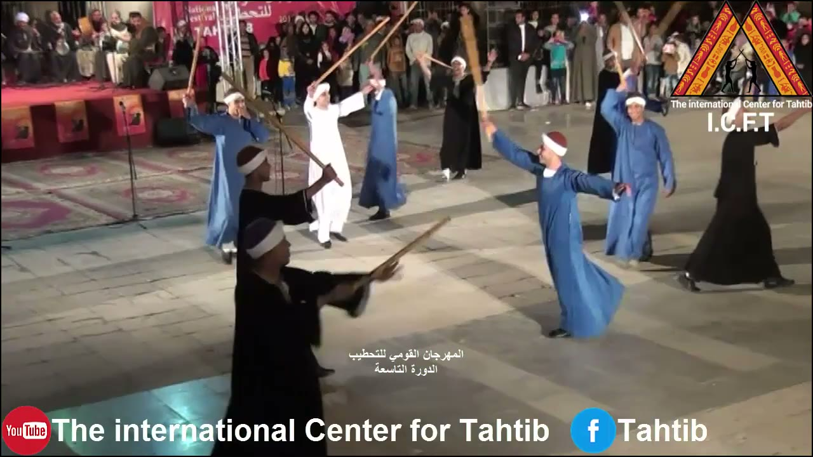
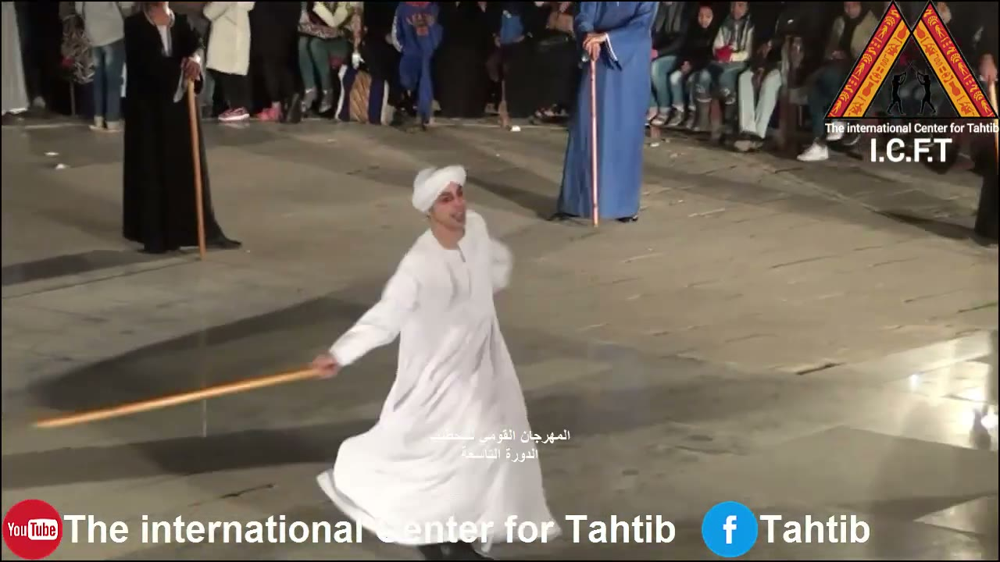
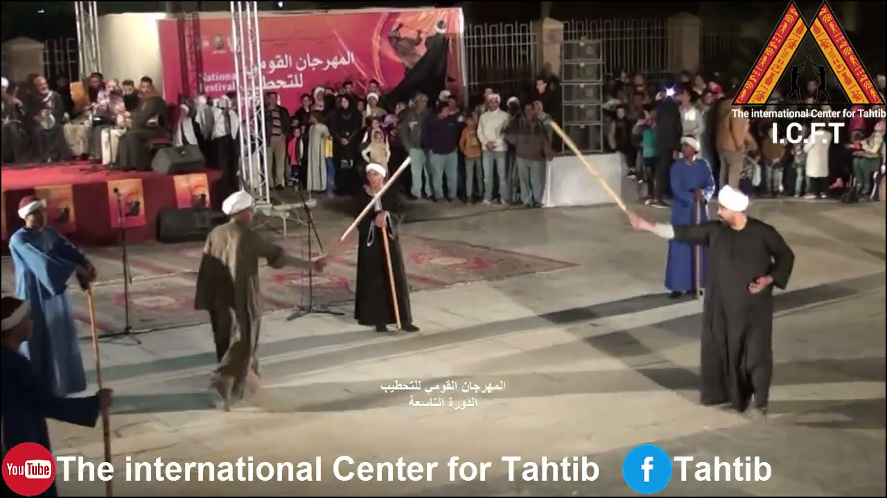
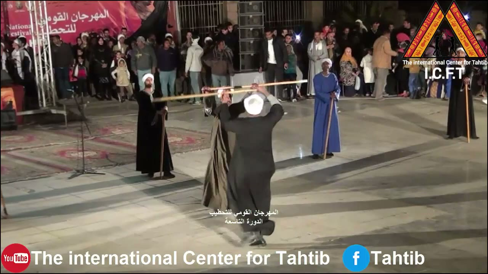
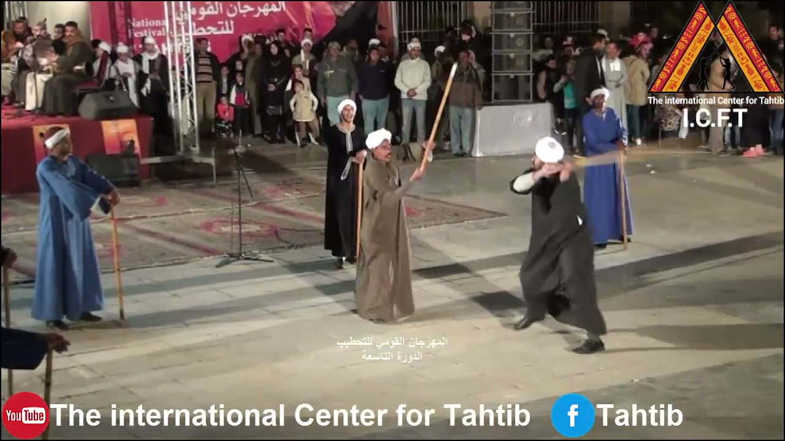
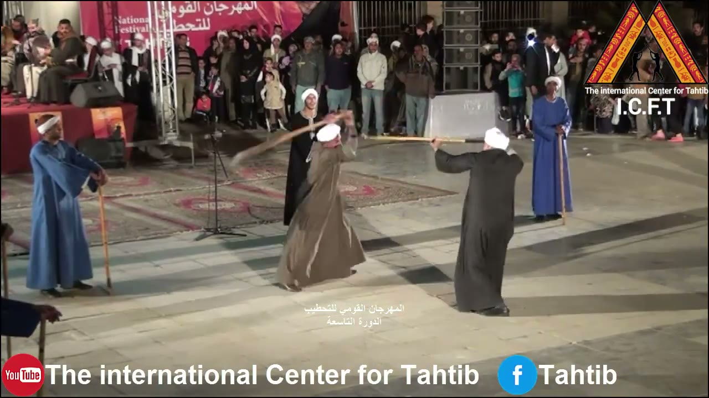
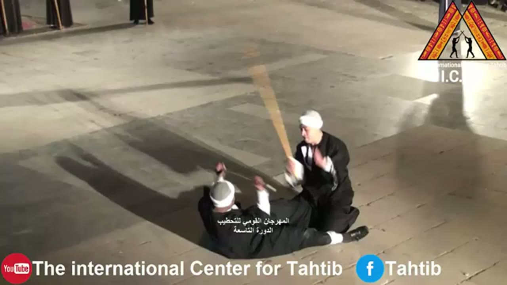
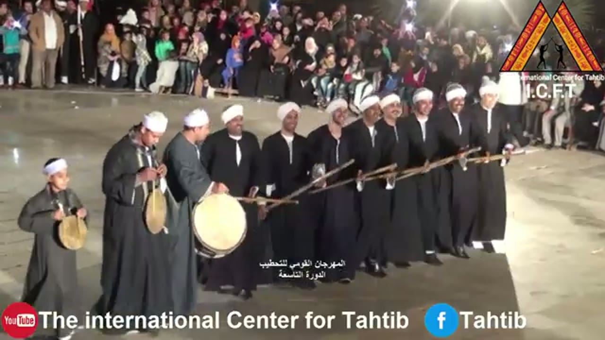
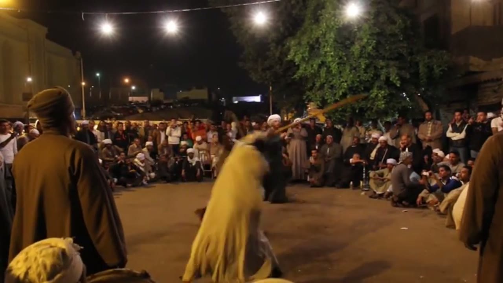
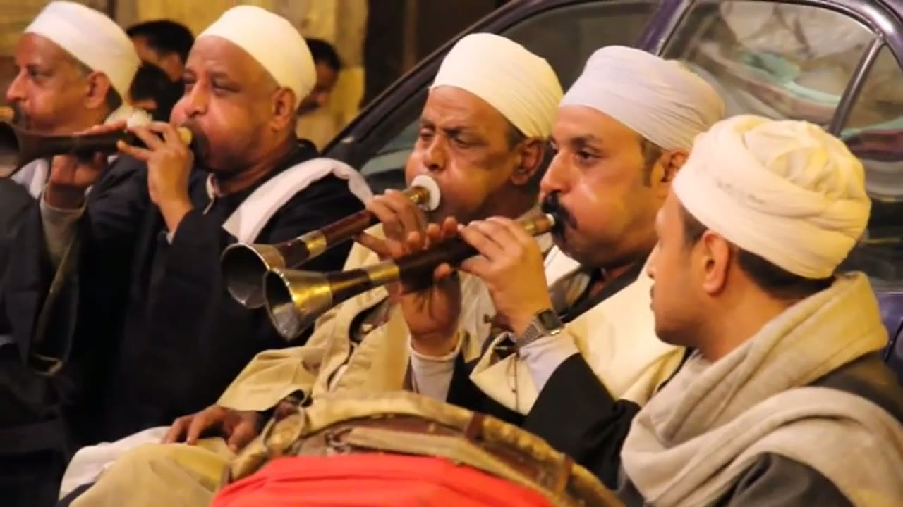

# Tahtib (التحطيب) reference keyframes

Reference for redrawing the Hikaya Tahtib animation (stick-fencing dance of Upper Egypt). Made 2026-10-04 and 2026-10-05
from three YouTube videos (`sources.txt`). Ten keyframes, each a different pose or moment, picked from 1,763 frames
extracted at 1 per second (tahtib1 508, tahtib2 451, tahtib3 804). It also carries the timing measurements (the `## Timing`
section): the exchange of stick strokes, the circling, stick angles, and how the soundtrack relates to the strokes.

**How to read the descriptions.** They cover only what is visible in the frame. Where something can't be read (a hand,
a grip, feet under a robe), the entry says so instead of filling it in. When a man's own left and right can't be told
reliably, hands are given by **side of the frame** ("frame-left hand"). Distances are relative ("a few body widths",
"about two stick lengths") unless a number and its method are given. Instruments are named only by what is seen being
blown or struck; none of the footage labels them. In the pair shots the two men are called **the tan-robed man** and
**the dark-robed man**, by robe colour, because that is the only thing that tells them apart from frame to frame.
Several other men stand round the floor in blue or black robes holding walking canes upright at their side; they are
bystanders, not fencers, in every shot where they appear.

## Where everything is

| What | Where |
|---|---|
| Keyframes (10 JPG, 1280 px wide) | `keyframes/` next to this file |
| Source URLs and titles | `sources.txt` |
| Contact sheets: every 2 s, timestamp on each tile | Drive `C:\ai\projects\arabic-app\Hikaya dance reference\tahtib\contact_tahtibN.jpg` |
| 30 s clips with audio | Drive, same folder, `clip_tahtibN.mp4` |
| Analysis outputs, strips and the log of every figure | Drive, same folder, `analysis\` (`LOG.md` is the audit trail; `scripts\` holds the helper scripts written for this pack) |
| Full videos and all 1 fps frames | Machine A only: `C:\media\dances\tahtib\` (`frames\tahtibN\tahtibN_tSSSSs.jpg`, SSSS = second) |
| This note, `sources.txt` and the keyframes in git | `arabic-buddy` repo, `docs/reference/tahtib/` (contact sheets, clips, analysis and videos are not in git) |

## Clips

| Clip | Source span | What's in it |
|---|---|---|
| `clip_tahtib1.mp4` | tahtib1, 5:08-5:38 | Edited documentary footage. At 5:11-5:13 a close shot of a man with a large frame drum and a short beater (checked frame by frame); the 8-second overview tiles at 5:20 and 5:28 show close shots of two men fencing in a park (not checked frame by frame). The soundtrack is drum, pipes and voices; I haven't listened to it, only measured it. Audio level (RMS) 0.064 over 5:08-5:58 |
| `clip_tahtib2.mp4` | tahtib2, 5:29-5:59 | 5:29-5:48.7 is one continuous shot (no cut, slight pans and zooms) of the two men fencing (the 20 s I hand-labelled, the clearest pair in the pack); the overview tile at 5:52 shows a seated audience. Musicians are not in picture. RMS 0.17 over 4:44-5:32 |
| `clip_tahtib3.mp4` | tahtib3, 7:20-7:50 | A line of men with sticks and frame drums at the edge of the floor (7:24 is keyframe 8; 7:25.2-7:26.5 checked frame by frame on the drum player). The 10-second overview tiles at 7:30 and 7:40 show the same line. RMS 0.15 over 7:20-7:50 |

---

## 1. Group on the floor, sticks in the air, night

`tahtib2_t0032s.jpg` · tahtib2 ("Luxor National Band for Popular Arts _ National Festival of TAHTIB", channel TAHTIB) at **0:32**

- Night, paved open floor, camera raised and to one side. Seated people sit on a red platform at the top left; standing spectators fill the back of the frame.
- About ten or eleven men are spread over the floor, loosely, with gaps wider than a body between them (no row, no ring): about five in blue robes, about five in black, one in white. Head dress is a plain white head cloth, a red cap, or a white-banded cap.
- At least eight long, thin, pale wooden sticks are visible, at very different angles at once: near vertical, diagonal, and one close to horizontal in the foreground. Each man holds his stick in one hand or two.
- The blue-robed man at frame-right has both arms stretched out sideways, the frame-left arm higher; a second blue-robed man just behind him has one arm raised high, and a black-robed man at the right edge walks with one arm out to frame-right.
- The two men in the foreground wear dark robes and white-banded caps; the nearer holds his stick across him with its upper end toward frame-right.
- No two sticks are touching in this frame, and no stick is near a body.

## 2. One man alone, spinning, stick held out

`tahtib2_t0218s.jpg` · tahtib2 at **3:38**

- A single man in a white robe and a wound white head cloth, mouth open as if smiling or calling, turns on the spot: the robe is flared out and blurred at the hem.
- His frame-left hand holds a pale stick out to frame-left, pointing slightly down. The visible shaft runs from his fist to the tip: about 13 degrees below horizontal (+-3, measured with `grid.py`, see Timing). The part of the stick behind his fist is hidden.
- His other arm is bent up at the shoulder, hand open and blurred.
- Behind him stand two bystanders: a black-robed man at frame-left and a blue-robed man at the top centre, each with a cane upright at his side.

## 3. The pair apart, sticks raised (pose A)

`tahtib2_t0310s.jpg` · tahtib2 at **5:10**

- The two fencers face each other across an open gap of roughly two stick lengths (image plane). Frame-left: the tan-robed man, white cap, brown robe; frame-right: the dark-robed man, white turban, black robe.
- Each holds a stick pointing up and toward the other: the tan-robed man's passes in front of a black-robed bystander and rises to the upper right, the dark-robed man's rises to the upper left. Both are about 50 degrees above horizontal (38-40 degrees from vertical, +-4), so the two sticks make a V that does not close.
- The dark-robed man holds his stick in his frame-left hand, a pale cuff showing at the wrist; his other hand is on his hip. The tan-robed man's arm is stretched toward the other man and the stick lies along it; which hand it is can't be read from this angle.
- The bystander in black between them holds a cane upright; a blue-robed bystander with a cane stands behind the dark-robed man, and two more stand at frame-left with canes.
- No stick touches another here. This is the "sticks apart" pose that the timeline calls A.

## 4. Sticks crossed overhead, men chest to chest (pose B)

`tahtib2_t0336s.jpg` · tahtib2 at **5:36**

- The two men stand so close that their bodies overlap in the picture; the dark-robed man (white turban) has his back to the camera and is the nearer of the two; the tan-robed man faces him on the far side, mostly hidden behind him.
- Both sticks are held roughly horizontal above head height, one above the other, overlapping across the top of the two men and spanning about a third of the frame width; both men's hands are raised and gripping.
- The shot falls inside the longest crossed stretch of the labelled passage (5:35.3-5:37.7, about 2.4 s; see Timing).
- A black-robed bystander at frame-left holds a cane upright; a blue-robed man at frame-right of the pair holds a cane upright; a black-robed man at the far right edge holds another.

## 5. One stick steep, the other swung across the head

`tahtib2_t0341s.jpg` · tahtib2 at **5:41**

- The tan-robed man (frame-left, brown robe, white cap) holds his stick up steeply, about 20 degrees from vertical with its top leaning toward frame-right (19-23 degrees, +-4, `grid.py` readings; see Timing), his hand at about chest height and his arm bent. A black-robed bystander with a cane stands just behind him.
- The dark-robed man (frame-right, black robe, white turban) has both forearms raised in front of his face; his stick is a motion blur at head height across his forearms, pointing toward frame-right. The blur means it is moving.
- The two sticks do not touch in this frame, and no stick is touching a body.
- A blue-robed bystander with a cane stands behind the dark-robed man; another stands at frame-left.

## 6. One stick held level, the other mid-swing (poses B/C)

`tahtib2_t0342s.jpg` · tahtib2 at **5:42**

- One second after keyframe 5. The dark-robed man (frame-right) holds his stick level at head height, pointing to frame-left (0 degrees, +-2); his hand is near the right end of the stick, which carries on a little past it.
- The tan-robed man (frame-left) has his stick blurred in an arc above and in front of his head, running from near his raised hands to the upper left: it is swinging, not held.
- A bystander's cane near the right edge reads 6 degrees off vertical (+-3), which shows how upright the canes are held compared with the fencers' sticks.
- The tip of the level stick is close to the blurred one, so whether they touch can't be read from this blur; the 10 fps hand labels call 5:41.3-5:42.2 "crossed or touching" (B) and 5:42.3-5:42.4 "mid-swing" (C). The next audio-confirmed contact is at about 5:43.7 (see Timing).

## 7. Two men on the ground

`tahtib3_t0320s.jpg` · tahtib3 ("Sohag National Band for Popular Arts", channel TAHTIB) at **5:20**

- A different, closer shot of the floor from a higher angle; no spectators in the frame. 640 x 360 source, so detail is soft.
- One man lies on his back at frame-left and bottom, white cap, black robe, both hands raised in front of him.
- A second man in a black robe with white cuffs is down on the floor beside him, crouched or kneeling (a black shoe sticks out to frame-right), holding a pale stick raised high in his frame-left hand, pointing up and slightly to frame-left. The stick is blurred, so it is moving.
- The stick is above the men and not touching the man on the ground in this frame. A thin pale line near the lying man's hands might be a second stick; I can't tell.

## 8. Line of men with sticks and frame drums

`tahtib3_t0444s.jpg` · tahtib3 at **7:24**

- A slanting row of about eleven men faces the camera: three at frame-left holding round hand drums, then about eight in black robes shoulder to shoulder, receding to frame-right. White head cloths. Several are smiling.
- Drums: a boy at the far left in a grey robe holds a small round frame drum in front of his chest with both hands. Next to him a man in a dark robe holds a similar one upright, a hand on its rim. The man in a grey robe beside him has a large round drum (pale skin, wooden rim) at belly height and plays it with the open hand: here the hand is at the upper right of the skin, and the frame-by-frame strip of 7:25.2-7:26.5 shows the hand landing flat on the skin.
- Sticks: the men in the row hold long sticks forward at hip-to-waist height, pointing to frame-left and down; several sticks overlap into a bundle whose tips lie near the large drum. Four sticks can be told apart; their angles are 10 to 30 degrees above horizontal, rising to frame-right (+-4; see Timing).
- Spectators stand behind the row; a floodlight glare is at the top.

## 9. Street duel inside a ring of spectators

`tahtib1_t0372s.jpg` · tahtib1 ("Tahteeb, stick game", UNESCO) at **6:12**

- Night, paved ground lit by lamps on a wire and a tree. Spectators sit in a ring on the ground at frame-right and stand behind it; a man in a brown cloak stands in the foreground at frame-left, facing the centre, and two turbaned heads are at the bottom edge.
- Two men fence in the middle. The one in a pale yellow robe is in motion (robe blurred); an arm is raised holding a long stick that rises to the upper right. The second man, in a dark robe, is partly hidden behind him.
- Hands, feet and faces of the two fencers are not readable at this size and blur.

## 10. Pipe players, close

`tahtib1_t0340s.jpg` · tahtib1 at **5:40**

- Close shot of five men seated side by side, white caps or wound turbans; four of them blow long straight pipes with dark wooden bodies, metal rings and flared brass-coloured bells, held pointing down and to frame-left. The man at the left edge is partly cut off.
- The middle player (eyes closed) holds his pipe in both hands; a small pale disc sits against his lips at the mouthpiece end.
- The man at the far right wears a cream turban and a grey scarf and has no pipe at his mouth; he looks toward frame-left.
- At the bottom edge the rim of a large drum with a brown surface and red cloth is visible. A car window is behind the men.
- This is the only close view of the pipes in the pack; they are off-screen during the duels in tahtib2.

---

## Timing

Everything below was measured on 2026-10-04 and 2026-10-05. Every figure is in `analysis\LOG.md` (on Drive) with the command or the
hand count it came from. Times are absolute video time, m:ss or m:ss.s.

**Method.** Audio: `audio.py` (harmonic/percussive split, three frequency bands, pulse search) on stretches of 24 to 64 s; `lowband.py`
(my own helper: onsets of the 40-250 Hz band only, which is where a drum sits and the pipes do not) and `hf_peaks.py` (6-10 kHz peaks,
where a stick clack would show). Pictures: 10 fps strips (hand labels good to +-100 ms), native-fps strips (every source frame:
25 or 30 fps, so +-33-40 ms) around the strikes I checked, `grid.py` for angles (points read off the grid by eye, good to a few pixels).
**tahtib1 is an edited documentary (52 cuts in 8:28), so no cycle can be timed across its shots. tahtib2 is one continuous 720p shot (no cut, slight pans and zooms) of a pair
for more than 20 s and is the main source for the stick exchange. tahtib3 is 360p and hand-held and is the main source for the drum pulse.**

### Audio strokes (4a)

No stretch gives one steady stroke interval: the median interval of the percussive onsets moves a lot as the detection bar rises (for example
tahtib3 7:08-7:50: 160 ms at the lowest bar, 279 ms at the next, 819 ms at the third), and `audio.py` found no repeating pattern (>=85 % match, up
to 16 intervals) in any stretch. The percussive part is only 5-19 % of the energy: the pipes and voices dominate. What does hold, in tahtib3, is a
**grid**: the onsets are phase-locked to a period of 133-135 ms in three independent stretches. R is the phase-lock strength (1.0 = perfect).

| Video | Stretch | Percussive onsets (n, median, IQR, SD) | Best phase-lock period (R) | 40-250 Hz band (n, median interval, lock R, Rayleigh p) |
|---|---|---|---|---|
| tahtib1 | 5:08.0-5:58.0 (50 s) | 203, 168 ms, 145-300, 154 | 143 ms (0.22): not established | 178, 255 ms, R 0.22 at 180 ms, p 2e-4 |
| tahtib1 | 6:00.0-6:40.0 (40 s) | 158, 186 ms, 157-348, 136 | 149 ms (0.29): weak | 119, 293 ms, R 0.32 at 148 ms, p 5e-6 |
| tahtib2 | 0:04.0-0:34.0 (30 s) | 160, 151 ms, 122-238, 120 | 137 ms (0.32) | 88, 273 ms, R 0.55 at 137 ms, p 2e-12 |
| tahtib2 | 4:36.0-5:40.0 (64 s, duels) | 367, 151 ms, 122-215, 70 | 145 ms (0.16): not established | 345, 157 ms, R 0.14 at 100 ms |
| tahtib2 | 4:44.0-5:32.0 (48 s, duels) | 271, 157 ms, 122-231, 74 | 145 ms (0.20): not established | 254, 157 ms, R 0.13, p 1e-2 |
| tahtib3 | 2:36.0-3:36.0 (60 s) | 332, 157 ms, 134-238, 67 | **134 ms (0.33)** | 163, 290 ms, R 0.48 at 267 ms and 0.41 at 134 ms, p 6e-17 |
| tahtib3 | 4:50.0-5:30.0 (40 s) | 224, 151 ms, 128-238, 76 | **133 ms (0.34)** | 171, 186 ms, R 0.37 at 133 ms, p 6e-11 |
| tahtib3 | 7:08.0-7:50.0 (42 s) | 191, 160 ms, 134-273, 101 | **135 ms (0.50)** | 147, 255 ms, R 0.46 at 135 ms, p 4e-14 |

(Also run, overlapping the rows above: tahtib3 4:48-5:25 grid 133 ms R 0.27; tahtib3 7:20-7:50 grid 135 ms R 0.65, low band R 0.67, p 4e-20.)
Grid 133-135 ms = 7.4-7.5 steps per second. Onsets fall 1, 2, 3 or more steps apart, not at one fixed interval; the low-band interval histograms
peak at about 1, 2 and 3 steps (tahtib3 7:08-7:50: 125-150 ms 42 intervals, 250-275 ms 24, 400-425 ms 14, out of 146 intervals).

**A repeating figure, in blocks.** In tahtib3 2:36-3:36, 294 of 331 percussive intervals (89 %) lie in runs of two or more cycles of a three-interval figure,
**short-short-long, 1-1-2 grid steps of 134 ms = a cycle of about 536 ms (about 112 cycles per minute)**; the longest run is 11.7 cycles in 6.2 s
at 3:12.0-3:18.2. The autocorrelation of that stretch peaks at 534 ms (r 0.53). The figure is shorter-lived in the other two tahtib3 stretches (57-59 % of
intervals in runs at 4:48-5:30, 15-17 % at 7:08-7:50). In tahtib2 0:04-0:34 the same kind of figure, 2-1-1 steps of 137 ms (548 ms cycle), covers 65 % of intervals; longest 5.0 cycles at 0:09.9-0:12.7.
These counts are of every percussive onset in the mix (drum strokes and any other sharp attack, pipe attacks included), not of one drum.

**Cross-check by eye (only a few strikes were visible).**
- tahtib3, 7:25.2-7:26.5, native 30 fps, the man at frame-left hitting a large frame drum with the open hand: two low-band onsets fall in the window, at 7:25.633 and 7:26.433, and on both frames his hand is on the skin (2 of 2). His hand also reaches the skin at other moments of the same window (about 7:25.2, 7:25.8-7:25.9, 7:26.0-7:26.07) with no onset above my threshold. Two matches are too few to compare intervals, so I don't report a visible-strike median.
- tahtib1, 5:11.52-5:12.44, 25 fps, a man with a short beater and a large frame drum: the beater is at the skin on the frame flagged for the onset at 5:11.720 (1 of 1 visible); after 5:11.76 the beater hand is below the crop, so the following onsets (5:11.880, 5:12.040, 5:12.200, 5:12.360, 160 ms apart) can't be checked.
- tahtib2 5:28-5:49: the strokes that are visible are the stick contacts (below); the drummers are off-screen.
- Offset between picture and sound: on the three flagged strikes the hand or beater is at the skin within about one frame (33-40 ms) of the audio onset; nothing larger was seen.

**What the onsets are.** I looked at the spectrogram of tahtib3 7:08-7:50 (`v3_B_audio.png`): horizontal harmonic stripes about 1 kHz apart reaching 8 kHz, some gliding (a sustained pitched sound, which is the pipes or voices),
plus vertical broadband bursts that reach down below 500 Hz at nearly every beat (the drum band). The other spectrograms were not inspected. The script cannot separate crowd noise from the bursts, and the drum heard is not shown to be the one in picture except for the 2+1 strikes above.
In tahtib2 11 of the 17 loudest 6-10 kHz peaks in 5:28-5:49 coincide with a visible stick contact (4 do not, 2 can't be decided), so that sound is the live sound of the picture; for the pipes and drums I have not checked that they belong to the men in view.

### The exchange of strokes between the two men (4b, 4d)

The pair do not keep a steady rhythm of strokes; they come in flurries (sticks meeting every 0.3-0.5 s) and gaps of 2-3 s. Sticks **do** meet stick on stick:
no blow landed on a body in the 45 s of tahtib2 I looked at frame by frame (4:54.0-4:58.1, 5:08.0-5:28.7, 5:28.9-5:49.1: count 0; 10 fps could miss a touch under 100 ms).

| What | Stretch | n | Result |
|---|---|---|---|
| Audio-confirmed contacts (17 loudest 6-10 kHz peaks examined frame by frame: 11 with sticks seen meeting within +-2 frames, 4 not contacts, 2 undecided) | tahtib2 5:32.6-5:47.8 | 11 peaks = 10 exchanges (5:43.68 and 5:43.76 counted as one), 9 intervals | median 1114 ms, mean 1687, SD 1346, IQR 1037-2188; without the 4.7 s gap in the clinch at 5:33.8-5:37.4: 8 intervals, median 1088 ms, mean 1308, SD 767 |
| Hand count: starts of "sticks crossed or touching" (pose B) | tahtib2 5:29.5-5:46.6 | 19 intervals | median 800 ms, mean 900, SD 676, IQR 450-1050, range 300-3100 ms |
| Same | tahtib2 5:10.9-5:26.9 | 13 intervals | median 1200 ms, mean 1231, SD 576, IQR 800-1600, range 400-2300 ms |

The audio list is a subset: only contacts that made a clack above my threshold are in it (the labels also show contacts at, for example, 5:30.0-5:30.1 and 5:42.0-5:42.2 with no listed peak).
So a stick exchange about every **0.8-1.2 s (median)**, very uneven (CV 0.47-0.75). The contacts do not fall on the drum onsets: signed offset to the nearest 40-250 Hz onset for the 11 peaks
(ms, + = drum later) -38 28 84 -134 -58 -23 53 -32 9 23 -81; median |offset| 38 ms, 6 of 11 within 40 ms; random times in the same stretch give 48 ms on average (chance of 38 or less: 0.28).
The drum pulse is not established in that stretch (above) and the drummers are not in picture, so the stick strokes are not shown to be tied to the music at all.

**Circling.** The two men do not run round a fixed centre that I can follow; they face each other a few body widths apart and **swap sides by walking past each other with sticks up**. Hand-counted passes
(the two men level in the frame, tahtib2 10 fps strips): in 5:08-5:28.8 five passes at about 5:12.2, 5:17.5, 5:20.6, 5:24.0, 5:27.1 (gaps about 5.3, 3.1, 3.4, 3.1 s, n=4, each good to about +-0.5 s);
in 5:29-5:48 passes at about 5:32.2, 5:34.2, 5:36.5, 5:40.5 (gaps about 2, 2.3, 4 s, n=3). A rate in degrees per second is **not measurable**: no fixed centre, only part of the path in view, camera low and to one side. The robes hide the men's feet;
small quick steps are visible and one man leaps clear of the floor at 5:40.7-5:40.9. `motion.py` gave no usable period: its energy spectrum has a peak at 245 ms, identical in a control strip of the crowd at the top of the frame, so it is not the fencing, and the cycles it found (3-7 s) are single passes.

**Stance and stick angles** (`grid.py` readings in 1280 x 720 frames, image-plane angles, +-4 degrees unless stated; the camera is low and to one side, so true angles differ):

| Frame | What | Angle |
|---|---|---|
| tahtib2 5:10.0 (keyframe 3) | both men's sticks, pair apart | dark-robed man's 50 degrees above horizontal (40 from vertical), tan-robed man's 52 above (38 from vertical), tilted the opposite way |
| tahtib2 5:41.0 (keyframe 5) | tan-robed man's stick | 19-23 degrees from vertical (67-71 above horizontal), top toward frame-right |
| tahtib2 5:42.0 (keyframe 6) | dark-robed man's stick | level, 0 degrees (+-2) |
| tahtib2 3:38.0 (keyframe 2) | solo man's stick | 13 degrees below horizontal (+-3), tip lower than the hand |
| tahtib3 7:24.0 (keyframe 8) | four sticks of the row | 30, 18, 14, 10 degrees above horizontal, rising to frame-right |

Stance is not measured as an angle. In keyframe 3 the dark-robed man has one hand on his hip and the stick in the other; in keyframes 5 and 6 both of his arms are raised. Stick length against body height: the visible shaft in keyframe 2 is about 0.74 of
the man's visible height (375 px of about 505 px from his turban top to the bottom edge of the frame, where his feet are cut off; he leans toward the camera and the end behind his fist is hidden), so **not measurable**; the stick is at least that long.

### Pose timeline (4c)

Poses, named from the keyframes: **A** sticks apart (keyframe 3), **B** sticks crossed or touching (keyframe 4), **C** a stick in fast motion, blurred (keyframe 6), **D** sticks lowered, men turning or walking apart.
Hand labels on 10 fps strips of tahtib2 (+-100 ms, so durations of 100-200 ms are "about"). The 3rd stretch (the group at 0:30-0:50) was not labelled: groups, no single pair.

| Stretch | Change points | Segments | Time in A / B / C / D | Segment length |
|---|---|---|---|---|
| tahtib2 5:29.0-5:48.7 (S1) | full list in the log: starts A 5:29.0, B 5:29.5, A 5:29.9 ... B 5:46.6, C 5:48.2, D 5:48.3 | 65 | 5.1 s (26 %) / 10.9 s (55 %) / 3.3 s (17 %) / 0.4 s (2 %) | mean 303 ms, median 200 ms; B segments mean 545 ms, longest 2.4 s (5:35.3-5:37.7) |
| tahtib2 5:08.0-5:28.8 (S2) | full list in the log: A 5:08.0, C 5:08.9, A 5:09.2 ... C 5:28.1, A 5:28.3 | 43 | 8.4 s (40 %) / 8.5 s (41 %) / 3.5 s (17 %) / 0.4 s (2 %) | mean 484 ms, median 400 ms |

**Order and repetition.** The poses follow no fixed order. Transitions in S1: C to A 13, A to B 12, B to C 12, A to C 10, B to A 8, C to B 8, C to D 1; in S2: A to B 11, B to A 9, C to A 6, B to C 5, A to C 4, C to B 3. No block repeats (best self-match of the sequence 45 % in S1, 58 % in S2;
none of 4000 shuffles with the same pose counts shows one either, so the test can find a repeat if there is one). The poses do not change on a regular beat: segments last 100 ms to 2.4 s, and the mean is a pose change about every 0.3-0.5 s.

### Proposed animation constants (4e)

| Constant | Value | Evidence | Confidence |
|---|---|---|---|
| `BEAT_MS` (time between pose changes) | **not measurable as a beat**: poses change every 303 ms on average (S1) and 484 ms (S2), no regular interval (segments 100-2400 ms) | tahtib2 5:08-5:48.7, hand labels at 10 fps (+-100 ms), 108 segments | medium for the mean, none for a beat |
| `STROKE_MS` (time between instrument strokes) | **grid of 134 ms (133-135)** with strokes 1, 2 or 3 steps apart, and a **three-stroke figure 1-1-2 steps = about 536 ms** that runs in blocks (6.2 s at tahtib3 3:12.0-3:18.2); not measurable as one fixed interval; not measurable in tahtib1 or in the tahtib2 duels | tahtib3 2:36-3:36, 4:50-5:30 and 7:08-7:50: phase-lock 134, 133, 135 ms (R 0.33-0.50, p below 1e-10 in the low band); tahtib2 0:04-0:34: 137 ms; the strokes themselves matched by eye on only 3 strikes | medium (three stretches, two videos, audio only; the eye check can't confirm the interval) |
| `MOVE_PERIOD_MS` (main repeating movement: the stick exchange) | **about 1100 ms** between exchanges (median; range 300-3100 ms; uneven) | tahtib2 5:32.6-5:47.8: 9 audio-confirmed intervals, median 1114 ms; hand count 5:29.5-5:46.6 median 800 ms (n=19) and 5:10.9-5:26.9 median 1200 ms (n=13) | low (one pair, one video, the two methods differ by 30 %, wide spread) |
| `MOVE_SIZE` (size of the movement, degrees) | stick elevation: **about 50 degrees above horizontal** in the apart pose (A), **0 to 70** across the exchange; the men keep about two stick lengths apart in A; a full circle and the stride: **not measurable** | tahtib2 5:10.0, 5:41.0, 5:42.0 and 3:38.0 (`grid.py`, +-4 degrees, image plane, single frames) | low |
| `SEQUENCE` | **none**: the pose order is free, with A, B and C interleaved and no repeating block (B, sticks crossed or touching, is 20 of 65 segments in S1 and 14 of 43 in S2) | tahtib2 5:08-5:48.7, 108 hand-labelled segments; shuffles test | high that there is no fixed order, in this footage only |

---

## Not covered by these frames

- **Whether a blow ever lands.** In the 45 s of tahtib2 I checked frame by frame, none does. tahtib1 and tahtib3 were not checked frame by frame (tahtib1 is cut into 2-8 s shots; the pair in tahtib3 5:10-5:20 is on the ground and only keyframe 7 was inspected). tahtib1 is a documentary with duel shots and interviews; I have not counted blows in its shots.
- **Instruments next to a duel.** The pipes are seen close up only in tahtib1 (keyframe 10) and are not in picture during the tahtib2 duels. The drums are seen in tahtib3 (keyframe 8) and tahtib1 (5:11). The brief names a pipe called mizmar and a drum called tabl; nothing in the footage labels them, and the drums seen here are round frame drums played with hands or a short beater. I can't say whether either is the instrument you meant.
- **The sound is not matched to the strokes.** The drum onsets are matched to the picture on only three strikes; the stick contacts do not fall on the drum onsets more than chance; and no steady stroke interval exists, only the 134 ms grid.
- **Feet and stance.** Robes cover the feet in every wide shot; no stance angle was measured. Grips are visible only as a hand at one end of the stick; the two-hand grip over the head is seen in keyframe 4.
- **A full circle.** Not measurable (above).
- **Only one festival and one fixed shot of a pair.** tahtib2 and tahtib3 are the same festival stage (per the uploader, the 9th National Festival of Tahtib, Luxor); the exchange timing rests on a single pair over 20 s, so it describes that pair. The street duels of tahtib1 are cut up and blurred.
- **Quality.** tahtib3 is 360p, hand-held, with a watermark; tahtib2 carries a channel logo and an Arabic caption over the lower part of the picture.
- **Costume close-up.** The duellists wear long dark or brown robes and white turbans or caps; no frame shows the cloth, belts or shoes of a fencer up close.
