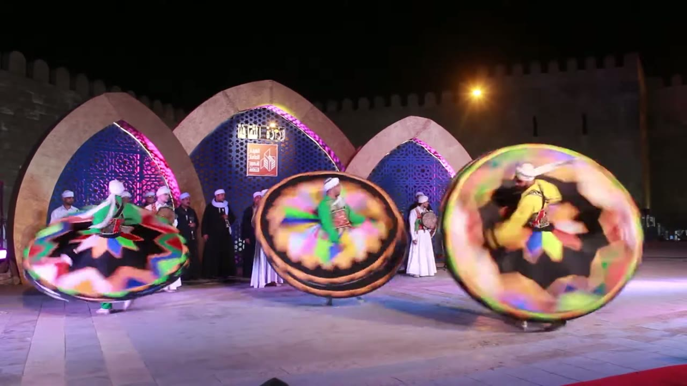
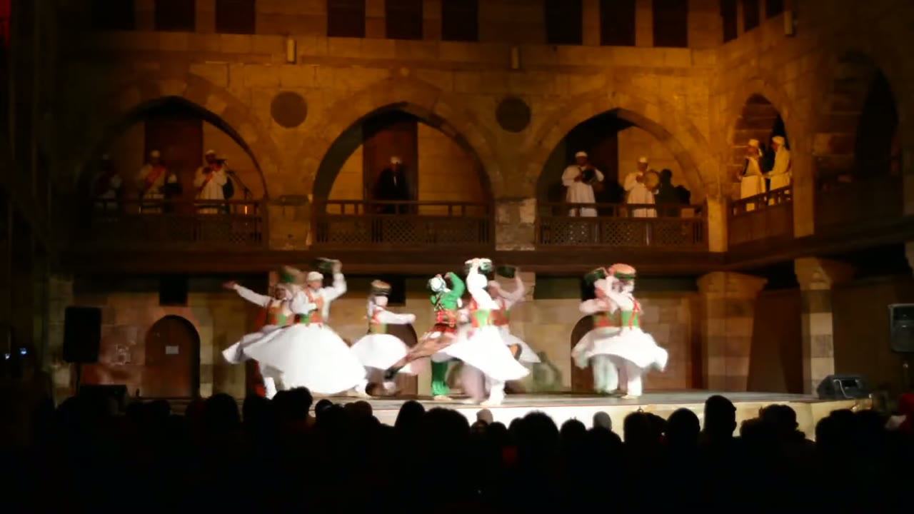
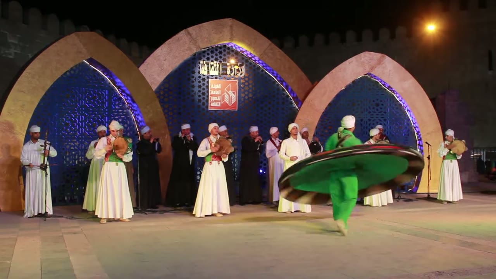
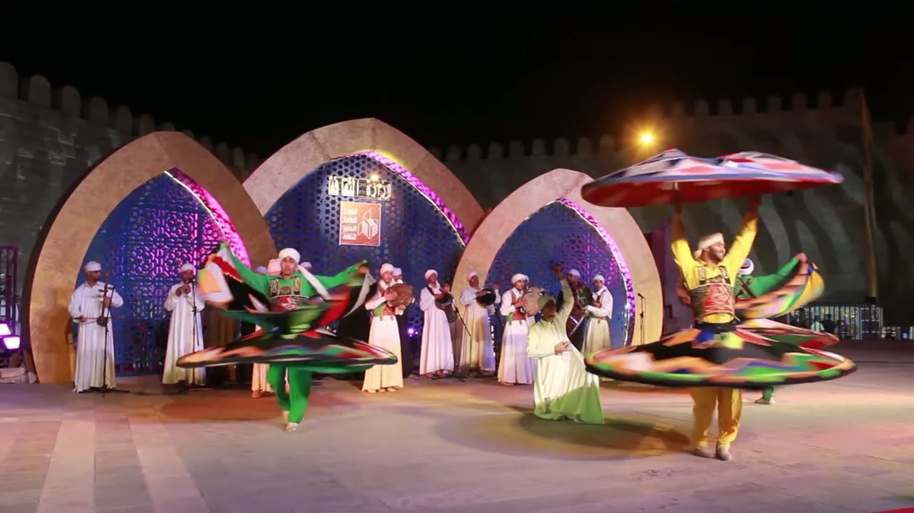
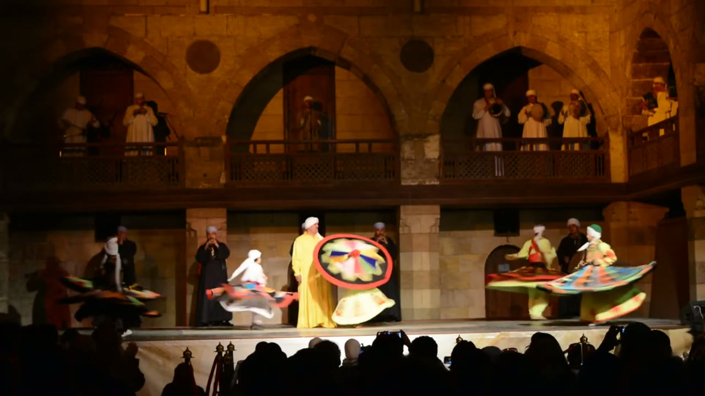
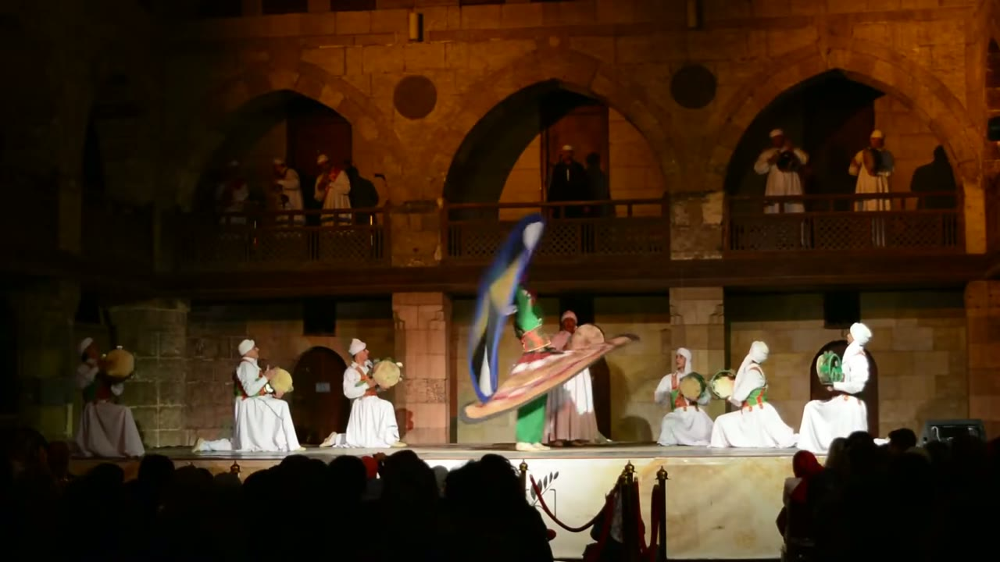
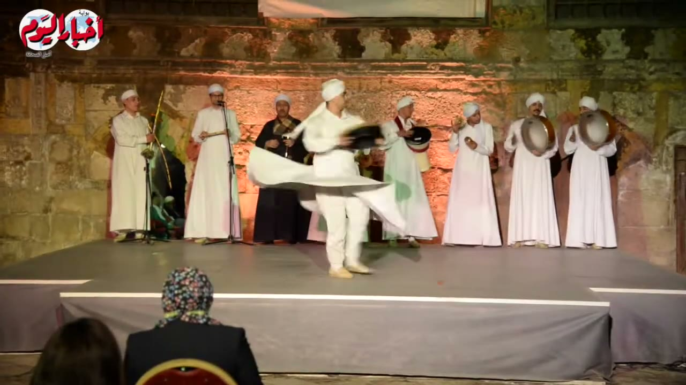
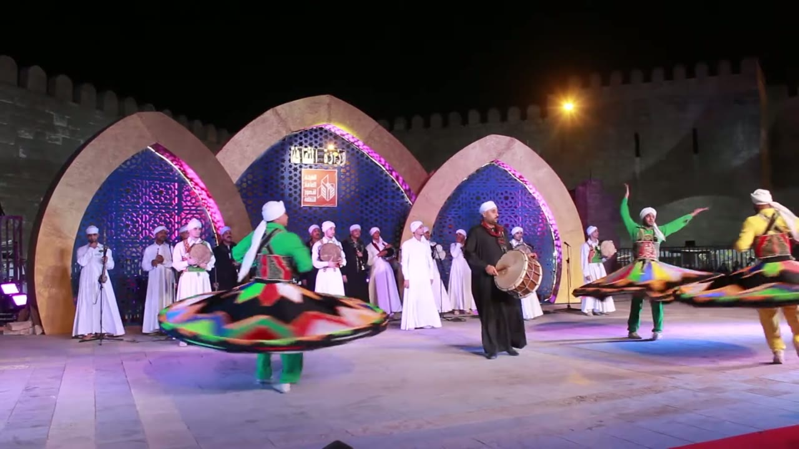
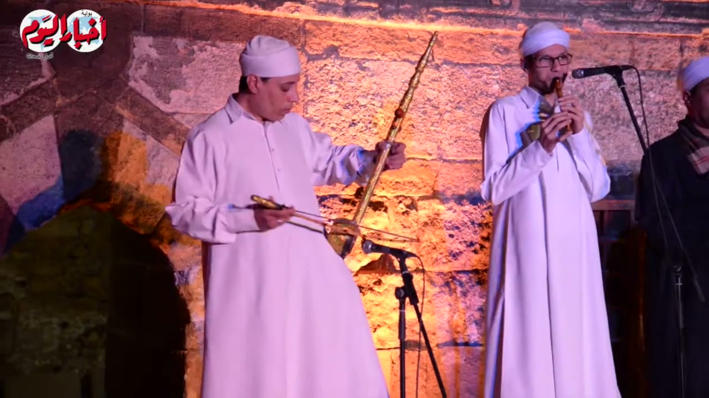
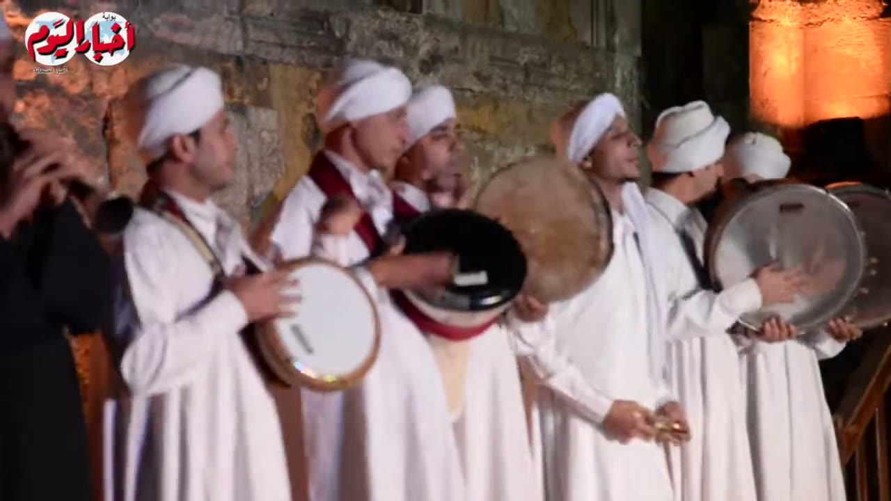

# Tanoura (التنورة) reference keyframes

Reference for redrawing the Hikaya Tanoura animation (Cairo; the titles of videos 3 and 6 bill the performers as the Heritage Tanoura troupe, video 1 as "the heritage Tanoura"). Made 2026-10-04 from three
YouTube videos (`sources.txt`). Ten keyframes, each a different pose or
moment, picked from 1,683 frames extracted at 1 per second (325 + 617 + 741).
It also carries the timing measurements (see "Timing").

**How to read the descriptions.** They cover only what is visible in the frame.
Where something can't be read (a hand, the object in a hand, feet, the number of
skirt layers), the entry says so instead of filling it in. When a performer's own
left and right can't be told reliably, hands are given by side of the frame
("frame-left hand"). Sizes are relative ("about 1.2 standing heights") and only
where the Timing section names the frame and the method; nothing is in metres.

## Where everything is

| What | Where |
|---|---|
| Keyframes (10 JPG, 1280 px wide) | `keyframes/` next to this file |
| Source URLs and titles | `sources.txt` |
| Contact sheets: every 2 s, timestamp on each tile | Drive `C:\ai\projects\arabic-app\Hikaya dance reference\tanoura\contact_tanouraN.jpg` |
| 30 s clips with audio | Drive, same folder, `clip_tanouraN.mp4` |
| Analysis folder (log, audio plots, onset csvs, strips, scripts) | Drive, same folder, `analysis\` (`LOG.md` lists every command and hand count behind the Timing section) |
| Full videos and all 1 fps frames | Machine A only: `C:\media\dances\tanoura\` (`frames\tanouraN\tanouraN_tSSSSs.jpg`, SSSS = second) |
| This note, `sources.txt` and the keyframes in git | `arabic-buddy` repo, `docs/reference/tanoura/` (contact sheets, clips, analysis and videos are not in git) |

Video numbers are 1, 3 and 6 because 2, 4 and 5 were looked at and dropped (a studio talk show with logo and ticker, a talk programme, and a 1.1 GB video that was not finished); tanoura2, 4 and 5 do not exist in this pack.

## Clips

| Clip | Source span | What's in it |
|---|---|---|
| `clip_tanoura1.mp4` | tanoura1, 2:28-2:58 | Fixed wide camera. The dancer at the right-hand end of the stage turns about once a second (clockwise as seen) with hands on hips; a child's red-rimmed disc is held up at head height beside a man standing in a long yellow robe from about 2:30. Music throughout. I haven't listened to it |
| `clip_tanoura3.mp4` | tanoura3, 0:54-1:24 | Hand-held. A man in white (long robe, white trousers) walks with the robe hanging, then spins from 0:56 and the robe widens into a flat disc by 0:58.6 (clip 0:02-0:05); the shot holds the disc to about 1:05 and cuts at 1:05.8 (clip 0:11.8) to the line of musicians; after 1:08 he walks at the frame-left edge, arms out, robe hanging. I haven't listened to it |
| `clip_tanoura6.mp4` | tanoura6, 2:50-3:20 | Fixed wide camera, two dancers. At 2:59.4 (clip 0:09.4) the yellow-top dancer raises his upper skirt layer from shoulder height to overhead in about 0.3 s, holds it about 7 s, then lowers it in steps from 3:09.9 (clip 0:19.9) to 3:11.7. I haven't listened to it |

Mean audio level measured with ffmpeg `volumedetect`: clip 1 -8.4 dB, clip 3 -15.4 dB, clip 6 -16.8 dB (peak 0 dB in all three).

---

## 1. Formation: three discs, musicians behind

`tanoura6_t0424s.jpg` · tanoura6 (General Authority for Cultural Palaces) at 7:04

- Night, an open stage in front of three pointed-arch screens (sand-coloured frames, blue lattice panels lit magenta at the edges) with a crenellated stone wall behind; one street lamp glows at upper right. Pale stone floor, a strip of red carpet at the bottom-right corner.
- Three dancers spin in a row across the front, each wearing a skirt that is now a wide disc: black outer ring, bright coloured wedges inside (the centre and right discs show pink, green, blue, orange, yellow). Frame-left dancer: white head-cloth, green top, the disc seen at a slant, wider than tall. Centre dancer: white head-cloth, green top; the disc has a near-circular outline with his chest and arms in its middle, so it looks tipped up toward the camera (I can't tell from one frame how it is held). Frame-right dancer: yellow top, a disc of about the same size and outline, his head and torso in its middle; that disc is about 380 px wide in this 1280 px frame.
- The discs are blurred by motion: the wedge pattern is smeared round each rim.
- Behind the dancers, at the left, about eight musicians stand in white and black robes; at frame-right (x about 780) one in white holds a round frame drum at chest height.
- The shot is the same wide camera as keyframes 2, 3, 4 and 8.

## 2. Formation: a courtyard, six dancers, balcony musicians

`tanoura1_t0010s.jpg` · tanoura1 (Ministry of Culture) at 0:10

- Night, a low stage in an arcaded stone courtyard: two storeys of pointed arches, wooden balconies with railings, two round blind medallions on the upper wall. Warm light on the stone; the bottom fifth of the frame is the dark silhouettes of the audience's heads.
- About six dancers stand and spin across the middle of the stage, most in a white top with an orange-red vest or crossed straps trimmed in green, and a white skirt flared to a cone or disc at hip height; several wear a small orange cap with a green band (zoomed crop). One dancer, at the centre, wears a green top, green trousers, a white cap and a red-and-white band at the waist, with a brown-and-white skirt tipped diagonally.
- On the upper balcony men in white stand at the railing; one at frame-right holds a round frame drum at chest height. The small size of the dancers (about one sixth of the frame height) means faces and hands can't be read here.
- Camera is fixed (the same view runs 0:00-1:00 with only the dancers moving).

## 3. One dancer, one disc, musicians in a line

`tanoura6_t0064s.jpg` · tanoura6 at 1:04

- A single dancer at frame-right in a green shirt, green trousers and a white head-cloth, turning with one wide flat green-topped skirt at about hip height, black and brown stripes at its rim; the disc is about 380 px wide (x 718 to 1095), tilted so its frame-left edge is lower. One foot is visible under it.
- Behind him about fourteen men stand in a row in front of the arches, in white and black robes with white head-cloths. Two of them, in long white skirts and green-and-red vests (the costume of the dancers in keyframe 2), hold round frame drums at chest height (x about 300 and 575 in the frame; two more drums at about x 810 and 1180). At the frame-left end a man holds a long upright instrument in front of him with a bow held across it, beside a microphone stand (zoomed crop). Three men in black robes (x about 390, 480 and 670) hold a small pipe up to the mouth.
- The red-and-white card on the centre arch is the authority's logo.
- Nobody else in the row is moving except for small hand movements.

## 4. Skirt layer raised overhead

`tanoura6_t0184s.jpg` · tanoura6 at 3:04

- At frame-right, the yellow-top dancer: yellow long-sleeved shirt, an embroidered vest (red panel with dark pattern), yellow trousers, a white wrapped head-cloth. Both arms are straight up with the hands above his head, and they hold a wide disc overhead: red underside, white, blue and red pattern on its upper face. Raised disc about 370 px wide, its centre about 1.25 standing heights above the floor (grid reading on this frame, see Timing; +-0.1).
- At his hips a second disc (black with green, orange and white blotches) is flat and spinning, about 375 px wide, about 1.2 standing heights across. His feet are visible below it.
- At frame-left a green-top dancer leans, with a black-and-colour disc at his waist and a layer of rainbow wedges (green, yellow, blue, orange) flung out behind him.
- In the middle of the stage a person in a long pale green robe stands; musicians in white stand against the arches behind.

## 5. A child's disc at head height

`tanoura1_t0152s.jpg` · tanoura1 at 2:32

- At centre-left a man stands still in a long yellow robe and a white head-cloth (face toward frame-right). At his frame-right, a dancer's red-rimmed disc is held up at about the man's head height: black ring inside the red rim, multicoloured wedges (blue, yellow, pink, white, green) round a red centre, seen nearly face-on. Below it a cream-yellow skirt flares as a bell; the dancer's own body and head are hidden behind the disc and the standing man.
- At frame-right a man in a dark robe holds a slender pipe to his mouth. At the left edge a small dancer in white and orange spins with a black-and-orange skirt blurred sideways.
- At the far right two dancers spin with flared coloured skirts; on the upper balcony men in white stand at the railing, some holding drums or pipes (too small to say which).

## 6. Skirt layer flung up beside the dancer

`tanoura1_t0206s.jpg` · tanoura1 at 3:26

- A dancer in a green top and green trousers spins at the centre of the stage. One tan-and-orange skirt layer is thrown up and tipped almost vertical on his frame-left side; beside it a long blue-and-white-and-yellow cloth streams upward (I can't tell from this frame whether it is part of the skirt).
- Behind him a man in a dark robe holds a frame drum at chest height. At frame-right a man in white sits on the stage floor with a round frame drum with a green-and-orange pattern on his knee; at the far left another man sits with a tan frame drum, partly cut off.
- Warm stone wall with arches; audience heads in silhouette along the bottom.

## 7. White robe widening into a disc

`tanoura3_t0058s.jpg` · tanoura3 (Akhbar El yom TV) at 0:58

- A man in a white long-sleeved top, white trousers, beige shoes and a white head-cloth whose tail flies out behind his head, mid-turn. His white skirt (how many layers it has can't be read) is spread at hip height into a flat disc, tilted a little, from about x 465 to x 770 in the 1280 px frame (grid crop), about 0.9 of his standing height across (standing height about 330 px, +-30). Both hands are in front of his chest holding a flat round black object that is blurred; I can't say what it is.
- Behind him a line of about nine men stands against a warm-lit stone wall, in white robes (pale green and pink where the stage light falls), one in black with an embroidered chest panel (x about 540). At the right of the line a man holds a round black-faced drum with a red rim at chest height; at the left a microphone stand.
- At the bottom-left a spectator in a patterned head covering sits with their back to the camera; another spectator in dark clothes at the bottom centre. The red-and-white logo at the top left is the channel's.

## 8. A drummer

`tanoura6_t0330s.jpg` · tanoura6 at 5:30

- A man in a black robe with a red scarf and a white head-cloth stands in the middle of the stage holding a large double-headed drum at waist height, tilted, its rope-laced shell toward the camera and its skin facing frame-left. A short stick is in his frame-left hand against the skin (zoomed crop); his frame-right hand is on the far edge of the drum.
- Behind him, at frame-right, a man in white with a green-and-red vest holds a frame drum; a dancer's black-and-colour skirt disc is cut off at the right edge; another spins at the left (green top, disc about 320 px wide).
- This drummer is in picture from about 5:20 to 6:20.

## 9. A bowed instrument and a pipe

`tanoura3_t0026s.jpg` · tanoura3 at 0:26

- Two men in white robes in front of a stone wall lit orange and pink; a third in dark clothes and a white head-cloth at the right edge.
- Frame-left man: holds a long-necked instrument upright in front of him, its neck leaning to frame-right, with a short brass-coloured bow in his frame-left hand held across the strings (zoomed crop); his other hand is on the neck. A microphone is close to the instrument.
- Frame-right man (glasses, white head-cloth): holds a short end-blown pipe up to his mouth with both hands, angled down toward frame-left; a microphone stands in front of him.
- The red-and-white logo at the top left is the channel's.

## 10. Frame drums and small cymbals

`tanoura3_t0033s.jpg` · tanoura3 at 0:33

- A close shot of about six men in white robes and white head-cloths standing in a row, heads about level.
- Frame-left man: holds a round frame drum with a white skin and dark rim against his chest, skin toward the camera, his frame-right hand on the skin. Second man: holds a larger frame drum up in front of his face with the black side toward the camera, red-and-white band round its rim. Fourth man (frame-right of centre): holds a pair of small brass-coloured discs between the fingers at about waist height (finger cymbals). Frame-right man: holds a large silver metal-rimmed round drum at chest height, a hand on the skin.
- At the far left edge part of another man is in frame with something held to his mouth (not readable).

---

## Timing

**Method.** Source frame rates: tanoura1 30 fps, tanoura3 25 fps, tanoura6 23.976 fps. Audio: `audio.py` (percussive onsets, 44.1 kHz), `tempotrack.py` (12 s windows, 6 s hop). Turn counts are hand counts read from timestamped strips of the dancer (`strip.py`, and a strip cropped round one dancer so he stays in the middle); `follow_period.py`, `track_turns.py`, `flowdir.py` and `motion.py` were leads or cross-checks only. Resolution: a hand-read moment on a 12 fps strip is good to +-60 ms, on 8 fps +-80 ms, on 3 fps +-170 ms, on native frames +-one frame (33-42 ms); durations below are quoted as "about". Every figure, with its command, strip and tiles, is in `analysis\LOG.md` (Drive copy).

### 4a. Instrument strokes

**tanoura1** (Ministry of Culture). 96-98 % of the sound is sustained (voice, wind, strings: harmonic energy), so there are almost no struck strokes to time. Four stretches:

| Span | perc. onsets | median IOI ms (IQR; SD) | median at higher bar | autocorr peaks ms (r) |
|---|---|---|---|---|
| 0:48-1:24 | 173 | 182.9 (149.5-284.4; 76.3) | 296.1, then 1195.8 | 290 (.34), 906 (.29), 1196 (.47) |
| 1:36-2:14 | 197 | 185.8 (110.3-255.4; 91.4) | 301.9, then 1027.5 | 255 (.19), 511 (.32), 1022 (.31) |
| 2:04-2:34 | 158 | 185.8 (116.1-249.6; 79.1) | 345.4, then 896.9 | 511 (.25), 1022 (.29), 2038 (.27) |
| 2:24-3:24 | 295 | 214.8 (127.7-261.2; 85.1) | 423.8, then 1024.6 | 261 (.22), 511 (.31), 1016 (.34), 2032 (.29) |

The median interval jumps as the prominence bar rises in every stretch, and no repeating pattern of up to 16 intervals was found in any of them: **no steady stroke is established in tanoura1.** What does come back is a period of about 511 ms and 1022 ms in the autocorrelation (r 0.25-0.34) and, in `tempotrack.py`, median intervals of 487-534 ms with autocorrelation r 0.39-0.60 in most of the 12 s windows between 1:30 and 3:06 (other windows jump between 600 and 1020 ms); it comes from sustained sound, and I do not name its source.

**tanoura6** (General Authority for Cultural Palaces). Six stretches:

| Span | share perc./harm. | perc. onsets | median IOI ms (IQR; SD) | BPM from median | median at higher bar | autocorr (r) | grid (phase-lock R) |
|---|---|---|---|---|---|---|---|
| 0:14-0:44 | .08/.92 | 154 | 220.6 (121.9-238.0; 74.6) | 272 | 243.8, then 940.4 | 232 (.54), 929 (.56) | 117 ms (.45) |
| 2:56-3:26 | .27/.73 | 198 | 133.5 (98.7-185.8; 78.3) | 449 | 226.4, then 461.5 | none above .14 | 106 ms (.19) |
| 3:38-4:08 | .16/.84 | 166 | 197.4 (116.1-220.6; 73.7) | 304 | 209.0, then 397.6 | 209 (.63), 412 (.45) | 105 ms (.25) |
| 4:00-4:20 | .10/.90 | 90 | 214.8 (185.8-232.2; 100.1) | 279 | 232.2, then 400.5 | 221 (.52) | 110 ms (.58) |
| 5:20-5:50 | .54/.46 | 187 | 127.7 (116.1-219.1; 67.9) | 470 | 232.2, then 586.3 | 238 (.36), 360 (.39), 946 (.39) | 119 ms (.39) |
| 6:00-6:30 | .51/.49 | 176 | 133.5 (110.3-220.6; 79.2) | 449 | 226.4, then 348.3 | 226 (.41), 342 (.32) | 115 ms (.51) |

In tanoura6 the percussive onsets sit on a grid of about 105-119 ms; each interval is one or two grid steps (about 115 ms or 230 ms) in a changing order, e.g. 5:20-5:50: "2 4 1 2 1 1 1 1 1 1 2 1 2 ..." and 4:00-4:20: "2 2 2 2 2 2 2 2 2 2 1 1 2 2 2 2 3 2 ..." (units of 110 ms); no pattern of up to 16 intervals repeats in any stretch. The median moves with the bar in every stretch, so **no single stroke period is established.** The steadiest stretch is 4:00-4:20: 214.8 ms (n 90), 232.2 ms at the higher bar (8 % apart), about 272 BPM, though only 10 % of the energy there is percussive. `tempotrack.py` also finds a steadier slow period near the end: in the 12 s windows from 9:44 to 11:30 the autocorrelation period is 580-615 ms with r 0.66-0.81 (the median interval in those windows varies from 377 to 964 ms); not checked against a picture.
Ruling out what isn't a drum: 5:20-5:50 and 6:00-6:30 have the highest percussive share (0.54, 0.51), vertical broadband bursts with low-frequency energy in the spectrogram, and percussive onsets that show up in the low, mid and high bands together (172, 180 and 170 of 187 onsets at 5:20-5:50). In the other stretches the percussive share is 0.08-0.27 and voice and sustained instruments dominate. Which instrument makes the bursts is not established from sound.

**tanoura3** (Akhbar El yom TV; an edited report). Two stretches: 0:00-0:50, 216 onsets, median 145.1 ms (IQR 121.9-232.2; SD 280.5), at the higher bars 220.6 and 487.6 ms, grid 123 ms (R 0.40), percussive share 0.03; 4:28-5:28, 206 onsets, median 261.2 ms (IQR 185.8-371.5; SD 153.4), at higher bars 365.7 and 894.0 ms, grid 183 ms (R 0.18), percussive share 0.04. Neither has a stable median. In the 4:28-5:28 list of intervals (units of 183 ms) the group "3 2 2 1" repeats four or five times in a row in the middle (about 1.46 s per group), but the phase-lock is weak (R 0.18, autocorrelation r at most 0.20), so I don't claim a rhythm.

**Visible-strike cross-check (tanoura6, 5:30.0-5:31.0).** The drummer in keyframe 8 holds a stick against the skin; in a 24-tile native-frame strip with the audio onsets marked (5:30.000, .209, .334, .500, .626, .709, .834, .918) I could not pick a contact frame: the stick moves in small strokes near the skin. Visible strikes identified: 0 of 8. As an objective check I correlated the movement in his stick-hand box and in the drum-head box with the onset train over 5:30-5:50 (125 onsets, lags -400 to +400 ms): best r 0.095 (p 0.23 against 2000 shuffles of the onsets) and 0.036 (p 0.68). **The picture of this drummer and the audio onsets are not shown to be linked**, so no audio-to-picture offset is given, and I can't say the drum in picture is the one heard. For tanoura1 and tanoura3 no cross-check was done (no struck instrument established; in tanoura3 the frame drums at 0:32-0:36 are in a 4 s close shot, not 20 s).

### 4b. The main repeating movement: the spin

What I counted: one **turn** = one "front window", the run of frames where the dancer's face and the front of his top face the camera. Between two fronts the tiles show front, profile, back (crossed straps, head-cloth tail), profile, front. The white head-cloth tail swings out twice per turn, so it was not used to count. 12 fps and 8 fps strips of one dancer, cropped round him; centres of the front windows read to +-60 ms.

| Dancer (video, span) | Turns | Mean period | Turns/s | rpm | SD of single turns |
|---|---|---|---|---|---|
| yellow top, tanoura6, 4:00.21-4:06.13 (12 fps strip) | 6 | 0.987 s | 1.01 | 61 | 0.036 s |
| yellow top, tanoura6, 4:07.19-4:19.10 (8 fps strip) | 12 | 0.993 s | 1.01 | 60 | 0.086 s |
| yellow top, tanoura6, 4:00.21-4:19.10, both strips | 19 | 0.994 s | 1.01 | 60 | 0.072 s |
| yellow top, tanoura6, 8:24.69-8:29.07 (8 fps strip) | 3 | 1.460 s | 0.69 | 41 | 0.092 s |
| green top, tanoura6, 1:02.12-1:06.96 (12 fps strip) | 6 | 0.807 s | 1.24 | 74 | 0.044 s |
| right-hand dancer, green cap, tanoura1, 2:29.03-2:34.63 | 6 | 0.933 s | 1.07 | 64 | 0.095 s |

Cross-checks by a second method (the dancer's own picture repeating, lag of the dips): yellow top in tanoura6 4:00-4:20, dips at 500, 1001, 1502 and 2002 ms (the 500 ms ones are a half-turn look-alike; 1001 ms agrees with 0.994 s); at 3:20-3:30 959 ms and at 5:00-5:10 1001 ms; at 8:24-8:34 1460 ms (agrees with the hand count 1.46 s), at 8:34-8:44 1251 ms and at 8:44-8:54 1293 ms (leads, no hand count). tanoura1 right-hand dancer, 2:27-2:35: dips at 967-1033 ms (hand count 0.93 s). `motion.py` on the yellow dancer at 4:00-4:20 gave about 1.9-2.2 s, i.e. two turns (the arms and head-cloth repeat every second turn); it does not see the single turn, and I trust the hand counts.

**Does the rate change?** Yes: the yellow-top dancer in tanoura6 turns once per 0.99 s at 4:00-4:19 and once per 1.46 s at 8:24-8:29 (leads: 1.25-1.29 s at 8:34-8:54). Dancers differ: 0.81 s (green top, 1:02-1:07) to 0.99 s (yellow top, 4:00-4:19) in tanoura6, 0.93 s for the right-hand dancer in tanoura1. The green-top dancer in tanoura6 was counted over one span only.

**Not counted.** The tanoura1 green-top dancer (0:30-0:46, small in the frame, the cross-check gave no consistent value); the child's raised disc in tanoura1 at 2:31-2:41 (its coloured wedge pattern turns, but the disc also tilts and wobbles and is blurred; no usable repeat); the tilted discs seen face-on in tanoura6 at 6:52-7:08 and 11:04-11:24 (only 4 s-apart tiles; a smear). No body turn here was too fast for the frame rate (18 to 30 source frames per turn at the counted rates); for the discs I did not test aliasing and don't give a rate.

**Direction** (seen from the fixed camera; near surface to frame-right = counter-clockwise seen from above). tanoura6 yellow-top dancer: front, then profile with the face toward frame-right, then back (native strip 4:00.250-4:00.542) = counter-clockwise; optical flow agrees (+3.35 px/frame, 95 % of 240 frame pairs positive, 4:00-4:10). tanoura1 green-top dancer (0:30-0:40): counter-clockwise by flow (+1.91 px/frame, 90 % positive); the dancer just frame-left of the right-hand dancer (2:29-2:45): counter-clockwise by flow only. tanoura1 right-hand dancer (green cap): front, then profile with the face toward frame-left, then back (native strip 2:29.900-2:30.167) = clockwise; flow agrees (-1.43 px/frame, 26 % of pairs positive). So both directions occur on one stage at the same time. The tanoura6 green-top dancer's direction was not read.

**Size, where measurable** (grid reading on `tanoura6_t0184s.jpg`, 3:04, good to about +-8 px, low wide camera, perspective not corrected): the yellow-top dancer's standing height about 308 px (feet y about 630, top of the head-cloth y about 322); lower disc about 375 px across = **1.22 standing heights** (+-0.1), its centre about **0.39** standing heights above the floor; the raised disc about 370 px across = 1.20 standing heights, its centre about **1.25** standing heights above the floor (0.25 above the top of the head). tanoura3 at 0:58 (grid crop on `tanoura3_t0058s.jpg`): skirt disc about 0.9 of the dancer's standing height across (standing height about 330 px, +-30). Single frames, so these are single readings.

### 4c. Pose timeline

Poses (named from the keyframes): *skirt tiers at hip* (skirt layers flared at hip height, nothing raised), *upper disc at shoulder height*, *upper disc rising*, *disc at head height*, *disc overhead* (arms straight up), *layers dropping*, *red layer low*. Two stretches, labelled by me from strips (3 fps tiles for the slow parts, 24 fps native frames for the rise in tanoura6, 15, 30 and 10 fps tiles for the child in tanoura1):

| video, timestamp -> pose | duration | onsets counted (not established strokes) |
|---|---|---|
| tanoura6, 2:56.0 -> upper disc at shoulder height | about 3.4 s | 20 |
| tanoura6, 2:59.4 -> upper disc rising | about 0.29 s | 0 |
| tanoura6, 2:59.7 -> disc overhead | about 7.1 s | 46 |
| tanoura6, 3:06.8 -> disc at head height | about 3.1 s | 18 |
| tanoura6, 3:09.9 -> layers dropping | about 1.5 s | 7 |
| tanoura6, 3:11.4 -> red layer low (to 3:16.0) | about 4.6 s | 24 |
| tanoura1, 2:04.0 -> skirt tiers at hip (child) | about 4.9 s | |
| tanoura1, 2:08.9 -> disc rising | about 2.1 s | |
| tanoura1, 2:11.0 -> disc at head height | about 2.4 s | |
| tanoura1, 2:13.4 -> disc overhead | about 8.6 s | |
| tanoura1, 2:22.0 -> disc tilted lower (to 2:26.0) | about 4.0 s | |

Order in tanoura6: shoulder height > rising > overhead > head height > dropping > red layer low. Order in tanoura1 (child): hip tiers > rising > head height > overhead > tilted lower. The stretches do not repeat inside their 20 s; the child's disc goes up again at 2:30-2:41 (head height and above, seen in keyframe 5), about 8 s after the first hold ends, but two cycles are too few to call it regular. The pose changes fall on no clear beat: the six durations in tanoura6 (3.4, 0.29, 7.1, 3.1, 1.5, 4.6 s) have no common unit, and the audio has no established stroke period against which to count them (the counts in the table are percussive onsets from `audio.py` on the 110-120 ms grid, 133.5 ms median, not established strokes).

### 4d. Skirt lifts, and the music against the spin

**tanoura6, yellow-top dancer, upper layer.** Native 24 fps frames (every 41.7 ms) at 2:58.9-2:59.9: the upper layer (red edge) is a flat disc at about shoulder height until 2:59.442 (last frame at rest); the first frame where it is higher and tilted is 2:59.484; it is above his head at 2:59.651; his arms are straight up and the disc overhead at 2:59.734. **Lift: 7 frames, about 290 ms (+-42 ms)** from the last rest frame to the overhead disc. The lower disc stays at his hips in every one of these frames. **Hold:** overhead in every 3 fps tile from 2:59.667 to 3:06.667, at head height from 3:07.000 to about 3:09.9: overhead for about 7.1 s (+-0.2 s), then about 3.1 s at head height. Inside the hold it tilts in the tiles at 3:00.000, 3:00.333, 3:01.000, 3:01.667, 3:02.000 and 3:02.333 and is flat and steady from 3:02.667 to 3:06.667. **Down:** the top layer (white, blue and red upper face) is flat at head height at 3:09.400-3:09.900; at 3:09.983 its red underside tilts; 3:10.067-3:10.317 it is tipped steeply up at his frame-right side; 3:10.400-3:10.567 the layers stream and the disc shape is lost; 3:10.650-3:11.317 they flare low around his legs; 3:11.400-3:11.900 the red layer opens as a flat disc at hip height; 3:11.983-3:12.317 it tips again. From the head-height disc (3:09.9) to the low flat red disc (3:11.65) takes about 1.75 s, in steps, not a single drop (12 fps strip). **Order of layers:** at 3:09.4-3:10.1 three layers can be told apart: the top one (red underside, patterned top) held up by the hands, a rainbow-wedge layer (blue, green, yellow, orange) as a tilted disc at chest height on his frame-right side, and the black, green and orange layer at his hips. At 2:59.4-2:59.9 only the top layer rises; the middle layer is not seen separately then, so no lift order for it.

**tanoura1, child, red-rimmed layer** (30, 15 and 10 fps strips): a flat red-rimmed ring around his waist at 2:08.300-2:08.800; first lift at 2:08.833 (the ring tilts and its frame-left side rises); the red layer arcs to head height on his frame-left side at 2:09.367-2:09.600, then falls into a bell around the hips at 2:09.633-2:09.733; it opens into a wide disc at chest height at 2:10.200-2:10.600, rises to neck and head height (edge-on) at 2:10.667-2:11.200; disc at head height until 2:12.3, just above the head with his hands going up at 2:12.4-2:13.3, arms straight up and the disc overhead from 2:13.4. **Lift: about 2.2-2.4 s** from the first lift (2:08.8) to head height (2:11.0-2:11.2), about 4.6 s to arms straight up and the disc overhead (2:13.4), in stages with one fall-back. **Hold:** overhead 2:13.4 to about 2:22.0 (about 8.6 s, 3 fps tiles, +-0.33 s). The cream skirt under the red layer stays down in the frames read; no lift order among layers can be given for the child.

**tanoura3, man in white, robe hanging to disc** (10 fps strip, 0:55.5-0:59.6): robe hanging while he walks until 0:56.1; first flare 0:56.2-0:56.4 (hem lifts into a cone at 0:56.4); partly flared 0:57.0-0:58.2; a wide flat disc at hip height at 0:58.6, held through 0:59.6 and, in the 5 fps strip, still wide at 1:04.8. **Hanging to disc: about 2.3 s** (0:56.3 to 0:58.6, +-0.1 s). The picture blurs at 1:05.0-1:05.6 and cuts at 1:05.8, so the return to hanging is not in that shot (disc held at least 6.2 s); at 1:06.0-1:10.1 he walks at the frame-left edge with the robe hanging.

**Music pulse against the spin.** tanoura6, yellow-top dancer, 4:00.2-4:19.1: 0.994 s per turn; the percussive onsets of 4:00-4:20 sit on a 110 ms grid (R 0.58), and 0.994 / 0.110 = 9.0 steps per turn, but 19 turns read to +-60 ms cannot show a lock to a 110 ms grid: **no lock demonstrated**. tanoura1, right-hand dancer, 2:29.0-2:34.6: 0.933 s per turn against the recurring 511 ms and 1022 ms periods of the sound (r 0.25-0.34): 1.8 beats per turn, not 2, so not locked; the sustained-sound period is 9 % longer than his turn.

### 4e. Proposed animation constants

| Constant | Value | Evidence | Confidence |
|---|---|---|---|
| `BEAT_MS` (time between pose changes) | not measurable | The six pose durations in tanoura6 2:56-3:16 are 3.4, 0.29, 7.1, 3.1, 1.5 and 4.6 s, the child's in tanoura1 2:04-2:26 are 4.9, 2.1, 2.4, 8.6 and 4.0 s: no common unit, no established stroke period to count against | n/a |
| `STROKE_MS` (time between instrument strokes) | tanoura6: about 115 ms grid, strokes 1 or 2 steps (about 115 or 230 ms); most even stretch 214.8 ms (4:00-4:20); not measurable in tanoura1 and tanoura3 | `audio.py` t6 stretches above; median shifts with the bar in every stretch; no picture match (0 of 8 visible strikes; stick-hand correlation p 0.23) | low |
| `MOVE_PERIOD_MS` (one full turn) | 990 ms typical (range 810 to 1460 ms; 0.81 s green top 1:02-1:07, 0.99 s yellow top 4:00-4:19, 0.93 s right-hand dancer tanoura1 2:29-2:35, 1.46 s yellow top 8:24-8:29) | hand counts of 3 to 19 turns (SD of single turns 0.04-0.09 s) in two videos; repeat-lag lead agrees within 1 % for the yellow dancer and within 4 % (green-cap lead) to 11 % (costume-colour lead) for the tanoura1 dancer; but rate differs by dancer and moment | medium |
| `MOVE_SIZE` | disc diameter about 1.2 standing heights (+-0.1); lower disc centre about 0.4 and raised disc centre about 1.25 standing heights above the floor | one frame, tanoura6 3:04 (grid reading, +-8 px); tanoura3 0:58 gives about 0.9 for a single thin white skirt | low |
| `SEQUENCE` | tanoura6: upper disc at shoulder height > rising (about 0.3 s) > overhead (about 7 s) > head height (about 3 s) > dropping (about 1.5 s) > red layer low; tanoura1 child: hip tiers > rising (2-5 s) > head height > overhead (about 8.6 s) > tilted lower | one 20 s stretch in each video; the child's disc goes up again about 8 s later | low |
| extra: `LIFT_RISE_MS` | about 290 ms (adult, tanoura6 2:59.4); 2200-4600 ms in stages (child, tanoura1 2:08.8-2:13.4); about 2300 ms for the robe to go from hanging to a disc (tanoura3 0:56.3-0:58.6) | native and 10 to 15 fps strips as above | medium (tanoura6, one lift), low (others) |
| extra: `LIFT_HOLD_MS` | about 7100 ms overhead (tanoura6), about 8600 ms (tanoura1 child), at least 6200 ms as a wide disc (tanoura3) | 3 fps, 3 fps and 5 fps tiles | low |
| extra: `SPIN_DIRECTION` | both occur on one stage: counter-clockwise (tanoura6 yellow; tanoura1 green top) and clockwise (tanoura1 right-hand dancer), seen from above | native strips and optical-flow sign for each | medium |

---

## Not covered by these frames

- **Feet and the stepping while turning.** The feet show in a few frames (keyframes 3 and 4) but at 24 to 30 fps and at this distance they are a blur under the skirt; no step pattern was read.
- **The skirt's construction.** Only the visible layers are described. In tanoura6 three layers can be told apart on one dancer for a fraction of a second (3:09.4-3:10.1); how the layers are tied at the waist and how many lie under the lowest visible one can't be seen. Which of the lower layers lifts first was not seen (only the top layer rises at 2:59.4).
- **The hat and head-cloth in detail.** Heads are small in tanoura1 and tanoura6; a green cap shows on the tanoura1 right-hand dancer and white wrapped head-cloths on most others, with a tail that flies out. No close view shows how it is wound.
- **Arm and hand positions through a spin.** Arms are out, on the hips, or straight up with a raised disc; the moments they change were not timed (the arms repeat on about a 2 s cycle in the yellow-top dancer at 4:00-4:20, from the `motion.py` lead, not confirmed by hand).
- **Instrument timing.** No steady stroke period is established in any of the three videos, and the only visible drummer (tanoura6, 5:20-6:20) cannot be matched to the audio onsets (0 of 8 visible strikes, correlation p 0.23). Nothing here names an instrument from sound alone. The soundtracks are live audio of the shows, but I did not listen to them; I measured them. tanoura3 is an edited report (cuts every few seconds, a channel logo) and tanoura6 opens with 15 s of card and cartoon.
- **Spin rates beyond the spans counted.** Five spans were hand counted, for three dancers (yellow top in tanoura6 three times, green top in tanoura6 once, the right-hand dancer in tanoura1 once); the child's raised disc and the face-on discs of tanoura6 at 6:52-7:08 and 11:04-11:24 were not counted. The tanoura1 green-top dancer gave no consistent figure. The direction of the tanoura6 green-top dancer was not read.
- **The spin-up from standing.** Only tanoura3 shows a robe going from hanging to a disc (0:56.3-0:58.6); in tanoura1 and tanoura6 the coloured-skirt dancers are already spinning when they appear (tanoura6 at 0:56, tanoura1 at 0:00 for the white skirts).
- **One lift measured to the frame.** The 290 ms lift in tanoura6 (2:59.4) is a single instance at 24 fps (+-42 ms); the child's lift and the holds are read from 3 to 15 fps tiles (+-0.07 to 0.33 s).
- **Size.** The disc size (1.2 standing heights) and heights above the floor come from one frame (tanoura6, 3:04) by a grid reading with +-8 px error and no correction for the low wide camera; tanoura3 0:58 gives about 0.9 for a thin white skirt. No distances in metres.
- **Venue and troupe.** tanoura1's title and description do not name the venue or the troupe (an arcaded stone courtyard); tanoura3's title says the courtyard of Qubbat al-Ghouri; tanoura6's description says the Roman Theatre at Bab al-Nasr on Al-Muizz Street. All three are billed as the Heritage Tanoura troupe or "the Tanoura" in their titles; none states which dancer is which.
- **Who read the frames.** Every description and count was read from images by one reviewer (me); the scripts named in `analysis\LOG.md` are leads and cross-checks.
